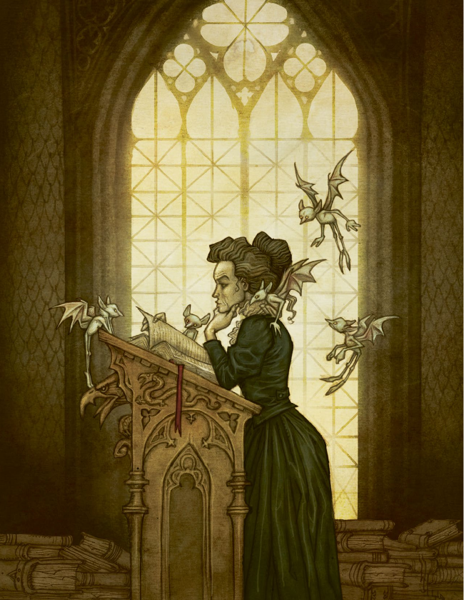
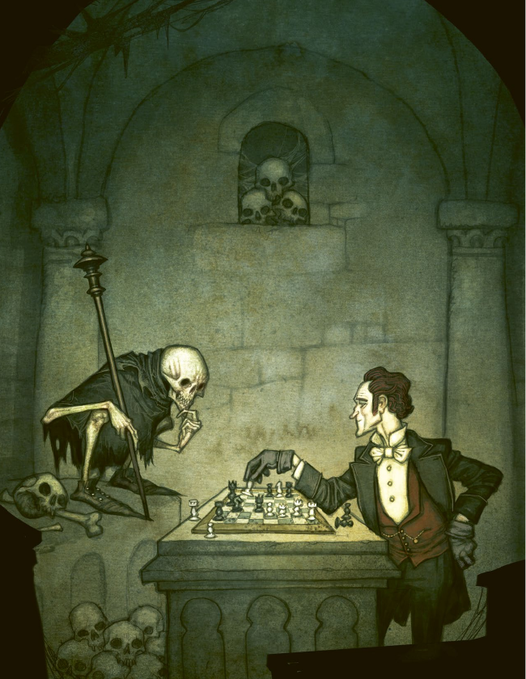
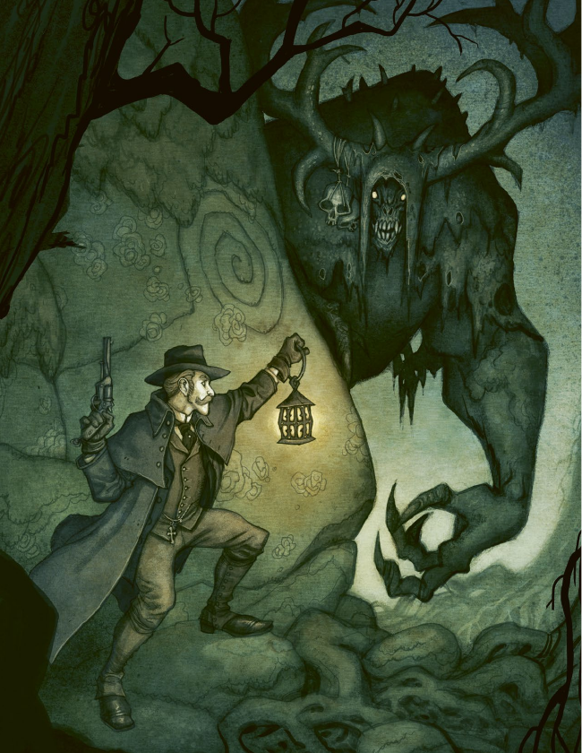
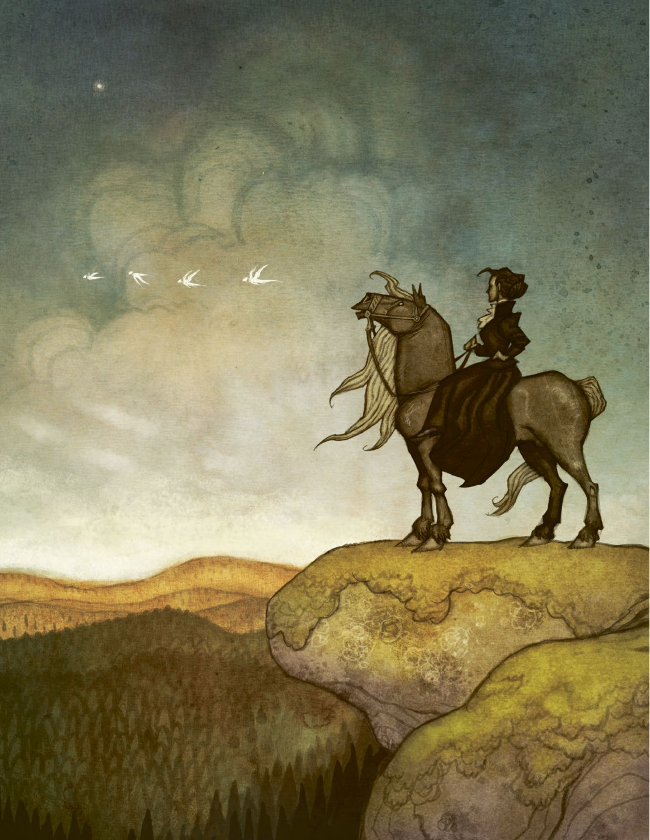

# 北欧奇谭：玩家建卡手册

来源：[北欧奇谭-玩家建卡手册.pdf](../../raw-docs/北欧奇谭-玩家建卡手册.pdf)。正文按原书结构整理；“PDF 页”指此手册的文件页序，“原书页”指页面上印出的页码。原文规则、范例、译注及随机表均保留；版面装饰省略，整页插画另存。原书内部的章节与页码引用沿用原文。该 PDF 收录原书的部分章节，原书页码不连续。

## 目录

- [玩家角色](#玩家角色)
- [技能](#技能)
- [天赋](#天赋)
- [结社与大本营](#结社与大本营)
- [背景故事表](#背景故事表)

<!-- 来源：北欧奇谭-玩家建卡手册.pdf；PDF 第 1 页；原书第 17 页 -->

## 玩家角色

> 我以为是一只鸟儿破窗而入，结果却是一个年轻的女人，她赤裸着身子，长着轻盈的翅膀，比乌鸦大不了多少。她的身体就像是粉红的水晶，熠熠发光，而背部和后颈布满咬痕。她看起来像是被老鼠咬伤了，我并不知道到底是什么迫使艾琳希达提尔逃出来，最后和我在一起。起初，我照料她的伤口，把她关在我床边的鸟笼里。四天之后，她竟然开口说话了，这着实让我惊讶。更重要的是，她比我还见多识广，且声称自己比我年长几百岁。后来我让她睡在我的枕头上，并在她的脚踝上系了根银链。她会吻我的脸颊，向我道晚安。而现在，当我试图理解她是如何死去，并被封存在一个玻璃罐中时，我想起了她的吻，我依然爱她，可是，她再也无法回应我的感情。

你的玩家角色是一个生活在19世纪乌普萨拉的人类，且拥有灵视能力。他和他的朋友们一起重建了结社，那是一个旨在追踪和打击自在之物的组织。

作为玩家，你应全身地扮演你的角色。把他置于危险而有趣的境地中，不要害怕，因为那样才会更加有趣。本章提供了如何一步一步创建角色的步骤。你们可能会需要一个团队，那样你们的角色就会彼此关联，形成有趣的人际关系。

创建角色所涉及的选项可分为三个类目：个人特质、专长和其它方面。在个人特点中，你首先需要选择一个角色范型，这是一种角色模板。然后为你的角色起名字，确定他追猎自在之物的动机。还需要明确角色的创伤来源，描述使他获得灵视能力的事件，并想出一个需要隐瞒其他PC的黑暗秘密。

专长代表了你的角色所精通的强项，当你在解谜或面对危险，需要掷骰时就会用上它。它具体由属性、技能和天赋组成。

最后一个部分涉及了你与其他PC的关系，以及你的装备和财产资源。在这里你会看见和受伤相关的规则，无论肉体上还是精神上的，以及如何通过完成谜题获得的经验值来强化你的专长。“优势”这一栏则意味着，你在前往斯堪的纳维亚半岛的陌生地点旅行时，可以通过磨练技能，阅读神秘文本或是面见那些能鼓舞你的人来取得优势。

<!-- 来源：北欧奇谭-玩家建卡手册.pdf；PDF 第 2 页；原书第 18 页 -->

### 创建角色

1. 选择角色范型
2. 选择年龄
3. 选择名字
4. 根据年龄分配属性点
5. 根据年龄分配技能点
6. 选择一个天赋
7. 选择一个动机
8. 选择创伤
9. 选择黑暗秘密
10. 选择你与其他PC之间的关系
11. 投出纪念物
12. 选择装备

### 个人特质

你可以基于决定背景和个人特质来创建玩家角色。这些内容会成为角色的基础，而随着游戏的发展，你会越来越清楚自己的角色是个怎样的人。

#### 角色范型

首先要做的事情就是选择角色范型，角色范型是角色的基础，且明确了接下来的一些步骤。你选择的范型会成为一个骨架，随之一个有血有肉的角色将从中诞生。角色范型也决定了你所擅长的领域。我们提供了10个角色范型可供选择，所有的角色范型都会在本章的最后一一描述。一组玩家中不宜有玩家选择相同的角色范型。

#### 年龄

下一步是决定角色的年龄，游戏中分为三个年龄组。青年、中年和老年。选择一个并记录在你的角色卡上。年龄会影响属性和技能。

#### 名字

从范型下的建议名单里选一个名字，或者你也可以自己取一个。

#### 年龄组

| 年龄组 | 年龄 | 属性点 | 技能点 |
| --- | --- | --- | --- |
| 青年 | 17-25岁 | 15 | 10 |
| 中年 | 26-50岁 | 14 | 12 |
| 老年 | 51+岁 | 13 | 14 |

#### 动机

你的动机解释了为何你的角色愿意冒着生命危险去追查并对抗自在之物。它将帮助你扮演好你的角色，你可以从角色范型的建议中选择，也可以自己想一个。

#### 创伤

你的创伤给予你灵视能力。这件事可能发生于你的童年，也可能发生于你成年之后，但通常和超自然现象相关。创伤可以是肉体上的，也可以是精神上的，或许你目睹了一些可怕的事情，或许你被卷入了一场灾难。

<!-- 来源：北欧奇谭-玩家建卡手册.pdf；PDF 第 3 页；原书第 19 页 -->

#### 黑暗秘密

你的黑暗秘密是一个令人羞耻的麻烦事，因此你把它藏在心底。它可能与你的创伤有关，或者是你在关注的一些完全与众不同的东西。但无论如何，他都会给游戏带来积极的影响，它会让你在乌普萨拉和旅行中遇到困难。也许你会被特工追捕，也许你要隐藏自己酗酒的事情，也许你正饱受妄想的折磨，也许你的家里曾发生过一些不能让外人知道的事情。

GM有一项工作，就是确保你们的黑暗秘密成为故事的焦点。将秘密融入到游戏的谜题中会更加有趣，尽管这会给玩家角色带来麻烦。如果你的黑暗秘密已经解决，或者你已经厌倦了，那么你也可以用别的内容替换它。

> GM：磨坊主说这就是他所知道的全部了。正当你们要离开时，他突然盯向你，阿斯特丽德。从眼神可以判断，他认出你来了。

> 玩家2（阿斯特丽德·丽佳）：噢！糟糕了！

> GM：“你说你叫什么名字？”

> 玩家2：阿斯特丽德·丽佳，圣母玛利亚修道院的前修女，您为何要这么问？

> GM：我们以前见过，但那时候你叫另一个名字，而且那时候你肯定不是个修女！

> 北方的布谷，会带来悲苦，
> 东方的布谷，会带走忧伤；
> 西方的布谷，会带来吉兆，
> 南方的布谷，喙里衔着死亡。
> ——关于解读布谷鸟叫声的童谣

#### 关于性别角色

真实的19世纪是一个父权社会，男性对女性拥有绝对权力。女性在行为、言语和就业等方面都受到限制。然而我们的角色扮演游戏并不需要还原真实的19世纪，它是关于神秘化的斯堪的维亚纳半岛的故事。你的游戏小组应共同决定这个斯堪的那维亚半岛到底是何种样貌，以及你们要如何处理这些问题。我们认为，没有必要让历史的不公去限制玩家的选择，尤其是在历史文学和童话故事中都有许多强大的女性。

<!-- 来源：北欧奇谭-玩家建卡手册.pdf；PDF 第 4 页；原书第 20 页 -->

> 所有人必须保护自己免受不可见之物的伤害，比如女巫和特洛精，以及蛇与蜥蜴这样的邪恶之物。如果说有什么是它们无法处理的，那便是钢铁、硬币以及其他它们无法控制的人造物。我的兄弟真傻，居然听信一个商人的胡话，那商人说自在之物和特洛精不过是孩子们的故事罢了。这使我的兄弟不再把带鞘的小刀插在门上，并让他的妻子把谷仓地基上的守护硬币拿走。因此，他的房子里就有孤魂野鬼，它们偷走了面包和布匹，咬伤了孩子们的手指脚趾直至流血。不可见之物的窃笑使他们一家人几夜无法安眠，直到他无法忍受，用猎枪在屋子里开了一枪，那子弹里装满了银制的薄片。幽灵们像黑烟般爬上了烟囱，尖叫着说它们势必会带着火与冰回来。但它们刚离开，我的兄弟马上就把小刀插在了门框上。于是这些东西就失去了力量。

> ——伊诺格·斯文松，比达莱特的佃户

### 专长

属性、技能和天赋构成了你的专长。它决定了你的角色擅长什么（以及不擅长什么）。在游戏中出现冲突、刺激或是危险的情况时，它会决定你的掷骰情况。

#### 属性

有四个属性用于描述你的角色强项和弱项，分别是体能、精准、逻辑和共情。这些属性都必须介于2-5之间，它们决定了你依赖该属性行动时候可以投的骰子数量。根据年龄你可以得到属性总值，然后分配到各个属性上。最小值为2，最大值为4，你所选择的范型的主要属性则最大可以分配到5点。

#### 体能

体能是衡量多强壮、多健硕的属性。它是打击能力和抗击打能力，也决定了你在没有食物和休息的情况下能坚持多久。它还能决定你举起倒下的树干的难易程度。

#### 精准

精准是衡量你协调能力和运动能力的属性。

#### 逻辑

逻辑是你解决问题的智力能力，也能反映你受教育的程度，它能帮助你在某些可怕的情况下解决问题。

#### 共情

共情代表你理解、说服、吸引或欺骗他人的能力。共情能在可怕的情况下帮助你解决问题。

<!-- 来源：北欧奇谭-玩家建卡手册.pdf；PDF 第 5 页；原书第 21 页 -->

#### 技能表

- 敏捷（体能）
- 近身战斗（体能）
- 力量（体能）
- 医学（精准）
- 远程战斗（精准）
- 隐秘行动（精准）
- 调查（逻辑）
- 学习（逻辑）
- 警觉（逻辑）
- 启迪（共情）
- 操控人心（共情）
- 观察（共情）

#### 技能

技能代表着获得的知识、训练和经验。一共有12种技能，它们都在第三章中被详细描述。每种技能数值都在0-5之间。当你在尝试一些困难或危险的事情时，技能值和属性一同决定骰子数量。

年龄会决定技能点数。在游戏开始时，你的任一技能不会超过2点，但你所选择的角色范型的主要技能可以提升到3点。解决谜题会获得经验值，经验值可以用来提高技能（见下文）。

#### 天赋

天赋是能使你在各种情况下受益的诀窍、特点和能力。它们会影响你的骰子数量，或者使你获得力量和资源。在本书第四章中，会有天赋的详细描述。

在你创建玩家角色时，你选择的角色范型提供了三种初始天赋可以选择。当你通过游戏获得经验值后，你可以获得更多的天赋。然后可以自由选择新的天赋，其中包括其他角色范型的天赋。

### 其他方面

为了在与自在之物遭遇和战斗中活下来，你的PC现需要朋友们的帮助，还有武器，装备，以及在偏远地区旅行住所所需支付的资源。通过向其他玩家描述你的角色，可以丰富角色本身。

在这里，你还能发现你受伤时会发生的事情；你如何通过旅行来给自己创造优势；你的经验值如何帮你提高的技能，或是购得新天赋。

#### 人际关系

你的PC和所有PC间都存在人际关系，在游戏开始时你们都认识彼此。或者仅仅是相识，也可能已经是一生的挚交。对于其他角色，你可以从你的角色范型中选择一种人际关系，或是自己创造一种人际关系。另一个玩家必须对这种关系表示同意。人际关系应该是有趣的，不会让你们成为敌人，毕竟你们必须要一起旅行和工作。

#### 资源

你的资源值代表你有多少可供支配的资金。数值较高意味着你有更好的住所和生活方式，更容易获得你想要的物品。下文的表格中显示了不同数值所代表的不同含义。游戏中改变你生活水平的事件会改变你的资源值。通常情况下，你的初始资源等同于角色范型资源范围的最低值，然而，你可以通过使用技能点来提高它，每投入一点技能点，将会提高一点资源值，但你的资源不应超过角色范型所列出的范围。在游戏开始前，资源只能通过消费技能点来获得。而一旦游戏开始后，你就只能通过购买天赋来获得资源值。

<!-- 来源：北欧奇谭-玩家建卡手册.pdf；PDF 第 6 页；原书第 22 页 -->

#### 资源表

| 资源值 | 生活标准 |
| --- | --- |
| 1 | 赤贫。你的生存完全依赖他人接济，每日都为了三餐而挣扎，而即便你有些财产，也少得可怜。这可能会导致你挨饿、患病或者转而投向药物和酒精。 |
| 2 | 贫穷。你的生活非常简陋。你的餐桌上大多数时候都有吃的，但可能难以果腹。如果你有孩子，他们会被迫生活在肮脏的环境中。你可以有一套换洗的衣服和少量财产。对你和你的家庭而言，失去收入总是灾难性的。 |
| 3 | 挣扎。你有一个简陋的家和固定收入。你没什么积蓄，但可以在特定的场合为家人作打扮，你的孩子也会有受教育的机会——至少在几年之内。 |
| 4 | 经济稳定。你有自己的房子和一份收入稳定的工作。有可能你存了些钱，偶尔会犒劳自己一些糖果，一次旅行或是一件精致漂亮的小玩意。在危机时候，总有人愿意借钱给你。 |
| 5 | 中产。你有自己的房子和生意，你可能有1个或几个雇员，且知道如何为未来投资。你有存款，也能获得贷款。你和你的家人生活富足。 |
| 6 | 小康。你有一所大房子或是大公寓。你可能有好几个雇员和若干个收入来源。你不会把金钱视为一种稀缺的资源，而是一种增加资本和影响力的筹码。你人缘极佳且很少与穷人打交道。你的家人可以去度假，而你可以负担得起所有最新的发明。 |
| 7 | 富有。你继承了大量的财产与不动产。你拥有多种形式的财产，有许多仆人和多种收入渠道。几乎没有东西是你买不起的。你与城镇甚至国家的精英关系良好，常与高级官员、政客和贵族关系密切。你只能通过车窗看见穷人。 |
| 8 | 大富豪。你是这个国家最富有的人之一，和统治者有着直接的关系。你拥有一座甚至好几座城堡或别墅。再大的花销都不是什么问题，你可以尽情放纵自己而无需担心花销。 |

#### 装备与纪念物

你的角色范型决定了你有什么初始装备。除了常规装备外，你还会有一个纪念物，它将会帮助你进行游戏并塑造角色。参照表格骰出你的纪念品或者自行决定。你可以通过使用纪念物，与之互动来恢复一个状态。你解释在困难中如何使用纪念物。GM对此有最终的决定权。

你的纪念物是你角色的一部分，你可以把它写进你的个人特质或背景中。它可能会在一个谜题中损坏或遗失，但通过消耗一点经验值，你可以在下个谜题中及时重获它或者修复它。你也可以选择一个新的纪念物，但这种情况下，你必须先经历一次没有纪念物的完整谜题。

<!-- 来源：北欧奇谭-玩家建卡手册.pdf；PDF 第 7 页；原书第 23 页 -->

#### 纪念物

骰出 2 个 6 面骰，第一个代表十位而第二个代表个位。

| D66 | 物品 |
| --- | --- |
| 11 | 风干的红玫瑰 |
| 12 | 亲近之人的照片 |
| 13 | 一枚有秘匣的印章戒指 |
| 14 | 你父亲的手杖 |
| 15 | 有秘密隔间的帽子 |
| 16 | 一本以外语写成的书 |
| 21 | 带刻字的扁酒壶 |
| 22 | 一封旧情书 |
| 23 | 一只肮脏的猫 |
| 24 | 一只猴子的头骨 |
| 25 | 血迹斑斑的本票 |
| 26 | 母亲戴过的金首饰 |
| 31 | 带链子的银色十字架 |
| 32 | 家族代代相传的精美小提琴 |
| 33 | 日记本（你的或者别人的） |
| 34 | 日期对你而言非常重要的报纸 |
| 35 | 破破烂烂的玩偶娃娃 |
| 36 | 信鸽 |
| 41 | 一本常常翻阅，写有致辞的小说 |
| 42 | 家族的墓地规划 |
| 43 | 页边空白区有注释的地图 |
| 44 | 玻璃罐中的奇异动物 |
| 45 | 你童年时候的八音盒 |
| 46 | 日长石（切割好的矿物） |
| 51 | 会让你想起某人的小瓶香水 |
| 52 | 家族流传的赞美诗篇 |
| 53 | 有照片嵌在里面的怀表 |
| 54 | 一份未签字的遗嘱 |
| 55 | 异国带来的黄金盒子 |
| 56 | 一位被遗忘的大师留下的乐谱 |
| 61 | 安眠药粉盒 |
| 62 | 写有精美花体字的烟斗 |
| 63 | 兔子脚或是其他幸运护符 |
| 64 | 有注射器的针盒 |
| 65 | 用骨头制成的旧骰子 |
| 66 | 家族流传下来的手稿 |

#### 描述

<!-- 本段跨越来源 PDF 第 6-7 页（原书第 22-23 页）。 -->

在游戏开始之前，你必须向其他玩家和GM介绍自己。举个例子，你可以描述你的外貌，给人的感觉，穿着打扮，以及别人应该如何称呼你。也许，有许多与你有关的谣言，或者你的社交场合总会成为焦点。你是否安静又富有神秘感。你身上会有丛林和汗水的气味吗？你的描述应该生动而简短。在你的角色卡上写下一些内容，如果你有空还可以给他画张图。

在游戏中，你可能会承受一种叫“状态”的东西，这就像是某种伤口或精神疼痛。当你在危机中无法有效保护自己，或者你为了成功做了孤注一掷的行为时，你就会承受状态。这些会在下文的第三章或第五章中详尽描述。

<!-- 来源：北欧奇谭-玩家建卡手册.pdf；PDF 第 8 页；原书第 24 页 -->

#### 状态类别

肉体状态（影响体能和精准）

- 疲惫
- 受创
- 重伤

精神状态（影响逻辑和共情）

- 愤怒
- 恐惧
- 绝望

#### 状态

肉体上和精神上的状态都有三个等级。承受每一级状态意味着你会在特定的技能检定中得到一个-1的调整值（减少一个骰子）。肉体的状态会给体能和精准相关的检定带来惩罚，而精神的状态会给逻辑和共情检定带来惩罚。还要注意调整值是会积累的。获得2级的状态会给你的技能检定带来-2的调整值（减少两个骰子）。然而，在谜题中，你有机会治疗状态的（见第五章）。无论你累计承受了多少级的状态，你总是至少有一个骰子。

状态会有助于你塑造角色：如果她感到难过，那就应该在扮演时表现出来。但，当然是由你决定哪些状态会如何影响扮演角色的方式。

#### 优势

在通向谜题的路上你可以获得一个优势，每个谜题只能获得一个。优势可能是一个新结识的，能在某个地方帮上忙的人，可能是给予你力量的神秘经历，或者你可以在前往谜题的路上维护或训练你的武器。优势还可以是你与另一个玩家的联系，你将会有助于你们的合作。

每回游戏中你可以使用一次优势，在这时你的检定会获得额外的两个骰子。你必须决定是在检定前使用，还是在孤注一掷时使用它（见第三章），并解释你会如何使用优势。在谜题过后，你的优势会消失，而下次你必须选择另一个技能来获取优势。

<!-- 来源：北欧奇谭-玩家建卡手册.pdf；PDF 第 9 页；原书第 25 页 -->

#### 优势的范例

- 我日日夜夜地苦练剑术
- 希芙达尔小姐似乎喜欢我
- 我被天使祝福了
- 我梦见我为了朋友们不惜犯险
- 和布伦加德上尉的谈话彻底解决了我们之间的分歧
- 凭着布鲁内留斯教授吻我的记忆，我可以做成任何事

> GM：远处轰然作响！周遭的人群消失无踪！你孤身一人站在小镇的广场上。阳光被病态的绿色阴云笼罩。有什么从林子里过来了。大地变得泥泞不堪，仿佛拉扯着你的大腿把你拽倒在地。进行一个恐惧检定！

> 玩家1（加斯帕尔·斯道尔）：我要拿出火车上那个老妇人给我的圣像。凝视着它，心中回想起老妇人的话，“在最黑暗的时刻，伸出你的手去感受上帝的存在！”因此我有2个额外的骰子！

#### 经验

每场游戏结束后，pc都会获得经验值（XP）。GM会问你一些问题，你每次回答一个“是”就能获得一点XP。

当你获得5点XP时可以获得一个成长。这意味着你可以提高一个技能的等级或购买一个新天赋。你的技能等级不能超过5，但可以购买任意数量的天赋。值得一提的时，你可以通过成长获得任何的天赋，包括其他角色范型的天赋。

#### 经验获取问题

1. 你参与了本次游戏吗？（角色总是至少能获得这一点经验）
2. 你是否和自在之物对峙过？
3. 你是否辨别了一种以前不了解的自在之物？
4. 你的黑暗秘密是否影响了你？
5. 你是否为了保护他人而犯险？
6. 你是否学会了什么（是什么呢）？
7. 你是否开发了自己的大本营？
8. 你是否做出了非凡的行动？

### 角色范型

本节介绍了10个角色范型，你必须选择其中一个，以作为角色的基础。每个范型都有一些选项和建议可供参考。

对于构成角色的个人特质的部分内容，你可以自由地做出选择，尽管这些内容都需要得到GM的最终确认和同意。而对于专长的数值，你必须让它们不超出角色范型所提供的范围。

#### 人生轨迹

依照本章的进行角色创建是最为快捷的方式。但是，对于渴望更多细节的人来说，本书的最后提供了一种替代的角色创建过程，从第 214 页开始提供了一些人生轨迹的随机表，你可以依照表格掷骰来进行角色创建。

<!-- 来源：北欧奇谭-玩家建卡手册.pdf；PDF 第 10 页；原书第 26 页 -->

#### 学者

我们都认同，至少在理论上这是可行的，有种方式可以让非灵视者，或说不是“星期四之子”的人获得看见自在之物的能力。其他人很快就忘记了我们的讨论。但这对我而言，是一个萦绕心头的困扰。这可不仅仅是一个理论问题。如果其他人也能看见那些东西，我们就会成为新世界的引领者。一位科塔亚姆的苏菲派哲学家提到过一种黑色的液体，在翻译后，我们称之为“黑泥浆”。一旦喝下它，那些东西就会浮现于眼前。我不得不变卖了母亲留下的大部分珠宝。让一个商人把一罐“黑泥浆”带回乌普萨拉。现在，这罐东西，就在我的书案上。

在以下的选项中选择一个，或是自己编写一个。

##### 姓名

- 名字：阿尔伯特，阿斯特里德，艾琳，伊萨克，路易斯（露易丝），帕拉斯科维雅
- 姓氏：布鲁格、格林哥琉斯，托提内

##### 动机

- 记录未知
- 修正我的严重错误.
- 成名

##### 创伤

- 小精怪把你变成了老鼠
- 因为美人鱼的魔法你变得衰老
- 目睹同伴被巨人撕碎

##### 黑暗秘密

- 药物上瘾
- 窃取或伪造文件以获得研究结果
- 被自在之物追猎

##### 人际关系

- 为每个玩家选择一种人际关系，或者自行编写。
- 实现目的的工具
- 在你面前我无法保持冷静
- 好朋友

##### 专长与装备

- 主属性：逻辑
- 主技能：学习
- 天赋：书虫、学富五车、知识是可靠的
- 资源：4-6
- 装备：藏书或地图集、书写工具、烈酒或计算尺

<!-- 来源：北欧奇谭-玩家建卡手册.pdf；PDF 第 11 页；原书第 27 页 -->

#### 医生

电信号游走于我们周身。当外界的微生物进入我们皮肤时，身体就会产生微观的士兵进行防御。大脑能记录的东西远比我们一生能书写的要多。奇迹无时无刻不在我们身边发生。但我的同事仍然质疑超自然生物的存在。我被迫，在屈辱中撤回了我的声明，以保留我的行医权利。我知道我在芬兰北部的罗瓦涅米出差时解剖的东西绝非上帝的造物。作为医生，我的誓言是帮助和保护我的同胞，哪怕是面对来自地狱的威胁。

在以下的选项中选择一个，或是自己编写一个。

##### 姓名

- 名字：阿尔弗雷德、多罗提亚、弗雷德理希、卡尔、玛吉特、威海米娜
- 姓氏：波勒琉斯、康宁斯马克、卢肯内

##### 动机

- 探索并解释世界
- 治疗病弱者和受病魔摧残之人
- 壮大结社，并成为其领袖

##### 创伤

- 在尸检中遇到了死者复活
- 给一个长着驴耳驴蹄的人做过手术
- 从垂死的美人鱼眼中看见了自己的命运

##### 黑暗秘密

- 你有两个人格
- 卷入非法事务
- 非自然的欲望

##### 人际关系

- 为每个玩家选择一种人际关系，或者自行编写。
- 我相信你能保守我的秘密。
- 你打扰到我了！
- 我会在夜里梦见你。

##### 专长与装备

- 主属性：逻辑
- 主技能：医学
- 天赋：军医、主任医师、应急医学
- 资源：4-6
- 装备：装有医疗用品的医生背包、烈酒或好酒、瘦弱的马或强效毒药

<!-- 来源：北欧奇谭-玩家建卡手册.pdf；PDF 第 12 页；原书第 28 页 -->

#### 猎人

男爵夫人猎鸭的爱好不过是个借口，她不过是想和我在野外单独相处罢了。我们经常会带着酒和面包外出，在精致的地毯上云雨之前，她会跟我讲怪物和自在之物的故事。我鼓起勇气，叫她“亲爱的”，但她的神情告诉我，我们之间的关系太近了，甚至已经越过雷池了。有一天夜里，她一丝不挂地来到我家。当她跨坐在我身上时，我才注意到男爵和其他几个人已进入了我的小木屋，就躲在门边的暗处。我想要站起身来，但男爵夫人用激烈的肢体动作把我按倒。她的呻吟变成了一种以古怪腔调说出的话语，我的身体因恐惧而开始抽搐，其他人靠近了我们，和男爵夫人开始一同吟唱。

在以下的选项中选择一个，或是自己编写一个。

##### 姓名

- 名字：阿尔戈特、布兰达、埃吉尔、玛伊、马尔特、托伦
- 姓氏：埃克、林德伯格、希格理德松

##### 动机

- 袭击我家人的东西必须被消灭
- 与自然和谐相处
- 渴望超凡的狩猎

##### 创伤

- 被灰树夫人的枝条袭击
- 在森林中摔断了腿，在一团鬼火的指引下回到了家
- 在黎明时分被山中的特洛精捕获，并被困在它化成石头的手臂中。

##### 黑暗秘密

- 我出卖过灵魂
- 我无法控制自己的怒火
- 和自在之物有过一个孩子

##### 人际关系

- 为每个玩家选择一种人际关系，或者自行编写。
- 我被你所吸引。
- 我讨厌你这种欺凌他人的瘪三。
- 你就是个住在城里的胆小鬼。

##### 专长与装备

- 主属性：精准
- 主技能：远程战斗
- 天赋：寻血犬、草药专家、神射手
- 资源：2-4
- 装备：来复枪、猎刀或猎犬、狩猎陷阱或狩猎装备

<!-- 来源：北欧奇谭-玩家建卡手册.pdf；PDF 第 13 页；原书第 29 页 -->

#### 神秘学家

我必须要知道真相。我是如何获得预知能力的？我又是如何仅凭想象人们的心跳，就使他们在剧痛中倒地的？在我年轻移居城市时，我的母亲留在了拉格比。她与两只山羊还有一头猪一起生活，奇怪的是，她用我已故父亲的名字命名了这头猪。我妈妈不喜欢谈论这些事情。她总是用两句话敷衍我：“摇篮，在我醒来时你就在摇篮里了。”我最后失去了耐心，我用壁炉的烧火棍威胁她，扬言要将她变成我脸上的疣子。然后，她告诉我，我其实是替换儿。

在以下的选项中选择一个，或是自己编写一个。

##### 姓名

- 名字：阿勒克桑达，尼克拉斯，托马斯，英格里德，尤里卡，瓦伦提娜
- 姓氏：贝克伦德，克朗德松，默尔克

##### 动机

- 学习自在之物相关的知识
- 了解自我
- 追寻力量

##### 创伤

- 在试图偷林德龙的龙蛋时被腐蚀毒液击中
- 家里的农场被一个脾气暴躁的田舍侏儒霸占
- 被夜鸦袭击并因此染上了热症

##### 黑暗秘密

- 我犯下过令人发指的罪行
- 我的力量控制着我
- 我是换生灵

##### 人际关系

- 为每个玩家选择一种人际关系，或者自行编写。
- 你有什么瞒着我们。
- 你让我平静。
- 你总有一天会拯救我们。

##### 专长与装备

- 主属性：精准
- 主技能：隐秘行动
- 天赋：魔术手法、灵媒、恐惧来袭
- 资源：1-4
- 装备：水晶球，牡鹿角粉（第 123 页）或火绒盒，匕首或烹饪锅

<!-- 来源：北欧奇谭-玩家建卡手册.pdf；PDF 第 14 页；原书第 30 页 -->

#### 军官

当我还是个孩子时，常与父母一起出席社交场合，从那时起，我就对得体绅士身上佩戴的勋章感到着迷。一位叔叔教会了我射击技巧，以及作为国王的士兵应当遵守的道德准则。当我骑着战马奔赴前线时，我幻想着自己凯旋的样子。但没人告诉过我，在战场上会发生什么。在尖叫着的，内脏四溅的士兵尸体之间，我满目都是劫掠与虐杀。我被自己人的子弹打中，当我醒来时，

发现自己躺在一辆满是尸体的马车上。照顾我的生物外貌古怪，我觉得那可能是一群特洛精。它们看起来友善而害羞。我没有跟母亲说过这些生物和战场上的事情。一旦想到有一天，会有信使唤我前去参加下一场战斗，我就只能沉默不语。

在以下的选项中选择一个，或是自己编写一个。

##### 姓名

- 名字：亚历山大、弗朗茨、亚莫尔、约翰、克拉拉、克里斯汀娜
- 姓氏：阿尔克林、林登、诺登弗莱赫特

##### 动机

- 让我的父亲为我骄傲
- 我的朋友们需要我
- 寻求危险及死亡

##### 创伤

- 你的船被海怪拖入水中，你险些淹死
- 在暴怒的巨人面前失去了所有战友
- 看见死去的军人在战场上再度站起来

##### 黑暗秘密

- 我是逃兵
- 无法处理肮脏与混乱的东西
- 杀害过手无寸铁的敌人

##### 人际关系

- 为每个玩家选择一种人际关系，或者自行编写。
- 我会不惜一切代价保护你。
- 我的领导者。
- 我不信任你。

##### 专长与装备

- 主属性：精准
- 主技能：远程战斗
- 天赋：久经沙场、绅士、战术家
- 资源：3-7
- 装备：来复枪或手枪，指南针或刺刀、地图册或军刀

<!-- 来源：北欧奇谭-玩家建卡手册.pdf；PDF 第 15 页；原书第 31 页 -->

#### 牧师

我也曾与其他人一样，是个怀疑论者。尽管我总是戴着硬边白领，但我还是会与当代思想家会面，谈论圣经的象征意义。利维坦，巨大的蛇之恶魔，那是人类需要与之对抗的，来自内心的潜在邪恶。附身与恶魔是在特定时间对精神疾病的历史性解释。但我后来在挪威海岸附近的韦斯特内斯村，目睹了归来的亡者从海峡中爬出。我们躲进教堂里，让钟声响彻整夜，直到黎明的光驱赶了它们。现在我明白了，我们不可不知主的真言，因为经文中所说的，都是真的。

在以下的选项中选择一个，或是自己编写一个。

##### 姓名

- 名字：伊丽莎白、埃里克、莉迪亚、玛丽亚、奥托、维克托
- 姓氏：阿夫·布莱克、弗斯马克、尼斯特伦

##### 动机

- 执行神圣的使命
- 净化我被玷污的灵魂
- 理解上帝的创造

##### 创伤

- 被巫师（女巫）迷惑后伤害了他人
- 目睹教堂的守护灵撕碎了想偷教堂银器的盗贼
- 一只妖虫的第三任主人，为了避免自己被扭曲而侍奉教会

##### 黑暗秘密

- 魔鬼常与我说话
- 我的身份是偷来的
- 我中过自在之物的圈套

##### 人际关系

- 为每个玩家选择一种人际关系，或者自行编写。
- 我比你优秀。
- 我暗中爱着你。
- 我的门徒（追随者）。

##### 专长与装备

- 主属性：共情
- 主技能：观察
- 天赋：赦免、祝福、忏悔者
- 资源：4-6
- 装备：乐器或好酒、书写用具、圣水或旧圣经（第 123 页）

<!-- 来源：北欧奇谭-玩家建卡手册.pdf；PDF 第 16 页；原书第 32 页 -->

#### 私家侦探

我从未想过问他们为什么不肯联系当局，而是雇佣了一个侦探前往克里斯丁汉姆。我以为是他们听说过，我解决了码头的谋杀案，可结果，他们需要的是一个清理屠杀现场的人。这座城堡就像被炮弹炸过一样。村民们不敢进入其中。它飘散着血与排泄物的恶臭。我甚至不愿去想接下来发生的事情。我驱逐了那个袭击冯·弗利辛根家族并把尸体翻得稀烂的东西。在这之前，那东西已经袭击了附近几个村庄，把男女老少杀了个精光。现在我每天晚上都会来这座城堡。

在以下的选项中选择一个，或是自己编写一个。

##### 姓名

- 名字：安德斯、菲利西亚、加百利亚、亨利克、萨缪尔、斯汀娜
- 姓氏：博加特、亚尔夫、马金内

##### 动机

- 远离我的家人
- 揭露真相
- 寻求刺激

##### 创伤

- 在寻找走失儿童时听到了死婴灵的哭声
- 深陷噩梦，当醒来时无法呼吸且被梦魇压在身上
- 与狼人正面冲突

##### 黑暗秘密

- 我被通缉悬赏了
- 通奸惯犯
- 药物上瘾

##### 人际关系

- 为每个玩家选择一种人际关系，或者自行编写。
- 你认为你可以相信我。
- 你是个好人。
- 在试图理解你。

##### 专长与装备

- 主属性：逻辑
- 主技能：调查
- 天赋：鹰眼、基础推演法、专注
- 资源：2-5
- 装备：放大镜或开锁器、左轮手枪、指虎或双筒望远镜

<!-- 来源：北欧奇谭-玩家建卡手册.pdf；PDF 第 17 页；原书第 33 页 -->

#### 仆人

膀胱救了我的小命。那是一个一年一度，公爵允许我们仆人也参与的圣诞晚会，我在外面的树根旁解手时，一个不请自来的小提琴手出现了。当我想要回去时，那小提琴的旋律让我双腿颤抖。透过窗户，我看见人们脸上挂着绝望的笑容，在翩然起舞。他们无法停下来。我听说过魔鬼的器具，能让人不住地手舞足蹈，至死方休。有传言说，他们被下葬时，头骨的下颚依然会有节奏地咔哒作响。我又有什么能力去抵抗路西法的乐手呢？第二天早上我回来时，音乐已经停止了。没人再提及那场晚会。超过一半的人都辞职了。我有些好奇，如果我和其他人一起进去，又会发生什么？

在以下的选项中选择一个，或是自己编写一个。

##### 姓名

- 名字：安娜、艾尔莎、约阿基姆、鲁特、索伦、托尔斯滕
- 姓氏：贝克、拉斯克、安格伦德

##### 动机

- 保护我的主人
- 好奇心
- 一种想要帮助他人和自在之物的冲动

##### 创伤

- 被溪中之马咬伤
- 在水乐灵的歌声中失去了主人
- 服务于一个被换生灵困扰的家族

##### 黑暗秘密

- 我杀害了某人
- 我因宗教信仰而遭受迫害
- 为境外势力从事间谍活动

##### 人际关系

- 为每个玩家选择一种人际关系，或者自行编写。
- 愿意效劳。
- 我不服从你的命令。
- 彼此尊重。

##### 专长与装备

- 主属性：体能
- 主技能：力量
- 天赋：忠诚、坚韧、强硬如钉
- 资源：2-4
- 装备：左轮手枪、马灯或化妆用品、野外炊具套组或简易绷带

<!-- 来源：北欧奇谭-玩家建卡手册.pdf；PDF 第 18 页；原书第 34 页 -->

#### 流浪者

我五岁的时候，就知道如何雕刻及解读流浪汉留下的记号。十五岁时，我看见了一个从未见过的符号。它刻在一个偏僻农场的木栅栏上，那是一个星型图案，还有一只扭曲的守护犬，以及象征着警告的符号，这个图形重复出现了许多次。于是，我没有离开，躲在谷仓满是干草的阁楼中等待，急切地想要知道些什么。当夜幕降临时，地面上升起了一道强光，我还听到了一声哨响，那声音似乎来自星空之上。我抓起了我的背包，打算逃离现场。但门口站着一个样貌英俊，双眼闪烁着光芒的男人。我花了10年时间，终于从他的奴役咒语中解脱出来。下次见到他时，我要让他为我蒙受的耻辱付出代价。

在以下的选项中选择一个，或是自己编写一个。

##### 姓名

- 名字：达格玛、奥斯卡、拉斯姆斯、罗尔夫、西格内、薇奥拉
- 姓氏：多尔克、埃里克松、柯拉博

##### 动机

- 向家人复仇
- 探索超自然的秘密
- 变得受欢迎

##### 创伤

- 目睹归来的死者自坟墓中苏醒
- 永远爱着一个林中女士
- 在特洛精的袋里活了一周

##### 黑暗秘密

- 偷来的身份
- 罹患绝症
- 一个自在之物杀了我某个我所爱的人

##### 人际关系

- 为每个玩家选择一种人际关系，或者自行编写。
- 你帮我，我帮你。
- 假意感激。
- 你是我的朋友。

##### 专长与装备

- 主属性：体能
- 主技能：操控人心
- 天赋：流浪者戏法、疑心、云游
- 资源：1-3
- 装备：拐杖、小刀或撬棍、宠物犬或烈酒

<!-- 来源：北欧奇谭-玩家建卡手册.pdf；PDF 第 19 页；原书第 35 页 -->

#### 作家

那个东西究竟是想帮我还是害我？我已经连续几夜坐在自己的房间里了，我没钱买蜡烛和油灯，只有空白的纸张和喋喋不休的饥肠与我同在。至少，一开始我是这么以为的。突然，有什么东西出现在我的身边，在寒冷的空气中吞云吐雾。它紧紧握住了我的钢笔，然后开始写作。起初，我欣喜于这些字句的优美流畅。直到我发现这根本停不下来。整整五天五夜，这个东西都在用我的手写字。而这，就是我那本脍炙人口的著作，我的手指已经作废。我虽然没见过它的脸，但我会找到它的。

在以下的选项中选择一个，或是自己编写一个。

##### 姓名

- 名字：奥古斯特、爱德华、海伦娜、雨果、莫德、塞尔玛
- 姓氏：约翰松、尼尔松、斯屈特

##### 动机

- 找到某个特定的自在之物
- 研究一本书
- 复仇

##### 创伤

- 激怒让人睡着并吸食你血液的妖精
- 被一个无家可归的小精怪诅咒，以自己的血写书
- 听到了水乐灵的歌声，但没能记下歌词

##### 黑暗秘密

- 我记录并利用朋友们的秘密和弱点
- 需要革命性的想法
- 我的毕生之作不过是个谎言

##### 人际关系

- 为每个玩家选择一种人际关系，或者自行编写。
- 你赋予我灵感！
- 试图赢得你的赞美。
- 你吓坏我了。

##### 专长与装备

- 主属性：共情
- 主技能：启迪
- 天赋：自动书写、记者、墨客
- 资源：2-5
- 装备：书写工具和纸，相机或观剧镜、宠物犬或藏书

<!-- 来源：北欧奇谭-玩家建卡手册.pdf；PDF 第 20 页；原书第 36 页 -->

<!-- 来源：北欧奇谭-玩家建卡手册.pdf；PDF 第 21 页；原书第 37 页 -->

## 技能

> 白天时候，池塘和周边的森林显得十分宁静。给我们带路的村民保证这里与霍尔兹神父的失踪没有关系。然而所有线索都指向了此地。我们享受他们提供的食物，与他们一起欢笑。在回村子的路上，村民们问我们什么时候回乌普萨拉，我们假意被说服，声称明天一早就走。当晚我们悄悄地进入林地。星光之下的林木看起来灰蒙蒙的。月光跃动于池塘的水面之上，使得树干间的黑暗显得越发厚重。我们紧挨着站在一起，在等候着。在我们周围张开了许多发光的眼睛，附近的树梢上定是有着上百只夜枭。森林中响起了雷鸣般的鼓点。我们听到了有人以黑暗者的语言在吟诵什么，我们知道，这些就是在夜里潜入此地的村民。水面泛起涟漪，什么东西正在从水下升起。

在《北欧奇谭》中，大多数事情可以通过GM和玩家间的对话处理。但玩家迟早会做出一些惊险刺激且不确定能否成功的事情。在这种情况下，就应该拿出骰子，让概率决定接下来的事态了。你的角色对某技能越是精通，他的成功率也就越大。

本章书讲述了如何通过以技能检定的形式来判断你某一行动的成功程度，这是运气和技能共同作用的。我们还描述了不同技能检定成功的不同层级，以及可能的结果。我们还介绍了会使技能检定更容易或更困难的状况，比如角色负伤、使用天赋、使用优势或是使用装备。本章还有在掷骰时进行孤注一掷的规则，这意味着你付出了巨大的努力，以至于受到了消极的影响，但也因此获得了在技能检定中重骰的机会。本文阐明了当你受伤或承受肉体或精神状态时会发生的事情——这通常发生于孤注一掷或技能检定失败之后。本文还对游戏中的12个技能进行了细述。

<!-- 来源：北欧奇谭-玩家建卡手册.pdf；PDF 第 22 页；原书第 38 页 -->

### 技能检定

在成功的前提下，技能会让你得以处理和忍受艰难的状况。一共有12个技能，每个技能都与一个属性相关。在使用技能时，你需要把属性值和技能值相加，其和为你投出的6面骰数量。骰出6视为一个成功。极少情况会要求骰出不止一个成功。

值得一提的是，你的玩家角色可以在游戏中使用任何技能，哪怕他的技能点为0。在这种情况下，他只需要骰出属性提供的骰子数，当他们尝试一些没有被技能包含的行动时也可以这样处理。

#### 运用调整值

一个基础规则是，把所有影响掷骰的因素都加在一起。如果一个天赋让你的骰子数+2，并且你利用你的优势获得另一个+2，你则获得了4个骰子。如果同时你受创了并承受着一个状态，则减少一个骰子。那么你总计有3个额外骰子。

#### 技能表

- 敏捷（体能）
- 近身战斗（体能）
- 力量（体能）
- 医学（精准）
- 远程战斗（精准）
- 隐秘行动（精准）
- 调查（逻辑）
- 学习（逻辑）
- 警觉（逻辑）
- 启迪（共情）
- 操控人心（共情）
- 观察（共情）

> 玩家1（卡斯帕尔·斯道尔）：我戴上面具，披上斗篷，潜入这个教堂。

> GM：周围阴冷而漆黑，教堂的巨大双开门上装饰着金属制成的恶魔面孔。当你打开门时，你听到大约有100人的低语声，他们都穿着蒙头斗篷。这里一定聚集了几个村落。教堂里满布被点亮的红色蜡烛。有个人在演奏某种你无从辨别的弦乐器。而在正前方有一个人面向着人群，他的脸被兜帽挡住了。进行一个隐秘行动检定。

> 玩家1：我有精准2和隐秘行动2，一共4个骰子。糟了，我没有骰出6！

> GM：正前方的那个人扯下了他的兜帽。你发现那是你的兄弟！此刻，你们眼神相交，四目对视。

### 意义与结果

在掷骰之前，你必须要告诉其他人你的角色想要做什么，以及他想实现的目标是什么。GM可能会要求你进一步解释或是更改你的目标。这种情况通常发生在GM无法清晰理解你的意图或是认为你的目标不现实时。例如：你无法通过操控人心检定来让敌人自杀，也无法在缺乏药物，医疗设备和病床的前提下用医学检定治愈数百人。

> GM：卡斯帕尔坐在集市中央的一个金属笼子里。他赤身裸体，肮脏不堪，神志模糊。大约有20个村民围着他周边，他们那疯狂的眼神好像扫遍了整个镇子。

> 玩家3（伊尔金卡·普罗科廷）：我要拔刀冲向他们！

> GM：你确定要这样做吗？独自对抗20名持械的敌人，你必败无疑。

<!-- 来源：北欧奇谭-玩家建卡手册.pdf；PDF 第 23 页；原书第 39 页 -->

### 检定失败

检定失败意味着不利状况或意外状况的出现。在大多数情况下，失败的意味是非常显见的。失败意味着你被拆穿，如果你对着一群人进行启迪检定，失败后他们可能会转而反对你。甚至在掷骰之前，GM就可以说明检定失败的结果。

在尤为困难与危险的情况下，检定失败也可能意味着你受到状态的折磨。GM应在你检定前就声明这一点。你所承受的状态和你目前使用的技能类别一致（肉体或是精神），但你可以自由进行选择其中的细分类。并非所有的检定都有使角色获得状态的风险，否则角色会很快被损耗掉，并导致游戏结束。

有些情况非常严重，以至于马上会导致角色崩溃。也许是在躲避撞过来的火车，或者在整个陪审团面前为自己看似粗暴的行为进行辩解。

> 玩家2（阿斯特丽德·利亚）：我坐在这个巫师对面，盯着他的眼睛“使出你邪恶的把戏吧！”我要让他对我使用魔力，但我尝试对抗它，并试图理解它是怎么控制他人的。

> GM：进行一个观察检定吧。如果你失败了，它会控制你，并且你会承受一个精神状态。

### 孤注一掷

检定失败，你可以重整力量再尝试一次。每个行动只能如此一次，且必须在检定失败后立即执行。这称之为孤注一掷。

当你掷骰时，你会承受一个状态。如果你的技能是体能或精准，你应选择一种肉体状态。如果你使用逻辑或共情，则要选择一种精神状态。你可以重骰除了6之外的所有骰子。你也可以对成功的检定进行孤注一掷，因为你的某些情况下，多个成功骰会效果更佳。

#### 一骰足矣！

当你的角色尝试去做某件事时，你可以为整个情景进行一次掷骰。当你试图潜入城堡，你不需要通过掷骰来看看自己是否能抵达大门，然后再次检定看看自己是否能抵达楼梯然后上楼。一骰足矣！有时，这意味着技能检定的效果可以持续很长时间；比如说，制作一件物品或者治愈病人可能需要若干天的时间。唯一的例外是战斗，我们会在第五章具体介绍。

> 玩家1（卡斯帕尔·斯道尔）：我朝他大喊：“我是你的兄弟！”我试着让他从某种咒语中恢复过来。

> GM：来一个操控人心检定。

> 玩家1：我骰出3个骰子，失败了。我选择承受愤怒状态，然后对这次检定进行孤注一掷，我拉住他，高声喊着：“看着我的眼睛，罗兰！”然后重新投3个骰子。

#### 崩溃前的孤注一掷

当进行孤注一掷时，你可以重骰6以外的所有骰子。你因此获得的状态，会在检定后才生效。因此，导致崩溃的孤注一掷也是有效的。因为在掷骰后，崩溃状态才会使你失去行动力。

<!-- 来源：北欧奇谭-玩家建卡手册.pdf；PDF 第 24 页；原书第 40 页 -->

#### 故事必须继续

GM必须确保检定的失败不会导致故事停滞。如果无法需要探明某个怪物的信息，或者你被锁上且必须撬锁逃脱时，这类事件就会发生。当检定失败威胁到故事的发展时，GM可以用三种方式来挽回局面：苦果，状态以及需求。苦果是指即使没有通过检定，也会视为成功，但却发生了节外生枝的事情。比如你在图书馆中找到了怪物的信息，但它注意到你在图书馆里，并且拦住了你的去路。有时GM会将苦果隐藏一段时间，然后再揭露。状态是指即使没有通过检定，你也达成了目的，但必须选择一个肉体状态或精神状态。比如你设法推开了压在朋友身上的巨石，也因此获得了肉体状态——力竭。需求意味着你获得了你需要的某种东西，但获得成功还需要更多的东西。这可能意味着你的检定失败了，但GM会提出另一种解决问题的办法。也许，你获得了你需要的信息，但它使用一种陌生的文字写成的，你必须找到办法翻译它。也许能够帮助你的人已经离开了，但GM会揭示她的子女得到了她的知识，而子女们还在这个村庄里。

### 状态

有两种方式会让角色获得状态。一是孤注一掷时选择一个状态，二是因技能检定失败而承受状态。获得状态意味着你的角色受到了负面效果。

状态分为两大类：肉体状态和精神状态。肉体状态与体能和精准有关，精神状态与逻辑和共情有关。肉体状态分为：力竭、伤痕累累，创伤；精神状态则分为：愤怒、恐惧和绝望。

当你承受1个状态时，你会对应减少1个骰子，具体视乎技能是与精神属性还是肉体属性相关。同样需要注意的是，状态是可叠加的，这意味着2个相同类型的状态会减少2个骰子。无论你累加了多少个状态，你都至少有一个骰子可以使用。状态可以通过行动或休息回复，这将在第五章中进一步描述。

当你已经有了三个同类型的状态，一旦获得第四个，你的角色就陷入了崩溃。这意味着你的角色受到重伤，暂时性的精神失常，或者其它形式的损耗。此外，崩溃的角色还可能承受致命伤（见第 64 页）。

#### 状态与技能

| 状态类型 | 受到影响的技能相关属性 |
| --- | --- |
| 肉体 | 体能和精准 |
| 精神 | 逻辑和共情 |

<!-- 来源：北欧奇谭-玩家建卡手册.pdf；PDF 第 25 页；原书第 41 页 -->

### 难度等级

在极端情况下，GM可能判定不止一个成功骰才能达成成功。当你试图说服一群滥用私刑的暴民释放受害者，或者在暴风雨的屋顶上躲避杀手的追赶时，这种情况就会存在。一个挑战难度的行动需要2个成功骰，而困难难度的行动需要3个成功骰。

#### 难度

| 行动 | 成功骰数 |
| --- | --- |
| 普通 | 1 |
| 挑战 | 2 |
| 困难 | 3 |

### 彼此帮助

其他角色可以帮助你提高技能检定的成功率。GM决定你是否真的能从他们的行动中获益，每有一个人的有效协助，你可以获得+1，最多通过此办法获得+3。

### 并行动作

当你们同时在做事情时，你们不能互相帮助。如果所有人都试图从某人身边隐秘行动或免于陷入沼泽时，每个人都必须在没有他人帮助的情况下通过自己的检定。然而，有一些技能允许在检定中获得额外成功的角色对他人提供成功骰（见额外成功），并以这种形式提供帮助。

#### 成功率

这个表格提供了掷骰以及孤注一掷的成功率。

| 骰子数 | 成功率 | 孤注一掷 |
| --- | --- | --- |
| 1 | 17% | 31% |
| 2 | 31% | 52% |
| 3 | 42% | 67% |
| 4 | 52% | 77% |
| 5 | 60% | 84% |
| 6 | 67% | 89% |
| 7 | 72% | 92% |
| 8 | 77% | 95% |
| 9 | 81% | 96% |
| 10 | 84% | 97% |

<!-- 来源：北欧奇谭-玩家建卡手册.pdf；PDF 第 26 页；原书第 42 页 -->

### 对抗骰

在很多情况下，玩家角色或NPC会试图阻碍你的成功。当你在进行隐秘行动时，可能会被守卫发现。你与朋友在某件事上意见无法达成一致时，每个人都会试图影响对方的观点。在这种情况下，则通过对抗骰来决定结果。

你与对手各自进行一次掷骰。成功骰数量多的人获胜。若成功骰数量相等，那么你既没有成功，也没有失败。如果你的对手是NPC，那么GM可以使用掷骰失败所带来的三种结果：即苦果、状态及需求。（见上文）

我的母亲有一个叫冈勒格的姐妹，当她们还是孩子的时候，常常坐在门廊上看星星，讲着生活在湖泊和草甸后方树林里的闪光之民的故事。一天晚上，当浓雾笼罩大地的时候，她听到了牧场中传来的音乐声，她没有告诉父母就偷偷溜了过去。

在牧场的中央站着一个小提琴手，他让花草顺着自己的旋律摇摆。她在月光下和他舞蹈，直到累得站不起来。那时，她定是去了别的地方。第二天早上当她回来时，她满头长发如雪，皮肤上也满是皱纹，就像是一个老妪。冈勒格说，她曾去过妖精的国都，并作为闪光之民的王子妃生活。可现在王子死了，她回来了。

——艾尔莎·泰伯奥凡诺克的农夫之妻

在两个玩家冲突当中，当掷骰结果相同时，任一方都可以选择孤注一掷来获得胜利。但如果结果仍然相同，你们就必须达成妥协。大家都获得了想要的东西，但需要付出代价。

> GM：当你把圣水泼到卡斯帕尔的兄弟身上时，产生的冲击波把你俩都震飞了。卡斯帕尔，你一起床就看见你的兄弟跪倒在地，他眼睛的颜色已经回复正常。

> 玩家3（伊金卡·普罗科廷）：我提起一把斧子，要把他的脑袋砍下来。

> 玩家1（卡斯帕尔·斯道尔）：不可以！我要冲到你的面前，把斧头抢下来。

> GM：你们都需要骰对抗骰，卡斯帕尔需要进行敏捷检定，而伊金卡进行近身战斗检定。

> 玩家1：我骰出了2个。

> 玩家3：我也是。

> GM：那我们进行一个折中。卡斯帕尔把伊金卡推开了，挺身站在他兄弟身前。但他没能夺下伊金卡的斧子，也没受到肉体状态。

### 优势

你可以利用你的优势来增加成功率。GM必须能够解释它之所以有用的原理，但最好在这个评估中尽可能慷慨，如果玩家角色没有机会使用优势，那么也太可惜了。

每个谜题都有一个特定的优势，每次游戏中只能使用一次，在进行技能检定时，优势可以提供额外的两个骰子。使用优势必须在掷骰或孤注一掷前声明。换句话说，当你在检定或孤注一掷中失败时，就无法使用优势了。当你回到乌普萨拉，你在谜题的旅途中获得的优势会失效，但下一个谜题的路上你可以获得新的优势。你的新优势不能关联上一次选择的技能，而必须选择另一个技能。

<!-- 来源：北欧奇谭-玩家建卡手册.pdf；PDF 第 27 页；原书第 43 页 -->

### 装备

你在谜题中发现的大多数道具都是日用品，但有些更为有用的道具可以提高你的检定成功率。你可能需要开锁器来打开某些东西，或者需要一匹马来驱赶暴民。这些道具会为你的检定提供额外的奖励骰，通常是+1。某些特殊道具甚至魔法道具会提供更高的奖励，但很少会超过+3。

### 额外成功

获得比要求数的成功骰意味着额外成功。你给别人留下了深刻印象，得到了比预期还要多，或者因为你的技巧而赢得名誉。在某些情况下，GM还会认为你的信心激增，以至于可以治愈你的某个状态。

有些技能让你能够使用额外的成功骰获得特定的效果，例如帮助其他未完成该检定的其他玩家角色。每一个效果都需要支付一个成功骰。GM决定你是否可以使用额外成功（以及达成什么目的）。

> “梦魇！梦魇！梦魇！
> 除非你能数清林中的鸟儿，
> 河中的游鱼，
> 树上的橡果，
> 以及上帝的话语，
> 否则你不得进入此地。”
> ——传统的驱逐梦魇咒

<!-- 来源：北欧奇谭-玩家建卡手册.pdf；PDF 第 28 页；原书第 44 页 -->

### 技能介绍

### 敏捷（体能）

敏捷是指快速奔跑，灵活行动，以及逃离危险的能力。当你试图逃跑，追逐某人，跳跃或是攀爬时，可以进行敏捷检定。如果有若干人和你正在做相同的事情，你可以把自己的成功骰转交给他人，从而提高他们的成功率。

在战斗中，你可以通过敏捷检定来躲避攻击或逃跑。额外的成功骰可以用于：

- 用战术碾压敌手，交换你们的先攻卡。
- 向你的敌人施压，敌人会因此获得一个精神状态（每轮只可以选择一次）。
- 远离敌人一个区域。
- 让你的敌人位于一个区域的特定位置。
- 在躲避敌人时进行另一个动作，比如说进行仪式或是在房间里放火。

### 近身战斗（体能）

当使用近战武器战斗时，使用近身战斗技能。骰出比需求更多的成功骰时，你可以：

- 增加1点伤害，这个效果可以多次选取。
- 用战术碾压对手，交换你们的先攻卡。
- 向你的敌人施压，你的攻击除了肉体状态外还会造成一个精神状态。
- 把敌人推到另一个区域，或是你所在区域内的指定位置。
- 将敌人的武器或物品击落。捡起一个物品在战斗中需要消耗一个快速动作。

#### 抵御攻击

当一个角色成为攻击、埋伏、食物下毒的目标，或当他试图进行说服时，他会有机会发现和抵御攻击者。敏捷用以躲避物理攻击。警觉指的是发现别人在偷偷靠近你，或是把什么东西塞进你的口袋。在社交场合中，你的角色处于被动时则使用观察。

### 力量（体能）

当使用蛮力举起某个重物，或者忍受疼痛和困境时，进行力量检定。这一技能能在你在没有水和食物的情况下生存，或日以继夜地行走，谜面承受状态。你可以把额外成功的骰子分给其他处于相同情况下的玩家角色。

力量检定有时可用于维修物品，比如车轮坏掉的马车。

当进行徒手搏斗，或是与敌人进行摔跤和擒抱时，你也应通过力量检定。骰出比需求数更多的成功骰时，你可以：

- 增加1点伤害，这一效果可多次选取。
- 用战术碾压对手，交换你们的先攻卡。
- 向你的敌人施压。你的攻击除了肉体状态外，还能造成精神状态。
- 把敌人推到另一个区域，或是你所在区域内的指定位置。
- 将敌人的武器或物品击落。捡起一个物品在战斗中需要消耗一个快速动作。
- 擒抱住你的敌人，他必须成功进行对抗才能逃脱。

### 医学（精准）

医学可以让你用你的专业知识来帮助受伤的人。这项技能还可以提供解剖学、疾病和损伤方面的知识。

当玩家角色在身体上遭受重创时，她有时可能需要医疗援助才能生存（见第五章）。通过技能检定意味着<!-- 来源：北欧奇谭-玩家建卡手册.pdf；PDF 第 29 页；原书第 45 页 -->患者不再处于“崩溃”状态。每一个额外的成功将治愈一个肉体状态。如果你的检定失败，并希望重新尝试，那么需要首先采购更多医疗用品，将患者转移到更为合适的地点，或从受过专业医学训练的人处获得帮助。

医学可以用于治疗肉体的状态。你的病人必须卧床，远离目前的伤害，并且具有足够的饮品、食物以及医学设备。你需要为每天的治疗进行一个医学检定，一个成功的检定可以治愈三个肉体状态，根据你的需要分配给不同的病人。每个额外的成功骰将治愈另外三个状态。即使崩溃状态也可以通过这种方式来治愈。通常情况下，失败的检定只是意味着浪费了一天的时间，但GM可能会允许敌人采取行动。

### 远程战斗（精准）

当你使用远程武器或是爆破物进行攻击时，你应进行远程战斗检定，当你骰出的成功骰比需求数更多时，你可以：

- 增加1点伤害，这一效果可多次选取。
- 用战术碾压对手，交换你们的先攻卡。
- 向你的敌人施压。你的攻击除了肉体状态外，还能造成精神状态。
- 把敌人推到另一个区域，或是你所在区域内的指定位置。
- 将敌人的武器或物品击落。捡起一个物品在战斗中需要消耗一个快速动作。

### 隐秘行动（精准）

当你尝试潜行、藏匿、撬锁或表演纸牌戏法时，你需要进行隐秘行动检定。额外的成功骰会让你更为成功。

### 调查（逻辑）

你可以通过调查检定来搜索房间，理解犯罪现场发生的事情，对尸体进行检查，或者找出某些被掩盖的东西。如果你成功了，GM会向你提供线索。如果你的成功骰比需求的更多，GM会决定你是找到了更多线索，理解了背景信息，还是仅仅对你杰出的工作而感到满足。

#### 调查的范围

调查技能不是用来发现隐藏事物的，比如门、陷阱或是隐藏的线索。如果你在描述你的角色在正确的地方搜索，GM应该让你找到你想要的东西，只要它能被看见。然而，如果GM愿意，成功的技能检定也可以提供奖励。

### 学习（逻辑）

学习衡量你的教育水平，以及通过逻辑和知识建立联系的能力。当你需要理解面前事物的某些方面时，你可以通过学习检定获得线索。有时GM会认为学习检定需要书籍或是其他信息源的支持。在某些情况下，近乎无法通过这种方式获得线索。

你可以通过学习来翻译外语，计算出在某些情况系的最优行动办法，或是了解机械装置，神秘仪式和魔法物品的工作原理。如果GM认为合适的话，你可以使用学习来获得有关自在之物的基础信息。通过获得比要求数更多的成功骰，你有时可以获得更多的信息。

> GM：在废弃的谷仓里，木板上有着用小刀刻出的符号。

> 玩家2（阿斯特丽德·莉亚）：我要用学习检定看看我能否辨认它们。一个成功骰。

> GM：你明确能认出它们。小时候绑架你和母亲的那个人有很多存在这类符号的书。它们是古埃及象形文字。其中有几条类似于他最珍贵的文本，正是因为读了那本书，他才陷入了疯狂并做出那些可怕的事情。

<!-- 来源：北欧奇谭-玩家建卡手册.pdf；PDF 第 30 页；原书第 46 页 -->

### 警觉（逻辑）

你使用警觉来发现那些偷偷靠近你的人。潜行的人需要以隐秘行动检定来对抗你的警觉检定（见第 62 页）。你还可以用警觉来追踪他人或是生物留下的足迹。

此外，警觉可以用来揭示你被监视的情况。如果成功，GM会向你提供信息。你可能会意识到将会发生什么，谁是这个群体的领导者，哪些人可能构成威胁，或者得知面临此事的最佳办法。如果你的成功骰超过了需求的成功骰数，那么每一个额外的成功骰都会向一个技能提供+1的奖励。检定失败则意味着你误读了局势，被对方发现，或者对你正在看着的人表露出敌意。

### 启迪（共情）

启迪是在人群中演讲，鼓励和引导朋友，以及创造及理解艺术作品的能力。当你试图影响一群人的想法和行动时，你需要进行启迪检定。

当玩家角色遭受严重的精神创伤时，他需要用启迪检定来避免陷入长期的精神崩溃（见第五章）。如果你通过检定，那么对方则可以从崩溃中解脱。每一个额外的成功骰都能治愈一个精神状态。如果你失败了，并且试图再次尝试，那么你必须先找到一种方式以理解对方。或者，你需要带他去新的地方，向别人寻求帮助，或者找到另一种与他沟通的方式。

启迪可以用于治疗精神状态。你的朋友需要在安全的地方，有饮水和食物，并愿意和你密切接触或是对话。你们共处的每一天都可以进行一次启迪检定，期间不能做其他事情。成功的检定能治愈总计三个精神状态，每一个额外成功能治愈另外三个状态。即使崩溃状态也可以通过这种方式痊愈。通常情况下，失败的检定意味着丧失了一天的时间，尽管期间GM可能会让敌人采取行动。

### 操控人心（共情）

通过操控人心，你可以用撒谎、玩弄、贿赂、谈判、讨价还价去影响他人的想法，或者以其他方式使用社交技能。当你对某人使用操控人心技能时，你要描述你希望达到的目的和你采取的做法。你还可以通过操控人心检定来进行交易，以购买道具和服务。

成功的检定会让你获得你想要的东西。失败则意味着对方并不信任或喜欢你，你可能会承受状态，也可能对方坚定了本身的想法。玩家角色可以通过观察检定对抗你的影响。

如果另一个人意图对你使用操控人心，他也应该描述他希望达成的目的。在进行掷骰前，你们必须许可彼此的目标。你只能有限地让对方行动或是信服。你们彼此进行操控人心检定的对抗以决定谁能影响谁。

失败方可以决定为了做胜方想要的事情而需承担的状态。也许你需要保证不会将他同意做的事情告诉任何人，也或者他想首先知道关于你的事情？

当你获得的成功骰数量大于你需要的数量时，你可以用额外成功骰给对方施加心理状态，一个成功骰对应一个状态。

#### 并不是精神控制

使用操控人心检定时，你的目标必须是合理的。你不能完全改变他人的思考方式、让别人自杀或者在没有正当理由的情况下让人们背叛朋友。在你成功对他人使用操控之后，其他的事情可能会让这个人重新考虑。这同样适用于对你进行的操控。

<!-- 来源：北欧奇谭-玩家建卡手册.pdf；PDF 第 31 页；原书第 47 页 -->

> 玩家2（阿斯特丽德·利亚）：“他是一个利用他人实现自己目的的叛徒，如果我们放了他，他会继续在这座城市里兴风作浪。我们不应把他送进监狱。”我要使用操控人心检定来说服你，我们应该处决你的兄弟。

> 玩家1（卡斯帕尔·斯道尔）：卡斯帕尔绝不会同意的。“这么说吧，如果你赢了，你可以让我不再插手我兄弟的事情，可以吗？”

### 观察（共情）

当你与另一个人谈话，或是花费时间与他共处时，你可以通过观察技能来了解他在想什么，感觉如何以及在计划什么。如果你通过了技能检定，GM会描述你得到的关于他的印象。例如，GM可能会告诉你他在撒谎，或是透露出他有伤害你的意图。你有权提出具体的问题并得到答案。

每一个额外的成功骰会给之后的检定获得+1，只要这些信息在此检定中能派上用场。检定失败意味着你暴露了自己给对方，且必须透露出玩家角色的想法，感受和意图。

#### 诚实的信息

有些技能可以让玩家角色获得信息。GM有责任提供准确有效的信息。成功的检定不应该得到含糊不清的答案，或是对真相及NPC的“保护”。让故事有趣的正是玩家们依靠他们所得的信息产生的行动，不要让他们一无所知，无从行动！

<!-- 来源：北欧奇谭-玩家建卡手册.pdf；PDF 第 32 页；原书第 48 页 -->

<!-- 来源：北欧奇谭-玩家建卡手册.pdf；PDF 第 33 页；原书第 49 页 -->

## 天赋

> 在那个月光朗照的夜晚，我们三个人在卡尔斯克朗群岛精疲力竭地划着船。海员教堂里的牧师曾三次看见威廉船长在布道台上无声地哀嚎，那场景实在令人费解。那船长，和他那艘三桅帆船“卡罗琳娜号”在去年一同失踪于暴风雨中。有人说他为了买下那条船而出卖了自己的灵魂，现在，魔鬼来上门讨债了。当卡罗琳娜号突然出现在我们面前几米远的地方时，我还在划着船。周围没有点亮的灯火。我从水中拔出了船桨，任小船漂完了最后的路程。我们一言不发地爬上了那艘船，船体上覆满了海藻与藤壶，好像已经在此搁浅了数月之久。按理说，白天时候应该有人能从陆地上见到它才是。我们花了好几个小时搜索那条船，却没有发现任何东西，没有货物，没有粮食，也没有任何活物和死物。太阳升起时把水染成了红色、绿色和橙色。我们已经精疲力尽，但随后就看见船周围冒起了一些水泡。我们决定潜下去一探究竟，也许，威廉船长和他的秘密就在水下等着我们。我是唯一活着回来的人，我会保守秘密，至死也不会说出我到底看见了什么。

除了技能外，你还会有一些可能派上用场的诀窍和特质。我们称之为“天赋”并会在本章中对此进行详细的描述。首先我们会列出不同角色范型的天赋，然后介绍通用天赋。

新创建的玩家角色有一个天赋，且只能从其角色范型提供的天赋中进行选择。而在游戏过程中，可以通过消耗经验值购买天赋，并且可以通过此方法选择任何天赋，包括其他角色范型的天赋。

有些天赋会在技能检定或恐惧检定中提供奖励（见第 68 页），使你可以投掷更多的骰子。不同天赋的效果可以叠加。

<!-- 来源：北欧奇谭-玩家建卡手册.pdf；PDF 第 34 页；原书第 50 页 -->

### 学者天赋

#### 书虫

从书籍中或图书馆中寻找线索时，学习检定+2。

#### 学富五车

你可以学习检定来构建游戏中地点和现象的真相。你可以知道某个地点以玻璃工人而闻名，或是有犯罪分子在该地区活动。由GM可以判断什么合适，什么是你可以知道的。你不应创造和自在之物有关的内容。

#### 知识是可靠的

在学习检定中无视状态的影响。

“当凄楚的爱情把你压迫，一双新鞋值得你去物色。穿着它走上一英里，等双脚出汗时，把右脚的鞋子往下脱。在里面倒入麦芽或是葡萄酿的酒，再细细品味，轻轻一啜，自由的滋味你将获得。”——驱逐有害爱情的传统民俗魔法

### 医生天赋

#### 军医

在面对尸体或是残破的人体时，恐惧检定+2。

#### 主任医师

当使用医学检定治疗其他玩家时，你的成功可以治疗4个症状，而非3个。该天赋同样适用于额外成功。

#### 应急医学

医学检定时无视状态影响。[^应急医学]

### 猎人天赋

#### 寻血犬

追踪猎物时警觉检定+2。

#### 草药专家

通过野外的草药，你可以在没有医疗用品的情况下使用医学检定。

#### 神射手

当你成功埋伏并首次攻击目标时，你的远程战斗检定+2。

[^应急医学]: 译注：此处应为官方错误，原文是指“无视精神状态”，已经有人指出医学技能本身就不受精神状态影响，但FL官方并没有勘误，译者认为应为无视肉体状态。而也有人指出，在初稿中医学属于逻辑技能，而非精准技能，因此在修改稿子后遗留了这一问题。）

<!-- 来源：北欧奇谭-玩家建卡手册.pdf；PDF 第 35 页；原书第 51 页 -->

### 神秘学家天赋

#### 魔术手法

当你使用魔术手法影响他人时，你可以用隐秘行动检定替代操控人心检定。

#### 灵媒

你可以通过观察检定来进行降灵仪式，并借此联络死者并预测他人的未来。额外的成功会提供更多信息，延长联系时间，或者让灵体直接现身。若检定失败，你会得到不准确的信息，遭受攻击，或承受某种状态。

#### 恐惧来袭

你可以使用1级的恐惧检定（见第 68 页）来实现恐惧打击。这是一个缓慢动作，且对自在之物无效。在你的区域里选择一个受害者，且目标NPC必须通过逻辑检定或共情检定。他可以获得和范围内友善单位个数相同的奖励骰。

<!-- 来源：北欧奇谭-玩家建卡手册.pdf；PDF 第 36 页；原书第 52 页 -->

翰蒙库拉的一位牧师在讲坛上布道，以全能的上帝的名义声称，世上没有特洛精、田舍侏儒和其他自然精怪。第二天早上，他的房子没了窗户，门从外面被人反锁，牧师只能用大锤把门砸破。又一个早上，当他醒来时家里的牲畜都没了脑袋，无口无目，四处乱踱。他依然坚持，是上帝创造了人类和牲畜，林子里的怪物不过是人类的迷信和魔鬼的胡说。直到又一个早上，当他睡醒时，身边没了妻子，只有一根木头。直到这时，他才走上讲坛，说他不知道是上帝还是魔鬼带来了自在之物，但它们确实存在着。当他回到家里时，妻子已在家门口等着。声称不可见之物并不存在最让它们恼火。

——奥拉·斯滕，达尔福斯的木匠

### 军官天赋

#### 久经沙场

你对战斗司空见惯，进行先攻检定时，你可以抽取两张卡并任选一张。

#### 绅士

你被教育必须在社交场合控制好自己的行为和情绪，哪怕是在压力环境下也必须如此。在进行操控人心检定时，无视精神状态带来的惩罚。

#### 战术家

当你在远程战斗检定中获得额外成功时，除了通常的可选效果外你还有一个额外选择，向一个友善单位下达指令。这必须消耗一个成功数。如果对方遵循你的指令，则可以在下一个检定中获得+2（可以多次给不同的人下达指令）。

### 牧师天赋

#### 赦免

玩家角色向你忏悔，袒露自己的行为时（见第 72 页）可以治愈三个状态，而非两个。

#### 祝福

每次游戏你可以祝福一个物品或另一个玩家。玩家角色或使用该物品的人将获得祝福优势，并在他们所选择的检定中+2。这一优势会在使用或谜题结束后失效。每个谜题你只能祝福一个角色或一件物品。

#### 忏悔者

在保密的谈话中，你可以使用观察检定替代操控人心检定。

<!-- 来源：北欧奇谭-玩家建卡手册.pdf；PDF 第 37 页；原书第 53 页 -->

### 私家侦探天赋

#### 鹰眼

当你试图进行远程的观测时，你的警觉检定+2。

#### 基础推演法

每次游戏一次，你可以要求GM解释线索是如何串联的。

#### 专注

进行调查检定时无视状态带来的惩罚。

### 仆人天赋

#### 忠诚

当你发誓保护的人在场时，你的恐惧检定+2。

#### 强硬如钉

徒手战斗时，力量检定+2。

#### 坚韧

每次游戏一次，你可以在任何一次检定中无视状态带来的惩罚。

### 流浪者天赋

#### 流浪者戏法

当你试图在富人面前隐藏自己或某个物品时，隐秘行动检定+2。

#### 疑心

进行警觉检定时无视状态的影响。

#### 云游

每次谜题你都可以进行一个操控人心检定，以创造一个位于该地点的NPC，或是你曾经见过的人。GM决定在上次见面以来他的变化，以及他现在对你的看法。如果检定失败，他要么对你怀有敌意，要么就是他反过来非常需要你的帮助。

### 作家天赋

#### 自动书写

你可以通过启迪检定引导灵体进行自动书写以获得线索。GM会提供或多或少的模糊线索，对未来的预测，或对敌人想法和经验的瞬间洞察。额外的成功会揭示更多的线索。如果检定失败，GM会决定你是否要承受某种状态，被附身，或是一种持续1D6小时的人格改变（具体由你决定是何种改变）。你可以在每次游戏中使用一次。

#### 记者

当你通过吸引或是哄骗他人以获得信息时，你可以使用启迪检定替代操控人心检定。

#### 墨客

进行启迪检定时无视状态的影响。

<!-- 来源：北欧奇谭-玩家建卡手册.pdf；PDF 第 38 页；原书第 54 页 -->

### 通用天赋

#### 战场经历

治疗肉体重创时，医学检定+2。

#### 勇敢

进行恐惧检定时，+1。

#### 近战训练

进行格挡时，力量检定或近身战斗检定+2。

#### 联络人

在每场游戏中，你可以确定自己已经认识了某个NPC，并且你们之间的关系是积极的。如果GM认为这会使谜题不再有趣，那么他可以不允许此天赋生效。

#### 怯懦

当你在战斗中受伤时，你可以通过一个隐秘行动检定来使其他玩家角色代替你承受伤害。这并不占用动作。如果检定失败，你必须承受1点额外伤害。每场战斗遭遇只能使用一次。

#### 骗术专精

当进行谎言或者欺骗时，操控人心检定+2。

#### 献身

每场游戏中，都可以使一个检定无视精神状态的影响。

#### 防御专精

每一轮你都有一个额外动作，这一动作只能用于闪避或格挡。

<!-- 来源：北欧奇谭-玩家建卡手册.pdf；PDF 第 39 页；原书第 55 页 -->

#### 双手武器专精

在近身战斗中使用双武器时，你可以使用额外成功攻击该区域的另一个敌人。如果你使用额外成功来增加伤害，你可以自行选择哪一次攻击获得额外伤害。

#### 炸药专家

当使用爆炸物进行战斗时，远程战斗检定+2。

#### 同理心

进行观察检定时，忽略状态带来的影响。

#### 逃脱大师

在你进行敏捷检定进行逃离时，无视状态的影响。

#### 名望

当你试图影响一个听说过你的人时，操控人心检定+2。

#### 疾行

在战斗中，你在自身区域内移动不会占用动作。

#### 神圣象征

你拥有一个宗教物品，它允许你使用启迪检定攻击自在之物，并造成1点伤害。

#### 风驰电掣

你拔出武器的行为不占用动作。

#### 命大

当你投重创时，你可以自行决定哪个骰点结果代表十位，哪个骰点结果代表个位。

#### 宠物

你拥有一只宠物，在它明显能派上用场的检定中，你可以获得+1。每场游戏只能使用一次。

#### 拳击手

徒手进行战斗时，伤害+1。

#### 人多壮胆

当你至少与2个玩家角色一起时，恐惧检定+2。在战斗中，你们必须置身于同一区域该天赋才能生效。

#### 第六感

进行调查检定时，你可以消费一个额外成功，以了解该区域是否存在自在之物、获得自在之物种类的粗略印象，以及发现此处是否有人使用了魔法。

#### 短跑选手

当你试图赶超或追上某人时，敏捷检定+2。

#### 主的牧羊人

当你治疗精神重创时，启迪检定+2。

#### 富有

资源增加1点（本天赋可重复购买）。

<!-- 来源：北欧奇谭-玩家建卡手册.pdf；PDF 第 40 页；原书第 56 页 -->

<!-- 来源：北欧奇谭-玩家建卡手册.pdf；PDF 第 41 页；原书第 89 页 -->

## 结社与大本营

#### 发现

有些设施是一个可以被探索的地点（见第 91 页）。它们是大本营鼎盛时期留下的遗物，如今早已被遗忘，残旧不堪。如果玩家满足获得设施的成本和前提，GM可以将对应的设施文本告知给玩家。由他们自己决定是否消耗开发点来探索这些设施。

### 大本营里的装备

除你的个人物品之外，在谜题中获得的装备在谜题结束后会被认为是无关紧要的。距离下一个谜题的发生可能还要几个月的时间。一旦新谜题出现，你们就需要新的装备。因此，玩家只能在角色卡上保留一个从谜题中获得的武器或道具。然而这个规则不会影响你的角色初始装备，纪念品和日用品，这些东西总是可以保留下来。经过升级项目，大本营可以储存额外的装备，同时还能在不消耗资源的情况下为玩家角色提供免费的道具。

### 升级项目

有三种类型的升级项目：设施、联络人和人员。设施是你在大本营发现或建造的新房间或功能设备。联系人是可以帮助你的人，人员是仆人或结社的新成员。

所有升级项目都包含以下子类：前提、成本、功能或物产。前提是你购置此升级项目所需要满足的东西，其中的资源是指至少一个玩家至少需要具备对应的资源值。成本是购置此项目所需要消费的开发点。功能和物产则解释了该升级项目提供给你们的收益和效果。

### 设施

#### 军械库

一个用玻璃柜子陈列武器的房间。

- 前提：资源5 以及 武器长廊
- 成本：5（可购置此升级项目三次）
- 功能：在准备阶段，每一级都允许玩家角色在不使用资源的情况下携带一件可得性为2的护甲或近战武器。

#### 蝴蝶居

玻璃花园的附属建筑，里面满是美丽的蝴蝶与昆虫。

- 前提：植物学花园
- 成本：2
- 功能：一个玩家在植物学花园度过一个场景时，可以治愈两个精神状态。

#### 鲤鱼池

白色木桥下，一个有小溪和瀑布的鲤鱼池。

- 前提：植物学花园
- 成本：2
- 功能：其中一个玩家可以在准备阶段获得一个额外的优势：处变不惊。

#### 医务室

一个设备齐全的医疗地点。

- 前提：资源5或者组织中有医生
- 成本：6
- 功能：在肉体康复检定中，可以孤注一掷。

#### 犬舍

饲养和训练狗的地方

- 前提：猎场看守 或 团体中有猎人
- 成本：4（可购置三次）
- 物产：在准备阶段，每一个设备等级，允许玩家角色不消费资源携带一只守门犬或猎犬

<!-- 来源：北欧奇谭-玩家建卡手册.pdf；PDF 第 42 页；原书第 90 页 -->

> 哦，神圣的三位国王
> 今晚我要与谁相会?
> 我该为谁收拾桌子?
> 我该为谁整理床被?
> 我将成为谁的新娘?
> 谁会给我姓氏?
> ——女孩们在梦中见到未来丈夫时所唱的传统歌谣

#### 图书馆

巨大的图书馆

- 前提：游戏开始
- 成本：0
- 功能：在此可以寻找线索。

#### 本地的酒馆

档次齐全的酒馆，就在城堡附近。

- 前提：—
- 成本：4（可购置3次）
- 功能：每一等级可以为角色的肉体康复检定提供+2的骰子。

#### 地图室

房间里有一个大地球仪，巨大的橡木桌子上满是地图和路线的手稿

- 前提：图书馆或教授
- 成本：4
- 物产：一个玩家角色可以得到一个额外的优势：古地图。

#### 天文台

一座塔楼被改建成天文台，这里能随时观赏星空。

- 前提：赞助人或发明家
- 成本：5

玩家角色们可以从恒星与行星中找到信息。一个玩家角色可在准备阶段获得额外优势：占卜或天气预测。

- 物产：一个玩家角色可以在不消费资源的情况下携带双筒望远镜。

#### 鸽舍

就是养信鸽的笼子。

- 前提：看守
- 成本：4
- 物产：玩家可以携带一只信鸽进入谜题，并且用它寄信以在下一个场景获得帮助。

#### 降灵大厅

一个接触灵体用的厅堂。

- 前提：资源4 或 团体中有神秘学家
- 成本：5
- 功能：玩家角色可以在谜题前进行降灵会并获得额外线索，具体由GM决定。

#### 靶场

满是靶子的地下室，或花园墙壁围起来的地方。

- 前提：武器长廊
- 成本：5（可购置3次）
- 功能：城堡的守卫配戴可得性为3的枪支。
- 物产：在准备阶段，每一个等级都允许玩家携带远程武器，其可用性为1-3，这不需要花费资源。

#### 马厩

马匹和马车用的马房。

- 前提：资源5 或 团体中有流浪者。
- 成本：4（可购置3次）
- 物产：在准备阶段，每一个等级能向玩家角色提供一匹不需要耗费资源的瘦马。

<!-- 来源：北欧奇谭-玩家建卡手册.pdf；PDF 第 43 页；原书第 91 页 -->

#### 结社编年史

一部记录自在之物遭遇的典籍。

- 前提：—
- 成本：4
- 功能：在游戏结束阶段时，玩家可以通过团队记录获得额外经验，每个角色获得1点额外经验。

#### 武器长廊

在走廊或房间里摆放着简单的武器陈列设施。

- 前提：资源4
- 成本：4
- 功能：在准备阶段，每个玩家角色都能获得一个可用性为1的近战武器。

#### 工坊

工坊设备齐全。

- 前提：资源4
- 成本：4
- 功能：一个角色可以在谜题前获得额外优势：精制武器或者精制装备。

### 被发现的设施

这些升级项目里的房间早已年久失修，或者被围墙封住。或者在前结社成员离开城堡后就被人遗忘了。

#### 植物学花园

玻璃花园，花朵芬馥，绿意盎然。

- 前提：园丁
- 发现：在长满奇花异草的荒地上，隐藏着破碎的玻璃与断壁残垣。
- 成本：4
- 功能：在花园里进行一个场景的角色可以恢复两个精神状态。

#### 地下仓库

简单的地下储存空间，可以作为保险库或酒窖使用。

- 前提：—
- 发现：穿过地下室的腐朽门扉，你们看见一条通往附属建筑的黑暗通道。
- 成本：4（最多可购买3次）
- 功能：每一等级可以保存至多三件从谜题中获得的公共物品。

#### 小教堂

基督徒礼拜的地方。

- 前提：资源5 或 团体中存在牧师。
- 发现：城堡翼楼外的一个古老废墟，你们可以看见含铅的马赛克玻璃窗和圣坛，早已被干枯的蔓藤和荆棘爬满。
- 成本：6
- 功能：精神康复检定时可以孤注一掷。
- 物产：玩家角色出门时可以携带圣水。

#### 差分机

发明家在古堡的大厅建造了一台计算机器。

- 前提：发明家
- 发现：一个漆黑的夜晚，你们的发明家闯进了大厅。大喊着“尤里卡（译者：是指‘我想到了’）！尤里卡！我们就差几个小零件而已了！”
- 成本：6
- 功能：设施建筑的成本减少1个开发点。

#### 地牢

地下室里有个被封锁的房间。一段潮湿的石阶通向坍塌的地下室拱顶。在里面，你们看到一扇结实的上锁铁门。

- 成本：3
- 功能：没有帮助的情况下，关押在此地的NPC无法逃离。

#### 被遗忘的画廊

一个巨大的通道，里面摆满了陈列柜，展示着前结社曾经的发现。

- 前提：守卫或神秘学图书馆
- 发现：在走廊一个古老的架子后方，地板上满是刮擦的痕迹，一股神秘的风似乎从那里吹来。

<!-- 来源：北欧奇谭-玩家建卡手册.pdf；PDF 第 44 页；原书第 92 页 -->

- 成本：6
- 功能：一个玩家角色获得+1的资源直到谜题结束。
- 物产：玩家角色可以带着前结社成员的旧笔记中的线索、当玩家角色在谜题中使用线索时，调查或观察技能+1。

#### 健身房

用来锻炼的地方。

- 前提：—
- 发现：在旧工具棚的后面，有一扇破损的门扉。它似乎通向了一个沿着屋脊建成的，有着肮脏窗户的附属建筑。在里面，是一个满是旧垃圾的大厅。
- 成本：5
- 功能：一个玩家角色在健身房度过场景的话可以恢复1个肉体状态。

#### 神秘学档案库

一个档案库，墙体是厚重的加铅墙，拱顶上有防护用的铭文。

- 前提：神秘学庙宇 或 神秘主义者
- 发现：图书馆后面的走廊，有一个被砖石封住的密室，在多孔的石头后面，是无法穿透的铅门……
- 成本：6（可购买3次）
- 功能：在谜题前，每一个等级可以提供3个魔力道具或者魔法道具

#### 神秘学图书馆

收藏禁书的图书馆。

- 前提：从谜题中获得的神秘学书籍
- 成本：5
- 功能：玩家角色每完成一个谜题，就可以在追寻或理解神秘学知识时获得免费的成功。玩家必须说明角色回想起的信息。

#### 神秘学庙宇

一个用以崇拜恶魔和自在之物的地方。

- 前提：神秘学图书馆

在神秘学图书馆下，里面的乱石上写着“崇拜”和“服从”，石头下方是一个被砖石封死，灌铅的舱门。
- 成本：5
- 功能：一个玩家角色可以在谜题前获得一个额外的优势：神秘学家。[^神秘学庙宇]

#### 神秘学工坊

一个工坊，可以制作能影响自在之物的道具。

- 前提：神秘学图书馆
- 发现：在神秘学庙宇的一尊雕像后方，是一个用砖砌成的拱顶，上面写着“创造”。
- 成本：5
- 功能：在谜题前可以制作一个魔力道具。GM可以从第 123 页的列表中投出或自主选择一个道具，也可以自行创造一个。

#### 自我鞭挞的工具

用于肉体惩罚的工具和发明。

- 前提：地牢
- 发现：在城堡的地下室里有一个狭小的储藏室，里面放着可怕的工具和古老的发明
- 成本：4
- 功能：每一等级可以为一名角色在精神康复检定中提供+1。

#### 藏宝室

一个大金库，里面放着结社的隐秘宝藏。

- 前提：银行家 或 被遗忘的画廊
- 发现：一扇砖墙之后，是一扇大铁门。一个看起来像是保险柜的数字仪表盘仿佛在嘲笑着你们的无知。
- 成本：6
- 功能：所有的玩家角色在谜题期间获得额外的+1资源。

### 联络人

这些都是能提供帮助的个人或机构。所有的联络人名字都由玩家来指定。当玩家角色选择动员联络人时，你们可以自由进行一个场景的扮演。

[^神秘学庙宇]: 译注：原文如此。

<!-- 来源：北欧奇谭-玩家建卡手册.pdf；PDF 第 45 页；原书第 93 页 -->

#### 知名或不知名的文本

结社成员可以通过大量的文本和书籍来提高他们对自在之物的认识。例如：

- 安娜·拉斯泰利的《无形之书》，此书为结社的存在和目标奠定了基础。此书在100年前已经遗失。出于不可知的原因，此书没有制作过复制抄本。有坊间说法指出，此书的内容不能符合读者的期待。也许这是因为安娜·拉斯泰利以不同的角度进行描述，与寻常的故事有所差别。也许她有不同的目的和表达手法，因此与传言有别。无论如何，此书有着关于自在之物的独特知识。
- 马克斯·布鲁格尔的《问与答》。这是一部18世纪的哲学著作。此书因与神秘学相关，在1792年被教会禁止。据说书中所提出的问题会使读者对自身和世界的看法破灭。该书是以红色墨水在黑色纸张上书写而成。在封面上，描绘了一条吞食自己尾巴的林德龙。
- 《女巫之锤》是15世纪的著作，天主教和新教的猎巫人都将其视为猎巫手册使用。本书的关注点是女巫，但也囊括了许多自在之物的信息。
- 卡尔·林奈的《蛮荒之人》。林奈的这本秘密日记描述了他本人在1732年在瑞典北部探索时与自在之物的多次遭遇。据说此书在乌普萨拉大学中被窃，目前已落入私人之手。
- 索尼娅·林德加德所著的《冥土上的死亡》，一部流行小说，讲的是一个女人不得不从狼人手上保护自己的家人。在结社之外，鲜有人知道索尼娅其实是一个星期四之子，书中的故事都是真实事件。
- 奥劳斯·马格纳斯的《对北地民族的描述》，这是22本书构成的合集，著于16世纪。当中的许多文章都在描述斯堪的纳维亚半岛及生活于此的人群。本书中收录了许多关于神秘生物的故事，及抵御它们的方法。
- 维提·克维斯特的《魔鬼的着装》是一部令人费解的文集，其中收录了聚集在奥兰岛上进行某种仪式的芬兰撒旦教徒所写的文章，诗歌和歌谣。与会者者的姓字已无从考究，唯有这些文本留下了。据说阅读这些文本的人不仅获得了巨大的财富，而且性格也发生了变化。
- 莫滕·克里斯滕森的《黑暗包围着我》。据作者本人所说，这本千页的巨作包含了与鬼魂和其他不死存在沟通的文本。这本书记载了引诱、束缚以及控制自在之物的方法。莫滕·克里斯滕森曾是哥本哈根的国家古文物学家，但在几年前，他放弃了自己的家庭和职位。据说，他在挪威北部召集了一群志同道合的人。

#### 银行家

能以债券进行支付。

- 前提：资源5
- 成本：5
- 功能：每一个谜题中，一个玩家角色可以通过一幕来提高自己2点资源值。

#### 修复工

手艺精湛的熟人。

- 前提：大本营里有6个或以上的设施。
- 成本：4
- 功能：无需消耗经验值就能修复或找回纪念物（纪念物规则见第 23 页）。

#### 记者

站在你们这边的调查记者（第 166 页）。

- 前提：资源4 或 团体中有作家
- 成本：4
- 功能：可以提供额外线索，并在谜题中出场提供帮助。

#### 赞助人

一名慷慨的资助者。

- 前提：启迪5，或者团体中有军官。
- 成本：4
- 功能：在使用操控人心进行物品交易和价格谈判时，提供一个无条件的成功骰。

<!-- 来源：北欧奇谭-玩家建卡手册.pdf；PDF 第 46 页；原书第 94 页 -->

#### 警员

友善的警察（数据同第 166 页的警官）

- 前提：资源5，或者团体中有私家侦探
- 成本：4
- 功能：提供额外线索，伪造证据，防止你们受到犯罪行为的侵害等。GM决定什么事情可行。

#### 教授

在大学里的联络人。

- 前提：资源5，团体中有学者
- 成本：4
- 功能：在乌普萨拉寻找或理解信息时得到一个无条件的成功骰。

#### 精神病理学家

在精神病院接受治疗。

- 前提：玩家角色必须在谜题中陷入崩溃。
- 成本：4
- 功能：一个玩家角色在精神康复检定中获得+2。

### 人员

这些升级项目是加入结社的仆人或拥有灵视能力的人。玩家必须给他们起个名字并进行简短的描述，然后就能使用他们了。

#### 管家：阿尔戈特·弗利斯克

你们一搬进来，阿尔戈特就来了。

- 前提：游戏开始
- 成本：0
- 功能：管理大本营。

#### 看守

一个机灵的看守照看着你们的房产。

- 前提：工坊
- 成本：3
- 功能：城堡里的设施如果损坏了（比如遭遇了威胁），他会负责修复。

#### 厨师

一个追求效率的管家，对大份量的食物情有独钟。

- 前提：—
- 成本：4
- 功能：在大本营为大家准备丰盛的晚宴，确保你们都能饱餐。
- 物产：在准备阶段为每一位玩家角色提供免费的粗制干粮。

#### 马车夫

住在马厩里，安静寡言的马夫。可以进入谜题，由GM负责扮演。玩家给他分配属性，他有10点属性（单一项最高为4），8点技能（单一项最高为3）。其中两个技能必须是体能的衍生技能。

肉体强度1，精神强度1（第 166 页）

- 前提：马童
- 成本：4
- 物产：玩家角色有了自己的马车和两匹骏马。他们可以通过马车旅行到其他地点，同时恢复一个状态（见第 76 页）。

#### 猎场看守

控制了房产内的动物数量。

- 前提：靶场
- 成本：5
- 功能：为玩家角色和城堡守卫把靶场提供的武器可用性提升到4。
- 物产：在准备阶段，无需进行资源检定就能获得狩猎陷阱和狩猎装备。

<!-- 来源：北欧奇谭-玩家建卡手册.pdf；PDF 第 47 页；原书第 95 页 -->

#### 园丁

保护城堡的一位花匠。

- 前提：资源5
- 成本：4
- 功能：大本营产出的所有食物都视为营养食品。
- 物产：无需要进行资源检定。就能在准备阶段为玩家角色提供3剂弱效毒药（毒性3）或是1剂强效毒药（毒性6）。

#### 守卫

城堡的守卫。玩家给他分配属性和技能点。守卫有12点属性点（单一项最高为4）和6点技能点（单一项最高为3），技能只能投放于近身战斗、远程战斗、警觉和观察中。

肉体强度2，精神强度1（第 166 页）。守卫自带2个可用性为1的武器。

- 前提：—
- 成本：5（可购买3次）
- 功能：竭尽所能地从对手和劫匪手上守护城堡，具体由GM决定。

#### 私人医生

不安的医生就住在城堡的一个翼楼里。

- 前提：医务室
- 成本：6
- 功能：每个谜题一次，通过一个场景为所有在大本营里的玩家角色治疗肉体崩溃和2个肉体状态。
- 物产：无需进行资源检定，在准备阶段提供医疗设备。

#### 发明者

古怪的工程师。

- 前提：教授
- 成本：5
- 功能：在谜题开始前，玩家角色可以建造一个机械道具，无视其可用性等级。
- 物产：为团体提供无需资源检定的化学设备。

#### 神秘主义者

探索神秘学的隐士。

- 前提：神秘学图书馆
- 成本：5
- 功能：可以获得一个能够影响谜题中自在之物的魔力道具或魔法道具。

#### 军需官

一个人脉丰富，组织能力强的前军官。

- 前提：银行家 或 赞助人
- 成本：6
- 功能：所有玩家无论生活水平（见第 73 页）都可以在准备阶段或谜题中可以获得+2资产。

#### 新成员

一个新招募的灵视者。玩家为他分配属性，GM决定他的动机和黑暗秘密。他有12点属性（单项最高4）和10点技能（单项最高2）。玩家和GM共同创建他与玩家角色及其他结社新成员的关系。

肉体强度1，精神强度1（第 166 页）

- 前提：启迪4
- 成本：5（可多次购买）
- 功能：可与玩家角色一同出现于谜题中，由GM控制。

#### 马童

工作认真的年轻人。

- 前提：马厩
- 成本：3
- 功能：玩家角色大本营中所有马匹都视为骏马。

<!-- 来源：北欧奇谭-玩家建卡手册.pdf；PDF 第 48 页；原书第 97 页 -->

<!-- 来源：北欧奇谭-玩家建卡手册.pdf；PDF 第 49 页；原书第 214 页 -->

## 背景故事表

在这一节中，我们将介绍另一种好角色创建的办法，即通过表格和掷骰来进行角色创建。通过让骰子做出决定，你可以得到令人兴奋且意想不到的结果。为了给人生轨迹表格增加变化，我们在这一方式中引入了许多职业。这些变化是第二章中诸多角色范型的变体，并不会带来规则上的影响。

### 玩家角色的掷骰速查表

1. 参照阶层表进行掷骰或选择。

   - a. 记下你的初始资源。

2. 基于你的阶层表结果，参照家境表掷骰或选择。

   - a. 根据你的掷骰结果写下属性。

   - b. 根据你的掷骰结果写下技能。

3. 参照职业表进行掷骰或选择。

   - a. 在你先前记下的资源点数上加上点数。

4. 基于你的职业表结果，参照人生事件表掷骰或选择。

   - a. 根据掷骰结果记下你的技能。如果你的技能已经为2，且它非你的本职主技能，你必须把点数提升分配到你职业的主技能中，最多克升到3点。如果你职业的主要技能已经达到3，你可把提升给你选择的另一个技能，最多为2。

   - b. 记下你所获得的装备。

5. 你现在是青年组。你现在可以开始游戏了（跳转至第8步），或者再掷一次人生事件，变成中年组（重复第4步，然后转到第6步）。
6. 你现在是中年组。你要把你选择的某个属性降低1点。然后你可以开始游戏了（跳转至第8步），或者再掷一次人生事件，变成老年组（重复第4步，然后转到第7步）。
7. 你现是老年组。将您选择的属性降低1，但任何属性的初始值都不能是0。现在必须开始游戏了（转到步骤8）。
8. 挪动一个你认为合适属性点，主属性的数值最多可以为5点。
9. 你可以在你认为合适的地方额外投入2个技能点，你的职业的主要技能值最多为3。
10. 参照第二章对应的角色范型，分别为你角色动机、创伤和黑暗秘密投D3。顺序为由上到下。
11. 从第2章的职业描述中列出的装备中选出一件额外物品。

### 1. 阶层表

| D66 | 阶层 | 资源 |
| --- | --- | --- |
| 11-16 | 穷人 | 1 |
| 21-31 | 工人 | 2 |
| 32-56 | 市民 | 3 |
| 61-66 | 贵族 | 5 |

<!-- 来源：北欧奇谭-玩家建卡手册.pdf；PDF 第 50 页；原书第 215 页 -->

### 2. 家境表：穷人

| D6 | 家境 | 属性 | 技能 |
| --- | --- | --- | --- |
| 1 | 病弱的。漏风的窗户，害虫和不良的饮食习惯对你造成了伤害。你从小就疾病缠身，身体虚弱。不管怎样，你尽了你所能去改善它，但还是受到了损伤。你能活到成年就是一个奇迹。 | 体能2 精准4 逻辑5 共情4 | 医学1 隐秘行动1 调查1 学习1 警觉2 |
| 2 | 帮派成员。你从一个青年帮派中找到了归属感。也许你所做的是无恶意的恶作剧，也可以就是在违法犯罪。你们之间的纽带直到今天依然存在。 | 体能4 精准4 逻辑3 共情4 | 敏捷1 近身战斗2 力量1 隐蔽行动2 |
| 3 | 繁重的劳动。哪怕你还是个孩子，你就已经必须要为自己和家人谋生了。长时间的辛苦费力的劳作在你的身体和灵魂上留下了印记。无论如何，劳动都使你变得坚强。 | 体能5 精准3 逻辑3 共情4 | 敏捷2 近身战斗1 力量2 警觉1 |
| 4 | 佣人。你为上流社会服务。也许你和家人同同服务于同一个雇主，也许你是一个农场工人或厨房里的女佣。你们亲眼目睹了不平等、压迫和财富。 | 体能4 精准4 逻辑3 共情4 | 隐秘行动1 警觉1 操控人心2 观察2 |
| 5 | 自耕农。你在乡下的农场里长大，早早就学会了如何耕种土地，如何与自然和谐相处。野外漫长、艰辛、寒冷的日子塑造了你。你知道劳作和养家糊口重要性。 | 体能5 精准3 逻辑3 共情4 | 敏捷1 近身战斗1 力量2 调查1 警觉1 |
| 6 | 地下开采。在你长大的村庄里每个人都过着这样的生活，所以你也不例外。矿井就是你的命运，在地底深处，闷热的隧道里，你在黑暗中劳作。你看着伙伴受伤，甚至死亡。但你坚持下来了，并且对隧道了如指掌。 | 体能3 精准5 逻辑3 共情4 | 敏捷2 力量1 调查1 警觉2 |

<!-- 来源：北欧奇谭-玩家建卡手册.pdf；PDF 第 51 页；原书第 216 页 -->

### 2. 家境表：工人

| D6 | 家境 | 属性 | 技能 |
| --- | --- | --- | --- |
| 1 | 病弱的。漏风的窗户，害虫和不良的饮食习惯对你造成了伤害。你从小就疾病缠身，身体虚弱。不管怎样，你尽了你所能去改善它，但还是受到了损伤。你能活到成年就是一个奇迹。 | 体能2 精准4 逻辑5 共情4 | 医学1 隐秘行动1 调查1 学习1 警觉2 |
| 2 | 离家的。你父母送你离家了。也许你和乡下的亲戚住在一起，或者去了一所学校。你很快就找到了自己的立足点，学会了照顾自己。这些年来，在你为自己塑造生活的同时，对家庭的记忆也越来越淡。 | 体能4 精准4 逻辑4 共情3 | 敏捷1 近身战斗1 学习1 警觉1 操控人心1 观察1 |
| 3 | 书虫。在你很小的时候，周边的人就知道你比其他孩子聪明。你很快就学会了阅读并如任何一本书都如饥似渴。在书中，你找到了生活的目标，介于诸多书本封面之间有一个你无法满足的世界。 | 体能3 精准3 逻辑5 共情4 | 医学1 调查2 学习2 警觉1 |
| 4 | 工厂里。你很早就开始工作，工厂成了你的第二个家。你学会了操作机器和设备，工人们很快就把你当成自己人了。你工时很长，工资微薄，但至少你能赚到自己的钱。 | 体能5 精准3 逻辑3 共情4 | 敏捷2 近身战斗1 力量2 警觉1 |
| 5 | 宗教。你成长在一个宗教家庭，神的箴言是你生活的准则。你很快就学会了教理问答，受到了当地牧师的喜爱。圣经的故事给了你安慰和希望。也许你对信仰坚定无比，也可能有些事已在你心中播下了怀疑的种子。 | 体格3 精准3 逻辑4 共情5 | 医学1 隐秘行动1 学习1 启迪2 操控人心1 |
| 6 | 地下开采。在你长大的村庄里每个人都过着这样的生活，所以你也不例外。矿井就是你的命运，在地底深处，闷热的隧道里，你在黑暗中劳作。你看着伙伴受伤，甚至死亡。但你坚持下来了，并且对隧道了如指掌。 | 体能3 精准5 逻辑3 共情4 | 敏捷2 力量1 调查1 警觉2 |

<!-- 来源：北欧奇谭-玩家建卡手册.pdf；PDF 第 52 页；原书第 217 页 -->

### 2. 家境表：市民

| D6 | 家境 | 属性 | 技能 |
| --- | --- | --- | --- |
| 1 | 病弱的。你小时候经常生病。尽管有良好的医疗护理和最好的环境，你的大部分年轻时光都是在房间里度过的，虚弱而卧床不起。你梦想过更美好的日子，并在想象中寻求庇护。 | 体能2 精准4 逻辑5 共情4 | 医学1 隐秘行动1 调查1 学习2 警觉1 |
| 2 | 寄宿学校。你在很小的时候就被送到寄宿学校接受最好的教育，无论是身体上还是精神上都得到了锻炼。那是一段充满挑战的艰难时期，但你找到了志同道合的人。你们一起度过了这些岁月，成为了一生的朋友。 | 体能3 精准4 逻辑4 共情4 | 敏捷1 力量1 学习2 警觉1 观察1 |
| 3 | 暴发户。你看到机会就能抓住它。你所有的朋友都来自比你更优越的家庭，你学会了如何在有礼貌的公司里表现自己。通过正确地使用你的筹码，并比其他人更聪明，你设法让自己进入了正确的圈子。也许你在这个过程中形成了一个强大的敌人或盟友? | 体能4 精准4 逻辑4 共情3 | 隐秘行动1 学习1 警觉1 操控人心2 观察1 |
| 4 | 沿袭父母的脚步。从你很小的时候起，你就知道别人对你有很高的期望。你在很小的时候就接受严格的训练，学会了家族生意。很明显，你会毫无怨言地追随父母的脚步。你明白了家族永远是第一位的，你所做的一切都是以家族的名义做的。这是你永远不会忘记的。 | 体能3 精准3 逻辑5 共情4 | 调查1 学习1 警觉1 操控人心2 观察1 |
| 5 | 派对狂。你的生活就是一场大派对。街角总会有舞会或晚宴，也总会有一瓶好酒或一场痛饮酒吧可以消磨时间。在派对的日子里，你交了很多朋友，可能还收获了一两个敌人。 | 体能3 精准3 逻辑4 共情5 | 近身战斗1 隐秘行动1 学习1 启迪1 操控人心2 |
| 6 | 身处权力走廊。你的母亲或父亲是政府官员，在你还是个孩子的时候，你就能接触到有影响力的人和重要的地方。也许你在一个美丽的乡村庄园里与政治家和外交官们一起度过夏天，或者帮助你的父亲/母亲完成他们的工作。 | 体能3 精准3 逻辑5 共情4 | 学习2 启迪1 操控人心2 观察1 |

<!-- 来源：北欧奇谭-玩家建卡手册.pdf；PDF 第 53 页；原书第 218 页 -->

### 2. 家境表：贵族

| D6 | 家境 | 属性 | 技能 |
| --- | --- | --- | --- |
| 1 | 病弱的。你小时候经常生病。尽管有良好的医疗护理和最好的环境，你的大部分年轻时光都是在房间里度过的，虚弱而卧床不起。你梦想过更美好的日子，并从书中寻求庇护。 | 体能2 精准4 逻辑5 共情4 | 隐秘行动1 调查1 学习2 警觉1 观察1 |
| 2 | 梦想家。你从小就活在自己的小世界里。你幻想其他的时间，想象中的朋友，甚至还有其他的世界。就好像你的常规生活根本无法满足你。 | 体能3 精准4 逻辑3 共情5 | 隐蔽行动1 学习1 警觉1 启迪1 调查1 |
| 3 | 抗争。你非常清楚别人对你的期待，但你讨厌这样。从孩提时代起，你就一直反对传统、权力和家族。富裕当然舒适，但这并不意味着你必须要追随父母的脚步。 | 体能4 精准4 逻辑3 共情4 | 学习1 警觉1 启迪2 操控人心1 观察1 |
| 4 | 被宠坏的。在孩提时代，你就得到了你想要的一切。你明白，只有最好的对你才足够好，而且你希望他人也认可这个观点。毕竟，这是你应得的，这是家族的声誉带给你的。 | 体能4 精准4 逻辑4 共情3 | 远程战斗1 隐秘行动1 学习2 警觉2 |
| 5 | 没落贵族。你永远无法忘记。在那一年你失去了一切。你被迫卖掉家族地产和代代相传的传家宝。即使你在灾难的阴影下开辟了一条新的生活之路，但耻辱从未消散（减少3点资源）。 | 体能3 精准4 逻辑4 共情4 | 远程战斗1 隐秘行动1 学习2 警觉2 |
| 6 | 游历欧洲。你总是想去看看世界，你的父母也放任你的行为。你开始了欧洲之旅。也许你曾去过维也纳观看歌剧，曾在伦敦漫游嬉戏，曾在圣彼得堡跳华尔兹。你学到了很多与生活有关的内容，并且常常期待着下一次旅行。 | 体能3 精准3 逻辑4 共情5 | 敏捷1 学习2 启迪1 操控人心1 观察1 |

<!-- 来源：北欧奇谭-玩家建卡手册.pdf；PDF 第 54 页；原书第 219 页 -->

### 3. 职业表

| 穷人 | 工人 | 市民 | 贵族 | 职业 | 参见表格 | 资源 |
| --- | --- | --- | --- | --- | --- | --- |
| 11-16 | — | — | — | 流浪者 | 流浪者（A） | 0 |
| 21-24 | 11 | — | — | 盗贼 | 流浪者（A） | +1 |
| 25-32 | 12-16 | — | — | 家丁 | 仆人（B） | +2 |
| 33-34 | 21-23 | — | — | 魔术师 | 神秘学家（D） | +1 |
| 35-43 | 24-32 | — | — | 计日临时工 | 流浪者（A） | +1 |
| 44-46 | 33-35 | — | — | 海军 | 军官（E） | +2 |
| 51-52 | 36-41 | — | — | 传教士 | 牧师（J） | +1 |
| 53-56 | 42-44 | 11-12 | — | 士兵 | 军官（E） | +2 |
| 61-62 | 45-46 | — | — | 管家 | 仆人（B） | +2 |
| 63 | 51-53 | — | — | 大厨 | 仆人（B） | +2 |
| 64 | 54-56 | — | — | 灵媒 | 神秘学家（D） | +2 |
| — | 61-62 | 13-14 | — | 警官 | 私家侦探（F） | +2 |
| 65-66 | 63-64 | — | — | 猎人 | 猎人（C） | +2 |
| — | 65-66 | 15 | — | 林警 | 猎人（C） | +2 |
| — | — | 16-21 | 11-14 | 勘探者 | 猎人（C） | +3 |
| — | — | 22 | 15-16 | 魔法师 | 神秘学家（D） | +2 |
| — | — | 23-24 | — | 外科医生 | 医生（I） | +2 |
| — | — | 25-26 | — | 教区牧师 | 牧师（J） | +2 |
| — | — | 31-32 | — | 侦探 | 私家侦探（F） | +2 |
| — | — | 33-34 | — | 律师 | 私家侦探（F） | +3 |
| — | — | 35-36 | 21-25 | 作家 | 作家（G） | +1 |
| — | — | 41-42 | — | 记者 | 作家（G） | +2 |
| — | — | 43 | 26-31 | 诗人 | 作家（G） | +1 |
| — | — | 44 | — | 精神病学家 | 医生（I） | +2 |
| — | — | 45-46 | 32-33 | 学者 | 学者（H） | +3 |
| — | — | 51-54 | 34-36 | 公务人员 | 学者（H） | +3 |
| — | — | 55-62 | 41-43 | 医生 | 医生（I） | +3 |
| — | — | 63-64 | 44-52 | 放浪艺术家 | 学者（H） | +1 |
| — | — | — | 53-55 | 主持牧师 | 牧师（J） | +3 |
| — | — | 65-66 | 56-66 | 武官 | 军官（E） | +3 |

<!-- 来源：北欧奇谭-玩家建卡手册.pdf；PDF 第 55 页；原书第 220 页 -->

### 人生事件表 A

流浪者、盗贼、计日临时工（角色范型：流浪者，第 34 页）

| D6 | 事件 | 技能 | 装备 |
| --- | --- | --- | --- |
| 1 | 监狱。你被逮捕并送进了监狱。也许你罪有应得，也许你是被人陷害。你在又冷又湿的石头牢房里待了好几年，学会了生存的本事。 | 近身战斗1 力量1 | 开锁器 |
| 2 | 艰苦的工作。你找了份诚实的工作，仅此一次地过上了体面的生活。这是一项艰苦的工作，天刚亮就起床，天刚黑就上床睡觉，浑身酸痛。但你终于成为了自己的主人。 | 力量1 警觉1 | 斧 |
| 3 | 竞争对手。你和一个职业对手展开了一场持久战。你几乎不记得它是怎么开始的，但冲突不断加剧，直到它占据了你的生活。也许你们已经想通了，并化敌为友；也许你们还是敌人。 | 隐秘行动1 观察1 | 指虎 |
| 4 | 事故。一场严重的事故给你留下了终生的伤疤。也许你被市民的马车轧死了，或者从断头台上摔下来了。你死而复生了而且再也不会让任何人从你身上捞到好处。 | 医学1 学习1 | 简易绷带 |
| 5 | 禁忌之爱。你狂热地爱上了一个错误的人。也许对方是来自显赫家庭的人，或者是朋友的配偶。你的爱是如此炽烈，就如同它注定失败的命运般强烈。你永远不会忘记他/她。 | 隐秘行动1 操控人心1 | 书写工具和纸 |
| 6 | 四条腿的朋友。你救了一只小狗，从那时起就有一个忠实的伙伴在你身边。你们一起经历了很多，有一件事是肯定的:你们都愿意为对方而死。 | 调查1 警觉1 | 看门犬 |

<!-- 来源：北欧奇谭-玩家建卡手册.pdf；PDF 第 56 页；原书第 221 页 -->

### 人生事件表 B

家丁，管家，大厨（角色范型：仆人，第 33 页）

| D6 | 事件 | 技能 | 装备 |
| --- | --- | --- | --- |
| 1 | 指责。你被诬告犯有严重罪行。你丢了工作，还欠了债。也许你知道幕后黑手是谁，也许你不知道。不管怎样，你学会了不要相信别人。 | 警觉1 观察1 | 白兰地[^白兰地] |
| 2 | 重要的服务。你被雇来执行一项重要任务。也许你为一位高级政客工作，或者暗中帮了一个重要人物的忙。你得到了一个强大的盟友，学会了谨慎的重要性。 | 隐秘行动1 操控人心1 | 高档伪装物 |
| 3 | 竞争对手。你和一个职业对手展开了一场持久战。你几乎不记得它是怎么开始的，但冲突不断加剧，直到它占据了你的生活。也许你们已经想通了，并化敌为友；也许你们还是敌人。 | 隐秘行动1 观察1 | 强效毒药 |
| 4 | 成就。你的行为给周围的人留下了深刻的印象。也许你从火灾中救了某人，或者为你的雇主挡了一颗子弹。不管是什么，大家都很尊敬你。你确实证明了你的勇气。 | 启迪1 操控人心1 | 好酒 |
| 5 | 秘密的关系。你遇到了不该遇到的人。你们的关系既突然又激情澎湃，但环境要求你们要保密。也许这段关系和秘密对你来说仍然很重要。也许这已经变成一段苦乐参半的回忆。 | 隐秘行动1 操控人心1 | 观剧镜 |
| 6 | 自我雇佣。你厌倦了为别人工作，开始建立自己的企业。也许你开了一家餐厅或经营自己的公司。你吸取了惨痛的教训，但最终获得了成功。也许它仍然持续。 | 启迪1 观察1 | 计算尺 |

[^白兰地]: 译注：原文为 Aquavit，译者怀疑为烈酒的笔误。

<!-- 来源：北欧奇谭-玩家建卡手册.pdf；PDF 第 57 页；原书第 222 页 -->

### 人生事件表 C

猎人、林警、勘探者（角色范型：猎人，第 28 页）

| D6 | 事件 | 技能 | 装备 |
| --- | --- | --- | --- |
| 1 | 负伤。你受了重伤，恢复了很长一段时间。也许你被困在了狩猎陷阱里，或者被野兽抓伤了。你身上还有伤疤可以作证。 | 医学1 警觉1 | 狩猎装备 |
| 2 | 遥远的土地。你在国外或很远的地方待过一段时间。你看到了你永远不会忘记的事情，遇到了给你留下深刻印象的人。有时你会梦想回到那里。 | 学习1 启迪1 | 指南针 |
| 3 | 边境问题。你卷入了边界争端。也许你不小心越境进入了禁区，或者与偷偷越境的可疑人士发生了冲突。你收获的到底朋友还是敌人? | 敏捷1 警觉1 | 来复枪 |
| 4 | 伟大的发现。你发现了非常有价值的东西;也许是一种被认为已经灭绝的动物，或者是埋藏的宝藏。其他人很快就发现了也想从你的发现中分一杯羹。也许媒体提到了你，或者指控你是个骗子。 | 调查1 学习1 | 野外厨房 |
| 5 | 亲密爱人。你遇到了一个让你快乐的人，你的爱也得到了回报。爱给了你生命的意义，未来似乎熠熠生辉。也许你们还在一起，也许你们在激情褪去后便分道扬镳。 | 隐秘行动1 启迪1 | 书写工具和纸 |
| 6 | 自己的探险。你策划并实施了某种探险行动。也许你到山里去杀一只神秘的野兽。或者你去寻找一个古代国王的坟墓。无论成功还是失败，你都赢得了声誉和名声。 | 调查1 警觉1 | 骏马 |

<!-- 来源：北欧奇谭-玩家建卡手册.pdf；PDF 第 58 页；原书第 223 页 -->

### 人生事件表 D

魔术师、魔法师、灵媒（角色范型：神秘学家，第 29 页）

| D6 | 事件 | 技能 | 装备 |
| --- | --- | --- | --- |
| 1 | 遇到自在之物。它在夜里到来。突然间你和一个自在之物正面相对。时间似乎静止了，你不知道自己是否能在这次遭遇中幸存下来。那是很久以前的事了，但你经常会想起那次遭遇以及它对你的影响。 | 学习1 警觉1 | 马灯 |
| 2 | 优秀雇主。幸运之神向你微笑，你被一位对你的知识着迷的杰出人士雇用。你尝到了美好生活的甜头，也尝到了阴谋诡计和欺骗的苦果。 | 学习1 操控人心1 | 高档伪装物 |
| 3 | 竞争对手。你和一个职业对手展开了一场持久战。你几乎不记得它是怎么开始的，但冲突不断加剧，直到它占据了你的生活。也许你们已经想通了，并化敌为友；也许你们还是敌人。 | 操控人心1 观察1 | 强效毒药 |
| 4 | 声誉。你突然成名了。也许报纸报道了你的知识，也许你救了别人的命。但名声带来了幸福的同时也带来了问题。 | 启迪1 操控人心1 | 乐器 |
| 5 | 伤痛。悲剧让你悲伤了很久。也许你失去了一个伙伴或亲密的朋友。或者一个或几个家庭成员在短时间内死亡。现在你已经离开了，但那些人会在你的记忆中永存。 | 医学1 警觉1 | 烈酒 |
| 6 | 表演上演。你把你的天赋和商业头脑结合起来，上演了一场让观众目瞪口呆的表演。你起了一个艺名，一时之间变成了另一个人。也许你还是会时不时地回到角色中去。 | 启迪1 操控人心1 | 高档伪装物 |

<!-- 来源：北欧奇谭-玩家建卡手册.pdf；PDF 第 59 页；原书第 224 页 -->

### 人生事件表 E

军官、士兵、海军（角色范型：军官，第 30 页）

| D6 | 事件 | 技能 | 装备 |
| --- | --- | --- | --- |
| 1 | 负伤。你受了重伤，恢复了很长一段时间。也许你被困在了狩猎陷阱里，或者被野兽抓伤了。你身上还有伤疤可以作证。 | 力量1 医学1 | 野外厨房 |
| 2 | 冒险。你参加了一次大型冒险，这可能是一次军事行动，一次环球旅行，或者一次科学探险。你经历了极限考验，也失去了很多朋友。但你安全回家了，留下了永生难忘的回忆。 | 力量1 远程战斗1 | 来复枪 |
| 3 | 竞争对手。你和一个职业对手展开了一场持久战。你几乎不记得它是怎么开始的，但冲突不断加剧，直到它占据了你的生活。也许你们已经想通了，并化敌为友；也许你们还是敌人。 | 近身战斗1 警觉1 | 指虎 |
| 4 | 获救。你遇到了严重的麻烦——可能身负重伤，等待死亡，或者被囚禁在可怕的环境中。但就在你觉得快结束的时候，你的运气变了。有人拯救了你，让你重获新生。你永远不会忘记那个人为你做的事。 | 敏捷1 隐秘行动1 | 刺刀 |
| 5 | 亲密爱人。你遇到了一个让你快乐的人，你的爱也得到了回报。爱给了你生命的意义，未来似乎熠熠生辉。也许你们还在一起，也许你们在激情褪去后便分道扬镳。 | 启迪1 操控人心1 | 双筒望远镜 |
| 6 | 英勇。你的英勇事迹引人注目。也许你在战场上冲锋陷阵，或者拯救了沉船上的船员。人们因为你的所作所为而尊敬你。你曾经是个英雄人物。 | 力量1 远程战斗1 | 手枪 |

<!-- 来源：北欧奇谭-玩家建卡手册.pdf；PDF 第 60 页；原书第 225 页 -->

### 人生事件表 F

侦探、警官、律师（角色范型：私家侦探，第 32 页）

| D6 | 事件 | 技能 | 装备 |
| --- | --- | --- | --- |
| 1 | 失败的案子。你接手的案子以失败告终。不管是杀人犯逃脱了惩罚，还是一个人被冤枉了，都对你产生了深远的影响。你发誓不会再让这种事发生。 | 调查1 观察1 | 烈酒 |
| 2 | 秘密的客户。你接了一个神秘的客户的单子。你们的合作卓有成效，但也充满了危险和阴谋。无论结果如何，这次合作让你了解了其他势力范围，也许是强大的盟友，也可能是最强大的敌人? | 隐秘行动1 操控人心1 | 手枪 |
| 3 | 竞争对手。你和一个职业对手展开了一场持久战。你几乎不记得它是怎么开始的，但冲突不断加剧，直到它占据了你的生活。也许你们已经想通了，并化敌为友；也许你们还是敌人。 | 近身战斗1 警觉1 | 指虎 |
| 4 | 备受瞩目的案件。你接手了一个备受关注的案子然后突然发现自己成了众人瞩目的焦点。可能是继承人失踪或是一起可怕的谋杀案。你承受着巨大的压力，了解到了很多人性的阴暗面。 | 调查1 启迪1 | 藏书 |
| 5 | 亲密爱人。你遇到了一个让你快乐的人，你的爱也得到了回报。爱给了你生命的意义，未来似乎熠熠生辉。也许你们还在一起，也许你们在激情褪去后便分道扬镳。 | 启迪1 学习1 | 乐器 |
| 6 | 自己的生意。你抓住机会开了自己的律所。没过多久，你就找到了你的第一个客户，这些年来，你接手了许多最不寻常的案子。也许你还在经营这个机构。 | 调查1 操控人心1 | 化学设备 |

<!-- 来源：北欧奇谭-玩家建卡手册.pdf；PDF 第 61 页；原书第 226 页 -->

### 人生事件表 G

作家、诗人、记者（角色范型：作家，第 35 页）

| D6 | 事件 | 技能 | 装备 |
| --- | --- | --- | --- |
| 1 | 成瘾。你对某种物质产生了严重的上瘾。你人生中相当一部分的事件都耗在了对下一次注射的需要上。你与黑社会有所联系，以确保你得到你想要的。也许你最终摆脱了毒瘾，或者你仍然是它的奴隶。 | 医学1 隐秘行动1 | 烈酒 |
| 2 | 赞助人。你被一个富有的赞助人选中了，他付钱给你并给你提供住处，条件是你必须创作艺术品。这是一次奇怪的合作;你们是如此不同，却又共生了一段时间。 | 操控人心1 观察1 | 宠物狗 |
| 3 | 竞争对手。你和一个职业对手展开了一场持久战。你几乎不记得它是怎么开始的，但冲突不断加剧，直到它占据了你的生活。也许你们已经想通了，并化敌为友；也许你们还是敌人。 | 近身战斗1 警觉1 | 手枪 |
| 4 | 意想不到的成功。突然间，它就发生了。你有了突破，报纸上争相报道。也许你写了一本轰动一时的小说或一篇广为阅读的文章。不管怎样，你在聚光灯下的时间很短。也许它让你尝到了更多? | 操控人心1 观察1 | 藏书 |
| 5 | 亲密爱人。你遇到了一个让你快乐的人，你的爱也得到了回报。爱给了你生命的意义，未来似乎熠熠生辉。也许你们还在一起，也许你们在激情褪去后便分道扬镳。 | 启迪2 | 书写工具和纸 |
| 6 | 创造杰作。经过多年的努力，你终于做到了。你创造了这一领域的真正杰作。也许它甚至取得了商业上的成功，也许只有少数人和你自己欣赏他的辉煌。问题是，你接下来要做什么? | 学习1 启迪1 | 好酒 |

<!-- 来源：北欧奇谭-玩家建卡手册.pdf；PDF 第 62 页；原书第 227 页 -->

### 人生事件表 H

学者、公务员、放浪艺术家（角色范型：学者，第 26 页）

| D6 | 事件 | 技能 | 装备 |
| --- | --- | --- | --- |
| 1 | 丑闻。你发现自己身处风暴中心。一桩大丑闻曝光，你也被牵连其中。你认清了谁是真正的朋友，什么是生活中最重要的。 | 警觉1 观察1 | 好酒 |
| 2 | 优秀雇主。幸运之神向你微笑，你被一位对你的知识着迷的杰出人士雇用。你尝到了美好生活的甜头，也尝到了阴谋诡计和欺骗的苦果。 | 学习1 操控人心1 | 书写工具和纸 |
| 3 | 竞争对手。你和一个职业对手展开了一场持久战。你几乎不记得它是怎么开始的，但冲突不断加剧，直到它占据了你的生活。也许你们已经想通了，并化敌为友；也许你们还是敌人。 | 隐秘行动1 学习1 | 强效毒药 |
| 4 | 社会名流。你曾混迹于上流社会，结交过有权势的朋友，曾过着奢侈的生活。也许你在宴会上刻意把自己塑造成灵人无法忍受的样自；也许你只是厌倦了肤浅的生活。 | 启迪1 操控人心1 | 乐器 |
| 5 | 亲密爱人。你遇到了一个让你快乐的人，你的爱也得到了回报。爱给了你生命的意义，未来似乎熠熠生辉。也许你们还在一起，也许你们在激情褪去后便分道扬镳。 | 观察1 学习1 | 观剧镜 |
| 6 | 有影响力的作品。你在你的领域里做出了开创性的作品。同事们争先与你搭档，你收到了超出你想象的资金和邀请。 | 学习1 启迪1 | 藏书 |

<!-- 来源：北欧奇谭-玩家建卡手册.pdf；PDF 第 63 页；原书第 228 页 -->

### 人生事件表 I

医生、外科医生、精神病学家（角色范型：医生，第 27 页）

| D6 | 事件 | 技能 | 装备 |
| --- | --- | --- | --- |
| 1 | 成瘾。你对某种物质产生了严重的上瘾。你人生中相当一部分的事件都耗在了对下一次注射的需要上。你与黑社会有所联系，以确保你得到你想要的。也许你最终摆脱了毒瘾，或者你仍然是它的奴隶。 | 操控人心1 观察1 | 化学设备 |
| 2 | 复杂的案件。你接手了一个复杂的案子，这个案子一度主宰了你的生活。也许你以为你能救的人最后死了。也许这是一种以前从未见过的怪病。 | 医学1 学习1 | 医学设备 |
| 3 | 竞争对手。你和一个职业对手展开了一场持久战。你几乎不记得它是怎么开始的，但冲突不断加剧，直到它占据了你的生活。也许你们已经想通了，并化敌为友；也许你们还是敌人。 | 医学1 隐秘行动1 | 烈性毒药 |
| 4 | 社会名流。你曾混迹于上流社会，结交过有权势的朋友，曾过着奢侈的生活。也许你在宴会上刻意把自己塑造成灵人无法忍受的样自；也许你只是厌倦了肤浅的生活。 | 启迪1 操控人心1 | 好酒 |
| 5 | 亲密爱人。你遇到了一个让你快乐的人，你的爱也得到了回报。爱给了你生命的意义，未来似乎熠熠生辉。也许你们还在一起，也许你们在激情褪去后便分道扬镳。 | 医学1 学习1 | 观剧镜 |
| 6 | 业务开展。你决定是时候自己当老板了，于是开了一家小诊所。有一段时间，一切都很顺利，你成了镇上受人尊敬的人物。也许你还在经营你的业务，或者你把它卖给了一个同事。 | 操控人心1 观察1 | 藏书 |

<!-- 来源：北欧奇谭-玩家建卡手册.pdf；PDF 第 64 页；原书第 229 页 -->

### 人生事件表 J

传教士、教区牧师、主持牧师（角色范型：牧师，第 31 页）

| D6 | 事件 | 技能 | 装备 |
| --- | --- | --- | --- |
| 1 | 怀疑。你经历了一些创伤，让你对上帝的存在心存疑虑。也许你的亲人死于一场可怕的疾病，或者你在教会里的榜样因可怕的罪行被判决。无论原因是什么，你的心底仍有所怀疑。 | 警觉1 观察1 | 烈酒 |
| 2 | 受欢迎。你们努力传播上帝的话语，帮助那些不幸的人。因此，你在你的教区非常受欢迎，人们认为你是他们可以信任的人。 | 启迪2 | 乐器 |
| 3 | 教会中的对手。你在教会里树敌了。可能是你的一个亲密同事在你升职后背叛了你。或者是高层不赞成你的方法，想要除掉你。无论如何，这种冲突一直存在。 | 隐秘行动1 警觉1 | 高档伪装物 |
| 4 | 神学大发现。你的神学著作广受好评。你可能发现了一件失传已久的圣遗物。或者你为一个重要的宗教人物的写下了重要的传记。 | 学习2 | 藏书 |
| 5 | 禁忌之爱。你狂热地爱上了一个错误的人。也许对方是来自显赫家庭的人，或者是朋友的配偶。你的爱是如此炽烈，就如同它注定失败的命运般强烈。你永远不会忘记他/她。 | 隐秘行动1 操控人心1 | 书写工具和纸 |
| 6 | 为上帝服务。你被授予一个重要的职位。你可能被授予一个重要的教区，或者掌管一个或多个大教堂。你认真对待自己的使命，全身心投入到工作中。 | 操控人心1 观察1 | 马匹和马车 |
