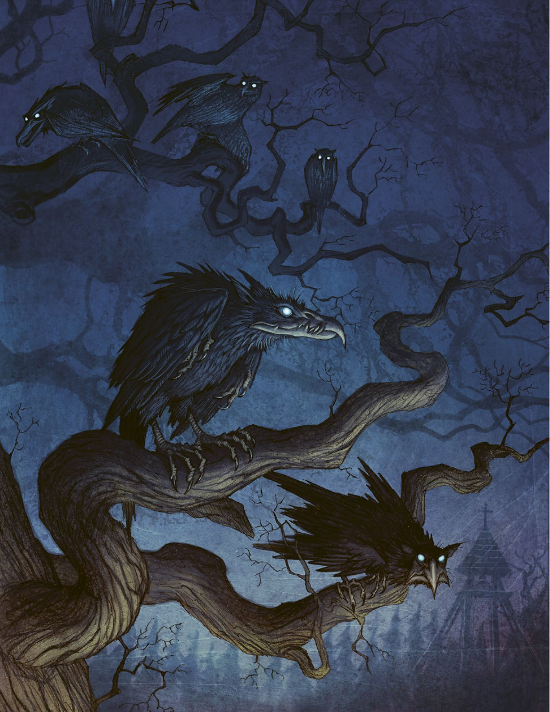
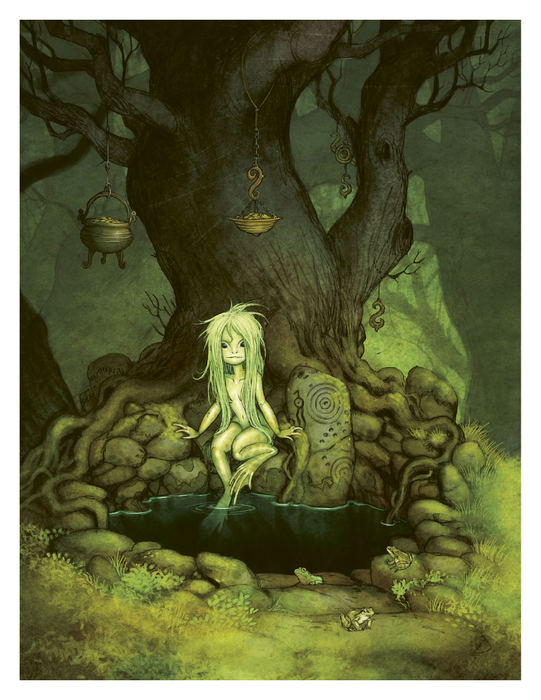

# 第 1 章：导言

[返回总目录](README.md) · 原始 PDF 第 8–19 页

## 本章目录

- [关于自在之物的介绍](#section-01)
- [关于本书](#section-02)
  - [什么是角色扮演游戏？](#section-03)
- [《北欧奇谭》简论](#section-04)
  - [神秘的北地](#section-05)
  - [自在之物](#section-06)
  - [灵视](#section-07)
  - [与自在之物战斗](#section-08)
  - [游戏的形式](#section-09)
  - [冲突](#section-10)
  - [掷骰](#section-11)

<!-- 来源：北欧奇谭规则书.pdf；PDF 第 8 页 -->

<!-- 来源：北欧奇谭规则书.pdf；PDF 第 9 页；原书第 5 页 -->

在赫多斯，没人会谈及那些死去的孩童。在旅店里，我们和牧师的一位朋友古斯塔夫·冯·弗林克会面了，那是一位白发苍苍的贵族。他含蓄地威胁我们道，如果我们继续提问，就不可能活着回到乌普萨拉。幸运的是，当地孤儿院的一个工作人员无视了院长女士严苛的眼神，带我们探访了村庄南边的废弃磨坊。小路两侧牧草丛生，路面上覆满坑坑洼洼、映射出满月微光的水塘。我们必须费力地拔出双脚，才能在泥泞的路面上艰难前行。

这条小路通往一条湍急的小溪，小溪上的木桥通向了对岸的磨坊。这座磨坊年久失修，残破不堪。磨坊的水车已经被激流摧毁，建筑本体则歪斜着倚在溪边。

我们在桥上走到了一半，就听到了尖锐的哭喊，像是从磨坊深处传来的婴儿的哭啼。那些就是我们专程到此，将要超度的死婴灵吗？

卡斯帕尔在桥上擦着我的肩头而过，走在了我们的前面，但刚到桥对岸就猛地顿住了——这让和伊金卡险些径直撞在他身上。在磨坊门前杂草丛生的小路上，站着孤儿院的女院长和贵族古斯塔夫·冯·弗林克。弗林克双手拿着一杆来复枪，院长女士一手拿着燧发手枪，另一只手提着她那长长的马鞭，我们曾见过她用那鞭子抽打脏兮兮的孩童。在他们身前，躺着一个被绑住手脚，衣服上布满血迹和破损的女人，正是她委托我们来此地调查。而此时此刻，她，一动也不能动。

GM：他们目前还没发现你们，但过不了几秒他们就会注意到你们。

玩家 1（加斯帕尔·斯托尔）：“放开她！”

GM：他们看向了你，看起来，他们既不惊讶，也不害怕。

玩家 2（阿斯特丽德·莉亚）：那我举起双手，向他们靠近几步。“我们是来帮助这个村子的，我们想知道孩子们生病和死亡的原因。”

GM：院长女士脸上浮现了不悦的微笑。“那么，你知道得太多了！”她用手枪指向了你。

玩家 1：“你们可以帮助我们，或是站在我们的对立面，但无论如何，我们都会做我们本应要做的事情！”

GM：那么进行一次操控人心检定。

玩家 1：我有 5 个骰子，骰出了一个成功，我通过了！

GM：她把枪放下，似乎想听你进一步说。与此同时，天空忽然变得黑暗，一只巨大的黑鸟遮蔽了月光，降落在磨坊顶上。它的羽毛残缺凌乱，鸟喙锋利修长，橙红色的眼睛就如同地狱之火。而院长女士和古斯塔夫·冯·弗林克似乎并不能看见它。

玩家 2：是死婴灵！

GM：那么，你们现在要做什么？

<!-- 来源：北欧奇谭规则书.pdf；PDF 第 10 页；原书第 6 页 -->

你手中拿着的是一本角色扮演游戏书，本书是基于 Johan Egerkrans 的著作《自在之物：北欧民俗中的精怪》写成的。本书的理念是，你和你的朋友可以通过此书讲述或游玩 19 世纪的北欧怪奇故事。

你们当中仅需要一名通读此书的人，更好的情况是，其他人也翻阅过第一章的内容。你们不需要牢记书中的内容，把它视为进行游戏的参考书目即可。除了本书外，你们还需要纸张、笔和至少 10 个 6 面骰子。

## 关于自在之物 1 的介绍

纵观历史，超自然的自在之物一直与北欧人共存。但人类并不能察觉到它们的存在，除非它们自己愿意。这些不可见的存在，会帮助农庄摆脱困境，使牲畜顺利繁衍，确保迷途的羊群找到归途，在严冬里、野火旁保护人类的安全，以换取农场的鲜奶和谷物。自在之物会在野地里种满鲜花；为人类指向通往水面映照未来的池塘；它们还会在熟睡的人耳边窃窃私语，引领他们入梦。

在19世纪，北欧因工业化、战争和革命而发生巨变，新的思维方式和理解世界的新方法在大学中得以传播，而古老的真理则饱受质疑。贫困的农业人口或是涌入城市，或是横跨大西洋远渡彼岸，以躲避饥荒和追寻自由的生活。

贵族和宗教人士不再能左右人们的思想与行动。而那些利用新时代发明的人则通过这些发明获得了巨大的财富，并通过财富对世界施以影响。城市周围涌现出大量工厂，这也催生了大量的，挤满贫困工人的，生活条件极端恶劣的郊区。

老弱病残和害怕离开的人选择留守村庄。牧草甸上杂草丛生，森林被肆意砍伐，城市之间的铁路工程把存在数百年的道路和社区变成了废墟。玻璃厂里喷涌出化学物质，矿坑就如狼群捕食受伤的动物般吞噬着山体。

北欧的自在之物也随之变化。在过去，村民们知道如何平息它们的怒火，并获得它们的帮助——比如，它们会避免在小精怪洞穴上方的土地上小便，每年都会给田舍侏儒 2 献上粥水和崭新的帽子。但古老的规则与传统不再奏效，现在的自在之物变得残暴嗜血，它们会从村庄里掳走孩童，摧毁屋舍，焚烧粮仓。

在北欧的某些地区，超自然的力量似乎变得更为强大，并开始不规律地、如同席卷农田的风暴般作祟。根据传说，有些出生的小猫长着两只头，小溪的血中混着血浆，森林让年幼的孩子永眠，小仙子在村间跳着舞引诱年轻人到森林里，成为地底之物的奴隶。在其他地区，这些超自然的存在似乎从村野中消失了，就像从未存在过一般，魔法也随之而去。也有人说，一些自在之物跟着人们来到了城市里，在下水道和工厂废墟中找到了新家。

北欧的部分人可以看见自在之物，即使他们尝试让自己看不见——这被称为“灵视能力”。而你就是这些人中的一员，在某个时刻，你经历了一些令你恐惧或受伤的事情，也许，你差点死于某场火灾，也可能你看见狼人在你面前展露自己的本来面目。从那以后，一切都变了。突然间，你可以看见自然精灵从桌子上偷<!-- 来源：北欧奇谭规则书.pdf；PDF 第 11 页；原书第 7 页 -->走食物，特洛精不请自来地出席在婚礼和施洗仪式上。

> 1　译注：自在之物，原文为瑞典语“Vaesen”，“超自然存在”的意思。

> 2　译注：田舍侏儒，原文为瑞典文“Nisse”，北欧民俗传说中的一种神话生物，通常被描述成身材矮小，留着白色长胡子的侏儒形象，一般头上戴着灰色、红色或其他明亮颜色的圆锥形针织帽。常见于北欧文学中，在 19 世纪的故事中尤为常见。田舍侏儒一般被认为是农田和土地的看守及保护者，它们因人类违背自然规律的行为而愤怒，并对人类施以惩罚：若人类因为懒惰不守农时，它们就会让土地贫瘠，若人类过度狩猎，它们就会让人类的畜养的牲畜患上疾病。

你和其他灵视者聚集在瑞典中部的乌普萨拉。你们了解到，过去有个叫“结社”的组织，他们的使命就是了解并对抗自在之物，结社的最后一名成员在大约十年前失踪或隐退。在那以后，结社的总部——在乌普萨拉弗里斯河畔的吉伦克鲁茨古堡——就荒废了。你们决心重建“结社”。一名在精神病院里度日的老妇人，也是结社的前成员，林内亚·艾尔弗克林给了你们古堡的钥匙，以及让你们成为古堡合法拥有者的文件。

你们怀着各自的理由，想要追捕自在之物，并保护人类免受其伤害。你们将踏上漫长的旅途，前往偏远村庄和荒凉地带，并揭开斯堪的纳维亚半岛的秘密。除了勇气、信念和灵视能力外，你们没有任何东西可以武装自己。你们会与自在之物正面交锋。子弹和钢铁无法阻止自在之物，想要驱逐它们，就必须洞察他们的弱点。即便你们获得胜利，与北境自在之物的邂逅也会给你们留下无法痊愈的伤疤！

## 关于本书

在本章中，我们将解释本角色扮演游戏的定义和玩法。并以游戏过程的范例作为开头，而本书中还有许多其他范例。在本章节，你还可以了解到自在之物所存在的世界的简要情况，以及这些与这类故事相关的人物类型。在简述了自在之物到底是什么之后，本章节最后还会介绍表现冲突的规则和形式——在激动人心或十万火急的关头，如何在游戏中通过掷骰结果决定事件的发展。

而下一章，则会讲述如何创建玩家角色（PC），也就是你在游戏中需要扮演的人物或角色。你的角色基于 10 个角色范型，这是创建角色时的人物骨骼及框架。接下来在第三章，则是与技能相关的内容，你可以执行各种行动，比如试图欺骗某人，或者逃离可怕的怪物，而是否成功则取决于掷骰结果。第四章则是天赋相关，即 PC 拥有的各种特技和专长，这些能帮助他们面对自在之物。

第五章则介绍了游戏中可能存在的，各式各样的冲突，比如生死搏斗，被人下毒，被困火场等。本章包括了 PC 受伤，甚至死亡的规则，以及他们在遇到恐怖之物时的处境。第六章则集中讲述“结社”这一概念，也就是角色所在的组织。而第七章中，则提供了本游戏的世界观信息：富有神秘色彩的斯堪的纳维亚半岛，在本章节也给玩家提供了一些建议，以便处理 19 世纪历史和游戏之中的差别。

最后的三个章节，关系到游戏世界和自在之物的秘密。玩家小组中应只有一人阅读这些内容，这名读者不能扮演 PC，而将会作为 GM 主持游戏。因此，其他人在下定决心成为GM之前最好不要阅读这些内容。第八章介绍了自在之物和它们的魔力，这里例举了一些关于自在之物的范例，介绍了自在之物在模组中的使用方法和战斗方式。第九章则向 GM 介绍了使用模组和创作模组的方法。而第十章，也就是本书的最后一章，是一篇名为《梦中之舞》的谜题，它将作为玩家进入游戏的开始，也是 PC 经历的第一个谜题。

<!-- PDF 第 11 页侧栏：本书与本游戏 -->

#### 本书与本游戏

本书完全可以独立使用，而且涵括了进行游戏所需要的全部内容。尽管如此，我们还是非常推荐 Johan Egerkrans 的《自在之物：斯堪的纳维亚民俗和神话中的精怪》这本书。当玩家在神秘的斯堪的纳维亚半岛冒险的时候，可以将此书可以视为指南。

<!-- 来源：北欧奇谭规则书.pdf；PDF 第 12 页；原书第 8 页 -->

### 什么是角色扮演游戏？

角色扮演是一种合作叙事游戏，通常会在桌面上，结合纸笔和骰子进行。除了某个特定的玩家外，其他人都会扮演 PC——就像戏剧或电影中所塑造的那种角色。在本书中，我们把玩家、PC 统称为“你们”，因为你们都应该代入自己的角色，把他们视为“我”。例如，当你打算让你的角色进行某个行动时，你可能会说“我要追着小偷进入火车车厢”，然后用她的方式说话，“以法律的名义，给我站住！”你可以决定角色的穿着和外貌，她的想法和感受，以及她对故事中发生事件的反应。

在角色扮演游戏中，你们的小组通常由3-6人组成，而每次游戏会持续 2-5 个小时。单独的玩家并不能决定事件的走向，故事的细节会被你们一起补全。这正是角色扮演游戏的乐趣之一——没人可以预测接下来的事情。为了让游戏得以进行，你们必须学会聆听他人的想法，并关注他人所描绘的、角色所处的游戏世界。你们都需要有一些想法，去思考世界的表象和运行方式，并对故事本身作出贡献。

游戏小组的成员拥有不同的任务。除了 GM 外，你们所有人都是“玩家”，并负责扮演 PC，玩家最主要的任务是融入到角色中，用角色的眼睛去感受世界，并在特定情况下依照他们的性格行动——哪怕玩家知道这些行动可能会给 PC 带来伤害。

不能扮演 PC 角色的人就是 GM，其职责为确保故事的逻辑性并让故事能向前推进。他需要描述这个世界的模样，扮演所有不是 PC 的角色。如果你们的 PC 遇到了一位脾气暴躁的旅店老板，那么这个角色将会由GM 扮演。GM 还会描述这个肮脏旅店的模样——火焰微弱的壁炉以及挂着巨大战利品的墙壁。而 GM 所扮演的角色都称之为“非玩家角色”（NPCs）。

GM 不需要编造每一件事情。他总是可以依赖自己的玩家，而且，他手上还有“谜题”。谜题是一种类似手稿的文本，只可惜我们在桌面上创造的故事不应该完全参照谜题中所写的文字。它更像是 GM 的基础框<!-- 来源：北欧奇谭规则书.pdf；PDF 第 13 页；原书第 9 页 -->架，其中可能暗示了游戏中发生的事件和准备了玩家可能会遇见的 NPC。谜题还包括对地点描述的建议，以及玩家拼凑线索解决问题的方法。谜题还包括挑战——那些可能会降临到 PC 身上的阻碍和危险。谜题中的内容具体由 GM 决定如何使用，GM 还应确保在决定时充分考虑到了玩家角色的行动。也许你们会去拜访在谜题书中压根就没提过的人？

在游戏的过程中，你的 PC 可能会尝试一些危险困难的事情，也许你会试图威胁一个敌人放下武器，或者给一个朋友止血？在这种情况下，结果是通过投骰子决定的。你的角色在特定方面的能力——比如射击、潜行或是解读线索——会影响成功率。关于更多骰子的信息，在本章末尾和第五章会有提及。

有一点非常重要，请牢记，角色扮演游戏不是竞争，而是合作！破坏和杀死 PC 不是 GM 的职责——尽管出于故事需要，你会经常让 PC 置于险境。有时候我们应该暂停一下，好好聊聊游戏本身，以确保每个人都能开心地游玩。

<!-- PDF 第 13 页侧栏：不可见之物 -->

#### 不可见之物

“哦，田舍侏儒自古就存在了，它们躲在偏远地区，还有僻静的田园或农庄里。聪明的人们会躲着它们，它们任性，报复心极强，会严厉地惩罚那些激怒它们的人。

我的祖母，谢斯廷，是安尼其农场的女佣，那个农庄里就住着一只田舍侏儒。奶奶说，有一天夜里，当地的大人物们举办了一场宴席，在太阳下山后还很是喧嚣吵闹。而在客人们离开后，主人和仆人们都上床睡觉时，田舍侏儒开始自己发出怪叫，一直到早上才停了下来。

但是田舍侏儒对牲畜很好，却也有所偏爱。谢斯廷奶奶说，农庄里有一匹马每天夜里都会被梳理得十分整洁，还有人把它的尾巴编成辫子，而另一匹马则被赶进了树林里，被狼吃掉了。

田舍侏儒们不会随便在人前现身。只有拥有灵视的人才能看见它们。这种人在路上遇见田舍侏儒时，最好给侏儒们靠边让路。因为田舍侏儒们可不会让道。人们应该尊重无形的存在。那些灵视者能感觉到它们，却不喜欢谈论它们，再说了，我从没听说过有人和田舍侏儒有什么联系。”——安娜·厄诺哥斯多特，克维达胡尔特的产婆

<!-- 来源：北欧奇谭规则书.pdf；PDF 第 14 页；原书第 10 页 -->

## 《北欧奇谭》简论

本节是一个简要的概述，读者最好记得这些内容以便能更好理解其他的内容。本节还包含了后续章节所需的参考资料，其中描述了游戏和世界的各个方面，这些内容都是为了让读者更轻易地找到想要的信息。

### 神秘的北地

《北欧奇谭》发生于 19 世纪神秘的斯堪的纳维亚半岛。这个斯堪的纳维亚并不具备历史上的准确性，只是一个平行世界，尽管其事件或多或少和我们现实能够符合。

因此，这些故事并不发生于 19 世纪的某个特定时期，神秘北地结合了整个世纪所有的现象。蒸汽船，火车，以及 19 世界末的政治和哲学运用都会和世纪早期的现象相混合。也就意味着，你完全可以从历史事件中汲取灵感——19 世纪的诸多事件都是创作令人兴奋的神秘故事的绝佳起点。

神秘游戏世界会在接下来的第七章被详细描述，我们还会聚焦于 PC 们当前的居住地，乌普萨拉。

### 自在之物

纵观整个历史，人类一直与自在之物们共享着土地，比如巨魔，鬼魂，林德龙和其他栖息于林间或湖中的生物。如同人类一般，它们也有着自己的兴衰。其中的一部分会协助农夫进行繁重的劳作，就像铁匠用奇异的手工艺品或是鲁特琴演奏者那样，用礼物和富有魔力的音乐帮助人们熬过漆黑的冬夜。

尽管自在之物一直存在，却鲜有人见过它们。对于人类的眼睛而言它们是不可见的，它们可以自行决定是否显现自己。据说，可以从一些无害之物的变化中察觉到它们的存在，比如房间里的气流，或是农场里动物的怪异行为。

传说与歌谣记录了一些避免激怒自在之物而必须遵守的准则。农村的人总是认为他们已经知晓了如何避免与地底居民的冲突，但有些东西早已改变了地表人类和地底之物之间的平衡。自在之物开始袭击村庄、毁坏房屋、工厂和火车站。他们不再如同传说里那样行动，有人认为自在之物们已经疯了，有人则认为这是世界末日即将来临。

在第八章我们列出了 21 种不同的自在之物，并描述了他们与人类的关系，还介绍了他们的能力和对应的游戏规则。

### 灵视

你是一个灵视者，这意味着你有能力看见自在之物，而无论它们是否试图维持隐身。你因某种生理或心理的巨大创伤而获得灵视，那很可能是某种形式的超自然事件引发的，那可能发生于童年，也可能发生于成年后。具有灵视的人也会被叫做“星期四之子”。

出于这样或那样的原因，你已经找到了同样拥有灵视的人们。并且你们决定一起使用你们的力量去帮助人<!-- 来源：北欧奇谭规则书.pdf；PDF 第 16 页；原书第 12 页 -->们面对自在之物们的喜怒无常。你已经了解到，在过去，有一个称之为“结社”的组织，而你们决定重建它。这个组织存在了数百年，由灵视者组成，且致力于研究或驱赶自在之物。组织的成员总是在乌普萨拉的古堡吉伦克鲁茨会面，但约在 10 年前，该组织的最后一批成员离弃了组织，锁上了城堡的大门。任由这建筑荒废，也没有人知道其中的原因。

<!-- PDF 第 14 页侧栏：使用其他城市 -->

#### 使用其他城市

本书假定所有角色将以乌普萨拉为根据地。这个小镇位于斯堪的纳维亚半岛的中部，拥有一所著名的大学，数十个结社和好奇心旺盛的学者。然而，你也可以将游戏放在另一个城镇中进行。建议通读本书关于乌普萨拉的内容（第 105 页），然后在地图和网络上研究下你的所在地，接着试着写一下关于角色故乡的地名辞海。

<!-- 来源：北欧奇谭规则书.pdf；PDF 第 15 页；原书第 11 页 -->

你和你的朋友找到一个结社的前成员，那是一个年长老妇人，叫做林内亚·艾尔弗克林，她现在是乌普萨拉精神病院里的一位病人。林内亚会向你们讲述结社的历史与传统，还给了你们吉伦克鲁茨古堡的钥匙与地契。但无论如何，她都不愿离开精神病院和你们一同回到古堡。她不会说为什么选中你们来重建这个古老的组织、建立你们的基地，以及你们为何要在斯堪的纳维亚半岛继续探索，并解决神秘问题和驱逐自在之物。

在游戏中，你有机会可以探索和扩展吉伦克鲁茨古堡。这座古堡就是你们的大本营，你们会在这里为旅途作准备，也能治愈因遭遇自在之物而带来的精神或肉体上的创伤。与此同时，你们必须在乌普萨拉的亲戚朋友面前假装成正常人的模样，如果他们发现了你具有所谓的接触超自然生物的能力，他们早晚会把你和林内亚关进同一个精神病院里。

你可以在本书第六章了解到更多关于结社、林内亚和大本营的事情。

<!-- PDF 第 16 页侧栏：恐怖之物、神秘事件，还有冒险 -->

#### 恐怖之物、神秘事件，还有冒险

在《北欧奇谭》中，游戏通常涵盖了恐怖，神秘和悬念。由玩家团体共同决定这些要素之间的比重。为了强调恐怖氛围，GM 会把 PC 们置身于孤立且被窥视的情景中。那些生物似乎是不可战胜的，尖啸与奇怪的气味充斥于 PC 的噩梦中。乡村地区陌生又黑暗，大多数问题都无法被解答。

如果你们更关注于解决谜题与挑战，玩家就应被给予棘手的线索并有时间去思考它们。然后，一场谋杀将涉及多个嫌犯，以及可能揭露真相的微妙细节。来自不同地方的线索必须拼凑在一起，才能形成统一的整体。在游戏过程中，角色们会逐步发现线索间的联系。在这种故事里，自在之物通常是寻求力量，财富或知识的工具。

而为了营造冒险和悬疑的感觉，游戏中少不了追逐场景、与怪物刀火相交的冲突，以及富有侵略性且好战的 NPC 们。也许你的 PC 会在即将穿过隧道的火车顶上逃离怪物的攻击，电光石火的瞬间后他们就不得不冒着受伤的风险跃入瀑布以便逃离。而在这场冲突结束后，怪物将在自己洞窟入口处被炸药炸飞。谜题的氛围和关注焦点主要由 GM 负责。但作为一名玩家，也可以通过自己的方式做出贡献。你创造了什么角色，以及你如何扮演他，将会决定你和你的游戏小组会有什么样的游戏体验。在恐怖游戏中，你的 PC 必须容易受到恐惧和绝望影响，当他受到惊吓时，必须允许他逃跑。如果重点是谜题和线索，你的玩家角色就需要适当的技能；他必须具备阅读能力，且可以熟练地调查图书馆和犯罪现场。在冒险故事中，你需要一种动力去做出大胆的决定，并投入到史诗般的战斗中。不要依赖其他人创造你所期待的故事和感觉！确保你自己能在游戏中获得乐趣是你自己的责任！

<!-- 来源：北欧奇谭规则书.pdf；PDF 第 17 页；原书第 13 页 -->

### 与自在之物战斗

你的任务是保护人类不受自在之物的伤害。但世界并不是非黑即白的。你所遭遇的自在之物可能是其他自在之物或人类活动的受害者。因此，无论如何，你需要表明立场并作出正确的事情。

在你踏上探险之路前，需要以火枪与长剑武装自己。你的武装可以帮助你对抗人类敌人，比如强盗和叛军。然而，在对抗自在之物时，最好带上卷轴和残章。或者人类的武器可以牵制住自在之物，但它们几乎不可能被利刃或子弹杀死。

为了与自在之物作战，你必须转向到旧日的传说和被遗忘的书籍中。驱逐自在之物的仪式总是非常精确，执行起来非常困难。你可能要在满月之夜把银粉撒进瀑布里，或是在黎明时分敲响教堂的钟以将巨人赶入林中。每个自在之物都小心地防护着自身的弱点，那些试图利用这些弱点的人总是冒着惹怒它们的危险。

关于和自在之物战斗的通用信息在本书第五章中提供，而更具体的内容则在第八章中每个自在之物的描述里。

### 游戏的形式

结社的探索从乌普萨拉开始，目标是解决一个引起你们关注的谜题。一个谜题通常需要 1-3 次聚会，每次聚会 4-6 小时。一个典型的游戏聚会以玩家的准备开始，比如购买装备，前往图书馆获得知识，或是拜访朋友和联系人。

也可以通过某种形式的邀请使故事启动。它讲述了在某个地方，似乎出现了自在之物。邀请可以是一封求助信，也可以是关于某人失踪的传言。

在前往目的地的路上，你有机会通过准备来获取优势。你有机会在一个小场景中描述及扮演自己的角<!-- 来源：北欧奇谭规则书.pdf；PDF 第 18 页；原书第 14 页 -->色。在这个场景中，你可以获得一个道具，某种洞察力，获得遇到了一个在目的地时能帮助你的人。

<!-- PDF 第 17 页侧栏：礼拜四的孩子 -->

#### 礼拜四的孩子

礼拜一的孩子面容精致，礼拜二的孩子心怀悲悯，礼拜三的孩子多灾多祸，礼拜四的孩子长路艰辛，礼拜五的孩子乐善好施，礼拜六的孩子工作劳苦，安息日的孩子真善喜乐。

——一首谈及灵视者的童谣

抵达目的地后，你们将在不同的地点查探，与NPC 交谈。这些地点可能会有挑战和线索。挑战可能包括某些具有攻击性的人对你们施加阻碍。怪奇的魔法，致命的暴风，或是引你们走上歧途的小精灵。而线索会告知你们正在狩猎一只怎样的自在之物，并提供消灭或驱逐它的方法。

《北欧奇谭》是通过场景进行游戏的。这意味着当你在一个场景中进行扮演，而当场景结束，GM会“剪辑”并进入下一个场景。你无需扮演每一件可能发生的事情，而只需要扮演那些你认为重要的。由 GM 决定场景的开始，以及何时结束。

GM：伊尔金卡，其他人在与镇长会面时，你要做些什么？

玩家 3（伊尔金卡·普洛科汀）：我想要闯入神父的家里，看看他是否有所隐藏。

GM：你要怎么做呢？

玩家 3：我一直等到半夜，然后溜过去，试图打开门。

GM：你就在神父的住所门外，乌云掩盖了星光，周围一片漆黑。只有夜枭在树上啼叫。门扉上了锁。

玩家 3：我要拿出开锁器，试图撬开它。

在游戏过程中，你们会收集到与作祟的自在之物有关的情报，以及见证它如何影响附近的居民，而且情况还会逐步恶化。希望你能找到足够的情报来完成驱逐它的仪式。无论你们成功与否，最终都会回到乌普萨拉的大本营，在那里你们可以从伤病中康复，并从经历中学习到东西。

若想了解谜题的结构和玩法，以及如何创作你的谜题，具体请参阅第九章。

### 冲突

当你们尝试一些困难的事情，或有人在阻碍你们时，就是该投骰子的时候了。由骰子来决定结果。而可以投的骰子数量取决于角色的属性和技能。比如，你试图躲过愤怒的自在之物的攻击，可以使用精准和隐秘行动。把精准属性和隐秘行动技能等级相加得到一个和，然后掷出数量与上述和相同数量的六面骰子。

要成功必须投出至少一个6，投出6意味着“成功”。有时你需要不止一个成功，而如果你投出的成功数比需要的更多，那么则意味着你获得了额外的成功。

如果有人在冲突中试图阻止你，则你们要比较谁的成功数更多。本书中有些地方说你可以获得 +1 的加值，这意味着你在特定情况下有额外的一个骰子可以投掷。

在本书第三章中，有关于冲突和掷骰的更详细的内容。

GM：农夫拉住了你。他浑身酒气，但眼神坚定，双手紧紧地攥着。“我可不在乎你那些冠冕堂皇的头衔，任何人都不能打扰我妹妹！”

玩家 1（加斯帕尔·斯道尔）：“你难道看不出来我们是在努力帮她吗？她得的不是普通的病，她被附身了！”

GM：他冲着你的脸打了一个酒嗝。“任何人都不能从这里经过，哪怕是天王老子也不行！”

玩家 1：我要把他推到在一边，然后开门。

GM：那进行力量检定吧。

玩家 1：我体能 3，力量 1，总计 4 个骰子，投出了一个 6，棒极了！

GM：但这个农夫有 7 个骰子，并且骰出了 3 个 6，比你还多俩。这说明他不仅成功了，还是额外成功。你抓住农夫，想要把他摔倒。但他的脚就好像在地上生根了，身子纹丝不动。

玩家 1：“呃 ~ 或者，我们也可以谈谈？”

<!-- 来源：北欧奇谭规则书.pdf；PDF 第 19 页；原书第 15 页 -->

### 掷骰

角色所擅长的事情，比如理解能力，话术，攀爬或是快速奔跑的能力，会用数值来表示。这些数值表明了当你必须解决麻烦时拥有多少个骰子。投出 6 即为成功，一般很少需要 2 个或以上的成功数。如果你失败了，你可以重新掷骰，但你必须因此承担一个状态。关于这点，我们会在第三章有更详细的解释。

有些表格会要求你投掷 D66，这意味着你要投掷两个六面骰，再次之前应先决定哪个骰子代表十位而哪个代表个位。例如，你的第一个骰子投出了 3，第二个骰子投出了 6，那么结果就是 36。

<!-- PDF 第 19 页侧栏：六大准则 -->

#### 六大准则

《北欧奇谭》应受限于六大准则，这些准则可以用于提供灵感，定义世界，以及定义这世界中的人物和怪物的行为方式。这六个准则分别是：

1. 自在之物非善非恶：玩家所遭遇的生物都有自身的日常生活、计划和梦想。它们当中的有些存在会与当地人类合作，有些热衷于恶作剧，有些则是彻头彻尾地实施谋杀。但无论如何，它们都必有自身的动机。

2. 自然界是黑暗且危险的：PC 们的家和大本营都在城镇里，这是能让他们感到安全的地方。而大自然代表了未知，那一另一个世界，截然不同的世界，在黑暗的密林和孤独的群山之中，任何事情都可能会发生。如果你迷失其中，不会有人能找到你的。

3. 斯堪的纳维亚正在发生变化：古老的斯堪的纳维亚正在被工业化的浪潮席卷，这种变化往往是随处可见的剧变：废弃的农场，街上的乞丐，困惑的自在之物在满是工厂和蒸汽机的新世界里找寻着自己的定位。

4. 知识和智慧是成功的关键：自在之物带来的谜题很少可以通过暴力解决。你必须使用你的能力来研究线索，理清你所发现的信息，还需要说服人类和自在之物分享它们所知的秘密。

5. 旅途不是目标的全部：谜题不仅仅是有待解决和克服的问题，它完整的意义在于让玩家通过游戏融入到故事中。另一个重要的事情是 PC自身的旅途历练，一个角色会从一个未经训练的年轻人，变成一个老道且富有经验，甚至伤痕累累的……老兵。

6. 你无法独自生存：PC 需要面对的怪物可以让人疯狂，而巨兽只消一击就能把人杀死。唯一的生存之道就是团结一致。无论是出于故事情节的需要，还是治疗游戏中伤痛的需求，PC 间的关系，还有 PC 和重要 NPC 之间的关系都是非常重要的。

<!-- PDF 第 19 页侧栏：特殊骰子 -->

#### 特殊骰子

《北欧奇谭》使用特制的骰子。这些骰子并不是进行游戏所必须的，但可能有助于游戏桌上的氛围。

[返回总目录](README.md) · [下一章](02-player-characters.md)
