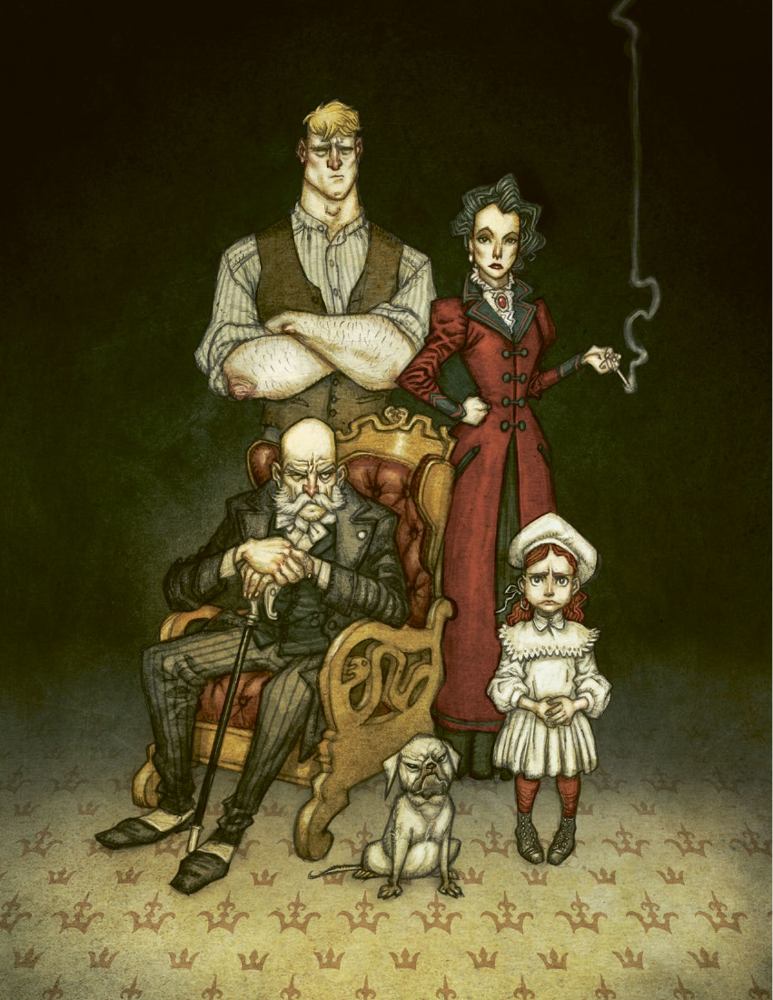

# 第 2 章：玩家角色

[返回总目录](README.md) · 原始 PDF 第 20–39 页

## 本章目录

- [个人特质](#section-01)
  - [角色范型](#section-02)
  - [年龄](#section-03)
  - [名字](#section-04)
  - [动机](#section-05)
  - [创伤](#section-06)
  - [黑暗秘密](#section-07)
- [专长](#section-08)
  - [属性](#section-09)
  - [技能](#section-10)
  - [天赋](#section-11)
- [其他方面](#section-12)
  - [人际关系](#section-13)
  - [资源 = 你的资源值代表你有多少可供支配的资金。](#section-14)
  - [装备与纪念物](#section-15)
  - [描述](#section-16)
  - [状态](#section-17)
  - [优势](#section-18)
  - [经验](#section-19)
- [角色范型](#section-20)
  - [学者](#section-21)
  - [医生](#section-22)
  - [猎人](#section-23)
  - [神秘学家](#section-24)
  - [军官](#section-25)
  - [牧师](#section-26)
  - [私家侦探](#section-27)
  - [仆人](#section-28)
  - [流浪者](#section-29)
  - [作家](#section-30)

<!-- 来源：北欧奇谭规则书.pdf；PDF 第 20 页；原书第 16 页 -->

<!-- 来源：北欧奇谭规则书.pdf；PDF 第 21 页；原书第 17 页 -->

我以为是一只鸟儿破窗而入，结果却是一个年轻的女人，她赤裸着身子，长着轻盈的翅膀，比乌鸦大不了多少。她的身体就像是粉红的水晶，熠熠发光，而背部和后颈布满咬痕。她看起来像是被老鼠咬伤了，我并不知道到底是什么迫使艾琳希达提尔逃出来，最后和我在一起。起初，我照料她的伤口，把她关在我床边的鸟笼里。四天之后，她竟然开口说话了，这着实让我惊讶。更重要的是，她比我还见多识广，且声称自己比我年长几百岁。后来我让她睡在我的枕头上，并在她的脚踝上系了根银链。她会吻我的脸颊，向我道晚安。而现在，当我试图理解她是如何死去，并被封存在一个玻璃罐中时，我想起了她的吻，我依然爱她，可是，她再也无法回应我的感情。

你的玩家角色是一个生活在 19 世纪乌普萨拉的人类，且拥有灵视能力。他和他的朋友们一起重建了结社，那是一个旨在追踪和打击自在之物的组织。

作为玩家，你应全身地扮演你的角色。把他置于危险而有趣的境地中，不要害怕，因为那样才会更加有趣。本章提供了如何一步一步创建角色的步骤。你们可能会需要一个团队，那样你们的角色就会彼此关联，形成有趣的人际关系。

创建角色所涉及的选项可分为三个类目：个人特质、专长和其它方面。在个人特点中，你首先需要选择一个角色范型，这是一种角色模板。然后为你的角色起名字，确定他追猎自在之物的动机。还需要明确角色的创伤来源，描述使他获得灵视能力的事件，并想出一个需要隐瞒其他 PC 的黑暗秘密。

专长代表了你的角色所精通的强项，当你在解谜或面对危险，需要掷骰时就会用上它。它具体由属性、技能和天赋组成。

最后一个部分涉及了你与其他 PC 的关系，以及你的装备和财产资源。在这里你会看见和受伤相关的规则，无论肉体上还是精神上的，以及如何通过完成谜题获得的经验值来强化你的专长。“优势”这一栏则意味着，你在前往斯堪的纳维亚半岛的陌生地点旅行时，可以通过磨练技能，阅读神秘文本或是面见那些能鼓舞你的人来取得优势。

<!-- 来源：北欧奇谭规则书.pdf；PDF 第 22 页；原书第 18 页 -->

## 个人特质

你可以基于决定背景和个人特质来创建玩家角色。这些内容会成为角色的基础，而随着游戏的发展，你会越来越清楚自己的角色是个怎样的人。

### 角色范型

首先要做的事情就是选择角色范型，角色范型是角色的基础，且明确了接下来的一些步骤。你选择的范型会成为一个骨架，随之一个有血有肉的角色将从中诞生。角色范型也决定了你所擅长的领域。我们提供了 10 个角色范型可供选择，所有的角色范型都会在本章的最后一一描述。一组玩家中不宜有玩家选择相同的角色范型。

### 年龄

下一步是决定角色的年龄，游戏中分为三个年龄组。青年、中年和老年。选择一个并记录在你的角色卡上。年龄会影响属性和技能。

### 名字

从范型下的建议名单里选一个名字，或者你也可以自己取一个。

### 动机

你的动机解释了为何你的角色愿意冒着生命危险去追查并对抗自在之物。它将帮助你扮演好你的角色，你可以从角色范型的建议中选择，也可以自己想一个。

### 创伤

你的创伤给予你灵视能力。这件事可能发生于你的童年，也可能发生于你成年之后，但通常和超自然现象相关。创伤可以是肉体上的，也可以是精神上的，或许你目睹了一些可怕的事情，或许你被卷入了一场灾难。

<!-- PDF 第 22 页侧栏：年龄 -->

#### 年龄

| 年龄组 | 年龄 | 属性点 | 技能点 |
| --- | --- | --- | --- |
| 青年 | 17-25岁 | 15 | 10 |
| 中年 | 26-50岁 | 14 | 12 |
| 老年 | 51+岁 | 13 | 14 |

<!-- PDF 第 22 页侧栏：创建角色 -->

#### 创建角色

1. 选择角色范型

2. 选择年龄

3. 选择名字

4. 根据年龄分配属性点

5. 根据年龄分配技能点

6. 选择一个天赋

7. 选择一个动机

8. 选择创伤

9. 选择黑暗秘密

10. 选择你与其他 PC 之间的关系

11. 投出纪念物

12. 选择装备

<!-- 来源：北欧奇谭规则书.pdf；PDF 第 23 页；原书第 19 页 -->

### 黑暗秘密

你的黑暗秘密是一个令人羞耻的麻烦事，因此你把它藏在心底。它可能与你的创伤有关，或者是你在关注的一些完全与众不同的东西。但无论如何，他都会给游戏带来积极的影响，它会让你在乌普萨拉和旅行中遇到困难。也许你会被特工追捕，也许你要隐藏自己酗酒的事情，也许你正饱受妄想的折磨，也许你的家里曾发生过一些不能让外人知道的事情。

GM 有一项工作，就是确保你们的黑暗秘密成为故事的焦点。将秘密融入到游戏的谜题中会更加有趣，尽管这会给玩家角色带来麻烦。如果你的黑暗秘密已经解决，或者你已经厌倦了，那么你也可以用别的内容替换它。

GM：磨坊主说这就是他所知道的全部了。正当你们要离开时，他突然盯向你，阿斯特丽德。从眼神可以判断，他认出你来了。

玩家 2（阿斯特丽德·丽佳）：噢！糟糕了！

GM：“你说你叫什么名字？”

玩家 2：阿斯特丽德·丽佳，圣母玛利亚修道院的前修女，您为何要这么问？

GM：我们以前见过，但那时候你叫另一个名字，而且那时候你肯定不是个修女！

<!-- PDF 第 23 页侧栏：北方的布谷，会带来悲苦， -->

北方的布谷，会带来悲苦，东方的布谷，会带走忧伤；西方的布谷，会带来吉兆，南方的布谷，喙里衔着死亡。

——关于解读布谷鸟叫声的童谣

<!-- PDF 第 23 页侧栏：关于性别角色 -->

#### 关于性别角色

真实的 19 世纪是一个父权社会，男性对女性拥有绝对权力。女性在行为、言语和就业等方面都受到限制。然而我们的角色扮演游戏并不需要还原真实的 19 世纪，它是关于神秘化的斯堪的维亚纳半岛的故事。你的游戏小组应共同决定这个斯堪的那维亚半岛到底是何种样貌，以及你们要如何处理这些问题。我们认为，没有必要让历史的不公去限制玩家的选择，尤其是在历史文学和童话故事中都有许多强大的女性。

<!-- 来源：北欧奇谭规则书.pdf；PDF 第 24 页；原书第 20 页 -->

## 专长

属性、技能和天赋构成了你的专长。它决定了你的角色擅长什么（以及不擅长什么）。在游戏中出现冲突、刺激或是危险的情况时，它会决定你的掷骰情况。

### 属性

有四个属性用于描述你的角色强项和弱项，分别是体能、精准、逻辑和共情。这些属性都必须介于2-5之间，它们决定了你依赖该属性行动时候可以投的骰子数量。根据年龄你可以得到属性总值，然后分配到各个属性上。最小值为 2，最大值为 4，你所选择的范型的主要属性则最大可以分配到 5 点。

#### 体能

体能是衡量多强壮、多健硕的属性。它是打击能力和抗击打能力，也决定了你在没有食物和休息的情况下能坚持多久。它还能决定你举起倒下的树干的难易程度。

#### 精准

精准是衡量你协调能力和运动能力的属性。

#### 逻辑

逻辑是你解决问题的智力能力，也能反映你受教育的程度，它能帮助你在某些可怕的情况下解决问题。

#### 共情

共情代表你理解、说服、吸引或欺骗他人的能力。共情能在可怕的情况下帮助你解决问题。

<!-- PDF 第 24 页侧栏：所有人必须保护自己免受不可见之物的 -->

所有人必须保护自己免受不可见之物的伤害，比如女巫和特洛精，以及蛇与蜥蜴这样的邪恶之物。如果说有什么是它们无法处理的，那便是钢铁、硬币以及其他它们无法控制的人造物。我的兄弟真傻，居然听信一个商人的胡话，那商人说自在之物和特洛精不过是孩子们的故事罢了。这使我的兄弟不再把带鞘的小刀插在门上，并让他的妻子把谷仓地基上的守护硬币拿走。因此，他的房子里就有孤魂野鬼，它们偷走了面包和布匹，咬伤了孩子们的手指脚趾直至流血。不可见之物的窃笑使他们一家人几夜无法安眠，直到他无法忍受，用猎枪在屋子里开了一枪，那子弹里装满了银制的薄片。幽灵们像黑烟般爬上了烟囱，尖叫着说它们势必会带着火与冰回来。但它们刚离开，我的兄弟马上就把小刀插在了门框上。于是这些东西就失去了力量。

——伊诺格·斯文松，比达莱特的佃户

<!-- 来源：北欧奇谭规则书.pdf；PDF 第 25 页；原书第 21 页 -->

### 技能

技能代表着获得的知识、训练和经验。一共有 12种技能，它们都在第三章中被详细描述。每种技能数值都在0-5之间。当你在尝试一些困难或危险的事情时，技能值和属性一同决定骰子数量。

年龄会决定技能点数。在游戏开始时，你的任一技能不会超过 2 点，但你所选择的角色范型的主要技能可以提升到 3 点。解决谜题会获得经验值，经验值可以用来提高技能（见下文）。

### 天赋

天赋是能使你在各种情况下受益的诀窍、特点和能力。它们会影响你的骰子数量，或者使你获得力量和资源。在本书第四章中，会有天赋的详细描述。

在你创建玩家角色时，你选择的角色范型提供了三种初始天赋可以选择。当你通过游戏获得经验值后，你可以获得更多的天赋。然后可以自由选择新的天赋，其中包括其他角色范型的天赋。

## 其他方面

为了在与自在之物遭遇和战斗中活下来，你的 PC现需要朋友们的帮助，还有武器，装备，以及在偏远地区旅行住所所需支付的资源。通过向其他玩家描述你的角色，可以丰富角色本身。

在这里，你还能发现你受伤时会发生的事情；你如何通过旅行来给自己创造优势；你的经验值如何帮你提高的技能，或是购得新天赋。

### 人际关系

你的 PC 和所有 PC 间都存在人际关系，在游戏开始时你们都认识彼此。或者仅仅是相识，也可能已经是一生的挚交。对于其他角色，你可以从你的角色范型中选择一种人际关系，或是自己创造一种人际关系。另一个玩家必须对这种关系表示同意。人际关系应该是有趣的，不会让你们成为敌人，毕竟你们必须要一起旅行和工作。

### 资源 = 你的资源值代表你有多少可供支配的资金。

数值较高意味着你有更好的住所和生活方式，更容易获得你想要的物品。下文的表格中显示了不同数值所代表的不同含义。游戏中改变你生活水平的事件会改变你的资源值。通常情况下，你的初始资源等同于角色范型资源范围的最低值，然而，你可以通过使用技能点来提高它，每投入一点技能点，将会提高一点资源值，但你的资源不应超过角色范型所列出的范围。在游戏开始前，资源只能通过消费技能点来获得。而一旦游戏开始后，你就只能通过购买天赋来获得资源值。

<!-- PDF 第 25 页侧栏：技能表 -->

#### 技能表

- 敏捷（体能）

- 近身战斗（体能）

- 力量（体能）

- 医学（精准）

- 远程战斗（精准）

- 隐秘行动（精准）

- 调查（逻辑）

- 学习（逻辑）

- 警觉（逻辑）

- 启迪（共情）

- 操控人心（共情）

- 观察（共情）

<!-- 来源：北欧奇谭规则书.pdf；PDF 第 26 页；原书第 22 页 -->

### 装备与纪念物

你的角色范型决定了你有什么初始装备。除了常规装备外，你还会有一个纪念物，它将会帮助你进行游戏并塑造角色。参照表格骰出你的纪念品或者自行决定。你可以通过使用纪念物，与之互动来恢复一个状态。你解释在困难中如何使用纪念物。GM 对此有最终的决定权。

你的纪念物是你角色的一部分，你可以把它写进你的个人特质或背景中。它可能会在一个谜题中损坏或遗失，但通过消耗一点经验值，你可以在下个谜题中及时重获它或者修复它。你也可以选择一个新的纪念物，但这种情况下，你必须先经历一次没有纪念物的完整谜题。

### 描述

在游戏开始之前，你必须向其他玩家和 GM 介绍自己。举个例子，你可以描述你的外貌，给人的感觉，<!-- 来源：北欧奇谭规则书.pdf；PDF 第 27 页；原书第 23 页 -->穿着打扮，以及别人应该如何称呼你。也许，有许多与你有关的谣言，或者你的社交场合总会成为焦点。你是否安静又富有神秘感。你身上会有丛林和汗水的气味吗？你的描述应该生动而简短。在你的角色卡上写下一些内容，如果你有空还可以给他画张图。

<!-- PDF 第 26 页侧栏：资源表 -->

#### 资源表

| 资源值 | 生活标准 |
| --- | --- |
| 1 | 赤贫。你的生存完全依赖他人接济，每日都为了三餐而挣扎，而即便你有些财产，也少得可怜。这可能会导致你挨饿、患病或者转而投向药物和酒精。 |
| 2 | 贫穷。你的生活非常简陋。你的餐桌上大多数时候都有吃的，但可能难以果腹。如果你有孩子，他们会被迫生活在肮脏的环境中。你可以有一套换洗的衣服和少量财产。对你和你的家庭而言，失去收入总是灾难性的。 |
| 3 | 挣扎。你有一个简陋的家和固定收入。你没什么积蓄，但可以在特定的场合为家人作打扮，你的孩子也会有受教育的机会——至少在几年之内。 |
| 4 | 经济稳定。你有自己的房子和一份收入稳定的工作。有可能你存了些钱，偶尔会犒劳自己一些糖果，一次旅行或是一件精致漂亮的小玩意。在危机时候，总有人愿意借钱给你。 |
| 5 | 中产。你有自己的房子和生意，你可能有 1 个或几个雇员，且知道如何为未来投资。你有存款，也能获得贷款。你和你的家人生活富足。 |
| 6 | 小康。你有一所大房子或是大公寓。你可能有好几个雇员和若干个收入来源。你不会把金钱视为一种稀缺的资源，而是一种增加资本和影响力的筹码。你人缘极佳且很少与穷人打交道。你的家人可以去度假，而你可以负担得起所有最新的发明。 |
| 7 | 富有。你继承了大量的财产与不动产。你拥有多种形式的财产，有许多仆人和多种收入渠道。几乎没有东西是你买不起的。你与城镇甚至国家的精英关系良好，常与高级官员、政客和贵族关系密切。你只能通过车窗看见穷人。 |
| 8 | 大富豪。你是这个国家最富有的人之一，和统治者有着直接的关系。你拥有一座甚至好几座城堡或别墅。再大的花销都不是什么问题，你可以尽情放纵自己而无需担心花销。 |

在游戏中，你可能会承受一种叫“状态”的东西，这就像是某种伤口或精神疼痛。当你在危机中无法有效保护自己，或者你为了成功做了孤注一掷的行为时，你就会承受状态。这些会在下文的第三章或第五章中详尽描述。

<!-- PDF 第 27 页侧栏：纪念物 -->

#### 纪念物

骰出 2 个 6 面骰，第一个代表十位而第二个代表个位。

| D66 | 物品 |
| --- | --- |
| 11 | 风干的红玫瑰 |
| 12 | 亲近之人的照片 |
| 13 | 一枚有秘匣的印章戒指 |
| 14 | 你父亲的手杖 |
| 15 | 有秘密隔间的帽子 |
| 16 | 一本以外语写成的书 |
| 21 | 带刻字的扁酒壶 |
| 22 | 一封旧情书 |
| 23 | 一只肮脏的猫 |
| 24 | 一只猴子的头骨 |
| 25 | 血迹斑斑的本票 |
| 26 | 母亲戴过的金首饰 |
| 31 | 带链子的银色十字架 |
| 32 | 家族代代相传的精美小提琴 |
| 33 | 日记本（你的或者别人的） |
| 34 | 日期对你而言非常重要的报纸 |
| 35 | 破破烂烂的玩偶娃娃 |
| 36 | 信鸽 |

| D66 | 物品 |
| --- | --- |
| 41 | 一本常常翻阅，写有致辞的小说 |
| 42 | 家族的墓地规划 |
| 43 | 页边空白区有注释的地图 |
| 44 | 玻璃罐中的奇异动物 |
| 45 | 你童年时候的八音盒 |
| 46 | 日长石（切割好的矿物） |
| 51 | 会让你想起某人的小瓶香水 |
| 52 | 家族流传的赞美诗篇 |
| 53 | 有照片嵌在里面的怀表 |
| 54 | 一份未签字的遗嘱 |
| 55 | 异国带来的黄金盒子 |
| 56 | 一位被遗忘的大师留下的乐谱 |
| 61 | 安眠药粉盒 |
| 62 | 写有精美花体字的烟斗 |
| 63 | 兔子脚或是其他幸运护符 |
| 64 | 有注射器的针盒 |
| 65 | 用骨头制成的旧骰子 |
| 66 | 家族流传下来的手稿 |

<!-- 来源：北欧奇谭规则书.pdf；PDF 第 28 页；原书第 24 页 -->

### 状态

肉体上和精神上的状态都有三个等级。承受每一级状态意味着你会在特定的技能检定中得到一个 -1 的调整值（减少一个骰子）。肉体的状态会给体能和精准相关的检定带来惩罚，而精神的状态会给逻辑和共情检定带来惩罚。还要注意调整值是会积累的。获得 2级的状态会给你的技能检定带来 -2 的调整值（减少两个骰子）。然而，在谜题中，你有机会治疗状态的（见第五章）。无论你累计承受了多少级的状态，你总是至少有一个骰子。

状态会有助于你塑造角色：如果她感到难过，那就应该在扮演时表现出来。但，当然是由你决定哪些状态会如何影响扮演角色的方式。

### 优势

在通向谜题的路上你可以获得一个优势，每个谜题只能获得一个。优势可能是一个新结识的，能在某个地方帮上忙的人，可能是给予你力量的神秘经历，或者你可以在前往谜题的路上维护或训练你的武器。优势还可以是你与另一个玩家的联系，你将会有助于你们的合作。

每回游戏中你可以使用一次优势，在这时你的检定会获得额外的两个骰子。你必须决定是在检定前使用，还是在孤注一掷时使用它（见第三章），并解释你会如何使用优势。在谜题过后，你的优势会消失，而下次你必须选择另一个技能来获取优势。

<!-- PDF 第 28 页侧栏：状态 -->

#### 状态

肉体状态（影响体能和精准）

- 疲惫

- 受创

- 重伤精神状态（影响逻辑和共情）

- 愤怒

- 恐惧

- 绝望

<!-- 来源：北欧奇谭规则书.pdf；PDF 第 29 页；原书第 25 页 -->

GM：远处轰然作响！周遭的人群消失无踪！你孤身一人站在小镇的广场上。阳光被病态的绿色阴云笼罩。有什么从林子里过来了。大地变得泥泞不堪，仿佛拉扯着你的大腿把你拽倒在地。进行一个恐惧检定！

玩家 1（加斯帕尔·斯道尔）：我要拿出火车上那个老妇人给我的圣像。凝视着它，心中回想起老妇人的话，“在最黑暗的时刻，伸出你的手去感受上帝的存在！”因此我有 2 个额外的骰子！

### 经验

每场游戏结束后，pc 都会获得经验值（XP）。GM 会问你一些问题，你每次回答一个“是”就能获得一点 XP。

当你获得 5 点 XP 时可以获得一个成长。这意味着你可以提高一个技能的等级或购买一个新天赋。你的技能等级不能超过 5，但可以购买任意数量的天赋。值得一提的时，你可以通过成长获得任何的天赋，包括其他角色范型的天赋。

## 角色范型

本节介绍了 10 个角色范型，你必须选择其中一个，以作为角色的基础。每个范型都有一些选项和建议可供参考。

对于构成角色的个人特质的部分内容，你可以自由地做出选择，尽管这些内容都需要得到 GM 的最终确认和同意。而对于专长的数值，你必须让它们不超出角色范型所提供的范围。

<!-- PDF 第 29 页侧栏：优势的范例 -->

#### 优势的范例

- 我日日夜夜地苦练剑术

- 希芙达尔小姐似乎喜欢我

- 我被天使祝福了

- 我梦见我为了朋友们不惜犯险

- 和布伦加德上尉的谈话彻底解决了我们之间的分歧

- 凭着布鲁内留斯教授吻我的记忆，我可以做成任何事

<!-- PDF 第 29 页侧栏：经验获取问题 -->

#### 经验获取问题

1. 你参与了本次游戏吗？（角色总是至少能获得这一点经验）

2. 你是否和自在之物对峙过？

3. 你是否辨别了一种以前不了解的自在之物？

4. 你的黑暗秘密是否影响了你？

5. 你是否为了保护他人而犯险？

6. 你是否学会了什么（是什么呢）？

7. 你是否开发了自己的大本营？

8. 你是否做出了非凡的行动？

<!-- PDF 第 29 页侧栏：人生轨迹 -->

#### 人生轨迹

依照本章的进行角色创建是最为快捷的方式。但是，对于渴望更多细节的人来说，本书的最后提供了一种替代的角色创建过程，从第214 页开始提供了一些人生轨迹的随机表，你可以依照表格掷骰来进行角色创建。

<!-- 来源：北欧奇谭规则书.pdf；PDF 第 30 页；原书第 26 页 -->

### 学者

我们都认同，至少在理论上这是可行的，有种方式可以让非灵视者，或说不是“星期四之子”的人获得看见自在之物的能力。其他人很快就忘记了我们的讨论。但这对我而言，是一个萦绕心头的困扰。这可不仅仅是一个理论问题。如果其他人也能看见那些东西，我们就会成为新世界的引领者。一位科塔亚姆的苏菲派哲学家提到过一种黑色的液体，在翻译后，我们称之为“黑泥浆”。一旦喝下它，那些东西就会浮现于眼前。我不得不变卖了母亲留下的大部分珠宝。让一个商人把一罐“黑泥浆”带回乌普萨拉。现在，这罐东西，就在我的书案上。

在以下的选项中选择一个，或是自己编写一个。

#### 姓名

- 名字：阿尔伯特，阿斯特里德，艾琳，伊萨克，路易斯（露易丝），帕拉斯科维雅

- 姓氏：布鲁格、格林哥琉斯，托提内

#### 动机

- 记录未知

- 修正我的严重错误

- 成名

#### 创伤

- 小精怪把你变成了老鼠

- 因为美人鱼的魔法你变得衰老

- 目睹同伴被巨人撕碎

#### 黑暗秘密

- 药物上瘾

- 窃取或伪造文件以获得研究结果

- 被自在之物追猎

#### 人际关系

- 为每个玩家选择一种人际关系，或者自行编写。

- 实现目的的工具

- 在你面前我无法保持冷静

- 好朋友

- 主属性：逻辑

- 主技能：学习

- 天赋：书虫、学富五车、知识是可靠的

- 资源：4-6

- 装备：藏书或地图集、书写工具、烈酒或计算尺

<!-- 来源：北欧奇谭规则书.pdf；PDF 第 31 页；原书第 27 页 -->

### 医生

电信号游走于我们周身。当外界的微生物进入我们皮肤时，身体就会产生微观的士兵进行防御。大脑能记录的东西远比我们一生能书写的要多。奇迹无时无刻不在我们身边发生。但我的同事仍然质疑超自然生物的存在。我被迫，在屈辱中撤回了我的声明，以保留我的行医权利。我知道我在芬兰北部的罗瓦涅米出差时解剖的东西绝非上帝的造物。作为医生，我的誓言是帮助和保护我的同胞，哪怕是面对来自地狱的威胁。

在以下的选项中选择一个，或是自己编写一个。

#### 姓名

- 名字：阿尔弗雷德、多罗提亚、弗雷德理希、卡尔、玛吉特、威海米娜

- 姓氏：波勒琉斯、康宁斯马克、卢肯内

#### 动机

- 探索并解释世界

- 治疗病弱者和受病魔摧残之人

- 壮大结社，并成为其领袖

#### 创伤

- 在尸检中遇到了死者复活

- 给一个长着驴耳驴蹄的人做过手术

- 从垂死的美人鱼眼中看见了自己的命运

#### 黑暗秘密

- 你有两个人格

- 卷入非法事务

- 非自然的欲望

#### 人际关系

- 为每个玩家选择一种人际关系，或者自行编写。

- 我相信你能保守我的秘密。

- 你打扰到我了！

- 我会在夜里梦见你。

- 主属性：逻辑

- 主技能：医学

- 天赋：军医、主任医师、应急医学

- 资源：4-6

- 装备：装有医疗用品的医生背包、烈酒或好酒、瘦弱的马或强效毒药

<!-- 来源：北欧奇谭规则书.pdf；PDF 第 32 页；原书第 28 页 -->

### 猎人

男爵夫人猎鸭的爱好不过是个借口，她不过是想和我在野外单独相处罢了。我们经常会带着酒和面包外出，在精致的地毯上云雨之前，她会跟我讲怪物和自在之物的故事。我鼓起勇气，叫她“亲爱的”，但她的神情告诉我，我们之间的关系太近了，甚至已经越过雷池了。有一天夜里，她一丝不挂地来到我家。当她跨坐在我身上时，我才注意到男爵和其他几个人已进入了我的小木屋，就躲在门边的暗处。我想要站起身来，但男爵夫人用激烈的肢体动作把我按倒。她的呻吟变成了一种以古怪腔调说出的话语，我的身体因恐惧而开始抽搐，其他人靠近了我们，和男爵夫人开始一同吟唱。

在以下的选项中选择一个，或是自己编写一个。

#### 姓名

- 名字：阿尔戈特、布兰达、埃吉尔、玛伊、马尔特、托伦

- 姓氏：埃克、林德伯格、希格理德松

#### 动机

- 袭击我家人的东西必须被消灭

- 与自然和谐相处

- 渴望超凡的狩猎

#### 创伤

- 被灰树夫人的枝条袭击

- 在森林中摔断了腿，在一团鬼火的指引下回到了家

- 在黎明时分被山中的特洛精捕获，并被困在它化成石头的手臂中。

#### 黑暗秘密

- 我出卖过灵魂

- 我无法控制自己的怒火

- 和自在之物有过一个孩子

#### 人际关系

- 为每个玩家选择一种人际关系，或者自行编写。

- 我被你所吸引。

- 我讨厌你这种欺凌他人的瘪三。

- 你就是个住在城里的胆小鬼。

- 主属性：精准

- 主技能：远程战斗

- 天赋：寻血犬、草药专家、神射手

- 资源：2-4

- 装备：来复枪、猎刀或猎犬、狩猎陷阱或狩猎装备

<!-- 来源：北欧奇谭规则书.pdf；PDF 第 33 页；原书第 29 页 -->

### 神秘学家

我必须要知道真相。我是如何获得预知能力的？我又是如何仅凭想象人们的心跳，就使他们在剧痛中倒地的？在我年轻移居城市时，我的母亲留在了拉格比。她与两只山羊还有一头猪一起生活，奇怪的是，她用我已故父亲的名字命名了这头猪。我妈妈不喜欢谈论这些事情。她总是用两句话敷衍我：“摇篮，在我醒来时你就在摇篮里了。”我最后失去了耐心，我用壁炉的烧火棍威胁她，扬言要将她变成我脸上的疣子。然后，她告诉我，我其实是替换儿。

在以下的选项中选择一个，或是自己编写一个。

#### 姓名

- 名字：阿勒克桑达，尼克拉斯，托马斯，英格里德，尤里卡，瓦伦提娜

- 姓氏：贝克伦德，克朗德松，默尔克

#### 动机

- 学习自在之物相关的知识

- 了解自我

- 追寻力量

#### 创伤

- 在试图偷林德龙的龙蛋时被腐蚀毒液击中

- 家里的农场被一个脾气暴躁的田舍侏儒霸占

- 被夜鸦袭击并因此染上了热症

#### 黑暗秘密

- 我犯下过令人发指的罪行

- 我的力量控制着我

- 我是换生灵

#### 人际关系

- 为每个玩家选择一种人际关系，或者自行编写。

- 你有什么瞒着我们。

- 你让我平静。

- 你总有一天会拯救我们。

- 主属性：精准

- 主技能：隐秘行动

- 天赋：魔术手法、灵媒、恐惧来袭

- 资源：1-4

- 装备：水晶球，牡鹿角粉（第 123 页）或火绒盒，匕首或烹饪锅

<!-- 来源：北欧奇谭规则书.pdf；PDF 第 34 页；原书第 30 页 -->

### 军官

当我还是个孩子时，常与父母一起出席社交场合，从那时起，我就对得体绅士身上佩戴的勋章感到着迷。一位叔叔教会了我射击技巧，以及作为国王的士兵应当遵守的道德准则。当我骑着战马奔赴前线时，我幻想着自己凯旋的样子。但没人告诉过我，在战场上会发生什么。在尖叫着的，内脏四溅的士兵尸体之间，我满目都是劫掠与虐杀。我被自己人的子弹打中，当我醒来时，发现自己躺在一辆满是尸体的马车上。照顾我的生物外貌古怪，我觉得那可能是一群特洛精。它们看起来友善而害羞。我没有跟母亲说过这些生物和战场上的事情。一旦想到有一天，会有信使唤我前去参加下一场战斗，我就 只能 沉默不语。

在以下的选项中选择一个，或是自己编写一个。

#### 姓名

- 名字：亚历山大、弗朗茨、亚莫尔、约翰、克拉拉、克里斯汀娜

- 姓氏：阿尔克林、林登、诺登弗莱赫特

#### 动机

- 让我的父亲为我骄傲

- 我的朋友们需要我

- 寻求危险及死亡

#### 创伤

- 你的船被海怪拖入水中，你险些淹死

- 在暴怒的巨人面前失去了所有战友

- 看见死去的军人在战场上再度站起来

#### 黑暗秘密

- 我是逃兵

- 无法处理肮脏与混乱的东西

- 杀害过手无寸铁的敌人

#### 人际关系

- 为每个玩家选择一种人际关系，或者自行编写。

- 我会不惜一切代价保护你。

- 我的领导者。

- 我不信任你。

- 主属性：精准

- 主技能：远程战斗

- 天赋：久经沙场、绅士、战术家

- 资源：3-7

- 装备：来复枪或手枪，指南针或刺刀、地图册或军刀

<!-- 来源：北欧奇谭规则书.pdf；PDF 第 35 页；原书第 31 页 -->

### 牧师

我也曾与其他人一样，是个怀疑论者。尽管我总是戴着硬边白领，但我还是会与当代思想家会面，谈论圣经的象征意义。利维坦，巨大的蛇之恶魔，那是人类需要与之对抗的，来自内心的潜在邪恶。附身与恶魔是在特定时间对精神疾病的历史性解释。但我后来在挪威海岸附近的韦斯特内斯村，目睹了归来的亡者从海峡中爬出。我们躲进教堂里，让钟声响彻整夜，直到黎明的光驱赶了它们。现在我明白了，我们不可不知主的真言，因为经文中所说的，都是真的。

在以下的选项中选择一个，或是自己编写一个。

#### 姓名

- 名字：伊丽莎白、埃里克、莉迪亚、玛丽亚、奥托、维克托

- 姓氏：阿夫·布莱克、弗斯马克、尼斯特伦

#### 动机

- 执行神圣的使命

- 净化我被玷污的灵魂

- 理解上帝的创造

#### 创伤

- 被巫师（女巫）迷惑后伤害了他人

- 目睹教堂的守护灵撕碎了想偷教堂银器的盗贼

- 一只妖虫的第三任主人，为了避免自己被扭曲而侍奉教会

#### 黑暗秘密

- 魔鬼常与我说话

- 我的身份是偷来的

- 我中过自在之物的圈套

#### 人际关系

- 为每个玩家选择一种人际关系，或者自行编写。

- 我比你优秀。

- 我暗中爱着你。

- 我的门徒（追随者）。

- 主属性：共情

- 主技能：观察

- 天赋：赦免、祝福、忏悔者

- 资源：4-6

- 装备：乐器或好酒、书写用具、圣水或旧圣经（第 123 页）

<!-- 来源：北欧奇谭规则书.pdf；PDF 第 36 页；原书第 32 页 -->

### 私家侦探

我从未想过问他们为什么不肯联系当局，而是雇佣了一个侦探前往克里斯丁汉姆。我以为是他们听说过，我解决了码头的谋杀案，可结果，他们需要的是一个清理屠杀现场的人。这座城堡就像被炮弹炸过一样。村民们不敢进入其中。它飘散着血与排泄物的恶臭。我甚至不愿去想接下来发生的事情。我驱逐了那个袭击冯·弗利辛根家族并把尸体翻得稀烂的东西。在这之前，那东西已经袭击了附近几个村庄，把男女老少杀了个精光。现在我每天晚上都会来这座城堡。

在以下的选项中选择一个，或是自己编写一个。

#### 姓名

- 名字：安德斯、菲利西亚、加百利亚、亨利克、萨缪尔、斯汀娜

- 姓氏：博加特、亚尔夫、马金内

#### 动机

- 远离我的家人

- 揭露真相

- 寻求刺激

#### 创伤

- 在寻找走失儿童时听到了死婴灵的哭声

- 深陷噩梦，当醒来时无法呼吸且被梦魇压在身上

- 与狼人正面冲突

#### 黑暗秘密

- 我被通缉悬赏了

- 通奸惯犯

- 药物上瘾

#### 人际关系

- 为每个玩家选择一种人际关系，或者自行编写。

- 你认为你可以相信我。

- 你是个好人。

- 在试图理解你。

- 主属性：逻辑

- 主技能：调查

- 天赋：鹰眼、基础推演法、专注

- 资源：2-5

- 装备：放大镜或开锁器、左轮手枪、指虎或双筒望远镜

<!-- 来源：北欧奇谭规则书.pdf；PDF 第 37 页；原书第 33 页 -->

### 仆人

膀胱救了我的小命。那是一个一年一度，公爵允许我们仆人也参与的圣诞晚会，我在外面的树根旁解手时，一个不请自来的小提琴手出现了。当我想要回去时，那小提琴的旋律让我双腿颤抖。透过窗户，我看见人们脸上挂着绝望的笑容，在翩然起舞。他们无法停下来。我听说过魔鬼的器具，能让人不住地手舞足蹈，至死方休。有传言说，他们被下葬时，头骨的下颚依然会有节奏地咔哒作响。我又有什么能力去抵抗路西法的乐手呢？第二天早上我回来时，音乐已经停止了。没人再提及那场晚会。超过一半的人都辞职了。我有些好奇，如果我和其他人一起进去，又会发生什么？

在以下的选项中选择一个，或是自己编写一个。

#### 姓名

- 名字：安娜、艾尔莎、约阿基姆、鲁特、索伦、托尔斯滕

- 姓氏：贝克、拉斯克、安格伦德

#### 动机

- 保护我的主人

- 好奇心

- 一种想要帮助他人和自在之物的冲动

#### 创伤

- 被溪中之马咬伤

- 在水乐灵的歌声中失去了主人

- 服务于一个被换生灵困扰的家族

#### 黑暗秘密

- 我杀害了某人

- 我因宗教信仰而遭受迫害

- 为境外势力从事间谍活动

#### 人际关系

- 为每个玩家选择一种人际关系，或者自行编写。

- 愿意效劳。

- 我不服从你的命令。

- 彼此尊重。

- 主属性：体能

- 主技能：力量

- 天赋：忠诚、坚韧、强硬如钉

- 资源：2-4

- 装备：左轮手枪、马灯或化妆用品、野外炊具套组或简易绷带

<!-- 来源：北欧奇谭规则书.pdf；PDF 第 38 页；原书第 34 页 -->

### 流浪者

我五岁的时候，就知道如何雕刻及解读流浪汉留下的记号。十五岁时，我看见了一个从未见过的符号。它刻在一个偏僻农场的木栅栏上，那是一个星型图案，还有一只扭曲的守护犬，以及象征着警告的符号，这个图形重复出现了许多次。于是，我没有离开，躲在谷仓满是干草的阁楼中等待，急切地想要知道些什么。当夜幕降临时，地面上升起了一道强光，我还听到了一声哨响，那声音似乎来自星空之上。我抓起了我的背包，打算逃离现场。但门口站着一个样貌英俊，双眼闪烁着光芒的男人。我花了 10 年时间，终于从他的奴役咒语中解脱出来。下次见到他时，我要让他为我蒙受的耻辱付出代价。

在以下的选项中选择一个，或是自己编写一个。

#### 姓名

- 名字：达格玛、奥斯卡、拉斯姆斯、罗尔夫、西格内、薇奥拉

- 姓氏：多尔克、埃里克松、柯拉博

#### 动机

- 向家人复仇

- 探索超自然的秘密

- 变得受欢迎

#### 创伤

- 目睹归来的死者自坟墓中苏醒

- 永远爱着一个林中女士

- 在特洛精的袋里活了一周

#### 黑暗秘密

- 偷来的身份

- 罹患绝症

- 一个自在之物杀了我某个我所爱的人

#### 人际关系

- 为每个玩家选择一种人际关系，或者自行编写。

- 你帮我，我帮你。

- 假意感激。

- 你是我的朋友。

- 主属性：体能

- 主技能：操控人心

- 天赋：流浪者戏法、疑心、云游

- 资源：1-3

- 装备：拐杖、小刀或撬棍、宠物犬或烈酒

<!-- 来源：北欧奇谭规则书.pdf；PDF 第 39 页；原书第 35 页 -->

### 作家

那个东西究竟是想帮我还是害我？我已经连续几夜坐在自己的房间里了，我没钱买蜡烛和油灯，只有空白的纸张和喋喋不休的饥肠与我同在。至少，一开始我是这么以为的。突然，有什么东西出现在我的身边，在寒冷的空气中吞云吐雾。它紧紧握住了我的钢笔，然后开始写作。起初，我欣喜于这些字句的优美流畅。直到我发现这根本停不下来。整整五天五夜，这个东西都在用我的手写字。而这，就是我那本脍炙人口的著作，我的手指已经作废。我虽然没见过它的脸，但我会找到它的。

在以下的选项中选择一个，或是自己编写一个。

#### 姓名

- 名字：奥古斯特、爱德华、海伦娜、雨果、莫德、塞尔玛

- 姓氏：约翰松、尼尔松、斯屈特

#### 动机

- 找到某个特定的自在之物

- 研究一本书

- 复仇

#### 创伤

- 激怒让人睡着并吸食你血液的妖精

- 被一个无家可归的小精怪诅咒，以自己的血写书

- 听到了水乐灵的歌声，但没能记下歌词

#### 黑暗秘密

- 我记录并利用朋友们的秘密和弱点

- 需要革命性的想法

- 我的毕生之作不过是个谎言

#### 人际关系

- 为每个玩家选择一种人际关系，或者自行编写。

- 你赋予我灵感！

- 试图赢得你的赞美。

- 你吓坏我了。

- 主属性：共情

- 主技能：启迪

- 天赋：自动书写、记者、墨客

- 资源：2-5

- 装备：书写工具和纸，相机或观剧镜、宠物犬或藏书

[上一章](01-introduction.md) · [返回总目录](README.md) · [下一章](03-skills.md)
