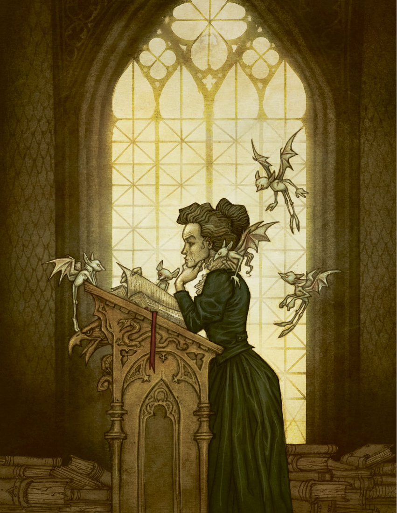

# 第 3 章：技能

[返回总目录](README.md) · 原始 PDF 第 40–51 页

## 本章目录

- [技能检定](#section-01)
  - [意义与结果](#section-02)
  - [检定失败](#section-03)
  - [孤注一掷](#section-04)
  - [状态](#section-05)
  - [难度等级](#section-06)
  - [彼此帮助](#section-07)
  - [并行动作](#section-08)
  - [对抗骰](#section-09)
  - [优势](#section-10)
  - [装备](#section-11)
  - [额外成功](#section-12)
- [技能介绍](#section-13)
  - [敏捷（体能）](#section-14)
  - [近身战斗（体能）](#section-15)
  - [力量（体能）](#section-16)
  - [医学（精准）](#section-17)
  - [远程战斗（精准）](#section-18)
  - [隐秘行动（精准）](#section-19)
  - [调查（逻辑）](#section-20)
  - [学习（逻辑）](#section-21)
  - [警觉（逻辑）](#section-22)
  - [启迪（共情）](#section-23)
  - [操控人心（共情）](#section-24)
  - [观察（共情）](#section-25)

<!-- 来源：北欧奇谭规则书.pdf；PDF 第 40 页；原书第 36 页 -->

<!-- 来源：北欧奇谭规则书.pdf；PDF 第 41 页；原书第 37 页 -->

白天时候，池塘和周边的森林显得十分宁静。给我们带路的村民保证这里与霍尔兹神父的失踪没有关系。然而所有线索都指向了此地。我们享受他们提供的食物，与他们一起欢笑。在回村子的路上，村民们问我们什么时候回乌普萨拉，我们假意被说服，声称明天一早就走。当晚我们悄悄地进入林地。星光之下的林木看起来灰蒙蒙的。月光跃动于池塘的水面之上，使得树干间的黑暗显得越发厚重。我们紧挨着站在一起，在等候着。在我们周围张开了许多发光的眼睛，附近的树梢上定是有着上百只夜枭。森林中响起了雷鸣般的鼓点。我们听到了有人以黑暗者的语言在吟诵什么，我们知道，这些就是在夜里潜入此地的村民。水面泛起涟漪，什么东西正在从水下升起。

在《北欧奇谭》中，大多数事情可以通过 GM 和玩家间的对话处理。但玩家迟早会做出一些惊险刺激且不确定能否成功的事情。在这种情况下，就应该拿出骰子，让概率决定接下来的事态了。你的角色对某技能越是精通，他的成功率也就越大。

本章书讲述了如何通过以技能检定的形式来判断你某一行动的成功程度，这是运气和技能共同作用的。我们还描述了不同技能检定成功的不同层级，以及可能的结果。我们还介绍了会使技能检定更容易或更困难的状况，比如角色负伤、使用天赋、使用优势或是使用装备。本章还有在掷骰时进行孤注一掷的规则，这意味着你付出了巨大的努力，以至于受到了消极的影响，但也因此获得了在技能检定中重骰的机会。本文阐明了当你受伤或承受肉体或精神状态时会发生的事情——这通常发生于孤注一掷或技能检定失败之后。本文还对游戏中的 12 个技能进行了细述。

<!-- 来源：北欧奇谭规则书.pdf；PDF 第 42 页；原书第 38 页 -->

## 技能检定

在成功的前提下，技能会让你得以处理和忍受艰难的状况。一共有 12 个技能，每个技能都与一个属性相关。在使用技能时，你需要把属性值和技能值相加，其和为你投出的 6 面骰数量。骰出 6 视为一个成功。极少情况会要求骰出不止一个成功。

值得一提的是，你的玩家角色可以在游戏中使用任何技能，哪怕他的技能点为 0。在这种情况下，他只需要骰出属性提供的骰子数，当他们尝试一些没有被技能包含的行动时也可以这样处理。

#### 运用调整值

一个基础规则是，把所有影响掷骰的因素都加在一起。如果一个天赋让你的骰子数 +2，并且你利用你的优势获得另一个 +2，你则获得了 4 个骰子。如果同时你受创了并承受着一个状态，则减少一个骰子。那么你总计有 3 个额外骰子。

玩家 1（卡斯帕尔·斯道尔）：我戴上面具，披上斗篷，潜入这个教堂。

GM：周围阴冷而漆黑，教堂的巨大双开门上装饰着金属制成的恶魔面孔。当你打开门时，你听到大约有 100 人的低语声，他们都穿着蒙头斗篷。这里一定聚集了几个村落。教堂里满布被点亮的红色蜡烛。有个人在演奏某种你无从辨别的弦乐器。而在正前方有一个人面向着人群，他的脸被兜帽挡住了。进行一个隐秘行动检定。

玩家 1：我有精准 2 和隐秘行动 2，一共 4 个骰子。糟了，我没有骰出 6 ！

GM： 正前方的那个人扯下了他的兜帽。你发现那是你的兄弟！此刻，你们眼神相交，四目对视。

### 意义与结果

在掷骰之前，你必须要告诉其他人你的角色想要做什么，以及他想实现的目标是什么。GM 可能会要求你进一步解释或是更改你的目标。这种情况通常发生在GM 无法清晰理解你的意图或是认为你的目标不现实时。例如：你无法通过操控人心检定来让敌人自杀，也无法在缺乏药物，医疗设备和病床的前提下用医学检定治愈数百人。

GM：卡斯帕尔坐在集市中央的一个金属笼子里。他赤身裸体，肮脏不堪，神志模糊。大约有 20 个村民围着他周边，他们那疯狂的眼神好像扫遍了整个镇子。

玩家3（伊尔金卡·普罗科廷）：我要拔刀冲向他们！

GM：你确定要这样做吗？独自对抗 20 名持械的敌人，你必败无疑。

<!-- PDF 第 42 页侧栏：技能表 -->

#### 技能表

- 敏捷（体能）

- 近身战斗（体能）

- 力量（体能）

- 医学（精准）

- 远程战斗（精准）

- 隐秘行动（精准）

- 调查（逻辑）

- 学习（逻辑）

- 警觉（逻辑）

- 启迪（共情）

- 操控人心（共情）

- 观察（共情）

<!-- 来源：北欧奇谭规则书.pdf；PDF 第 43 页；原书第 39 页 -->

### 检定失败

检定失败意味着不利状况或意外状况的出现。在大多数情况下，失败的意味是非常显见的。失败意味着你被拆穿，如果你对着一群人进行启迪检定，失败后他们可能会转而反对你。甚至在掷骰之前，GM 就可以说明检定失败的结果。

在尤为困难与危险的情况下，检定失败也可能意味着你受到状态的折磨。GM 应在你检定前就声明这一点。你所承受的状态和你目前使用的技能类别一致（肉体或是精神），但你可以自由进行选择其中的细分类。并非所有的检定都有使角色获得状态的风险，否则角色会很快被损耗掉，并导致游戏结束。

有些情况非常严重，以至于马上会导致角色崩溃。也许是在躲避撞过来的火车，或者在整个陪审团面前为自己看似粗暴的行为进行辩解。

玩家2（阿斯特丽德·利亚）：我坐在这个巫师对面，盯着他的眼睛“使出你邪恶的把戏吧！”我要让他对我使用魔力，但我尝试对抗它，并试图理解它是怎么控制他人的。

GM：进行一个观察检定吧。如果你失败了，它会控制你，并且你会承受一个精神状态。

### 孤注一掷

检定失败，你可以重整力量再尝试一次。每个行动只能如此一次，且必须在检定失败后立即执行。这称之为孤注一掷。

当你掷骰时，你会承受一个状态。如果你的技能是体能或精准，你应选择一种肉体状态。如果你使用逻辑或共情，则要选择一种精神状态。你可以重骰除了6 之外的所有骰子。你也可以对成功的检定进行孤注一掷，因为你的某些情况下，多个成功骰会效果更佳。

玩家 1（卡斯帕尔·斯道尔）：我朝他大喊：“我是你的兄弟！”我试着让他从某种咒语中恢复过来。

GM：来一个操控人心检定。

玩家 1：我骰出 3 个骰子，失败了。我选择承受愤怒状态，然后对这次检定进行孤注一掷，我拉住他，高声喊着：“看着我的眼睛，罗兰！”然后重新投 3 个骰子。

#### 崩溃前的孤注一掷

当进行孤注一掷时，你可以重骰6以外的所有骰子。你因此获得的状态，会在检定后才生效。因此，导致崩溃的孤注一掷也是有效的。因为在掷骰后，崩溃状态才会使你失去行动力。

<!-- PDF 第 43 页侧栏：一骰足矣！ -->

#### 一骰足矣！

当你的角色尝试去做某件事时，你可以为整个情景进行一次掷骰。当你试图潜入城堡，你不需要通过掷骰来看看自己是否能抵达大门，然后再次检定看看自己是否能抵达楼梯然后上楼。一骰足矣！有时，这意味着技能检定的效果可以持续很长时间；比如说，制作一件物品或者治愈病人可能需要若干天的时间。唯一的例外是战斗，我们会在第五章具体介绍。

<!-- 来源：北欧奇谭规则书.pdf；PDF 第 44 页；原书第 40 页 -->

### 状态

有两种方式会让角色获得状态。一是孤注一掷时选择一个状态，二是因技能检定失败而承受状态。获得状态意味着你的角色受到了负面效果。

状态分为两大类：肉体状态和精神状态。肉体状态与体能和精准有关，精神状态与逻辑和共情有关。肉体状态分为：力竭、伤痕累累，创伤；精神状态则分为：愤怒、恐惧和绝望。

当你承受 1 个状态时，你会对应减少 1 个骰子，具体视乎技能是与精神属性还是肉体属性相关。同样需要注意的是，状态是可叠加的，这意味着 2 个相同类型的状态会减少2个骰子。无论你累加了多少个状态，你都至少有一个骰子可以使用。状态可以通过行动或休息回复，这将在第五章中进一步描述。

当你已经有了三个同类型的状态，一旦获得第四个，你的角色就陷入了崩溃。这意味着你的角色受到重伤，暂时性的精神失常，或者其它形式的损耗。此外，崩溃的角色还可能承受致命伤（见第 64 页）。

<!-- PDF 第 44 页侧栏：故事必须继续 -->

#### 故事必须继续

GM 必须确保检定的失败不会导致故事停滞。如果无法需要探明某个怪物的信息，或者你被锁上且必须撬锁逃脱时，这类事件就会发生。当检定失败威胁到故事的发展时，GM 可以用三种方式来挽回局面：苦果，状态以及需求。

苦果是指即使没有通过检定，也会视为成功，但却发生了节外生枝的事情。比如你在图书馆中找到了怪物的信息，但它注意到你在图书馆里，并且拦住了你的去路。有时 GM 会将苦果隐藏一段时间，然后再揭露。

状态是指即使没有通过检定，你也达成了目的，但必须选择一个肉体状态或精神状态。比如你设法推开了压在朋友身上的巨石，也因此获得了肉体状态——力竭。

需求意味着你获得了你需要的某种东西，但获得成功还需要更多的东西。这可能意味着你的检定失败了，但 GM 会提出另一种解决问题的办法。也许，你获得了你需要的信息，但它使用一种陌生的文字写成的，你必须找到办法翻译它。也许能够帮助你的人已经离开了，但 GM 会揭示她的子女得到了她的知识，而子女们还在这个村庄里。

<!-- PDF 第 44 页侧栏：状态与技能 -->

#### 状态与技能

| 状态类型 | 影响的技能相关属性 |
| --- | --- |
| 肉体 | 体能和精准 |
| 精神 | 逻辑和共情 |

<!-- 来源：北欧奇谭规则书.pdf；PDF 第 45 页；原书第 41 页 -->

### 难度等级

在极端情况下，GM 可能判定不止一个成功骰才能达成成功。当你试图说服一群滥用私刑的暴民释放受害者，或者在暴风雨的屋顶上躲避杀手的追赶时，这种情况就会存在。一个挑战难度的行动需要2个成功骰，而困难难度的行动需要 3 个成功骰。

### 彼此帮助

其他角色可以帮助你提高技能检定的成功率。GM决定你是否真的能从他们的行动中获益，每有一个人的有效协助，你可以获得 +1，最多通过此办法获得 +3。

### 并行动作

当你们同时在做事情时，你们不能互相帮助。如果所有人都试图从某人身边隐秘行动或免于陷入沼泽时，每个人都必须在没有他人帮助的情况下通过自己的检定。然而，有一些技能允许在检定中获得额外成功的角色对他人提供成功骰（见额外成功），并以这种形式提供帮助。

<!-- PDF 第 45 页侧栏：难度 -->

#### 难度

| 行动 | 成功骰数 |
| --- | --- |
| 普通 | 1 |
| 挑战 | 2 |
| 困难 | 3 |

<!-- PDF 第 45 页侧栏：成功率 -->

#### 成功率

这个表格提供了掷骰以及孤注一掷的成功率。

| 骰子数 | 成功率 | 孤注一掷 |
| --- | --- | --- |
| 1 | 17% | 31% |
| 2 | 31% | 52% |
| 3 | 42% | 67% |
| 4 | 52% | 77% |
| 5 | 60% | 84% |
| 6 | 67% | 89% |
| 7 | 72% | 92% |
| 8 | 77% | 95% |
| 9 | 81% | 96% |
| 10 | 84% | 97% |

<!-- 来源：北欧奇谭规则书.pdf；PDF 第 46 页；原书第 42 页 -->

### 对抗骰

在很多情况下，玩家角色或 NPC 会试图阻碍你的成功。当你在进行隐秘行动时，可能会被守卫发现。你与朋友在某件事上意见无法达成一致时，每个人都会试图影响对方的观点。在这种情况下，则通过对抗骰来决定结果。

你与对手各自进行一次掷骰。成功骰数量多的人获胜。若成功骰数量相等，那么你既没有成功，也没有失败。如果你的对手是 NPC，那么 GM 可以使用掷骰失败所带来的三种结果：即苦果、状态及需求。（见上文）在两个玩家冲突当中，当掷骰结果相同时，任一方都可以选择孤注一掷来获得胜利。但如果结果仍然相同，你们就必须达成妥协。大家都获得了想要的东西，但需要付出代价。

GM：当你把圣水泼到卡斯帕尔的兄弟身上时，产生的冲击波把你俩都震飞了。卡斯帕尔，你一起床就看见你的兄弟跪倒在地，他眼睛的颜色已经回复正常。

玩家 3（伊金卡·普罗科廷）：我提起一把斧子，要把他的脑袋砍下来。

玩家 1（卡斯帕尔·斯道尔）：不可以！我要冲到你的面前，把斧头抢下来。

GM：你们都需要骰对抗骰，卡斯帕尔需要进行敏捷检定，而伊金卡进行近身战斗检定。

玩家 1：我骰出了 2 个。

玩家 3：我也是。

GM：那我们进行一个折中。卡斯帕尔把伊金卡推开了，挺身站在他兄弟身前。但他没能夺下伊金卡的斧子，也没受到肉体状态。

### 优势

你可以利用你的优势来增加成功率。GM 必须能够解释它之所以有用的原理，但最好在这个评估中尽可能慷慨，如果玩家角色没有机会使用优势，那么也太可惜了。

每个谜题都有一个特定的优势，每次游戏中只能使用一次，在进行技能检定时，优势可以提供额外的两个骰子。使用优势必须在掷骰或孤注一掷前声明。换句话说，当你在检定或孤注一掷中失败时，就无法使用优势了。当你回到乌普萨拉，你在谜题的旅途中获得的优势会失效，但下一个谜题的路上你可以获得新的优势。你的新优势不能关联上一次选择的技能，而必须选择另一个技能。

<!-- PDF 第 46 页侧栏：我的母亲有一个叫冈勒格的姐妹，当她 -->

我的母亲有一个叫冈勒格的姐妹，当她们还是孩子的时候，常常坐在门廊上看星星，讲着生活在湖泊和草甸后方树林里的闪光之民的故事。一天晚上，当浓雾笼罩大地的时候，她听到了牧场中传来的音乐声，她没有告诉父母就偷偷溜了过去。

在牧场的中央站着一个小提琴手，他让花草顺着自己的旋律摇摆。她在月光下和他舞蹈，直到累得站不起来。那时，她定是去了别的地方。第二天早上当她回来时，她满头长发如雪，皮肤上也满是皱纹，就像是一个老妪。冈勒格说，她曾去过妖精的国都，并作为闪光之民的王子妃生活。可现在王子死了，她回来了。

——艾尔莎·泰伯奥凡诺克的农夫之妻

<!-- 来源：北欧奇谭规则书.pdf；PDF 第 47 页；原书第 43 页 -->

### 装备

你在谜题中发现的大多数道具都是日用品，但有些更为有用的道具可以提高你的检定成功率。你可能需要开锁器来打开某些东西，或者需要一匹马来驱赶暴民。这些道具会为你的检定提供额外的奖励骰，通常是+1。某些特殊道具甚至魔法道具会提供更高的奖励，但很少会超过 +3。

### 额外成功

获得比要求数的成功骰意味着额外成功。你给别人留下了深刻印象，得到了比预期还要多，或者因为你的技巧而赢得名誉。在某些情况下，GM 还会认为你的信心激增，以至于可以治愈你的某个状态。

有些技能让你能够使用额外的成功骰获得特定的效果，例如帮助其他未完成该检定的其他玩家角色。每一个效果都需要支付一个成功骰。GM 决定你是否可以使用额外成功（以及达成什么目的）。

<!-- PDF 第 47 页侧栏：“梦魇！梦魇！梦魇！ -->

“梦魇！梦魇！梦魇！

除非你能数清林中的鸟儿，河中的游鱼，树上的橡果，以及上帝的话语，否则你不得进入此地。”——传统的驱逐梦魇咒

<!-- 来源：北欧奇谭规则书.pdf；PDF 第 48 页；原书第 44 页 -->

## 技能介绍

### 敏捷（体能）

敏捷是指快速奔跑，灵活行动，以及逃离危险的能力。当你试图逃跑，追逐某人，跳跃或是攀爬时，可以进行敏捷检定。如果有若干人和你正在做相同的事情，你可以把自己的成功骰转交给他人，从而提高他们的成功率。

在战斗中，你可以通过敏捷检定来躲避攻击或逃跑。额外的成功骰可以用于：

- 用战术碾压敌手，交换你们的先攻卡。

- 向你的敌人施压，敌人会因此获得一个精神状态（每轮只可以选择一次）。

- 远离敌人一个区域。

- 让你的敌人位于一个区域的特定位置。

- 在躲避敌人时进行另一个动作，比如说进行仪式或是在房间里放火。

### 近身战斗（体能）

当使用近战武器战斗时，使用近身战斗技能。骰出比需求更多的成功骰时，你可以：

- 增加 1 点伤害，这个效果可以多次选取。

- 用战术碾压对手，交换你们的先攻卡。

- 向你的敌人施压，你的攻击除了肉体状态外还会造成一个精神状态。

- 把敌人推到另一个区域，或是你所在区域内的指定位置。

- 将敌人的武器或物品击落。捡起一个物品在战斗中需要消耗一个快速动作。

### 力量（体能）

当使用蛮力举起某个重物，或者忍受疼痛和困境时，进行力量检定。这一技能能在你在没有水和食物的情况下生存，或日以继夜地行走，谜面承受状态。你可以把额外成功的骰子分给其他处于相同情况下的玩家角色。

力量检定有时可用于维修物品，比如车轮坏掉的马车。

当进行徒手搏斗，或是与敌人进行摔跤和擒抱时，你也应通过力量检定。骰出比需求数更多的成功骰时，你可以：

- 增加 1 点伤害，这一效果可多次选取。

- 用战术碾压对手，交换你们的先攻卡。

- 向你的敌人施压。你的攻击除了肉体状态外，还能造成精神状态。

- 把敌人推到另一个区域，或是你所在区域内的指定位置。

- 将敌人的武器或物品击落。捡起一个物品在战斗中需要消耗一个快速动作。

- 擒抱住你的敌人，他必须成功进行对抗才能逃脱。

### 医学（精准）

医学可以让你用你的专业知识来帮助受伤的人。这项技能还可以提供解剖学、疾病和损伤方面的知识。

当玩家角色在身体上遭受重创时，她有时可能需要医疗援助才能生存（见第五章）。通过技能检定意味着<!-- 来源：北欧奇谭规则书.pdf；PDF 第 49 页；原书第 45 页 -->患者不再处于“崩溃”状态。每一个额外的成功将治愈一个肉体状态。如果你的检定失败，并希望重新尝试，那么需要首先采购更多医疗用品，将患者转移到更为合适的地点，或从受过专业医学训练的人处获得帮助。

<!-- PDF 第 48 页侧栏：抵御攻击 -->

#### 抵御攻击

当一个角色成为攻击、埋伏、食物下毒的目标，或当他试图进行说服时，他会有机会发现和抵御攻击者。敏捷用以躲避物理攻击。警觉指的是发现别人在偷偷靠近你，或是把什么东西塞进你的口袋。在社交场合中，你的角色处于被动时则使用观察。

医学可以用于治疗肉体的状态。你的病人必须卧床，远离目前的伤害，并且具有足够的饮品、食物以及医学设备。你需要为每天的治疗进行一个医学检定，一个成功的检定可以治愈三个肉体状态，根据你的需要分配给不同的病人。每个额外的成功骰将治愈另外三个状态。即使崩溃状态也可以通过这种方式来治愈。通常情况下，失败的检定只是意味着浪费了一天的时间，但 GM 可能会允许敌人采取行动。

### 远程战斗（精准）

当你使用远程武器或是爆破物进行攻击时，你应进行远程战斗检定，当你骰出的成功骰比需求数更多时，你可以：

- 增加 1 点伤害，这一效果可多次选取。

- 用战术碾压对手，交换你们的先攻卡。

- 向你的敌人施压。你的攻击除了肉体状态外，还能造成精神状态。

- 把敌人推到另一个区域，或是你所在区域内的指定位置。

- 将敌人的武器或物品击落。捡起一个物品在战斗中需要消耗一个快速动作。

### 隐秘行动（精准）

当你尝试潜行、藏匿、撬锁或表演纸牌戏法时，你需要进行隐秘行动检定。额外的成功骰会让你更为成功。

### 调查（逻辑）

你可以通过调查检定来搜索房间，理解犯罪现场发生的事情，对尸体进行检查，或者找出某些被掩盖的东西。如果你成功了，GM 会向你提供线索。如果你的成功骰比需求的更多，GM 会决定你是找到了更多线索，理解了背景信息，还是仅仅对你杰出的工作而感到满足。

### 学习（逻辑）

学习衡量你的教育水平，以及通过逻辑和知识建立联系的能力。当你需要理解面前事物的某些方面时，你可以通过学习检定获得线索。有时 GM 会认为学习检定需要书籍或是其他信息源的支持。在某些情况下，近乎无法通过这种方式获得线索。

你可以通过学习来翻译外语，计算出在某些情况系的最优行动办法，或是了解机械装置，神秘仪式和魔法物品的工作原理。如果 GM 认为合适的话，你可以使用学习来获得有关自在之物的基础信息。通过获得比要求数更多的成功骰，你有时可以获得更多的信息。

GM：在废弃的谷仓里，木板上有着用小刀刻出的符号。

玩家 2（阿斯特丽德·莉亚）：我要用学习检定看看我能否辨认它们。一个成功骰。

GM：你明确能认出它们。小时候绑架你和母亲的那个人有很多存在这类符号的书。它们是古埃及象形文字。其中有几条类似于他最珍贵的文本，正是因为读了那本书，他才陷入了疯狂并做出那些可怕的事情。

<!-- PDF 第 49 页侧栏：调查技能不是用来发现隐藏事物的，比如 -->

调查技能不是用来发现隐藏事物的，比如门、陷阱或是隐藏的线索。如果你在描述你的角色在正确的地方搜索，GM 应该让你找到你想要的东西，只要它能被看见。然而，如果GM 愿意，成功的技能检定也可以提供奖励。

<!-- 来源：北欧奇谭规则书.pdf；PDF 第 50 页；原书第 46 页 -->

### 警觉（逻辑）

你使用警觉来发现那些偷偷靠近你的人。潜行的人需要以隐秘行动检定来对抗你的警觉检定（见第 62.页）。你还可以用警觉来追踪他人或是生物留下的足迹。

此外，警觉可以用来揭示你被监视的情况。如果成功，GM 会向你提供信息。你可能会意识到将会发生什么，谁是这个群体的领导者，哪些人可能构成威胁，或者得知面临此事的最佳办法。如果你的成功骰超过了需求的成功骰数，那么每一个额外的成功骰都会向一个技能提供 +1 的奖励。检定失败则意味着你误读了局势，被对方发现，或者对你正在看着的人表露出敌意。

### 启迪（共情）

启迪是在人群中演讲，鼓励和引导朋友，以及创造及理解艺术作品的能力。当你试图影响一群人的想法和行动时，你需要进行启迪检定。

当玩家角色遭受严重的精神创伤时，他需要用启迪检定来避免陷入长期的精神崩溃（见第五章）。如果你通过检定，那么对方则可以从崩溃中解脱。每一个额外的成功骰都能治愈一个精神状态。如果你失败了，并且试图再次尝试，那么你必须先找到一种方式以理解对方。或者，你需要带他去新的地方，向别人寻求帮助，或者找到另一种与他沟通的方式。

启迪可以用于治疗精神状态。你的朋友需要在安全的地方，有饮水和食物，并愿意和你密切接触或是对话。你们共处的每一天都可以进行一次启迪检定，期间不能做其他事情。成功的检定能治愈总计三个精神状态，每一个额外成功能治愈另外三个状态。即使崩溃状态也可以通过这种方式痊愈。通常情况下，失败的检定意味着丧失了一天的时间，尽管期间 GM 可能会让敌人采取行动。

### 操控人心（共情）

通过操控人心，你可以用撒谎、玩弄、贿赂、谈判、讨价还价去影响他人的想法，或者以其他方式使用社交技能。当你对某人使用操控人心技能时，你要描述你希望达到的目的和你采取的做法。你还可以通过操控人心检定来进行交易，以购买道具和服务。

成功的检定会让你获得你想要的东西。失败则意味着对方并不信任或喜欢你，你可能会承受状态，也可能对方坚定了本身的想法。玩家角色可以通过观察检定对抗你的影响。

如果另一个人意图对你使用操控人心，他也应该描述他希望达成的目的。在进行掷骰前，你们必须许可彼此的目标。你只能有限地让对方行动或是信服。你们彼此进行操控人心检定的对抗以决定谁能影响谁。

失败方可以决定为了做胜方想要的事情而需承担的状态。也许你需要保证不会将他同意做的事情告诉任何人，也或者他想首先知道关于你的事情？

当你获得的成功骰数量大于你需要的数量时，你可以用额外成功骰给对方施加心理状态，一个成功骰对应一个状态。

<!-- PDF 第 50 页侧栏：并不是精神控制 -->

#### 并不是精神控制

使用操控人心检定时，你的目标必须是合理的。你不能完全改变他人的思考方式、让别人自杀或者在没有正当理由的情况下让人们背叛朋友。在你成功对他人使用操控之后，其他的事情可能会让这个人重新考虑。这同样适用于对你进行的操控。

<!-- 来源：北欧奇谭规则书.pdf；PDF 第 51 页；原书第 47 页 -->

玩家 2（阿斯特丽德·利亚）：“他是一个利用他人实现自己目的的叛徒，如果我们放了他，他会继续在这座城市里兴风作浪。我们不应把他送进监狱。”我要使用操控人心检定来说服你，我们应该处决你的兄弟。

玩家 1（卡斯帕尔·斯道尔）：卡斯帕尔绝不会同意的。“这么说吧，如果你赢了，你可以让我不再插手我兄弟的事情，可以吗？”

### 观察（共情）

当你与另一个人谈话，或是花费时间与他共处时，你可以通过观察技能来了解他在想什么，感觉如何以及在计划什么。如果你通过了技能检定，GM 会描述你得到的关于他的印象。例如，GM 可能会告诉你他在撒谎，或是透露出他有伤害你的意图。你有权提出具体的问题并得到答案。

每一个额外的成功骰会给之后的检定获得 +1，只要这些信息在此检定中能派上用场。检定失败意味着你暴露了自己给对方，且必须透露出玩家角色的想法，感受和意图。

<!-- PDF 第 51 页侧栏：诚实的信息 -->

#### 诚实的信息

有些技能可以让玩家角色获得信息。GM有责任提供准确有效的信息。成功的检定不应该得到含糊不清的答案，或是对真相及 NPC的“保护”。让故事有趣的正是玩家们依靠他们所得的信息产生的行动，不要让他们一无所知，无从行动！

[上一章](02-player-characters.md) · [返回总目录](README.md) · [下一章](04-talents.md)
