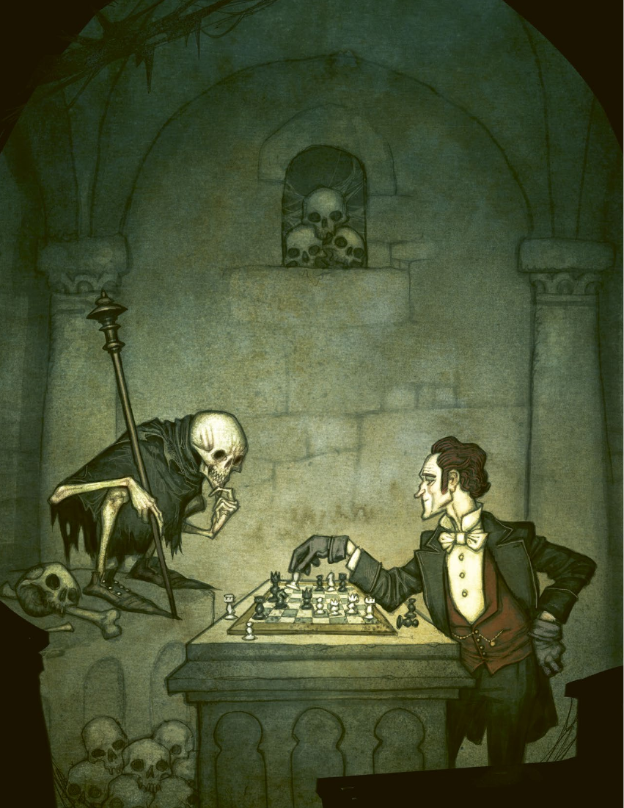

# 第 4 章：天赋

[返回总目录](README.md) · 原始 PDF 第 52–59 页

## 本章目录

- [学者天赋](#section-01)
  - [书虫](#section-02)
  - [学富五车](#section-03)
  - [知识是可靠的](#section-04)
- [医生天赋](#section-05)
  - [军医](#section-06)
  - [主任医师](#section-07)
  - [应急医学](#section-08)
- [猎人天赋](#section-09)
  - [寻血犬](#section-10)
  - [草药专家](#section-11)
  - [神射手](#section-12)
- [神秘学家天赋](#section-13)
  - [魔术手法](#section-14)
  - [灵媒](#section-15)
  - [恐惧来袭](#section-16)
- [军官天赋](#section-17)
  - [久经沙场](#section-18)
  - [绅士](#section-19)
  - [战术家](#section-20)
- [牧师天赋](#section-21)
  - [赦免](#section-22)
  - [祝福](#section-23)
  - [忏悔者](#section-24)
- [私家侦探天赋](#section-25)
  - [鹰眼](#section-26)
  - [基础推演法](#section-27)
  - [专注](#section-28)
- [仆人天赋](#section-29)
  - [忠诚](#section-30)
  - [强硬如钉](#section-31)
  - [坚韧](#section-32)
- [流浪者天赋](#section-33)
  - [流浪者戏法](#section-34)
  - [疑心](#section-35)
  - [云游](#section-36)
- [作家天赋](#section-37)
  - [自动书写](#section-38)
  - [记者](#section-39)
  - [墨客](#section-40)
- [通用天赋](#section-41)
  - [战场经历](#section-42)
  - [勇敢](#section-43)
  - [近战训练](#section-44)
  - [联络人](#section-45)
  - [怯懦](#section-46)
  - [骗术专精](#section-47)
  - [献身](#section-48)
  - [防御专精](#section-49)
  - [双手武器专精](#section-50)
  - [炸药专家](#section-51)
  - [同理心](#section-52)
  - [逃脱大师](#section-53)
  - [名望](#section-54)
  - [疾行](#section-55)
  - [神圣象征](#section-56)
  - [风驰电掣](#section-57)
  - [命大](#section-58)
  - [宠物](#section-59)
  - [拳击手](#section-60)
  - [人多壮胆](#section-61)
  - [第六感](#section-62)
  - [短跑选手](#section-63)
  - [主的牧羊人](#section-64)
  - [富有](#section-65)

<!-- 来源：北欧奇谭规则书.pdf；PDF 第 52 页；原书第 48 页 -->

<!-- 来源：北欧奇谭规则书.pdf；PDF 第 53 页；原书第 49 页 -->

在那个月光朗照的夜晚，我们三个人在卡尔斯克朗群岛精疲力竭地划着船。海员教堂里的牧师曾三次看见威廉船长在布道台上无声地哀嚎，那场景实在令人费解。那船长，和他那艘三桅帆船“卡罗琳娜号”在去年一同失踪于暴风雨中。有人说他为了买下那条船而出卖了自己的灵魂，现在，魔鬼来上门讨债了。

当卡罗琳娜号突然出现在我们面前几米远的地方时，我还在划着船。周围没有点亮的灯火。我从水中拔出了船桨，任小船漂完了最后的路程。我们一言不发地爬上了那艘船，船体上覆满了海藻与藤壶，好像已经在此搁浅了数月之久。按理说，白天时候应该有人能从陆地上见到它才是。

我们花了好几个小时搜索那条船，却没有发现任何东西，没有货物，没有粮食，也没有任何活物和死物。太阳升起时把水染成了红色、绿色和橙色。我们已经精疲力尽，但随后就看见船周围冒起了一些水泡。我们决定潜下去一探究竟，也许，威廉船长和他的秘密就在水下等着我们。我是唯一活着回来的人，我会保守秘密，至死也不会说出我到底看见了什么。

除了技能外，你还会有一些可能派上用场的诀窍和特质。我们称之为“天赋”并会在本章中对此进行详细的描述。首先我们会列出不同角色范型的天赋，然后介绍通用天赋。

新创建的玩家角色有一个天赋，且只能从其角色范型提供的天赋中进行选择。而在游戏过程中，可以通过消耗经验值购买天赋，并且可以通过此方法选择任何天赋，包括其他角色范型的天赋。

有些天赋会在技能检定或恐惧检定中提供奖励（见第 68 页），使你可以投掷更多的骰子。不同天赋的效果可以叠加。

<!-- 来源：北欧奇谭规则书.pdf；PDF 第 54 页；原书第 50 页 -->

## 学者天赋

### 书虫

从书籍中或图书馆中寻找线索时，学习检定 +2。

### 学富五车

你可以学习检定来构建游戏中地点和现象的真相。你可以知道某个地点以玻璃工人而闻名，或是有犯罪分子在该地区活动。由 GM 可以判断什么合适，什么是你可以知道的。你不应创造和自在之物有关的内容。

### 知识是可靠的

在学习检定中无视状态的影响。

## 医生天赋

### 军医

在面对尸体或是残破的人体时，恐惧检定 +2。

### 主任医师

当使用医学检定治疗其他玩家时，你的成功可以治疗 4 个症状，而非 3 个。该天赋同样适用于额外成功。

### 应急医学

医学检定时无视状态影响。1

## 猎人天赋

### 寻血犬

追踪猎物时警觉检定 +2。

### 草药专家

通过野外的草药，你可以在没有医疗用品的情况下使用医学检定。

### 神射手

当你成功埋伏并首次攻击目标时，你的远程战斗检定 +2。——————

<!-- PDF 第 54 页侧栏：“当凄楚的爱情把你压迫， -->

“当凄楚的爱情把你压迫，一双新鞋值得你去物色。穿着它走上一英里，等双脚出汗时，把右脚的鞋子往下脱。在里面倒入麦芽或是葡萄酿的酒，再细细品味，轻轻一啜，自由的滋味你将获得。”——驱逐有害爱情的传统民俗魔法

> 1 译注：此处应为官方错误，原文是指“无视精神状态”，已经有人指出医学技能本身就不受精神状态影响，但 FL 官方并没有勘误，译者认为应为无视肉体状态。而也有人指出，在初稿中医学属于逻辑技能，而非精准技能，因此在修改稿子后遗留了这一问题。）

<!-- 来源：北欧奇谭规则书.pdf；PDF 第 55 页；原书第 51 页 -->

## 神秘学家天赋

### 魔术手法

当你使用魔术手法影响他人时，你可以用隐秘行动检定替代操控人心检定。

### 灵媒

你可以通过观察检定来进行降灵仪式，并借此联络死者并预测他人的未来。额外的成功会提供更多信息，延长联系时间，或者让灵体直接现身。若检定失败，你会得到不准确的信息，遭受攻击，或承受某种状态。

### 恐惧来袭

你可以使用 1 级的恐惧检定（见第 68 页）来实现恐惧打击。这是一个缓慢动作，且对自在之物无效。在你的区域里选择一个受害者，且目标 NPC 必须通过逻辑检定或共情检定。他可以获得和范围内友善单位个数相同的奖励骰。

<!-- 来源：北欧奇谭规则书.pdf；PDF 第 56 页；原书第 52 页 -->

## 军官天赋

### 久经沙场

你对战斗司空见惯，进行先攻检定时，你可以抽取两张卡并任选一张。

### 绅士

你被教育必须在社交场合控制好自己的行为和情绪，哪怕是在压力环境下也必须如此。在进行操控人心检定时，无视精神状态带来的惩罚。

### 战术家

当你在远程战斗检定中获得额外成功时，除了通常的可选效果外你还有一个额外选择，向一个友善单位下达指令。这必须消耗一个成功数。如果对方遵循你的指令，则可以在下一个检定中获得 +2（可以多次给不同的人下达指令）。

## 牧师天赋

### 赦免

玩家角色向你忏悔，袒露自己的行为时（见第

72. 页）可以治愈三个状态，而非两个。

### 祝福

每次游戏你可以祝福一个物品或另一个玩家。玩家角色或使用该物品的人将获得祝福优势，并在他们所选择的检定中 +2。这一优势会在使用或谜题结束后失效。每个谜题你只能祝福一个角色或一件物品。

### 忏悔者

在保密的谈话中，你可以使用观察检定替代操控人心检定。

<!-- PDF 第 56 页侧栏：翰蒙库拉的一位牧师在讲坛上布道，以 -->

翰蒙库拉的一位牧师在讲坛上布道，以全能的上帝的名义声称，世上没有特洛精、田舍侏儒和其他自然精怪。第二天早上，他的房子没了窗户，门从外面被人反锁，牧师只能用大锤把门砸破。又一个早上，当他醒来时家里的牲畜都没了脑袋，无口无目，四处乱踱。他依然坚持， 是上帝创造了人类和牲畜，林子里的怪物不过是人类的迷信和魔鬼的胡说。直到又一个早上，当他睡醒时，身边没了妻子，只有一根木头。直到这时，他才走上讲坛，说他不知道是上帝还是魔鬼带来了自在之物，但它们确实存在着。当他回到家里时，妻子已在家门口等着。声称不可见之物并不存在最让它们恼火。

——奥拉·斯滕，达尔福斯的木匠

<!-- 来源：北欧奇谭规则书.pdf；PDF 第 57 页；原书第 53 页 -->

## 私家侦探天赋

### 鹰眼

当你试图进行远程的观测时，你的警觉检定 +2。

### 基础推演法

每次游戏一次，你可以要求 GM 解释线索是如何串联的。

### 专注

进行调查检定时无视状态带来的惩罚。

## 仆人天赋

### 忠诚

当你发誓保护的人在场时，你的恐惧检定 +2。

### 强硬如钉

徒手战斗时，力量检定 +2。

### 坚韧

每次游戏一次，你可以在任何一次检定中无视状态带来的惩罚。

## 流浪者天赋

### 流浪者戏法

当你试图在富人面前隐藏自己或某个物品时，隐秘行动检定 +2。

### 疑心

进行警觉检定时无视状态的影响。

### 云游

每次谜题你都可以进行一个操控人心检定，以创造一个位于该地点的 NPC，或是你曾经见过的人。GM决定在上次见面以来他的变化，以及他现在对你的看法。如果检定失败，他要么对你怀有敌意，要么就是他反过来非常需要你的帮助。

## 作家天赋

### 自动书写

你可以通过启迪检定引导灵体进行自动书写以获得线索。GM 会提供或多或少的模糊线索，对未来的预测，或对敌人想法和经验的瞬间洞察。额外的成功会揭示更多的线索。如果检定失败，GM 会决定你是否要承受某种状态，被附身，或是一种持续 1D6 小时的人格改变（具体由你决定是何种改变）。你可以在每次游戏中使用一次。

### 记者

当你通过吸引或是哄骗他人以获得信息时，你可以使用启迪检定替代操控人心检定。

### 墨客

进行启迪检定时无视状态的影响。

<!-- 来源：北欧奇谭规则书.pdf；PDF 第 58 页；原书第 54 页 -->

## 通用天赋

### 战场经历

治疗肉体重创时，医学检定 +2。

### 勇敢

进行恐惧检定时，+1。

### 近战训练

进行格挡时，力量检定或近身战斗检定 +2。

### 联络人

在每场游戏中，你可以确定自己已经认识了某个NPC，并且你们之间的关系是积极的。如果 GM 认为这会使谜题不再有趣，那么他可以不允许此天赋生效。

### 怯懦

当你在战斗中受伤时，你可以通过一个隐秘行动检定来使其他玩家角色代替你承受伤害。这并不占用动作。如果检定失败，你必须承受 1 点额外伤害。每场战斗遭遇只能使用一次。

### 骗术专精

当进行谎言或者欺骗时，操控人心检定 +2。

### 献身

每场游戏中，都可以使一个检定无视精神状态的影响。

### 防御专精

每一轮你都有一个额外动作，这一动作只能用于闪避或格挡。

<!-- 来源：北欧奇谭规则书.pdf；PDF 第 59 页；原书第 55 页 -->

### 双手武器专精

在近身战斗中使用双武器时，你可以使用额外成功攻击该区域的另一个敌人。如果你使用额外成功来增加伤害，你可以自行选择哪一次攻击获得额外伤害。

### 炸药专家

当使用爆炸物进行战斗时，远程战斗检定 +2。

### 同理心

进行观察检定时，忽略状态带来的影响。

### 逃脱大师

在你进行敏捷检定进行逃离时，无视状态的影响。

### 名望

当你试图影响一个听说过你的人时，操控人心检定 +2。

### 疾行

在战斗中，你在自身区域内移动不会占用动作。

### 神圣象征

你拥有一个宗教物品，它允许你使用启迪检定攻击自在之物，并造成 1 点伤害。

### 风驰电掣

你拔出武器的行为不占用动作。

### 命大

当你投重创时，你可以自行决定哪个骰点结果代表十位，哪个骰点结果代表个位。

### 宠物

你拥有一只宠物，在它明显能派上用场的检定中，你可以获得 +1。每场游戏只能使用一次。

### 拳击手

徒手进行战斗时，伤害 +1。

### 人多壮胆

当你至少与 2 个玩家角色一起时，恐惧检定 +2。在战斗中，你们必须置身于同一区域该天赋才能生效。

### 第六感

进行调查检定时，你可以消费一个额外成功，以了解该区域是否存在自在之物、获得自在之物种类的粗略印象，以及发现此处是否有人使用了魔法。

### 短跑选手

当你试图赶超或追上某人时，敏捷检定 +2。

### 主的牧羊人

当你治疗精神重创时，启迪检定 +2。

### 富有

资源增加 1 点（本天赋可重复购买）。

[上一章](03-skills.md) · [返回总目录](README.md) · [下一章](05-conflict-and-injuries.md)
