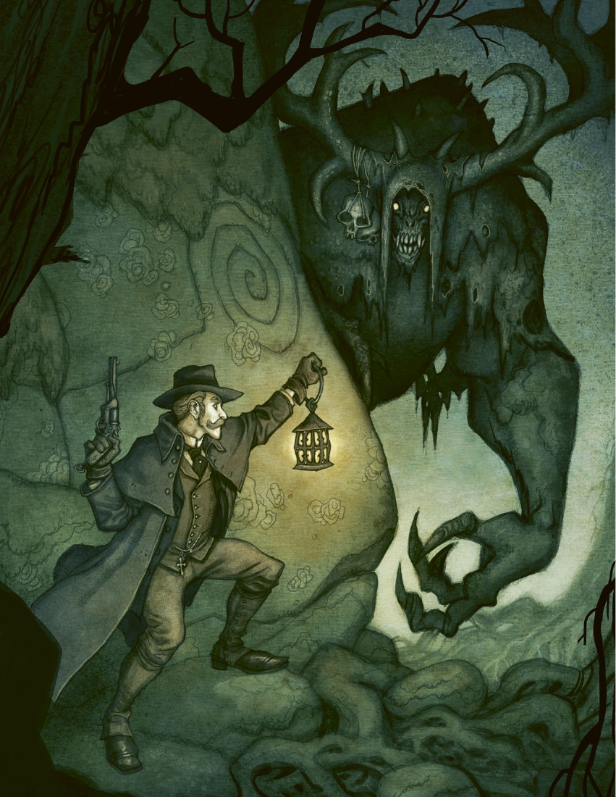

# 第 5 章：冲突与受伤

[返回总目录](README.md) · 原始 PDF 第 60–81 页

## 本章目录

- [战斗](#section-01)
  - [轮次与先攻](#section-02)
  - [区域与距离](#section-03)
  - [环境](#section-04)
  - [与自在之物战斗](#section-05)
- [战斗中的动作](#section-06)
  - [描述行动](#section-07)
  - [战斗中移动](#section-08)
  - [近身战斗](#section-09)
  - [远程武器](#section-10)
  - [闪避和格挡](#section-11)
  - [擒拿与缠斗](#section-12)
  - [逃跑与追逐](#section-13)
  - [伏击或奇袭](#section-14)
- [受伤](#section-15)
  - [崩溃](#section-16)
  - [重创](#section-17)
- [特殊影响](#section-18)
  - [恐惧](#section-19)
  - [爆炸](#section-20)
  - [火焰](#section-21)
  - [毒药](#section-22)
  - [坠落伤害](#section-23)
  - [饥渴与疲惫](#section-24)
- [治疗伤势](#section-25)
  - [治疗重创](#section-26)
  - [治疗状态](#section-27)
  - [活动](#section-28)
  - [服务与设施](#section-29)
- [装备](#section-30)
  - [准备装备](#section-31)
  - [在谜题中购物](#section-32)
  - [护甲和掩体](#section-33)
  - [装备和武器](#section-34)

<!-- 来源：北欧奇谭规则书.pdf；PDF 第 60 页；原书第 56 页 -->

<!-- 来源：北欧奇谭规则书.pdf；PDF 第 61 页；原书第 57 页 -->

我是自己梦境的囚徒，无法醒来。我的睡眠是一位林中女士赋予的，当地人称她为树皮天使。她吻在了我的额头上，然后消失在森林里，我便倒在地上沉眠。

朋友们把我带回来乌普萨拉的城堡里，让我躺在床上。在睡梦中，我显然一直在谈论我的妻子，她也是结社的成员，但在前往乡村地区，哈兰的卡纳瑞德的路上去世了。我在床上来回翻滚，满头大汗。

我的朋友们花了好些天才追踪树皮天使到迪格尔瀑布，这是韦姆兰省的叙斯勒拜克北部的一个瀑布。她承受了他们的满腔怒火，但即使被手枪和来复命中了二十多发，她也并不会死去。直到我的朋友们发现了那一棵藏着林中女士灵魂的巨大橡树，并把这棵树烧毁，才使她不复存在。

在熊熊火焰吞噬了树皮天使之后，我醒来了。床头柜上有一杯早已冷却的茶水。让我备受感动的是，他们还加了一点肉桂，这正是我所喜欢的。当我的朋友们回来时，我们庆祝了一番。他们三番五次地想知道我是如何被那些与烈火、毒蛇和黑恶犬相关的噩梦折磨的。我从来没有告诉过他们我真正梦到了什么，树皮天使的吻把我送上了天堂，让我与亡妻再度相会。

本章的主题是冲突——这是一种超越语言解决范围的事态。在这种情况下，仅仅依靠技能检定并不足够，你们必须一步一步地，遵循规则来决定结果。本章的第一节介绍了战斗规则，它描述了如何决定你们角色的行动顺序，他们可以执行什么动作，以及可能影响成功率的各种环境因素。它还会解释如何在战斗中进行移动，并列出了伏击、追逐，以及擒抱和挣脱的规则。

接下来，我们会提供关于肉体受伤的规则，以及介绍伤害会如何影响你。紧接着的一节会介绍目睹自在之物或是经历其他恐怖会如何导致精神上的伤害。规则还会介绍如何进行恐惧检定，以避免遭受面前事物的影响。

随后的章节会涉及爆炸、火灾、毒药造成的伤害，以及饥渴和疲劳对角色的影响。之后我们会介绍如何治愈自身和他人所受的伤害。在本章结束前，我们还会总结护甲、装备以及武器的内容。

<!-- 来源：北欧奇谭规则书.pdf；PDF 第 62 页；原书第 58 页 -->

## 战斗

当你或其他人尝试射击、击打或伤害他人时，战斗就开始了。首先要做的是决定行动顺序，看看谁行动得更快，能先下手为强。这是通过抽取先攻卡决定的。

### 轮次与先攻

战斗以轮进行划分。每一轮中，每个人都轮流进行动作，当所有人都完成动作时，这一轮就结束，开始新的一轮。

在战斗开始之前，每个参与者（无论他们愿意或不愿意）都要抽取一张卡来决定他们的行动顺序。拿出一组 1-10 的卡片。洗牌，让每人抽一张。卡片的数值就是你的先攻值。

把你的先攻卡放在你的角色卡旁边，让每个人都能看见。GM 则把 NPC 或者怪物的卡片放在前面，因此你们可以看见。如果你们面对若干个相同的对手，GM可以选择把他们视为一个组群，并只抽取一张卡。

先攻值最低的人首先行动，他可以进行他的动作，然后是先攻值次低的人行动，如此直到每个人完成了自己的回合。一旦如此，就意味着这一轮已经结束，你们要以相同的顺序开始下一轮。你无法在战斗中抽取新的先攻卡。

每轮的时长并不是准确的概念，每一轮通常持续几秒，这足够进行瞄准射击，或是夺路而逃了。

#### 交换先攻卡

你可以和其他玩家角色在战斗中交换先攻卡。你只可以在每轮开始时，也就是没有任何人行动之前这么做。为了交换先攻卡，你们的角色间必须能够彼此交谈。在战斗中，额外的成功骰可以用作“以战术碾压对手”（见第三章：技能），强迫对方与你交换先攻卡。如果你与一个具有多张先攻卡的怪物战斗，你可以选择你想要的那一张。

### 区域与距离

战斗发生的场景划分成许多区域。区域是指只需几步就能与敌人进行近距离战斗的空间。如果你需要击中一个区域外的敌人，需要手枪或是投掷武器。击中两个区域外的敌人则需要来复枪。

区域的大小取决于地形。它通常是由墙壁、楼梯、河流或其他类似特征划分的开放空间。当战斗开始时，<!-- 来源：北欧奇谭规则书.pdf；PDF 第 63 页；原书第 59 页 -->GM 可以绘制区域地图并标记每个区域。GM 还可以标记可以隐蔽的地方。有些障碍只能通过执行一个动作或通过技能检定来移动。例如，你可能需要一个成功的力量检定和一个缓慢动作，才能清除一堆堵塞出口的瓦砾。

<!-- PDF 第 62 页侧栏：先攻卡 -->

#### 先攻卡

特别准备的北欧奇谭卡组（单独销售）里包括了十张先攻卡。如果你没有这套牌，那么用普通的扑克牌也可以，只需要把 A 当成 1 处理就可以了。

<!-- PDF 第 62 页侧栏：有趣的区域 -->

#### 有趣的区域

你可以通过多样化的环境使战斗变得更加有趣。让两个区域之间有所间隔，比如必须打破才能通过的一扇墙，一扇锁上的门或是一个巨大的树篱。有些区域只能经特定的地点进入，让阳台上躲着一个手持来复枪的敌人吧。

不要忘记描述环境，即使它并不会影响任何检定的成功。记得让地面变得泥泞，让灯光变得刺眼，或是有些刺鼻的气味。在开响第一枪时，记得让无数鸟儿腾空而起。

### 环境

如果在特别困难的环境下进行战斗，GM 可能会决定提高技能检定的难度，比如在黑暗的环境下，你可以需要在远程战斗检定中获得额外成功骰。

GM 应在环境明显会影响成功率时才要求额外的成功骰，比如雾和昏暗的光线可能会影响氛围，但不太应该影响技能检定。

有些生物不受黑暗等事物的影响，因此他们可能会有目的地选择对峙发生的地点和时间。玩家也可以利用环境要素，GM 甚至应该对此加以鼓励，比如，某些自在之物会受到阳光照射的伤害，或是无法忍受肥皂的气味。

### 与自在之物战斗

你所听过一切与自在之物相关的传闻都表明，他们几乎无法在战斗中被杀死，与他们进行物理层面的冲突总是为了拖延足够的时间，以便于进行仪式或逃跑。

相关的仪式很少会需要技能检定，你只需要描述你的行动，只要行动正确，仪式就会驱逐怪物。

GM：死婴灵似乎变得比之前更大了。它鸟一样的身体在磨坊上空盘旋着，翅膀却一动不动。突然，它俯冲下来，利爪猛击着建筑物上。溪边的磨坊更加倾斜了，且不断有木板开裂，或是坠落。

玩家 3（伊金卡·普罗科廷）：我要打开地板上的暗道入口。

GM：在入口下方，你发现了一个包裹在腐坏布料里的孩童尸体，他可能就是在这一两天内死去的。

玩家 2（阿斯特丽德·莉莉娅）：我轻轻地抱起这个孩子：“我们必须让他入土，必须有个人把自己的名字给它，否则它会无法安息。”

GM：死婴灵的利爪正在撕裂你们周围的墙壁。

玩家 1（卡斯帕尔·斯托尔）：“我把我的名字给它。我们有适合安葬它的地方吗？”

GM：你们发现尸体的地洞里就有泥土，你们可以就地埋葬。

玩家 2：我要拿出圣经和十字架，准备净化这片土地。

## 战斗中的动作

人类、动物和大多数的自在之物每回合都可以执行2 个动作，一个快速动作和一个缓慢动作。缓慢动作需要更长的时间，且通常需要检定。快速行动是耗时短且极少需要检定的，你可能会大喊几句话，或是拔出武器，如果你愿意也可以把一个缓慢动作替换成快速动作，从而该轮进行两个快速动作。

有部分的快速动作是反应动作，通常是规避攻击的某种机动手段。在回合中的任何时刻，你都可以进行反应动作。这意味着你可以在你的回合前消耗掉你的快速动作，也可以在回合后才准备应敌策略。当你使用反应动作进行自保时，你必须在知道对手的掷骰结果前采取行动。

### 描述行动

当你选择一个动作时，你必须描述你是如何执行它的。这是营造游戏氛围和赋予故事生命的一部分。或许你会猛地跳入泥潭，一边咒骂一边向怪物射击。或者，<!-- 来源：北欧奇谭规则书.pdf；PDF 第 64 页；原书第 60 页 -->你蹲伏在地，偷偷靠近敌人，手中紧紧地攥着你的小刀，因为用力的原因关节都发白了。

### 战斗中移动

你可以用快速动作在你的区域内移动。如果敌人躲在掩体后或是位于远处，你可以消耗快速动作以接近对方进行近身战斗。进入邻近区域也需要一个快速动作。

### 近身战斗

攻击敌人需要进行技能检定。徒手的攻击需要进行力量检定，而手持近战武器的战斗需要使用近身战斗检定。远程的攻击则需要通过远程战斗检定。

你需要一个成功骰来命中目标，而造成的伤害则应参照武器表。你可以对敌人造成等同于伤害值数量的肉体状态。当你骰出多个成功骰时，你可以选择造成额外的伤害（关于战斗中的额外成功的更多信息请参照本书第三章：技能）。每个额外的成功骰可以额外让对手承担一个肉体状态。

人类的 NPC 和动物不会承受状态，但他们具有与之类似的强度值。比如说，一个承受 3 点伤害的角色会损失3点强度，并在下一次对应检定中减少3个骰子。

<!-- PDF 第 64 页侧栏：常见的缓慢动作 -->

#### 常见的缓慢动作

| 动作 | 对应技能 |
| --- | --- |
| 使用近战武器攻击 | 近身战斗 |
| 使用远程武器攻击 | 远程战斗 |
| 徒手攻击 | 力量 |
| 摔跤、推动、擒抱 | 力量 |
| 逃离 | 敏捷 |
| 说服 | 操控人心 |
| 引诱敌人到某处 | 敏捷 |
| 进行仪式（通常需要若干回合） | - |
| 调查情况 | 警觉 |
| 治疗伤口 | 医学 |
| 爬墙 | 敏捷 |

<!-- PDF 第 64 页侧栏：常见的快速动作 -->

#### 常见的快速动作

| 动作 | 对应技能 |
| --- | --- |
| 拔出/收起武器 | - |
| 站起来 | - |
| 闪避（反应） | 敏捷 |
| 格挡（反应） | 力量/近身战斗 |
| 挣脱（反应） | 力量 |
| 控制对手（反应） | 力量 |
| 追逐（反应） | 敏捷 |
| 对抗魔法（反应） | 根据魔法类型而定 |
| 简短地喊话 | - |
| 转过身 | - |
| 关门 | - |
| 熄灭蜡烛 | - |
| 在区域内移动 | - |
| 进入邻近区域 | - |
| 进入掩体 | - |

<!-- 来源：北欧奇谭规则书.pdf；PDF 第 65 页；原书第 61 页 -->

### 远程武器

武器表中列出了武器的射程。这个数值代表了你的武器可以攻击到距你相隔多少个区域的敌人。0 代表你只能在同一个区域内使用近战武器与敌人对抗，而 1或者更多的射程意味你可以攻击邻近的区域。

射程 0-1 的手枪可以攻击到同一区域内或是距你 1个区域内的敌人。射程1-3的来复枪可以攻击到距你1-3个区域内的敌人，但不得攻击与你位于同一区域的敌人。

### 闪避和格挡

当受到攻击时，你可以使用快速动作格挡近战攻击，或是闪避枪支射击和其他类型的远程攻击。闪避和格挡这两个反应动作都可以在回合中的任何时间使用，而不需要在自己的回合内使用。这意味着你可以“保存”快速动作以备在回合后期进行招架或闪避。当然，你可以在自己的回合之前就使用反应动作。

闪避和格挡都需要进行技能检定。你可以通过敏捷检定进行闪避，或根据你到底是徒手还是持械来判断使用力量检定还是近身战斗检定。你的每一个成功骰都能与对方的一个成功骰相抵消，如果你抵消了他全部的成功骰，则视为他未能命中。通过获得更多的额外成功骰，你还可以和对方交换先攻卡。

你必须在知道对方是否成功前决定你是否要进行闪避或格挡。

<!-- PDF 第 65 页侧栏：弹药 -->

#### 弹药

你必须携带足够的弹药以使用你的武器。在战斗中，你可以在行动中装填弹药。在某些情况下，GM会要求你记录你剩下的子弹数量，也许你被困在一个地穴网络中，且必须保护某些资源。也可能你必须冲到桌子前，拿起银色弹头，在狼人靠近前给你的左轮上膛。

<!-- 来源：北欧奇谭规则书.pdf；PDF 第 66 页；原书第 62 页 -->

### 擒拿与缠斗

当你试图擒抱住对手，或是与对手角力时，你需要进行力量检定。你的对手也可以利用反应动作，进行力量检定以试图挣脱。如果你在对抗中成功，就能固定住你的对手，他只能选择试图挣脱或是大喊大叫，而无法进行其他动作。如果你希望捂住对方的嘴，让他无法发出声音则需要额外的成功骰。

你的对手会被束缚，直到你放开或她挣脱。每回合她可以使用一个快速动作尝试挣脱。你可以用反应动作维持擒拿。你们进行力量的对抗检定。要成功挣脱，被束缚的人必须比对手获得更多成功骰；如果你们的成功骰数量相同，则情况不变。如果你不使用反应动作来抓住对手，她仅需要一个成功骰就可以挣脱。

被束缚的人可以格挡，但在成功挣脱之前，不能逃跑或攻击。

### 逃跑与追逐

你可以通过敏捷检定试图逃离。成功的技能检定意味着你脱离了战斗。若你检定失败，意味着你仍留在之前的区域里。你无法穿过敌人占据的区域进行逃离（这不包括你在回合开始时所处于的区域）。

与你位于同一区域的敌人可以试图阻止你逃跑，他会使用反应动作进行敏捷检定。对手的每一个成功骰都与你的成功骰相抵消。如果他抵消了你全部的成功骰，那么你仍将处于战斗中。同时，你们两个都会向着逃跑方向移动一个区域。

### 伏击或奇袭

为了伏击或奇袭你的对手，你需要进行隐秘行动检定以对抗对方的警觉。如果成功你可以抽取一张额外的先攻卡，并选择最好的那一张。对抗中的每一个成功为你第一轮行动提供 +1 的骰子。

若你在奇袭的对抗检定中失败，你的对手会得到一张额外的先攻卡，并选取最优的一张。如果有若干个伏击者，则只有一人可以进行隐秘行动检定，他的结果适用于所有伏击者。

在某些情况下，GM 会认为你不需要技能对抗检定就可以伏击或奇袭对手。你自动获得一张额外先攻卡。

GM：透过窗户，你看见托尔海姆神父走进了院子里的厕所。

玩家 2（阿斯特丽德·莉莉娅）：我要拔出小刀，夺门而入，割开他的咽喉。

GM：抽先攻卡吧。你可以抽一张额外的先攻卡。你打了一个出其不意。他抽到了 4。

玩家 2：我抽到了 3 和 5，我当然要选 3 作为我的先攻顺序。我要抵近，开始近身战斗。

GM：他要使用反应动作，以手臂来格挡你。你进行近身战斗检定，而他因徒手战斗所以会用力量检定进行格挡。

## 受伤

正如前文所提到，受到伤害会让你承受状态，而伤害的类型决定了你承受的状态类型。在战斗中，武器的伤害值决定了承受的状态数。

<!-- PDF 第 66 页侧栏：“痛楚！痛楚！痛楚！ -->

“痛楚！痛楚！痛楚！

我以我手将你驱逐！

遵照我的命令，远离此地去往远处！”——舒缓疼痛的传统咒语

<!-- 来源：北欧奇谭规则书.pdf；PDF 第 67 页；原书第 63 页 -->

### 崩溃

当你扣除了全部的精神状态或肉体状态，然后再次获得该类型的状态时，你就会陷入崩溃。这意味着你丧失了行动能力，并受到了重创，这可能会威胁到你的生命或者伤势严重到永远无法康复，参照第 65 页至第 66 页的重伤表立即进行一次掷骰。你会与 GM一起决定你的角色会具体发生什么，这也取决于是什么导致你陷入了崩溃。

#### 肉体受伤导致的崩溃

如果你因肉体上的伤势而陷入崩溃。这可能意味着大出血，昏迷，骨折，或者你经历了非常严重的伤痛，以至于失去了对身体的控制能力。

你所有的检定会自动失败。你唯一能做的，就是说出简短的话语。如果 GM 允许的话，你可以自行爬到安全的地方。在崩溃状态下，每一次受伤都会导致新的重伤。

#### 精神受创导致的崩溃

获得精神状态而导致的崩溃意味着你无法承受你所处的形势，也许你此时正在遭受臆想的折磨，或者失去了生存下去的希望，或者你不再知道自己是谁，<!-- 来源：北欧奇谭规则书.pdf；PDF 第 68 页；原书第 64 页 -->不再清楚自己在哪里。无论如何，你已经失去了照顾自己的能力，以及无法有目的地行动。

在精神崩溃的情况下遭受攻击时，你可以选择逃跑、格挡或是闪避，你的检定只要成功就能如常地生效。你无法攻击敌人或执行仪式，但你依然可以移动和控制身体。你依然能说话，尽管你的话语可能含糊不清，缺乏连贯性。

### 重创

当你陷入崩溃时，你需要承受一个重创。请参照精神重创表或肉体重创表马上进行一次掷骰。你骰出 2个 D6，并事先明确哪个代表 10 位，哪个代表个位。举个例子，你先骰出了 3，然后骰出了 6，那么结果为36。

第 65 页至第 66 页的表格列出了你可能承受的重创。

在肉体重创表中，有一列名为“致命性”，而精神重创表中有一列叫“长期性”。陷入这些重创意味着你必须在规定的时间内得到救治（见下文的重创表），否则你可能会死亡或是罹患永久性的精神疾病。一旦发生了这种事，你需要抛弃这个玩家角色并创建新的角色。而结社会因此得到一名新成员。

即使你得到了救治并脱离崩溃状态，这个重创也会在谜题的后续部分继续影响你。重创表中写出了你是否会获得残缺或洞察。残缺会给你带来负面影响，比如一只眼睛视力受损，或者心中有一种挥之不去的恐惧感。而洞察是一种对你有益的，超越人类的力量，比如你得以看见未来，或者是一种让你更为容易通过技能检定的力量。

当你回到大本营，你必须决定你的残缺或洞察是永久性的，还是能得以康复或消失的。关于这方面的细则，请参照本书的第六章第 88 页。

<!-- PDF 第 68 页侧栏：特沃拉克的利特尔·曼斯因他的贪杯和 -->

特沃拉克的利特尔·曼斯因他的贪杯和胡闹而闻名。一个漆黑的秋夜里，他喝醉后在特洛精的林地里撒尿。第二天，当他在室内的茅房里解决问题时，一阵笑声自下方传来，他突然觉得有什么东西黏在了他的屁股上。特洛精在他身上涂抹了柏油，据说他身上的黑色怎么清洗都洗不掉。利特尔·曼斯再也不敢贪杯了，但依然没有女人看得上他。他独居在小木屋里，据说特洛精盯上了他，而且一直在捉弄他。

——伊达·韦斯特马克，洛特的一位洗衣妇

<!-- PDF 第 68 页侧栏：NPC与重创 -->

#### NPC 与重创

重创，残缺和洞察的规则都只对玩家角色有效。当一个 NPC 陷入崩溃时，他会被有效地消灭。具体的情况会决定他到底是死亡、失去意识还是屈从于绝望。当然，GM 可以通过参照重创表掷骰以在描述事件时获得灵感。

<!-- 来源：北欧奇谭规则书.pdf；PDF 第 69 页；原书第 65 页 -->

<!-- PDF 第 69 页侧栏：肉体重创表 -->

#### 肉体重创表

| D66 | 伤害 | 致命性 | 时限 | 效果 |
| --- | --- | --- | --- | --- |
| 11 | 脚伤 | 否 | - | 残缺：瘸行，敏捷-1 |
| 12 | 手指骨折 | 否 | - | 残缺：手指变形，近身战斗-1 |
| 13 | 跟腱破裂 | 否 | - | 残缺：移动性降低，敏捷-1 |
| 14 | 膝盖受损 | 否 | - | 残缺：跛行，敏捷-1 |
| 15 | 骨折 | 否 | - | 残缺：关节失能，力量-1 |
| 16 | 身体里有破片 | 否 | - | 残缺：感染溃疡，启迪-1 |
| 21 | 皮肤受损 | 否 | - | 残缺：毁容，操控人心-1 |
| 22 | 喉咙受损 | 否 | - | 残缺：粗喘，隐秘行动-1 |
| 23 | 眼睛受损 | 否 | - | 残缺：视觉受损，警觉-1 |
| 24 | 手臂受伤 | 否 | - | 残缺：手臂变形，远程战斗-1 |
| 25 | 面部受损 | 否 | - | 残缺：面容畸形，操控人心-1 |
| 26 | 挤压伤 | 否 | - | 残缺：颤抖，远程战斗-1 |
| 31 | 缺牙 | 否 | - | 残缺：牙齿脱落，启迪-1 |
| 32 | 耳朵受伤 | 否 | - | 残缺：平衡感受损，近身战斗-1 |
| 33 | 下巴受伤 | 否 | - | 残缺：淌口水，启迪-1 |
| 34 | 背部受损 | 否 | - | 残缺：驼背，敏捷-1 |
| 35 | 断指 | 否 | - | 残缺：手指被切断，远程战斗-1 |
| 36 | 神经受损 | 否 | - | 残缺：疼痛，力量-1 |
| 41 | 耳朵撕裂 | 否 | - | 残缺：听觉受损，警觉-1 |
| 42 | 小腹受伤 | 是 | 1D6天 | 残缺：身体僵硬，近身战斗-1 |
| 43 | 被污染的伤口 | 是 | 1D6天 | 残缺：脓毒症，力量-1 |
| 44 | 流血伤口 | 是 | 1D6天 | 残缺：坏疽，敏捷-1 |
| 45 | 生殖器破裂 | 是 | 1D6天 | 残缺：小便失禁，敏捷-1 |
| 46 | 眼球开裂 | 是 | 1D6小时 | 残缺：独眼，警觉-1 |
| 51 | 肠道破损 | 是 | 1D6小时 | 残缺：佩戴结肠造瘘袋，敏捷-1 |
| 52 | 手臂上的深伤口 | 是 | 1D6小时 | 残缺：独臂，力量-1（无法使用双手武器） |
| 53 | 动脉破裂 | 是 | 1D6回合 | 残缺：恐血症，恐惧检定-2 |
| 54 | 内出血 | 是 | 1D6回合 | 残缺：失血，力量-2 |
| 55 | 前额凹陷 | 是 | 1D6回合 | 残缺：人格改变，观察-2 |
| 56 | 颅骨开裂 | 是 | 1D6回合 | 残缺：脑损伤，学习-2 |
| 61 | 昏迷 | 是 | 1D6天 | 洞察：预知的启示，调查+3 |
| 62 | 脊髓受损 | 是 | 1D6小时 | 洞察：活死人，隐秘行动+3 |
| 63 | 腹部开裂 | 是 | 1D6小时 | 洞察：超自然的专注，远程战斗+3 |
| 64 | 躯干撕裂 | 是 | 1D6分钟 | 洞察：斗神，近身战斗+3 |
| 65 | 肺部破裂 | 是 | 1D6回合 | 洞察：守护天使，敏捷+4 |
| 66 | 胸腔凹陷 | 是 | 1D6回合 | 洞察：超自然的力量，力量+4 |

<!-- 来源：北欧奇谭规则书.pdf；PDF 第 70 页；原书第 66 页 -->

<!-- PDF 第 70 页侧栏：精神重创表 -->

#### 精神重创表

| D66 | 伤害 | 致命性 | 时限 | 效果 |
| --- | --- | --- | --- | --- |
| 11 | 困惑 | 否 | - | 残缺：茫然，调查-1 |
| 12 | 手足无措 | 否 | - | 残缺：对压力敏感，隐秘行动-1 |
| 13 | 过犹不及 | 否 | - | 残缺：过度激进，操控人心-1 |
| 14 | 丧失行为能力 | 否 | - | 残缺：手脚笨拙，敏捷-1 |
| 15 | 力竭感 | 否 | - | 残缺：幽闭恐惧，隐秘行动-1 |
| 16 | 恐慌症 | 否 | - | 残缺：容易受惊，恐惧检定-1 |
| 21 | 看见真实的自我 | 否 | - | 残缺：撒谎成瘾，启迪-1 |
| 22 | 面部肌肉失踪 | 否 | - | 残缺：对表情感到恐惧，操控人心-1 |
| 23 | 一夜白头 | 否 | - | 残缺：衰老感，观察-1 |
| 24 | 感觉自己没有价值 | 否 | - | 残缺：信心破灭，启迪-1 |
| 25 | 瘫软在地 | 否 | - | 残缺：缺乏主动性，调查-1 |
| 26 | 震颤 | 否 | - | 残缺：颤栗发抖，远程战斗-1 |
| 31 | 死亡幻觉 | 否 | - | 残缺：恐惧死亡，近身战斗-1 |
| 32 | 一直在战斗和尖叫 | 否 | - | 残缺：无法控制冲动，隐秘行动-1 |
| 33 | 注意力涣散 | 否 | - | 残缺：总能听见杂音，学习-1 |
| 34 | 恶心感 | 否 | - | 残缺：讨厌不洁，医学-1 |
| 35 | 动摇 | 否 | - | 残缺：过度感伤，操控人心-1 |
| 36 | 紧张 | 否 | - | 残缺：免疫系统弱化，力量-1 |
| 41 | 肌肉极度紧张 | 否 | - | 残缺：高度紧绷，敏捷-1 |
| 42 | 精神创伤 | 是 | 1D6天 | 残缺：创伤后应激障碍（PTSD），恐惧检定-1 |
| 43 | 狂怒 | 是 | 1D6天 | 残缺：任性，反复无常，操控人心-1 |
| 44 | 被遗弃感 | 是 | 1D6天 | 残缺：缺乏信任感，操控人心-1 |
| 45 | 无法忍受自身弱点 | 是 | 1D6天 | 残缺：偏执，警觉-1 |
| 46 | 精神崩垮 | 是 | 1D6小时 | 残缺：同理心受损，启迪-1 |
| 51 | 羞耻感 | 是 | 1D6小时 | 残缺：自我厌恶，操控人心-1 |
| 52 | 失去情感 | 是 | 1D6小时 | 残缺：自我中心，医学-1 |
| 53 | 灵魂出窍的经历 | 是 | 1D6回合 | 残缺：抽离感，远程战斗-1 |
| 54 | 陷入梦境 | 是 | 1D6回合 | 残缺：梦魇，恐惧检定-2 |
| 55 | 儿童退行 | 是 | 1D6回合 | 残缺：智力退化，学习-2 |
| 56 | 恐怖的领悟 | 是 | 1D6回合 | 残缺：窘迫感，医学-2 |
| 61 | 敏感感官 | 是 | 1D6天 | 洞察：治愈者，医学+3 |
| 62 | 被附身 | 是 | 1D6分钟 | 洞察：与鬼魂接触，学习+3 |
| 63 | 痴迷于细节 | 是 | 1D6分钟 | 洞察：全视能力，调查+3 |
| 64 | 超自然经历 | 是 | 1D6分钟 | 洞察：神使，启迪+3 |
| 65 | 被他人的情绪入侵 | 是 | 1D6回合 | 洞察：完全共情，观察+4 |
| 66 | 意识分裂 | 是 | 1D6回合 | 洞察：醍醐灌顶，学习+4 |

<!-- 来源：北欧奇谭规则书.pdf；PDF 第 71 页；原书第 67 页 -->

#### 残缺

残缺意味着你的身体承受了无法痊愈的伤势，这会使你的生活更加困难。残缺会在你每次游戏中影响你一次，GM 决定具体产生影响的时间。GM 可以通过以下方式激活你的残缺：

- 提高难度：给技能检定提供惩罚。缺陷具体写明了受影响的技能和减少的骰子数量。部分缺陷会影响恐惧检定。

- 社交污名：NPC 会在和你见面时回应消极。你的伤势可能会令他害怕或是持有敌意。由 GM 描述具体的内容。

- 自我窒碍：你往常可以处理好的事情现在需要通过技能检定。也许你现在一瘸一拐，必须通过敏捷检定才能上山。

- 失去控制：GM会在特定的情况下控制你的行动。这只会持续一段很短的时间，然后你就会恢复正常。也许你的创伤记忆会让你质疑朋友的言辞，或者记忆的缺失让你混淆了重要的信息。

#### 洞察

洞察会改变你。给予你超越常人的超自然力量。每次游戏你可以使用洞察一次，洞察可以通过以下方式使用：

- 提升技能：给你的技能检定增加奖励骰。洞察标明了受影响的技能，以及增加的骰子数量。

- 启示视觉：你有一次超自然的经历，一个具有预言性的幻觉，或是对一个问题的直觉性理解。这将会为你解开谜题提供线索。由 GM 设置场景并提供线索，在某些情况下，洞察不能用作此用途，具体由 GM 决定。

- 协助开眼：你可以让另一个人类在一个场景持续的时间内看见自在之物。当你如此使用洞察时，你必须触碰对方，或者通过话语在你们之间建立强烈的情绪连接。

- 决定命运：你可以通过洞察控制一个 NPC 的想法或行动。这个效果只会持续一瞬间，且你不能让她伤害自己或是她的朋友。由 GM 决定这个 NPC能否被短暂控制。

玩家 3（伊金卡·普罗科汀）：我想要通过洞察来获得启示。我打算去旅店稍微睡一会儿，然后会有什么东西造访我的梦境。

GM：你躺在那张配有羽绒枕的德式大床上，如同往常，进入梦乡。墙上挂着狩猎的战利品，和一面精致的镜子。突然间，一个低语将你唤醒：“伊金卡，伊金卡。”此时仍是夜里，无法确认声音是从哪里传来。看到镜中的自己，你才意识到自己是在做梦。你的身体已经死去，你的眼窝是一团漆黑的空洞，你灰白的头发已经垂至膝盖。

<!-- PDF 第 71 页侧栏：展示及描述影响 -->

#### 展示及描述影响

告诉游戏小组你的缺陷如何影响你的行动和外观。GM 则描述 NPC 对此的反应。

如果你有洞察，你必须描述当你激活它时候会发生了什么。记住，《北欧奇谭》并不是关于超级英雄和法师的游戏；你不会浑身升腾起火焰，也不能在空中漂浮。洞察的效果是隐晦的。

<!-- 来源：北欧奇谭规则书.pdf；PDF 第 72 页；原书第 68 页 -->

## 特殊影响

你的玩家角色可能会陷入，甚至是导致，一系列与战斗无关的危险或恐怖，尽管这些情况也可能在战斗中发生。关于这些情况具体影响的规则如下。

### 恐惧

当你遇到自在之物，接触到魔法，或者看到诸如尸体一样的可怕之物，因而感到害怕或压力时，你需要努力让自己不陷入恐慌或是失控。你必须通过恐惧检定。

你要选择使用逻辑或共情来面对这些情况。属性值代表了你可用的骰子数量。你可以获得相当于场景内玩家数量的奖励骰（最多获得 +3）。但已经崩溃或是陷入恐惧的角色无法为他人提供奖励骰。假如你是在战斗中受到惊吓，你只能获得与你同区域的玩家角色数量的奖励骰。

精神状态会给恐惧检定增加惩罚骰。在检定失败后，你可以通过获得一个精神状态来孤注一掷。某些天赋会使你更容易地通过恐惧检定。

生物、魔法或是事件的恐惧值决定了你需要骰出多少个成功骰。如果检定成功，你可以控制自己且行为正常。额外成功在恐惧检定中没有效果。

若检定失败，你就会陷入恐慌。投一个 D6 以决定你经过多少回合后才能重新控制自己。你可以自由选择你接下来会逃离、僵直、昏厥还是攻击（见本页文本框）。一旦你恢复了对自己的控制，就能摆脱恐慌。

当你陷入恐慌，你就会承受相当于恐惧值数量的精神状态，同时你在恐惧检定中的每个成功骰都会让你少承受一个精神状态。如果你陷入了崩溃，你将会承受精神重创。

<!-- PDF 第 72 页侧栏：恐惧值 -->

#### 恐惧值

| 情景 | 恐怖值 |
| --- | --- |
| 吓人的——一个自在之物， 血淋淋的尸体 | 1 |
| 恐怖的——狼人， 死去的孩子 | 2 |
| 无法忍受的——万人坑， 被绑起来承受了严重的暴力 | 3 |

<!-- PDF 第 72 页侧栏：恐惧 -->

#### 恐惧

当你感到恐惧时，你可以选择一个：

- 逃离：你必须用你所有的行动来逃离让你害怕的东西。你没有时间去捡起东西，交谈，或者帮助别人。你选一条最近最快的路离开那里。

- 僵直：你的身体拒绝移动，使你完全僵直。你不能说话也无法做任何动作。如果你位于黑暗或隐蔽的位置，则需要警觉检定才能找到你。

- 昏厥：你的身体变得软弱无力，眼前一片漆黑。如果你正躺在一个黑暗或隐蔽的地方，则需要通过一个成功的警觉检定才能找到你。

- 攻击：使用你手上的武器攻击最近的敌人或生物。你失去做出战术选择的能力，在击败对方前不会停止攻击。你无法执行快速动作，如果附近没有敌人，你会陷入狂怒之中，并开始破坏周围的东西。

<!-- 来源：北欧奇谭规则书.pdf；PDF 第 73 页；原书第 69 页 -->

最后，值得一提的是，如果你不是在一个危险的情况下陷入恐慌，比如在一个安全的情况下检查尸体时。那么效果的持续时间和你的应激反应则是无关紧要的。GM 可以让你们自行决定你的应激反应和持续时间。

GM：你把匕首刺入了托纳海姆神父的咽喉，但喷溅而出的并非血液，而是一种有着硫磺气味的绿色的黏液。

玩家 2（阿斯特丽德·莉莉娅）：我要扔掉刀子退出厕所。

GM：神父的尸体在你们面前的地板上融化。你们听到了数千团烈火的咆哮声，还有钢铁的鼓点和铁链在沙地上被拖动的金属声响。黏液从地面上升起，慢慢形成了一个生物的形状。两只眼睛突然出现在你们面前，接着浮现出冲你们微笑的一张嘴。进行恐惧检定，恐惧值为 2。

玩家 2：我要使用共情。我投出了一个成功。因此只承受一个精神状态，我选择逃离并投一个D6 来看一下恐慌的持续时间。

### 爆炸

爆炸会袭击同一区域的所有人。可以使用闪避检定来潜到掩体后或移动到邻近区域。 掩体可以减少爆炸造成的伤害，但护甲不行。

伤害是通过投掷与爆炸威力值相同数量的骰子决定的，成功骰的数量表示被爆炸袭击的人需要承受的伤害值。这次检定无法被孤注一掷。

你使用远程战斗技能把爆炸物投掷到 2 个区域内（射程 1-2），额外的成功骰会增加伤害。如果你技能检定失败，爆炸物会落在所选区域的一个随机邻近区域。

爆炸物表显示了不同爆炸物的爆炸威力，以及他们的能影响的范围。在表上“邻近区域”为 1 的爆炸物会除了影响它所在的区域外，还能影响邻近的一个区域。确切地说，它影响的邻近区域是随机决定。如果有三个邻近区域，则分别用 1-2，3-4，5-6 来标记他们。用 D6 掷骰一次来决定具体是哪个区域被波及了。距离爆炸地点每隔一个区域，伤害就递减 1。

<!-- PDF 第 73 页侧栏：爆炸物 -->

#### 爆炸物

| 类型 | 爆炸威力 | 邻近区域 |
| --- | --- | --- |
| 自制的手榴弹 | 6 | 0 |
| 炸药筒 | 8 | 1 |
| 大型炸药包 | 10 | 3 |

<!-- 来源：北欧奇谭规则书.pdf；PDF 第 74 页；原书第 70 页 -->

### 火焰

着火会令你受到伤害且承受一个状态。你将在接下来的每一回合开始时，继续承受伤害。伤害数值取决于火焰的强度（见火焰表），但也取决于你应激的力量检定，力量检定每骰出一个成功骰，就可以抵消一点伤害。在燃烧状态下，你唯一能做的动作是试图灭火，逃跑或者呼喊。

灭火是一个缓慢动作，且需要成功的敏捷检定。越严重的火灾就越难扑灭，且需要更多的成功数。成功骰可以在回合间保存下来，也就意味着你可以在一个回合开始灭火，并在下一个回合才扑灭它。

如果火焰没有熄灭，那么每轮 GM 都需要投一个骰子。成功则意味着火势蔓延且进一步加剧，直到身体的大部分着火为止。

### 毒药

毒药以毒性衡量。弱效毒药的毒性为 3，强效毒药的毒性为 6，烈性毒药的毒性为 9 甚至更多。当你被下毒时，你需要和 GM 进行一次对抗检定。你将使用力量检定，而 GM 骰出与毒性相等数量的骰子。如果对抗成功，你不会承受任何伤害。如果对抗平手，你会承担一个状态。如果你对抗失败，你会承受等同于 GM的成功骰数量的状态。

在之后的回合中，你会持续获得状态，但新增的状态数量会每回合减少一个。当你崩溃时，你会受到肉体重创。毒药的效果可以通过解毒药或者成功骰数量和毒药伤害一样多的医学检定来解除。

<!-- PDF 第 74 页侧栏：火焰表 -->

#### 火焰表

| 火势 | 伤害 | 扑灭需要的成功 |
| --- | --- | --- |
| 身体的小部分着火 | 1 | 1 |
| 身体的一半着火 | 2 | 1 |
| 身体的大部分着火 | 3 | 2 |

<!-- PDF 第 74 页侧栏：当她想要行 -->

当她想要行荒淫的不洁之事时，会取一只鸽子并割下其生殖器。

在晒干后将其磨成粉末，让渴望之人把粉末服下。

——爱情魔药的传统配方

<!-- 来源：北欧奇谭规则书.pdf；PDF 第 75 页；原书第 71 页 -->

### 坠落伤害

当你从 3 米以上的地方坠落到坚硬的地面时，GM会对你投伤害。GM的骰子数量等于你坠落高度米数-2。他每一次成功，你都会承受一个肉体状态，护甲不能在坠落中提供保护。

### 饥渴与疲惫

如果你不吃不喝、缺乏休息，GM 会要求你进行力量检定。失败的话则要承受一个状态。由 GM 决定这是肉体状态还是精神状态。

## 治疗伤势

在经历暴力和可怕的遭遇后，你和你的朋友可能需要治愈你们的状态。本节描述了互相协助的方法，尽管这些内容已经在本书第三章中提及，但为了避免大家前后对照翻阅，特在此处再重复一次。

### 治疗重创

当你遭受了致命或可能转化为慢性的重创。那么就必须有人在时间限制内使用医学或是启迪检定治疗你。如果检定成功，你会摆脱崩溃。但同时保留所有其他状态，额外的成功骰可以消除额外的状态。

如果尝试失败了，治疗你的人必须寻求他人帮助，获得更多的药物补给，或是把你转移到更安全的地方以便于他再次尝试。如果在规定的时限内没有人成功，你可能会死去或者陷入永久性崩溃。然后你就该创建一个新角色了。

### 治疗状态

你可以使用医学检定来治疗其他人的肉体状态，但不能治疗自己。你和你的病人必须在治疗上花费一整天的时间。你们需要位于一个能提供吃喝的安全的地方，在这一天里你们不能做其他任何事。

同理，你也可以用启迪检定治愈他人的精神状态。除了需要消耗一整天的时间外，你们还需要一个安全的地方，食物和饮品，以及你的朋友愿意和你对话以及密切接触。

如果技能检定成功了，你的病人总共可以治愈三个状态，你为病人做分配。他们自己决定治愈哪些状态。

<!-- PDF 第 75 页侧栏：医疗护理备忘表 -->

#### 医疗护理备忘表

| 行动 | 时间 | 描述 |
| --- | --- | --- |
| 治疗重创 | 回合 | 用医学或启迪治疗崩溃的角色（每个额外成功骰治愈一个额外状态） |
| 治愈肉体状态 | 天 | 在一个安全的地方使用医学检定，每个成功可以治愈他人三个状态（包括崩溃） |
| 治愈精神状态 | 天 | 在一个安全的地方使用启迪检定，与此同时你们会有紧密的谈话且每个成功治愈三个状态（包括崩溃） |
| 休息 | 幕 | 一个或几个玩家角色可以恢复2个状态，每天一次。 |
| 求医 | 幕 | 使用资源并描述你所在的地方，你可以独自也可以和朋友在一起，你在接受医学服务。（见分表） |

<!-- 来源：北欧奇谭规则书.pdf；PDF 第 76 页；原书第 72 页 -->

崩溃也可以通过这种方式治疗。每一个额外的成功骰可以治愈额外三个状态。失败的技能检定通常意味着浪费了一天的时间，也可能让敌人有时间进一步采取行动对付玩家角色。

病人的精神状态和肉体状态不能被一个以上的人进行治疗。然而一人负责治疗肉体，一人负责精神则是可行的。当你在治疗他人时，你自己无法被治疗。这同样适用于肉体状态和精神状态。

### 活动

你可以通过参加活动来获得放松和休息，从而治愈自身的状态。概括事件或是描述一个小场景。活动中必须包括一个其他人，比如 NPC 或是玩家角色。例如，你可以和某人交谈，或是在朋友的看守下独自在树林里祈祷。

活动可以治疗你选择的 2 个精神状态或肉体状态，但是崩溃无法通过这种方式治愈。即使场景中有多个玩家角色参与，也只有一个角色可以治愈状态。你们每天可以通过活动恢复一次（或者 GM 认为合适的次数）状态。

### 服务与设施

最后，你们也可以购买医疗看护或者是在医生的诊室里恢复状态，也或者你们可以在更好的设施里疗养，或是进行丰富多彩的旅行，在环境优渥的旅社或酒店里休整（见第 76 页的表格）。这被视为一种特殊的活动，且需要用资源检定投出的资源购买，但这种活动有一些不同之处。在这个情况下，所有参与者都能恢复状态。而且你可以自己制定活动。换句话说，在医疗机构寻求看护只能替代一种常规的活动。

<!-- PDF 第 76 页侧栏：“从关节的伤痛 -->

“从关节的伤痛与错位中挣脱。

骨与骨，关节与关节，开始有序连接。

直到恢复到完好如初的模样。”——治疗骨折的传统魔咒

<!-- PDF 第 76 页侧栏：活动的范例 -->

#### 活动的范例

- 喝酒

- 智力层面的讨论

- 祈祷 / 冥想

- 观看剧目

- 浪漫的约会

- 自我鞭策

- 讲故事

- 唱歌或是跳舞

- 旅行

- 争论

- 忏悔

- 打牌

- 扳手腕

- 照料病人、弱者、穷人

<!-- 来源：北欧奇谭规则书.pdf；PDF 第 77 页；原书第 73 页 -->

## 装备

你的玩家角色可能需要购置武器，护甲以及其他装备。这通常发生于谜题的准备阶段，也就是你离开大本营之前，但你也可以考虑在游戏中购买物品。这方面的规则如下：

### 准备装备

装备具有 1-5 的等级，这表明了它的可得性，也就是多容易能获得它。装备通常是通过社会关系和地位获得的，这些会通过你的资源得以反映（见第 22 页）。玩家们需要在谜题开始前为探险采购装备，这是准备阶段的一环（见第九章）。

每个角色投掷的骰子数量由它们的资源值显示。成功骰的数量可以用于购买装备，比如说，一个可得性为 1 的装备需要消耗一个成功。而可得性为 3 的装备则需要 3 个成功。

你们可以把成功骰彼此赠予，或者把它们拼凑在一起以购买更高级别的装备，你们可以自行决定是谁来持有这些装备，而不需要考虑是谁的成功骰购得此物的。

玩家角色也可以选择使用自由资产来购买装备，但这样一来，他们在谜题中的可用资金就会减少。

### 在谜题中购物

一旦进入现场，玩家角色们就被期望拥有与他们各自的生活水平相对应的金钱、地位或物品。

当你和一个不愿意放弃某件物品的 NPC 进行交易时，你可以通过操控人心检定加上生活水平带来的奖励（见资源调整值表）与之对抗。如果你可以骰出相当于装备可用性数量的成功骰则可以获得这一装备。

对于一些愿意以固定价格出售商品的常规采购，你需要通过骰资源骰来决定手上有多少钱（或是未来可以承诺支付的钱）用以购买。

富有的个人可以通过在谜题中消耗资产自动购买装备（见资源调整值表），但不能在对抗检定中使用资产。点数的消耗会持续到下一个谜题，直到使用资源检定的成功骰增加到资产上。

### 护甲和掩体

你可以通过穿戴护甲从攻击中保护自己。护甲会给你提供保护值，当你受到攻击时，你需要骰相当于保护值数量的骰子。每一个成功骰都可以抵消一点伤害。穿戴护甲会使你行动不便，并给敏捷检定带来惩罚骰。

护甲表列出了护甲的保护值、敏捷检定中需要扣除的骰子数量，及其可得性等级。

轻甲的一个例子就是皮质胸甲。中型盔甲则是头盔与锁子甲。而重甲则意味着你在遇到可怕的自在之物前，能先穿上一套古老的板甲。

<!-- PDF 第 77 页侧栏：资源调整值 -->

#### 资源调整值

| 资源数 | 生活水平 | 奖励值 | 资产 |
| --- | --- | --- | --- |
| 1 | 赤贫 | -1 | - |
| 2 | 贫穷 | - | - |
| 3 | 挣扎 | - | 1 |
| 4 | 经济稳定 | +1 | 2 |
| 5 | 中产 | +1 | 3 |
| 6 | 小康 | +2 | 5 |
| 7 | 富有 | +3 | 8 |
| 8 | 大富豪 | +5 | 12 |

<!-- 来源：北欧奇谭规则书.pdf；PDF 第 78 页；原书第 74 页 -->

在战斗中，你可以选择躲在墙、路障或是某些地形的后面来避免远程武器带来的伤害。在掩体后你也可以如常地对攻击进行闪避。

掩体会给你提供保护值。你需要骰相当于保护值数量的骰子，每有一个成功骰就会减少一点伤害。掩体不能保护你免受来自同一区域敌人的攻击。因为敌人可以绕过或越过掩体进行攻击。这一规则的例外是爆炸，在同一区域的爆炸也能让掩体的保护值生效。

### 装备和武器

工具，武器和其他物品会帮助在技能检定中增加奖励。奖励骰表明了你可以骰出的额外骰子数。具体请看装备表以了解每件物品的可用性等级。你也可以访问各种机构或是购买服务，以便于让事情变得更为容易或是得到一个地点进行状态治疗。具体的例子请参见服务与设施表。

武器表显示了角色可用的武器清单。伤害值表示它的攻击在对抗中能带来多少个状态。射程表明了你的武器可以影响的区域。射程 0-1 意味着你可以攻击与自己同区域或邻近一个区域的敌人。而射程 1-3 则意味着你可以攻击邻近 1 个、2 个及 3 个区域内的敌人，却不能攻击自身所在区域的敌人。奖励是指你使用该武器攻击时，你可以在检定中增加多少个骰子。技能说明了其对应的技能。可得性表明了该武器的获得难度。

<!-- PDF 第 78 页侧栏：掩体 -->

#### 掩体

| 掩体类型 | 保护值 |
| --- | --- |
| 家具 | 3 |
| 木制门 | 4 |
| 土包 | 5 |
| 房屋墙体 | 6 |

<!-- PDF 第 78 页侧栏：装备表 -->

#### 装备表

| 物品 | 奖励 | 可得性 | 效果 |
| --- | --- | --- | --- |
| 撬棍 | +1 | 2 | 使用力量检定破坏锁 |
| 开锁器 | +1 | 2 | 使用隐秘行动检定撬锁 |
| 观剧镜 | +1 | 1 | 在远距离使用警觉检定 |
| 双筒望远镜 | +2 | 2 | 在远距离使用警觉检定 |
| 狩猎陷阱 | +1 | 1 | 通过警觉检定发现潜行的人 |
| 狩猎装备 | +1 | 1 | 在野外环境下进行调查检定 |
| 火绒盒 | +1 | 1 | 在昏暗环境下进行调查检定 |
| 马灯 | +2 | 1 | 在黑暗环境下进行调查检定，以及通过警觉检定发现潜行者 |
| 指南针 | +1 | 2 | 通过学习检定找到路 |

<!-- PDF 第 78 页侧栏：护甲表 -->

#### 护甲表

| 类型 | 保护 | 敏捷 | 可得性 |
| --- | --- | --- | --- |
| 轻甲 | 2 | -1 | 2 |
| 中甲 | 4 | -2 | 3 |
| 重甲 | 6 | -3 | 4 |

<!-- 来源：北欧奇谭规则书.pdf；PDF 第 79 页；原书第 75 页 -->

<!-- PDF 第 79 页侧栏：装备表 -->

#### 装备表

| 物品 | 奖励 | 可得性 | 效果 |
| --- | --- | --- | --- |
| 放大镜 | +1 | 2 | 使用调查检定寻找线索时 |
| 照相机 | +2 | 3 | 通过学习或调查检定获得关于某地区的知识 |
| 书写工具及纸张 | +1 | 1 | 在调查检定中记下便条 |
| 计算尺 | +1 | 2 | 通过学习检定计算数值 |
| 简易绷带 | +1 | 1 | 医学检定需求此物 |
| 医疗设备 | +2 | 2 | 医学检定需求此物 |
| 乐器 | +1 | 2 | 通过启迪检定影响听众 |
| 乐器（大师工艺） | +2 | 3 | 通过启迪检定影响听众 |
| 烹饪锅 | +1 | 1 | 通过启迪检定来烹饪 |
| 野外厨房 | +2 | 2 | 通过启迪检定来烹饪 |
| 粗制干粮 | +1 | 1 | 不需要力量检定，持续数天时间 |
| 营养食品 | +1 | 2 | 不需要力量检定，持续许多天时间 |
| 烈酒 | +1 | 1 | 以酒精进行启迪检定 |
| 好酒 | +1 | 2 | 通过酒精进行启迪或操控人心检定 |
| 化学设备 | +1 | 2 | 通过调查检定寻找死因 |
| 便携实验工具 | +1 | 3 | 通过学习检定制作毒药 |
| 藏书 | +1 | 2 | 通过学习检定找到信息 |
| 老旧的卷轴 | +2 | 3 | 通过学习检定找到信息 |
| 水晶球 | +1 | 3 | 使用观察搜寻线索 |
| 地图册 | +1 | 2 | 导航时使用调查检定和学习检定 |
| 瘦马 | +1 | 2 | 用于力量检定 |
| 骏马 | +2 | 3 | 使用近身战斗检定和力量检定时 |
| 宠物狗 | +1 | 1 | 运用于近身战斗检定 |
| 看门狗 | +2 | 2 | 运用于警觉检定和近身战斗检定 |
| 猎犬 | +3 | 3 | 运用于警觉、近身战斗和调查检定 |
| 化妆品 | +1 | 1 | 有些场合的操控人心检定需要 |
| 伪装物 | +2 | 2 | 有些场合的操控人心检定需要 |
| 高档伪装物 | +2 | 3 | 有些场合的操控人心检定需要，以及能用操控人心检定替代隐秘行动。 |
| 绳子 | +1 | 1 | 使用力量检定进行攀爬 |
| 绳梯 | +3 | 2 | 使用力量或敏捷检定进行攀爬 |
| 弱效毒药（剂量3） | - | 1 | 可用于下毒（毒性3） |
| 强效毒药（剂量2） | - | 2 | 可用于下毒（毒性6） |
| 烈性毒药（剂量1） | - | 3 | 可用于下毒（毒性9） |

<!-- 来源：北欧奇谭规则书.pdf；PDF 第 80 页；原书第 76 页 -->

<!-- PDF 第 80 页侧栏：服务与设施 -->

#### 服务与设施

| 服务 | 可得性 | 效果 |
| --- | --- | --- |
| 助理医生/庸医 | 1 | 治愈崩溃 |
| 医生 | 2 | 治愈崩溃及一个精神状态 |
| 私人医生或外科医生 | 3 | 治愈崩溃及两个精神状态 |
| 洗浴设施 | 1 | 治愈一个精神状态 |
| 理发师 | 2 | 治愈两个精神状态 |
| 使童 | 1 | 如果玩家角色通过了操控人心检定，那么允许他在下一个场景呼唤联络人 |
| 信鸽 | 2 | 允许玩家角色在下一个场景中呼唤联络人 |
| 驿站邮差 | 3 | 允许玩家角色在下一个场景中呼唤联络人或得到一件足够小的物品 |
| 马车 | 2 | 前往新地点且治愈一个状态 |
| 火车或船只 | 3 | 前往新地点且治愈三个状态 |
| 住宿点或招待所 | 1 | 提供休息或治疗所需的过夜住宿服务 |
| 高档酒店 | 3 | 提供食物与住宿服务，恢复一个状态 |
| 简餐 | 1 | 持续几天不需要进行力量检定 |
| 丰盛的晚餐 | 2 | 持续许多天不需要进行力量检定 |
| 宴会 | 3 | 持续许多天不需要进行力量检定且治愈一个精神状态 |

<!-- 来源：北欧奇谭规则书.pdf；PDF 第 81 页；原书第 77 页 -->

<!-- PDF 第 81 页侧栏：近战武器 -->

#### 近战武器

| 武器 | 伤害 | 射程 | 奖励 | 可得性 | 技能 |
| --- | --- | --- | --- | --- | --- |
| 拳击或踢击 | 1 | 0 | 0 | - | 力量 |
| 指虎 | 1 | 0 | +1 | 2 | 近身战斗 |
| 椅子 | 1 | 0 | +1 | 1 | 近身战斗 |
| 长柄锤 | 2 | 0 | 0 | 2 | 近身战斗 |
| 连枷 | 2 | 0 | +2 | 4 | 近身战斗 |
| 来复枪托 | 1 | 0 | +1 | - | 近身战斗 |
| 小刀或匕首 | 1 | 0 | +1 | 1 | 近身战斗 |
| 刺剑 | 1 | 0 | +2 | 3 | 近身战斗 |
| 剑或军刀 | 2 | 0 | +2 | 4 | 近身战斗 |
| 撬棍 | 1 | 0 | +1 | 2 | 近身战斗 |
| 斧 | 2 | 0 | +1 | 1 | 近身战斗 |
| 铁头木杖 | 1 | 0 | +1 | 1 | 近身战斗 |
| 戟 | 3 | 0 | +1 | 4 | 近身战斗 |
| 刺刀 | 2 | 0 | +1 | 3 | 近身战斗 |
| 鞭子 | 1 | 0 | +1 | 1 | 近身战斗 |

<!-- PDF 第 81 页侧栏：远程武器 -->

#### 远程武器

| 武器 | 伤害 | 射程 | 奖励 | 可得性 | 技能 |
| --- | --- | --- | --- | --- | --- |
| 矛 | 1 | 0-1 | +1 | 1 | 近身战斗/远程战斗 |
| 弓 | 1 | 0-2 | +1 | 1 | 远程战斗 |
| 长弓 | 2 | 1-3 | +1 | 2 | 远程战斗 |
| 十字弓 | 2 | 0-1 | +1 | 3 | 远程战斗 |
| 手枪或左轮 | 2 | 0-1 | +2 | 4 | 远程战斗 |
| 滑膛枪 | 2 | 1-2 | +1 | 3 | 远程战斗 |
| 来复枪 | 2 | 1-3 | +2 | 4 | 远程战斗 |
| 加农炮 | 5 | 2-5 | +1 | 5 | 远程战斗 |

[上一章](04-talents.md) · [返回总目录](README.md) · [下一章](06-society-and-headquarters.md)
