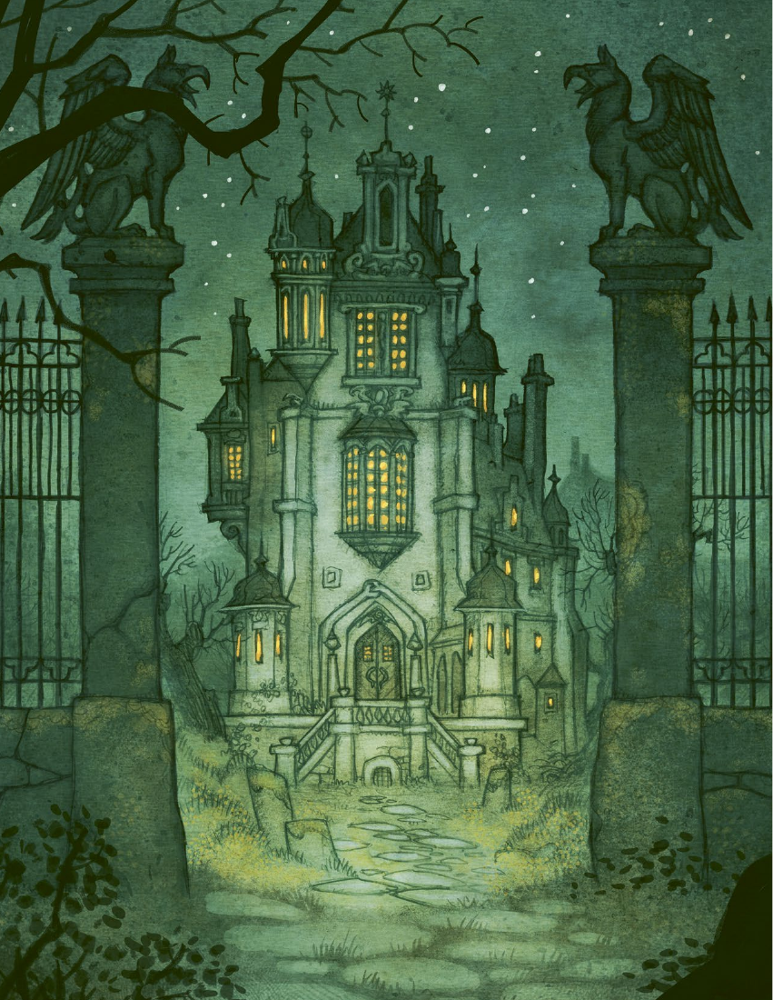

# 第 6 章：结社与大本营

[返回总目录](README.md) · 原始 PDF 第 82–99 页

## 本章目录

- [结社的历史](#section-01)
  - [星期四之子的诞生](#section-02)
  - [阿耳特弥斯教团](#section-03)
  - [卡尔·林奈](#section-04)
  - [奥卢惨案](#section-05)
  - [结社的衰落](#section-06)
- [结社的重生](#section-07)
  - [林内亚·艾尔弗克林](#section-08)
  - [结社的结构](#section-09)
  - [吉伦克鲁茨古堡](#section-10)
  - [乌普萨拉的挑战](#section-11)
- [战役规则](#section-12)
  - [你们的大本营](#section-13)
  - [威胁](#section-14)
  - [残缺和洞察](#section-15)
  - [大本营里的装备](#section-16)
  - [升级项目](#section-17)
  - [设施](#section-18)
  - [被发现的设施](#section-19)
  - [联络人](#section-20)
  - [人员](#section-21)

<!-- 来源：北欧奇谭规则书.pdf；PDF 第 82 页；原书第 78 页 -->

<!-- 来源：北欧奇谭规则书.pdf；PDF 第 83 页；原书第 79 页 -->

据说，烛台里的黑色蜡烛是由处女在月圆之夜献祭的公牛血制成的。我被它的光芒所吸引。我独自一人，呆在大本营里最黑暗的地方，我以前是不能进入此地的。我把一顶鸡冠似的帽子戴上头顶。我是我们当中最年轻的一员，也是一个卑贱女仆的女儿，我现在终于被接纳得以加入这个团体了。

我脚下的地板似乎在移动，他们已经让我喝了两瓶酒，说这会有助于我应对接下来的事情。有人说我要面对某种自在之物，有些人说我会遇到林德龙，还有人说我会见到大海怪，但这些显然都不太可能。一想到狼人在黑暗中发出的咆哮，我就胆颤心惊。

开门的嘎吱声引起了我的注意。在黑暗中出现了一双发光的眼睛，空气之中弥漫着恶臭。我抓起一个烛台，把它举过了头顶，滚烫的烛泪滴落在我的额头上。在烛光下，浮现出了一张脸。那是一只特洛精，它的面容是那么恐怖，我不禁尖叫起来，感觉有什么温暖又湿润的东西从我腿上滑落。那野兽向我扑来，我被撞倒在地上。身上沾满了怪物身上的软泥。紧接着我听到了周围的笑声，就在我们礼拜天喝茶的图书馆里，有几盏提灯亮了起来。我抱着一个用蜡和布制成的特洛精脑袋。原来是几天前剩下的虾汤洒在了我身上。我们的老大向我伸出手，告诉我该摘下这顶愚蠢的帽子了。之后我们又去了埃莱娜的酒馆，在酒馆里我们边喝边唱，直到天亮。我也是这个家庭的一员了。

这一章提供了结社的历史背景，这是一个由灵视者组成的组织。几个世纪以来一直致力于研究和驱逐自在之物，直到大约 10 年前才不复存在。这章书还解释了你和其他玩家角色如何联结起来为结社注入新的生命力，并重新开放了结社旧时的大本营——瑞典城市乌普萨拉的一座废弃城堡。本章节最后的部分描述了如何探索大本营，以及如何对其做出改善。

<!-- 来源：北欧奇谭规则书.pdf；PDF 第 84 页；原书第 80 页 -->

## 结社的历史

林内亚·艾尔弗克林可以告诉你许多事情，比如结社的创立及后来发生的事情。一旦游戏开始，就会由GM 和玩家去填充细节。也许是某个昔日与组织有过仇怨的自在之物因组织前成员的行为来向玩家角色复仇，或是寻求帮助？

### 星期四之子的诞生

结社的创始人出生于 16 世纪的丹麦西兰岛上的埃尔西诺小镇，来自本地的一个贫困家庭。据说，蒂娜·拉斯穆森在小时候感染了天花，昏迷数周才醒了过来，自此她获得了灵视能力。当她醒来时，9 个兄弟姐妹中的7 人已经一命呜呼，以及蒂娜可以看见她周围的奇怪生物了。在她成长的过程中，她就与城镇外的仙灵和特洛精联络，并帮助其他人与自在之物互动。据说在她十几岁的时候，人们就像对待睿智的老婆婆一样对待她，她还常常给年纪比她大的，比她富有的人提出建议。

当教会发现了蒂娜的超能力后，她的生活就全变了。在牧师的指示下，她的父母把她囚禁起来，带到镇广场上接受巫术审判。如果罪名成立，她就会立即被处死。.

她所认识的超自然生物帮助她从候审的木制笼子里逃出。镇民给了她一匹马和一些食物。夜深人静的时候，她一路向南逃向哥本哈根，用假名在那里躲了起来。

### 阿耳特弥斯教团

这纯属机缘巧合罢了。蒂娜和一个同样具有“视力”的人住在了一起。贵族马茨·罗森博格将已故妻子和孩子曾住过的部分房间出租，借此从需要住宿的过路旅客处赚一点外快。马茨曾被一只狼人所伤，那狼人杀害了他的妻子与孩子，从那时起他就获得了灵视，他被自己的能力和看见的东西吓坏了。

当马茨亡妻的鬼魂在午夜穿过房子时，马茨和蒂娜意识到了他们有着相同的能力。此后不久，他们就成立了阿耳特弥斯教团以研究自在之物，并开始招募更多具有灵视能力的人来研究和了解这些生物。

阿耳特弥斯教团的其中一位成员叫安娜·拉斯泰利，她是一名意大利的修女，从罗马宗教审判所逃离出来，定居在斯堪的纳维亚。安娜独自负责编纂整理结社的发现。她写了许多与自在之物有关的文章和书籍。她一生的杰作是一部名为《无形之书》的巨著。

阿耳特弥斯教团成长壮大，在哥本哈根建立了一个会议中心。在与自在之物的遭遇中，结社成员意识到这些生物有时会伤害，奴役甚至杀害人类，有一部分成员甚至认为自在之物与魔鬼有所勾结。马茨希望教团专注于追寻并驱逐自在之物，而蒂娜则始终认为积累知识才是他们的首要目标。

在安娜和马茨去世后，其他人接替了他们的位置。两百年间，阿耳特弥斯教团遍布斯堪的纳维亚半岛，并修建了好几个会议中心。其中一个就在乌普萨拉，在这段期间里，他们收集到了许多与自在之物及魔法相关的文本和信息，建立了神秘知识的图书馆。

<!-- PDF 第 84 页侧栏：飞天，飞天，我一飞冲天 -->

飞天，飞天，我一飞冲天前往布洛库拉的海岸去享受野兽的极乐与盛宴——女巫们在去布洛库拉参加撒旦集会之前背诵的咒语

<!-- 来源：北欧奇谭规则书.pdf；PDF 第 85 页；原书第 81 页 -->

### 卡尔·林奈

18 世纪初，年轻的科学家卡尔·林奈离开它位于乌普萨拉的家，开始到瑞典北部进行科学考察。没人知道林奈是在出发前就获得了灵视，还是在旅途中获得了那种能力。但无论如何，他回来时带了一本名为《蛮荒之人》的秘密日记，其中记录了他与自在之物的多次遭遇，以及关于自在之物的流言。林奈加入了乌普萨拉的阿耳特弥斯教团，没多久后就成为了教团的领导者。

卡尔·林奈又组织了另一次对达勒卡里亚的探险，这次的队伍全部由结社成员组成，其目的是研究自在之物。林奈计划创建一个全面的，关于自在之物的科学目录，这将使他成为享誉全球的科学家。

林奈把前往达勒卡里亚的探险队称为“罗伊特霍尔姆旅行结社”，这个名字所指的正是达勒卡里亚的总督尼尔斯·罗伊特霍尔姆旅行结社，正是这位总督资助了此次的探险，但没人知道他的真实目的。林奈回到乌普萨拉后，宣称这次的探险活动取得了“惊人的成功”，并决定把阿耳特弥斯教团的乌普萨拉分部更名为“无形者研究及人类保护结社”，简而言之，就是“结社”。

在达勒卡里亚探险几年后，林奈召集了结社成员，宣布他要离开组织，并声称自己失去了灵视。这引燃了争论，很快就升级为躯体暴力。许多人认为自己遭到了欺骗，他们开始质疑，林奈是否曾具有灵视，或说，他是为了成为科学家而在一直撒谎？在争执持续了一周之后，有人放火烧了结社的总部，在大火熄灭后，所有关于达勒卡里亚探险的记录都已化为灰烬。

<!-- PDF 第 85 页侧栏：“一个商人驾着马车来到，他声称亲眼 -->

“一个商人驾着马车来到，他声称亲眼看见那个梦魇怪来到了休斯比，直到所有的活物死光才肯离开。他说这只梦魇怪总是出没于休斯比，它会在夜里从门缝或钥匙孔里溜进屋子，骑在熟睡的男人或女人的身上，直到他们口吐白沫为止。这已经是休斯比生活的一部分了，而且被它夜间拜访也是有好处的，因为它会在门廊上留下些钱币。但梦魇怪发生了些变化，它不再给人们钱了。上次来到休斯比时，它暴跳如雷且没人知道它愤怒的原因。那个夜里，这名商人住在神父家厨房里的长凳上，他有一个防护梦魇怪的金雀花护符，这救了他的小命。他躺着却无法入睡，听见村子里的男男女女，像吹号一样用力地呼吸，却无法吸入空气，于是这些人一个接一个的死去，其中还包括了屋里的神父。商人说，那只梦魇怪现在变得邪恶无比，现在他在村庄之间四处游荡，把路过的地方都屠戮得干干净净。”——阿尔瓦·弗利斯克，一名在隆舍教区的农妇

<!-- 来源：北欧奇谭规则书.pdf；PDF 第 86 页；原书第 82 页 -->

### 奥卢惨案

在 18 世纪，整个阿耳特弥斯教团重新定名为结社。在此期间，斯堪的纳维亚周围的许多成员在与自在之物的相遇中受伤或死亡，还有几个会议大厅倒闭。许多结社的许多成员认为，人与自在之物之间的平衡已经发生了改变，几个世纪前订立的契约已经不复存在。在一些地方，这些生物无缘无故地攻击人类，而在另一些地方，它们又消失得无影无踪。

结社的目标开始不断转向，成员们更多着力于驱逐攻击人类的自在之物。他们通过灵视和从 16 世纪积累至今的大量知识来完成这项任务。乡下人兴许知道如何安抚这些生物，但要说到放逐它们，可没有人比结社的人更加擅长。

18世纪末，芬兰的北部饱受一个巨人家族的蹂躏，这些巨人试图将人类赶走。这个巨人族中的女族长，贝斯特拉声称自己是荒野，山脉以及森林的守护者，并野蛮地向此地区的猎户和矿工发起攻击。结社成员集中力量以面对这威胁。百余名灵视者聚在奥卢的城堡制定战术。但巨人们先到一步，在那天夜里，贝斯特拉让她的子嗣纵火烧了城堡。近乎所有的结社成员<!-- 来源：北欧奇谭规则书.pdf；PDF 第 87 页；原书第 83 页 -->都在大火中丧命。

<!-- PDF 第 86 页侧栏：分裂的结社 -->

#### 分裂的结社

在 16 世纪，结社成立之初，各方围绕着组织的宗旨和行事方式就存在不同的观点。几年间，出现了许多小的派系，但很多很快就不复存在了。他们当中有些人自己使用魔法，比如 15 世纪早期一位名叫卡亚·拉尔森的前学院教师所领导的团体，拉尔森本人因巫术指控而在斯德哥尔摩入狱。还有一些人愿意与自在之物共存，比如威尔弗雷德·斯蒂恩的追随者，据说斯蒂恩船长在与自在之物缔结连理后，就永远地消失在韦姆兰的森林里。

还有一个历经多年依然存在的团体叫“罗森伯格派”，该派系因结社的联合创始人马茨·罗森伯格而得名。罗森伯格派认为自在之物都是撒旦创造的怪物，且他们都在追踪、驱逐或是猎杀自在之物。该派系中的许多成员都是退伍军人和猎户，在战斗技能上受过良好的训练。该派系目前由约翰娜·雷冯恩领导，她是一位芬兰神父的女儿，据说还是一位天赋异禀的驱魔人。乌普萨拉的结社与罗森伯格派之间关系紧张，两个团体间的会议曾多次导致武力冲突。目前罗森伯格派的人数和行踪尚属未知。

这次火灾有三名幸存者，卡特娅·科科拉女男爵，艾伯特·韦尔登海姆教授以及希尔玛·阿夫·图伦斯蒂娜女伯爵。他们三人跳入井中，在冰冷的水中呆了几个小时后获救，并火速离开了芬兰，逃回了吉伦克鲁茨城堡，也就是结社在乌普萨拉的总部。

### 结社的衰落

三名奥卢大火的幸存者试图招募新成员并重建结社。但在接下来的几年里，这三人就全部失踪了。

韦尔登海姆教授去了挪威的北部，调查关于天空中怪异闪光，从此再无音讯。人们最后一次见到科科拉女男爵是在瑞典南部的一艘船上，据说她是去那里驱逐深海中的怪物。图伦斯蒂娜女伯爵呢，向东走了，她没有留下任何关于她去往何处的信息。

新成员在与自在之物的遭遇中，要么死去，要么疯狂，要么就是离开组织自保。离开的人里有一个就是林内亚·艾尔弗克林，她现在就住在乌普萨拉的精神病院里。正是她向玩家角色介绍了结社，她还暗示可能在斯堪的纳维亚半岛上还有其他类似的团体在运作——但她不知道他们的确切位置，也不知道如何联系他们。

## 结社的重生

你和其他玩家角色出于不同的原因决定追踪和处理自在之物，或帮助解决人类和自在之物之间的冲突。在游戏开始时，你们都已经接触过林内亚·艾尔弗克林，她会告知你们结社的历史。以及给了你们结社大本营，吉伦克鲁茨古堡的钥匙。

游戏从你们进入古堡时开始，在那里你们将开始对大本营的探索和重建。然后很快你们会进入到第一次对未知的探索中。

### 林内亚·艾尔弗克林

林内亚·艾尔弗克林是一位选择离开组织的前结社成员。她在乌普萨拉市中心一套简陋的公寓里租了一个套间，但大多数时光里，她都在乌普萨拉的精神病院里度过。林内亚谢绝回到古堡。所以你们可以在精神病院或者一个叫“面包师”的旅店见面。

林内亚不仅脏兮兮，还老糊涂。她总是忘记你的名字，以及你是谁。随着她逐渐回忆起那些她宁可忘记的事情，她对结社的知识会在短时间内突然涌出。但她常常说出自相矛盾的话语。

如果你更愿意使用另一个角色替代林内亚，你可以自己选择一个新的长者角色来指引和协助玩家角色们。

### 结社的结构

林内亚告诉了你们结社过去的运作方式，以及成员所坚持的传统。如何管理和塑造结社的乌普萨拉分社完全取决于你们自己，但或者历史会提供一些帮助。

在传统上，结社由高级成员理事会领导。理事会在一楼的沙龙开会，在那里可以俯瞰花园和弗里斯河。

<!-- PDF 第 87 页侧栏：我们是谁？ -->

#### 我们是谁？

你的动机应该解释你重建结社以及追寻自在之物的原因。你和其他玩家角色还需要考虑角色们是如何初次相遇的，以及是什么让你们想要合作。你们可能是亲戚或朋友，且同样获得了灵视。你们可能被同一个贵族雇佣过；你们也可能是本不认识的陌生人，如今因为巧合而相遇，或是为了一个伟大的目标而团结在一起。或者，你们都单独找到了林内亚，并通过她结识了彼此。

<!-- 来源：北欧奇谭规则书.pdf；PDF 第 88 页；原书第 84 页 -->

行为不端的成员会可能会被投票踢出理事会。理事会以共识作为决定方式。结社每周有一次例会，或者在紧急事态发生时可以召开紧急讨论，通常紧急会议上讨论的，都是在斯堪的纳维亚偏远地区的各种传闻。

理事会将指派探险队以研究或消灭那些怪奇生物。在探险队出发前，可以得到所有的可用资源以获得最大的成功可能。结社的成员有义务贡献出装备和知识。为了事业的发展，所有的东西都会大家共同所有。任务和装备都是分配给最适合这项工作的人。

结社融合了天主教，各类异教，以及希腊的传统，当中包括了众多的仪式。在远征开始前，成员们会在教堂接受牧师的祝福。然后他们会聚集在地下室的房间里，在女神阿耳特弥斯的神像前，焚香点烛，背诵协会的信条。他们会站成一圈，那左手的食指和中指放在心脏前。每个成员在旅途前会得到一朵干花，象征着组织的爱与力量。而当他们回来时，还要做一个仪式来忏悔罪行。

<!-- PDF 第 88 页侧栏：林内亚其人 -->

#### 林内亚其人

作为团队，你可以明确你的玩家角色是如何与林内亚接触的，以及她想要帮助你的原因是什么。下面提供了一些建议：林内亚注意到自在之物已经改变了往日的行为方式，变得更具有攻击性。她担心人类会受难，于是选择帮助你，她把你们一个又一个地聚在了一起，让你们相信重建结社是必须的。你们都做了关于结社和林内亚的梦，因此想要找到她，你们要弄清楚发生在你们身上的事情。林内亚不知道你们为什么会梦见她，但她知道这些梦的真实含义：需要有人保护整个北欧的人免受自在之物的伤害，你们是命中注定的结社重建者。

你们在寻找其他灵视者的过程中彼此相遇。为了了解更多与超自然有关的信息，你们发现了结社的信息，是你们找到了林内亚。她才勉强同意协助你们重建组织。

你们中的一人被自在之物袭击了，而林内亚参与过协助驱逐那只自在之物。之后，林内亚告诉你，说过去的经历给她带来了过多的伤害，她已经无法寻找怪异且有恶意的生物了。但她至少可以帮助你找到其他玩家角色。

你们都是某个俱乐部、秘密团体或是某个组织的成员。在那里，你们彼此了解到你们都有着相同的视觉。在某个时刻，你们听到了组织里的另一个成员，他恰好是林内亚的精神病医生，在谈论林内亚的噩梦和幻想。你们意识到，林内亚比你们更了解自在之物和灵视，于是你们决定去见她。

<!-- 来源：北欧奇谭规则书.pdf；PDF 第 89 页；原书第 85 页 -->

结社的徽记是衔尾蛇，一种啃咬自己尾巴的林德龙。衔尾蛇起源于埃及，在挪威神话中也以巨蛇耶梦加得的形式出现。

### 吉伦克鲁茨古堡

大本营是一座巨大的荒废古堡，它坐落于弗里斯河旁的一座小山上。古堡被黑色的铁栏包围，大门两侧还有狮鹫雕像。花园和通往入口的人行道上草木丛生。还有许多老鼠、狐狸和鸟。在后院，弗里斯河岸上有一个破旧的码头，还有一间用木板封起来的小船屋。花园里还有几个较小的建筑物，可能是马厩、储藏室或是仆人居所，以及一些雕像和喷泉。在一座小山上还有七个已经腐坏的木头十字架。

城堡的正面装饰以凶恶的石像鬼。这座建筑有三层高，有若干个塔楼和一个巨大的地窖。

吉伦克鲁茨城堡空置了许多年。旧家具上布满了蛛网，还有老鼠在沙发和椅子上筑巢。鼠群守护着它们的家园，蝙蝠和乌鸦通过天花板上的洞进进出出，建筑的部分区域弥漫着霉菌的气味，漏水的房顶对雨水从不设防。

城堡中的大部分空间都未经探索。许多门要么锁着，要么被封起来了。通过阅读前住户留下的旧日记，你们会了解到这里有几个图书馆、一个实验室，一个医务室、一个小教堂，一个天文台和一个魔法学习大堂。也应该，还有关押自在之物的牢房。这些东西都隐藏在你已经发现，却尚未打开的神秘门扉的后面。

在你们入住古堡后不久，一个名为阿尔戈特·弗利斯克的男人就到访了。他声称他的祖先已经服务于这个城堡数百年了，并坚持要你们聘用他当管家。弗利斯克工作辛勤，让你们吃饱，帮你们穿衣服，为你们打<!-- 来源：北欧奇谭规则书.pdf；PDF 第 90 页；原书第 86 页 -->扫城堡，并见缝插针地表达城堡需要更多的工作人员。此外，不得不说的是，这位优秀的管家在诸多场合都会面带笑容，而且他对结社和自在之物的了解远比看起来还要多。但到目前为止，你们都未能让他吐露出自己的秘密。

<!-- PDF 第 89 页侧栏：阿耳特弥斯教团的信条 -->

#### 阿耳特弥斯教团的信条

我庄严宣誓，我不会堕落也不会流血和软弱哪怕面对地底孳生的恶魔我发誓我不会让思想混浊我会保持思维敏捷举止纯和，双眼清澈我发誓为了我的战友我个人的野心和情感将会让步于我们的结社我要将生命奉献给神圣的阿耳特弥斯我将为对抗自在之物和保护人类而活

<!-- PDF 第 89 页侧栏：结社内部的头衔 -->

#### 结社内部的头衔

具有特定职责的成员将被赋予与之相称的头衔。一个人可以具有多个头衔，也不是每一个职务都需要有人任职。

| 职责 | 头衔 |
| --- | --- |
| 祭祀或司仪 | 教士 |
| 装备 | 军械士 |
| 安保 | 守护者 |
| 金钱和物资 | 司库 |
| 与外界联系 | 织幕者 |
| 大本营 | 城堡执管 |
| 图书馆及信息获得 | 图书管理员 |
| 身体的训练和医疗 | 看护人 |

### 乌普萨拉的挑战

不妨假设，得到吉伦克鲁茨古堡的所有权会招惹许多窥探的目光。你们可能需要面对许多的拜访，比如记者、警察、罪犯，还有意图窥探你们秘密或是获得你们财产的家伙。

如果乌普萨拉的人们得知了你们的身份和行为，用不了多久他们就会把你们关进精神病院里。你们自己的故事将由你们自己创造。

## 战役规则

如果你们使用相同的玩家角色参与多个谜题，那么你们就必须要在谜题之间做些事情。无论是以谜题的形式构成一个更长的战役及故事，还是让谜题作为若干彼此独立的故事。每次玩家角色返回大本营时，都需要决定获得的洞察和残缺是否会保留。此外，玩家角色可能会升级和扩展他们的总部。而且在乌普萨拉，他们也会遇到危险，比如某些自在之物会出于某种原因跟踪玩家角色，来到大本营。也有可能会遇到一些普通人，比如想要制造麻烦的记者或警察。本章余下的部分会讨论战役规则，这将会给玩家提供指引，让玩家明白在谜题与谜题之间该做些什么。

### 你们的大本营

在解决谜题后，你们会有机会让吉伦克鲁茨古堡，也就是你们的大本营获得升级项目。你们可以雇佣员工，探索城堡未知的部分，增加新设备或是翻新现有设备。绘制大本营的草图，增加新的人员，并随着城堡的扩展而增添新的房间会是一件非常有趣的事情。

一旦你们在谜题后返回乌普萨拉，你们就需要回答关于你们经历的问题，每一个肯定的回答都会提供一个开发点。在进入下一个谜题之前，你可以使用开发点购买大本营的升级项目。未使用的开发点将会被保存下来。

每次购买大本营升级项目时，都伴随着威胁出现的风险。GM 将会使用和升级项目成本相同的骰子数量进行暗骰（译者：即玩家不知道结果的掷骰），当中若有任何一个骰子成功，就会出现威胁。如果玩家在同一幕里购买了多个升级项目，GM 会进行与对应次数的掷骰，且每次掷骰都有 1 个额外的骰子。因此，可能会有复数个威胁同时出现。

<!-- PDF 第 90 页侧栏：如何开始游戏？ -->

#### 如何开始游戏？

游戏并没有预设的初始场景，它可以从你们初次面见林内亚，或是进入城堡开始探索开始。也可以在开始时，你们就已经入住城堡几天，并且已经对林内亚有了较深入的了解。在后面的情况下，初始场景通常会将你们引入你们要面对的第一个谜题。

如果你们只打算游玩一个谜题，那么忽略城堡，直接开始游戏吧。

<!-- 来源：北欧奇谭规则书.pdf；PDF 第 91 页；原书第 87 页 -->

在游戏开始时，你们已经有了两个升级项目：“结社图书馆”和“男管家阿尔戈特·弗利斯克”。

### 威胁

当掷骰结果表明出现了威胁时，GM 必须从列中选择一个威胁或是自行创造一个威胁。如果 GM 愿意的话，额外成功会使威胁更加强大。

GM 应该列出与威胁相关的 NPC 或自在之物，且最好开始一个倒计时阶段，让威胁逐步变得有威胁且更加危险。这个过程可以贯穿若干个谜题，伴随着威胁的相互交织，玩家角色在乌普萨拉的生活会变得不再安全。但是，你也可以让威胁在一个场景中立刻得到揭示，以便于让玩家角色应对并消除它的影响。

威胁通常会发生于大本营或乌普萨拉，且在谜题发生的之前或之后。但有些威胁，如窥探的记者，可能会跟着玩家角色进入旅途。当玩家离开时，威胁可能会袭击他们的大本营，比如一个窃贼就乐于如此。

威胁可能会与玩家角色的黑暗秘密、背景故事或之前未能完成的谜题相关。举个例子，如果一位尽职的警官出现了，他坚信有人在吉伦克鲁茨堡里进行非法活动。也许这个人是玩家角色过去认识的人，可能是一个兄弟或是孩提时代的朋友？如果玩家在大本营里碰巧唤醒了一只自在之物，这个生物可能会意识到角色的黑暗秘密，并对此加以利用。

<!-- PDF 第 91 页侧栏：开发点问题 -->

#### 开发点问题

在完成一个谜题后，你们必须共同回答下列的问题。每一个肯定的回答提供一个开发点。

1. 你们在游戏中至少有一幕是发生于大本营吗？

2. 你们是否遭遇了一个新类型的自在之物？

3. 你们是否探访了一个神奇的地点？

4. 你们受到了魔法的影响吗？

5. 你们是否为大本营带回了神秘学书籍或者其他重要的物品？

6. 你们结识了重要的联系人吗？

7. 这次谜题特别困难或是具备史诗感吗？

8. 你们是否解决了谜题？

<!-- PDF 第 91 页侧栏：威胁的范例 -->

#### 威胁的范例

玩家为大本营购买了一项升级项目，且GM 获得了一个成功骰。GM 决定威胁是一只在城堡中复活的幽灵。幽灵的名字叫麦斯，他是一个蒙冤的结社成员的鬼魂，因为被错误指正与自在之物勾结而蒙羞死去。它在被洗清冤屈前，是不可能安息的。麦斯将依照如下的倒计时出现：

1. 有人挪动了物品的位置，玩家角色们做了噩梦，仆人们报告说在城堡里的许多房间里有一个未见过的人，尽管从未有人见过此人进入城堡。

2. 麦斯变得极具侵略性，并开始用魔法来恐吓玩家角色，他会使用幽灵的尖啸，召唤害虫涌入城堡，并对人们施加恐怖的幻象。

3. 麦斯会攻击（在他看来）最为傲慢的玩家角色。

<!-- 来源：北欧奇谭规则书.pdf；PDF 第 92 页；原书第 88 页 -->

### 残缺和洞察

在完成一个谜题后，你必须确定你的残缺和洞察（见第 67 页）是否是永久的。这是通过骰子完成的，称之为康复检定。一旦失败，你的洞察会消失，残缺则会永远保留。经过康复检定确认后的洞察和残缺都没法被抹去。

如果你获得了肉体或精神上的残缺或洞察，就要对应进行肉体或精神上的康复检定。

肉体康复检定的骰子数量由体能和精准决定，比如说，你的体能是3且精准是2，你一共可以骰5个骰子。每一个成功骰可以治疗一个残缺或是永保一个洞察。

精神康复检定的骰子数量由逻辑和共情的总和决定。每一个成功骰可以治疗一个残缺或是永保一个洞察。

通过购买大本营的升级项目，你可以获得康复检定重骰的机会或是在康复检定中获得额外的骰子。在谜题中获得的状态不会影响康复检定。

<!-- PDF 第 92 页侧栏：威胁列表 -->

#### 威胁列表

从下列威胁中选择一个或是自主创造一个：

- 警察确信在大本营里存在非法活动。

- 窃贼计划到大本营来行窃。

- 犯罪团伙的老大想要敲诈或威胁玩家角色。

- 出现了一名不惜一切代价要曝光玩家角色的记者。

- 亲戚，他（们）希望某个玩家角色被关进精神病院里。

- 犯罪的朋友或亲戚前来求助。

- 有城堡里的自在之物醒来，并对某个玩家角色产生了兴趣

- 有自在之物找到、闯入，并控制了城堡

- 有研究人员请求阅读城堡图书馆，但实际上他们是来偷神秘学著作的

- 来了一位贵族妇女，她声称自己拥有吉伦克鲁茨古堡，并希望玩家角色搬出去。

- 有神父坚信城堡里有违法的教团

- 政府官员已经决定要拆除这座城堡

- 银行职员前来讨城堡前主人的旧账

- 将玩家角色们视为竞争对手的神秘学团体

- 伪装成无助孩童的自在之物

<!-- PDF 第 92 页侧栏：康复检定范例 -->

#### 康复检定范例

在一个异常血腥的谜题中，卡斯帕尔·斯道尔得到了 2 个肉体的残缺：瘸行和坏疽，还有一个肉体方面的洞察。当团队回到大本营时，玩家进行康复检定。结果中有 2 个成功骰。玩家决定用一个成功骰治疗一个残缺（坏疽），另一个成功骰用以使洞察永久存在。卡斯帕尔，现在已经从坏疽中康复，而瘸行和洞察都会成为永久性的。

<!-- 来源：北欧奇谭规则书.pdf；PDF 第 93 页；原书第 89 页 -->

### 大本营里的装备

除你的个人物品之外，在谜题中获得的装备在谜题结束后会被认为是无关紧要的。距离下一个谜题的发生可能还要几个月的时间。一旦新谜题出现，你们就需要新的装备。因此，玩家只能在角色卡上保留一个从谜题中获得的武器或道具。然而这个规则不会影响你的角色初始装备，纪念品和日用品，这些东西总是可以保留下来。经过升级项目，大本营可以储存额外的装备，同时还能在不消耗资源的情况下为玩家角色提供免费的道具。

### 升级项目

有三种类型的升级项目：设施、联络人和人员。设施是你在大本营发现或建造的新房间或功能设备。联系人是可以帮助你的人，人员是仆人或结社的新成员。

所有升级项目都包含以下子类：前提、成本、功能或物产。前提是你购置此升级项目所需要满足的东西，其中的资源是指至少一个玩家至少需要具备对应的资源值。成本是购置此项目所需要消费的开发点。功能和物产则解释了该升级项目提供给你们的收益和效果。

### 设施

#### 军械库

一个用玻璃柜子陈列武器的房间。前提：资源 5 以及武器长廊成本：5（可购置此升级项目三次）功能：在准备阶段，每一级都允许玩家角色在不使用资源的情况下携带一件可得性为 2 的护甲或近战武器。

#### 蝴蝶居

玻璃花园的附属建筑，里面满是美丽的蝴蝶与昆虫。

前提：植物学花园成本：2功能：一个玩家在植物学花园度过一个场景时，可以治愈两个精神状态。

#### 鲤鱼池

白色木桥下，一个有小溪和瀑布的鲤鱼池。前提：植物学花园成本：2功能：其中一个玩家可以在准备阶段获得一个额外的优势：处变不惊。

#### 医务室

一个设备齐全的医疗地点。

前提：资源 5 或者组织中有医生成本：6功能：在肉体康复检定中，可以孤注一掷。

#### 犬舍

饲养和训练狗的地方前提：猎场看守或 团体中有猎人成本：4（可购置三次）物产：在准备阶段，每一个设备等级，允许玩家角色不消费资源携带一只守门犬或猎犬

<!-- PDF 第 93 页侧栏：发现 -->

#### 发现

有些设施是一个可以被探索的地点（见第

91. 页）。它们是大本营鼎盛时期留下的遗物，如今早已被遗忘，残旧不堪。如果玩家满足获得设施的成本和前提，GM 可以将对应的设施文本告知给玩家。由他们自己决定是否消耗开发点来探索这些设施。

<!-- 来源：北欧奇谭规则书.pdf；PDF 第 94 页；原书第 90 页 -->

#### 图书馆

巨大的图书馆前提：游戏开始成本：0功能：在此可以寻找线索。

#### 本地的酒馆

档次齐全的酒馆，就在城堡附近。前提：—成本：4（可购置 3 次）功能：每一等级可以为角色的肉体康复检定提供+2 的骰子。

#### 地图室

房间里有一个大地球仪，巨大的橡木桌子上满是地图和路线的手稿前提：图书馆或教授成本：4物产：一个玩家角色可以得到一个额外的优势：古地图。

#### 天文台

一座塔楼被改建成天文台，这里能随时观赏星空。

前提：赞助人或发明家成本：5玩家角色们可以从恒星与行星中找到信息。一个玩家角色可在准备阶段获得额外优势：占卜或天气预测。物产：一个玩家角色可以在不消费资源的情况下携带双筒望远镜。

#### 鸽舍

就是养信鸽的笼子。前提：看守成本：4物产：玩家可以携带一只信鸽进入谜题，并且用它寄信以在下一个场景获得帮助。

#### 降灵大厅

一个接触灵体用的厅堂。

前提：资源 4 或团体中有神秘学家成本：5功能：玩家角色可以在谜题前进行降灵会并获得额外线索，具体由 GM 决定。

#### 靶场

满是靶子的地下室，或花园墙壁围起来的地方。前提：武器长廊成本：5（可购置 3 次）功能：城堡的守卫配戴可得性为 3 的枪支。

物产：在准备阶段，每一个等级都允许玩家携带远程武器，其可用性为 1-3，这不需要花费资源。

#### 马厩

马匹和马车用的马房。

前提：资源 5 或团体中有流浪者。成本：4（可购置 3 次）物产：在准备阶段，每一个等级能向玩家角色提供一匹不需要耗费资源的瘦马。

<!-- PDF 第 94 页侧栏：哦，神圣的三位国王 -->

哦，神圣的三位国王今晚我要与谁相会 ?

我该为谁收拾桌子 ?

我该为谁整理床被 ?

我将成为谁的新娘 ?

谁会给我姓氏 ?

——女孩们在梦中见到未来丈夫时所唱的传统歌谣

<!-- 来源：北欧奇谭规则书.pdf；PDF 第 95 页；原书第 91 页 -->

#### 结社编年史

一部记录自在之物遭遇的典籍。前提：—成本：4功能：在游戏结束阶段时，玩家可以通过团队记录获得额外经验，每个角色获得 1 点额外经验。

#### 武器长廊

在走廊或房间里摆放着简单的武器陈列设施。前提：资源 4成本：4功能：在准备阶段，每个玩家角色都能获得一个可用性为 1 的近战武器。

#### 工坊

工坊设备齐全。前提：资源 4成本：4功能：一个角色可以在谜题前获得额外优势：精制武器或者精制装备。

### 被发现的设施

这些升级项目里的房间早已年久失修，或者被围墙封住。或者在前结社成员离开城堡后就被人遗忘了。

#### 植物学花园

玻璃花园，花朵芬馥，绿意盎然。前提：园丁发现：在长满奇花异草的荒地上，隐藏着破碎的玻璃与断壁残垣。成本：4功能：在花园里进行一个场景的角色可以恢复两个精神状态。

#### 地下仓库

简单的地下储存空间，可以作为保险库或酒窖使用。

前提：—发现：穿过地下室的腐朽门扉，你们看见一条通往附属建筑的黑暗通道。

成本：4（最多可购买 3 次）功能：每一等级可以保存至多三件从谜题中获得的公共物品。

#### 小教堂

基督徒礼拜的地方。

前提：资源 5 或团体中存在牧师。

发现：城堡翼楼外的一个古老废墟，你们可以看见含铅的马赛克玻璃窗和圣坛，早已被干枯的蔓藤和荆棘爬满。成本：6功能：精神康复检定时可以孤注一掷。物产：玩家角色出门时可以携带圣水。

#### 差分机

发明家在古堡的大厅建造了一台计算机器。前提：发明家发现：一个漆黑的夜晚，你们的发明家闯进了大厅。大喊着“尤里卡（译者：是指‘我想到了’）！尤里卡！我们就差几个小零件而已了！”成本：6功能：设施建筑的成本减少 1 个开发点。

#### 地牢

地下室里有个被封锁的房间。

一段潮湿的石阶通向坍塌的地下室拱顶。在里面，你们看到一扇结实的上锁铁门。成本：3功能：没有帮助的情况下，关押在此地的 NPC 无法逃离。

#### 被遗忘的画廊

一个巨大的通道，里面摆满了陈列柜，展示着前结社曾经的发现。

前提：守卫或神秘学图书馆发现：在走廊一个古老的架子后方，地板上满是刮擦的痕迹，一股神秘的风似乎从那里吹来。

<!-- 来源：北欧奇谭规则书.pdf；PDF 第 96 页；原书第 92 页 -->

成本：6功能：一个玩家角色获得 +1 的资源直到谜题结束。物产：玩家角色可以带着前结社成员的旧笔记中的线索、当玩家角色在谜题中使用线索时，调查或观察技能 +1。

#### 健身房

用来锻炼的地方。前提：—发现：在旧工具棚的后面，有一扇破损的门扉。它似乎通向了一个沿着屋脊建成的，有着肮脏窗户的附属建筑。在里面，是一个满是旧垃圾的大厅。成本：5功能：一个玩家角色在健身房度过场景的话可以恢复 1 个肉体状态。

#### 神秘学档案库

一个档案库，墙体是厚重的加铅墙，拱顶上有防护用的铭文。

前提：神秘学庙宇或 神秘主义者发现：图书馆后面的走廊，有一个被砖石封住的密室，在多孔的石头后面，是无法穿透的铅门……成本：6（可购买 3 次）功能：在谜题前，每一个等级可以提供 3 个魔力道具或者魔法道具

#### 神秘学图书馆

收藏禁书的图书馆。

前提：从谜题中获得的神秘学书籍成本：5功能：玩家角色每完成一个谜题，就可以在追寻或理解神秘学知识时获得免费的成功。玩家必须说明角色回想起的信息。

#### 神秘学庙宇

一个用以崇拜恶魔和自在之物的地方。前提：神秘学图书馆在神秘学图书馆下，里面的乱石上写着“崇拜”和“服从”，石头下方是一个被砖石封死，灌铅的舱门。

成本：5功能：一个玩家角色可以在谜题前获得一个额外的优势：神秘学家。1

#### 神秘学工坊

一个工坊，可以制作能影响自在之物的道具。前提：神秘学图书馆发现：在神秘学庙宇的一尊雕像后方，是一个用砖砌成的拱顶，上面写着“创造”。成本：5功能：在谜题前可以制作一个魔力道具。GM 可以从第 123 页的列表中投出或自主选择一个道具，也可以自行创造一个。

#### 自我鞭挞的工具

用于肉体惩罚的工具和发明。前提：地牢发现：在城堡的地下室里有一个狭小的储藏室，里面放着可怕的工具和古老的发明成本：4功能：每一等级可以为一名角色在精神康复检定中提供 +1。

#### 藏宝室

一个大金库，里面放着结社的隐秘宝藏。前提：银行家或 被遗忘的画廊发现：一扇砖墙之后，是一扇大铁门。一个看起来像是保险柜的数字仪表盘仿佛在嘲笑着你们的无知。成本：6功能：所有的玩家角色在谜题期间获得额外的 +1资源。

### 联络人

这些都是能提供帮助的个人或机构。所有的联络人名字都由玩家来指定。当玩家角色选择动员联络人时，你们可以自由进行一个场景的扮演。

> 1　译注：原文如此。

<!-- 来源：北欧奇谭规则书.pdf；PDF 第 97 页；原书第 93 页 -->

#### 银行家

能以债券进行支付。前提：资源 5成本：5功能：每一个谜题中，一个玩家角色可以通过一幕来提高自己 2 点资源值。

#### 修复工

手艺精湛的熟人。

前提：大本营里有 6 个或以上的设施。成本：4功能：无需消耗经验值就能修复或找回纪念物（纪念物规则见第 23 页）。

#### 记者

站在你们这边的调查记者（第 166 页）。前提：资源 4 或团体中有作家成本：4功能：可以提供额外线索，并在谜题中出场提供帮助。

#### 赞助人

一名慷慨的资助者。

前提：启迪 5，或者团体中有军官。成本：4功能：在使用操控人心进行物品交易和价格谈判时，提供一个无条件的成功骰。

<!-- PDF 第 97 页侧栏：知名或不知名的文本 -->

#### 知名或不知名的文本

结社成员可以通过大量的文本和书籍来提高他们对自在之物的认识。例如：

- 安娜·拉斯泰利的《无形之书》，此书为结社的存在和目标奠定了基础。此书在 100 年前已经遗失。出于不可知的原因，此书没有制作过复制抄本。有坊间说法指出，此书的内容不能符合读者的期待。也许这是因为安娜·拉斯泰利以不同的角度进行描述，与寻常的故事有所差别。也许她有不同的目的和表达手法，因此与传言有别。无论如何，此书有着关于自在之物的独特知识。

- 马克斯·布鲁格尔的《问与答》。这是一部 18世纪的哲学著作。此书因与神秘学相关，在1792 年被教会禁止。据说书中所提出的问题会使读者对自身和世界的看法破灭。该书是以红色墨水在黑色纸张上书写而成。在封面上，描绘了一条吞食自己尾巴的林德龙。

- 《女巫之锤》是 15 世纪的著作，天主教和新教的猎巫人都将其视为猎巫手册使用。本书的关注点是女巫，但也囊括了许多自在之物的信息。

- 卡尔·林奈的《蛮荒之人》。林奈的这本秘密日记描述了他本人在 1732 年在瑞典北部探索时与自在之物的多次遭遇。据说此书在乌普萨拉大学中被窃，目前已落入私人之手。

- 索尼娅·林德加德所著的《冥土上的死亡》，一部流行小说，讲的是一个女人不得不从狼人手上保护自己的家人。在结社之外，鲜有人知道索尼娅其实是一个星期四之子，书中的故事都是真实事件。

- 奥劳斯·马格纳斯的《对北地民族的描述》，这是 22 本书构成的合集，著于 16 世纪。当中的许多文章都在描述斯堪的纳维亚半岛及生活于此的人群。本书中收录了许多关于神秘生物的故事，及抵御它们的方法。

- 维提·克维斯特的《魔鬼的着装》是一部令人费解的文集，其中收录了聚集在奥兰岛上进行某种仪式的芬兰撒旦教徒所写的文章，诗歌和歌谣。与会者者的姓字已无从考究，唯有这些文本留下了。据说阅读这些文本的人不仅获得了巨大的财富，而且性格也发生了变化。

- 莫滕·克里斯滕森的《黑暗包围着我》。据作者本人所说，这本千页的巨作包含了与鬼魂和其他不死存在沟通的文本。这本书记载了引诱、束缚以及控制自在之物的方法。莫滕·克里斯滕森曾是哥本哈根的国家古文物学家，但在几年前，他放弃了自己的家庭和职位。据说，他在挪威北部召集了一群志同道合的人。

<!-- 来源：北欧奇谭规则书.pdf；PDF 第 98 页；原书第 94 页 -->

#### 警员

友善的警察（数据同第 166 页的警官）前提：资源 5，或者团体中有私家侦探成本：4功能：提供额外线索，伪造证据，防止你们受到犯罪行为的侵害等。GM 决定什么事情可行。

#### 教授

在大学里的联络人。

前提：资源 5，团体中有学者成本：4功能：在乌普萨拉寻找或理解信息时得到一个无条件的成功骰。

#### 精神病理学家

在精神病院接受治疗。

前提：玩家角色必须在谜题中陷入崩溃。成本：4功能：一个玩家角色在精神康复检定中获得 +2。

### 人员

这些升级项目是加入结社的仆人或拥有灵视能力的人。玩家必须给他们起个名字并进行简短的描述，然后就能使用他们了。

#### 管家：阿尔戈特·弗利斯克

你们一搬进来，阿尔戈特就来了。前提：游戏开始成本：0功能：管理大本营。

#### 看守

一个机灵的看守照看着你们的房产。前提：工坊成本：3功能：城堡里的设施如果损坏了（比如遭遇了威胁），他会负责修复。

#### 厨师

一个追求效率的管家，对大份量的食物情有独钟。

前提：—成本：4功能：在大本营为大家准备丰盛的晚宴，确保你们都能饱餐。

物产：在准备阶段为每一位玩家角色提供免费的粗制干粮。

#### 马车夫

住在马厩里，安静寡言的马夫。

可以进入谜题，由 GM 负责扮演。玩家给他分配属性，他有 10 点属性（单一项最高为 4），8 点技能（单一项最高为 3）。其中两个技能必须是体能的衍生技能。肉体强度 1 精神强度 1（第 166 页）前提：马童成本：4物产：玩家角色有了自己的马车和两匹骏马。他们可以通过马车旅行到其他地点，同时恢复一个状态（见第 76 页）。

#### 猎场看守

控制了房产内的动物数量。前提：靶场成本：5功能：为玩家角色和城堡守卫把靶场提供的武器可用性提升到 4。

物产：在准备阶段，无需进行资源检定就能获得狩猎陷阱和狩猎装备。

<!-- 来源：北欧奇谭规则书.pdf；PDF 第 99 页；原书第 95 页 -->

#### 园丁

保护城堡的一位花匠。前提：资源 5成本：4功能：大本营产出的所有食物都视为营养食品。

物产：无需要进行资源检定。就能在准备阶段为玩家角色提供 3 剂弱效毒药（毒性 3）或是 1 剂强效毒药（毒性 6）。

#### 守卫

城堡的守卫。

玩家给他分配属性和技能点。守卫有 12 点属性点（单一项最高为 4）和 6 点技能点（单一项最高为 3），技能只能投放于近身战斗、远程战斗、警觉和观察中。肉体强度 2 精神强度 1（第 166 页）。守卫自带2 个可用性为 1 的武器。前提：—成本：5（可购买 3 次）功能：竭尽所能地从对手和劫匪手上守护城堡，具体由 GM 决定。

#### 私人医生

不安的医生就住在城堡的一个翼楼里。前提：医务室成本：6功能：每个谜题一次，通过一个场景为所有在大本营里的玩家角色治疗肉体崩溃和 2 个肉体状态。

物产：无需进行资源检定，在准备阶段提供医疗设备。

#### 发明者

古怪的工程师。前提：教授成本：5功能：在谜题开始前，玩家角色可以建造一个机械道具，无视其可用性等级。

物产：为团体提供无需资源检定的化学设备。

#### 神秘主义者

探索神秘学的隐士。前提：神秘学图书馆成本：5功能：可以获得一个能够影响谜题中自在之物的魔力道具或魔法道具。

#### 军需官

一个人脉丰富，组织能力强的前军官。前提：银行家或 赞助人成本：6功能：所有玩家无论生活水平（见第 73 页）都可以在准备阶段或谜题中可以获得 +2 资产。

#### 新成员

一个新招募的灵视者。

玩家为他分配属性，GM决定他的动机和黑暗秘密。他有 12 点属性（单项最高 4）和 10 点技能（单项最高2）。玩家和 GM 共同创建他与玩家角色及其他结社新成员的关系。

肉体强度 1 精神强度 1.（第 166 页）前提：启迪 4成本：5（可多次购买）功能：可与玩家角色一同出现于谜题中，由 GM控制。

#### 马童

工作认真的年轻人。前提：马厩成本：3功能：玩家角色大本营中所有马匹都视为骏马。

[上一章](05-conflict-and-injuries.md) · [返回总目录](README.md) · [下一章](07-mythic-north-and-upsala.md)
