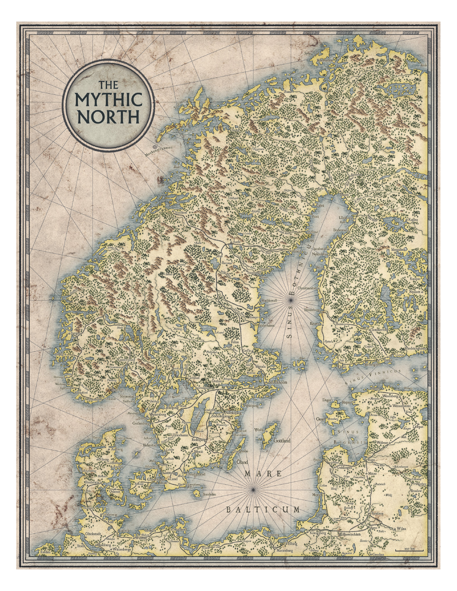
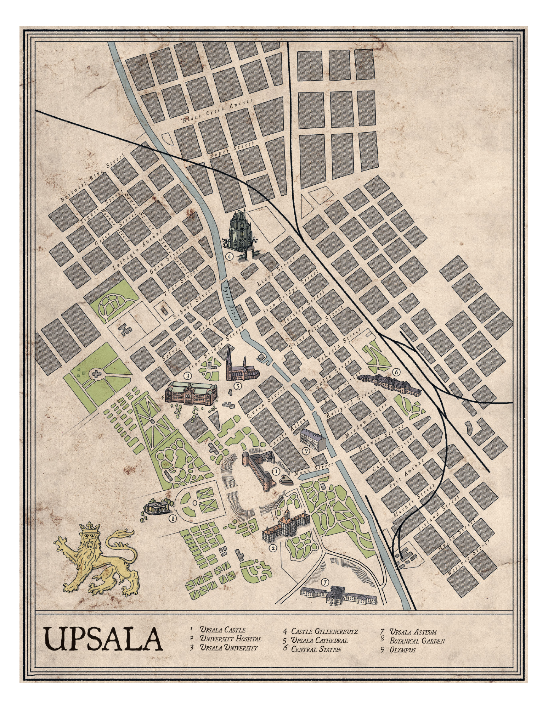

# 第 7 章：神秘的北欧和乌普萨拉

[返回总目录](README.md) · 原始 PDF 第 100–113 页

## 本章目录

- [属于你们的神秘北欧](#section-01)
  - [斯堪的纳维亚的冲突](#section-02)
  - [城市生活](#section-03)
  - [北欧的主要城市](#section-04)
  - [乡村生活](#section-05)
  - [科技](#section-06)
  - [头衔与名字](#section-07)
  - [旅行](#section-08)
- [乌普萨拉——精怪传说与科学之城](#section-09)
  - [乌普萨拉大学医院](#section-10)
  - [乌普萨拉精神病院](#section-11)
  - [警察局](#section-12)
  - [济贫院](#section-13)
  - [威尔斯普林街 59 号](#section-14)
  - [乌普萨拉公报](#section-15)
  - [乌普萨拉植物花园](#section-16)
  - [军政府](#section-17)

<!-- 来源：北欧奇谭规则书.pdf；PDF 第 100 页；原书第 96 页 -->

<!-- 来源：北欧奇谭规则书.pdf；PDF 第 101 页；原书第 97 页 -->

马车停了下来，我自车厢走下，来到村郊一小片被践踏过的泥地上，这里与城市的温床全然不同。这里的光似乎更明亮。空气中没有雾霾的气味。没有人会藏匿在建筑间的小巷里，人们有家可归。城市中司空见惯的盗匪和乞丐在这里荡然无存。在杂货店外的草地上，一个女孩用棍子抽打着正在吃草的干瘦牛群。村子中央隐约可见一座装饰以古怪雕像的教堂。

我到此的理由是一封匿名信。写信人说村里的人已经丧失了心智，他们赤身裸体，不带任何工具和家具前往林间生活。他们把森林深处卡拉哈拉峡谷的黑泥涂抹在身上，还会对着星星吟唱。写信人还说，这些村民袭击并吃掉了一个路过此地的城里人——一个像我这样的人。

我的肩上用皮带悬挂着一杆步枪，它的重量给了我一种安全感。尽管这可能只是个错觉。为了减少恐惧感，我不断警醒自己，想要揭开卡拉哈拉峡谷的谜团，需要的不是蛮力而是逻辑和智慧，但尽管如此，我还是把步枪放在手边，寸步不离。

乡村牧师走近了我。我要在他的家里过夜，等待明早抵达的其他人。我真的能在这里等到他们吗，或是，在那之前我已被乡间的黑暗吞噬殆尽？

这一章提供了一些见解，这些见解与神秘的斯堪的纳维亚和使人类分裂的冲突有所关联。城市与乡村作为人类和自在之物共同的定居地，他们的差异越来越大，以至于水火不容。乌普萨拉城作为所有谜题的起点，可以描述成若干可探访的地点，玩家角色们或许会在这些地点得到线索，也或许将要驱逐盘踞这些地方的自在之物。本章还包括了 19 世纪斯堪的纳维亚主要城市的简介，这些内容可以作为创建角色背景故事时的灵感。

本章着重于介绍斯堪的纳维亚半岛的整体风貌和氛围。一个重要的想法是，你应该构建你自己的斯堪的纳维亚，它可能或多或少地与史实版本有些相似。游戏世界中的大多数内容都应该被模糊地定义，除非你必须阐明某些会在出现在谜题中的某些东西。举例说明，如果想要进行一个关于神秘放映机的故事，你大可以假定科技已经发展到足以让放映机存在的水平。简而言之，你不需要决定具体的年份。

<!-- 来源：北欧奇谭规则书.pdf；PDF 第 102 页；原书第 98 页 -->

## 属于你们的神秘北欧

《北欧奇谭》发生于瑞典，挪威，芬兰或是丹麦，但这是一个基于现实世界调整出来的架空版本，它是独一无二的。这是一个混合了整个 19 世纪所有事件，文化表达和冲突的时空，对每个游戏小组而言都是独一无二的。玩家们会共同决定他们自己的斯堪的纳维亚的风貌，而 GM 在其中的影响更为显著。

运用你所知道的或是你认为你知道的 19 世纪相关的内容，也可以使用你对那个时代的想象，去构建一个能够突出你们玩家角色和故事的背景吧。如果芬兰被沙俄侵占会使角色在坦佩雷郊区的旅程变得更为惊险，并构建和自在之物的遭遇，那么芬兰就应该被沙俄占领。如果你的记者角色需要打字机来撰写社会评论文章，那么打字机就理所当然地存在。

### 斯堪的纳维亚的冲突

神秘的北欧以一系列会对玩家角色带来影响的冲突为标志。欧罗巴正从席卷整片大陆的拿破仑战争中开始恢复。但新的战争已经开始或即将打响。而大西洋彼岸也传来美国南北战争的消息。

日益膨胀的民族主义把所有国家的人们划分成两派：我们和他们。定义挪威人和瑞典人变得迫在眉睫，那些不符合标准的人可能会被排斥、驱逐，甚至杀害。教会内部的矛盾也与日俱增。天主教徒和新教徒彼此对立，那些胆敢跟随独立小教派并遵循自我方式的人则将面临迫害与酷刑。

工业化点燃了新旧之间，工人与雇主之间，城市居民和城市淘金客之间的矛盾。有些人希望离开农村，有些人则意图延续祖辈所创造的一切，他们之间的关系变得紧张。在森林中，林业公司和矿业公司试图驱逐农民和女佣，而当地人也在努力抗争。事实上，这些企业为城市里的工厂提供了他们所需的木材和矿石。

城市与乡村之间产生了裂缝。城市生机勃勃且充满活力，工厂里的机械通过烟囱喷吐出滚滚浓烟，而货物和原材料络绎不绝地穿过车站和港口。随着每一批新货物，每一批新人口、每一个新故事和每一个新思想的传入。下层阶级在郊区繁衍生息，而市中心则挤满了新建筑，商人们在这里将黄金和劳动力转化为利润。富人的捐款支持着大学的运作，人们开始相信，知识的传播将有助于人类征服自然。一切皆有可能；任何事情都可以被认识和解释。

而乡村似乎正在凋萎消亡。屋舍惨遭遗弃，农田里满是腐败的花草。沼泽水位上涨，最终漫入人类的家园。当食物耗尽，留下的病弱者只能在雪地里等死。荒野永恒而无法驯服。

而财富和知识的分配有着严重的不公正。教会和贵族仍拥有权力，但他们受到资产阶级、贸易影响和财产影响力的威胁。无论从政治上还是社会上，世界都是阶级化的。底层是穷人和无产者、儿童和那些被宣布为疯子或国家敌人的人。

围绕男性和女性权利的争斗也带来了紧张关系。在这个时代，性别上的不平等开始面临挑战，妇女获得了继承财产和自己决定生活的权利。女性在职场中的地位也越来越突出。与此同时，新的性别认知也诞生了，有人认为女性就应该精致，穿上紧身束胸衣，能在困难的情况下晕倒就再好不过。女性主义的反向运动开始了，这无疑为某些人带来更多的行动自由。象征性别和社会地位的严格着装规范正在逐渐消失。

革命团体遍及欧洲各地，他们向许多人传达了治理社会的各种哲学，他们还告知大众，现状不仅仅可以被挑战，而且还可以被推翻。

<!-- 来源：北欧奇谭规则书.pdf；PDF 第 103 页；原书第 99 页 -->

<!-- 来源：北欧奇谭规则书.pdf；PDF 第 104 页；原书第 100 页 -->

### 城市生活

城市就是工业革命的心脏。以前重大的决策都是神职人员和贵族代表在城堡和庄园中做出的。而今市民们利用他们的资本来控制政治和经济上的决策，他们的家园就在城市里。

教会的权威流失，落到了科学家手上，科学家们正在客观地研究和整理，他们研究石头和苔藓、还研究人类的思想和一切东西。没有谜题不可释义。知识的积累发生在大学校园里，有些大学会成长为城市中的独立社区。

在城镇的边缘，工人阶级就住在肮脏不堪之地。巨大的贫民窟开始出现，临时帐篷和搭棚变成了永久性的棚屋和住房。工会试图团结工厂工人，以争取更好的生活和工作条件，但他们遭受了警察的暴力和资本家的蒙骗。

发明正在改变许多城市居民的生活。肥皂和工厂生产的棉衣可以改善卫生，减少疾病的传播。坚固的砖砌建筑遍布整个城市，笔直的街道为长途汽车和行人提供了足够的空间。下水道得到了扩建，以前堆积在小巷里的污物现在可以从市中心被冲走。得益于新技术和新药物，医疗状况也有所改善。

来自世界各地殖民地的船只带着香料、茶叶、鸦片和关在笼子里的珍奇动物进入港口，传播着关于异域文化和外国风景的故事。

警察暴力机构变得更具组织性，对控制大众人口一事背负了更大的责任，公民们必须依照民族理想来治理、监督和塑造国家。许多政府雇佣秘密警察来监视和打击国家的敌人。间谍潜入外国势力，收集情报，为武装冲突做准备。

<!-- PDF 第 104 页侧栏：找到谁是女巫 -->

找到谁是女巫只需在教堂里抛出一枚硬币当你弯腰时候把那硬币捡起你从两腿之间就能看见女巫和其他古怪东西——揭穿女巫和自在之物的传统方法

<!-- 来源：北欧奇谭规则书.pdf；PDF 第 105 页；原书第 101 页 -->

科学家们不再把精神疾病视为恶魔附身的标志，他们或建立了使用现代疗法的精神病院。这些新的疗法通常是痛苦的，且往往会让病情变得更糟。他们会用高压水枪射击病人的头部；病人们会被绑在旋转椅上旋转直至昏迷；许多人迷信惊吓疗法，他们有时甚至会在病人的床上藏匿尸体的残肢。

### 北欧的主要城市

你们的玩家角色和他们遭遇的人可能曾在乌普萨拉以外的地方四处旅行。下文会介绍 19 世纪斯堪的纳维亚的一些主要城市。

#### 斯德哥尔摩

这里是瑞典的首都，大约有 10 万人口。因为城市移民和高出生率的缘故，这里的人口增长迅速，这座城市饱受饥饿和疾病之苦，1/3 的孩童不到 1 岁就会夭折。这里的第一个火车站已经建成，铁路通往哥德堡、乌普萨拉和斯堪尼亚。最近，该市还修建了自来水厂、煤气厂和发电厂。煤气灯照亮了街道，马拉的有轨电车和公共汽车在那里悠闲地行驶。国王和皇室成员住在奢华的宫殿里。

乌普萨拉

#### 克里斯蒂安尼亚

克里斯蒂安尼亚是挪威的首都。人口不断增长，而且这座城市是挪威第一条铁路和蒸汽轮船航线的中心。野外的木材和矿石经此运到欧洲各地。

#### 哥本哈根

丹麦首都的标志性特色就是政治辩论。人们对君主专制心怀不满。哥本哈根是北欧的商业中心，城市正在迅速扩张。其中许多匆忙新造的住宅狭窄而黑暗，配以狭窄的巷道和院子。这里文化生活蓬勃发展。最近还新建了几座剧院和动物园。

#### 赫尔辛基

芬兰首都是一个相对年轻的城市，居民人口很少，其中一半人说瑞典语。最近，这里新建了许多建筑，包括火车站和乌斯彭斯基大教堂。这里的市中心被称为科鲁夫现在由宽广的林荫大道和广场组成。在卡利奥区，工人们挤在简陋的木屋里。拉平拉赫蒂医院坐落在城镇的边缘，这是芬兰最大的精神病院。

<!-- 来源：北欧奇谭规则书.pdf；PDF 第 106 页；原书第 102 页 -->

### 乡村生活

在乡村 ，财富是用牲畜、工具和房产来衡量的。所有的劳动都是体力劳动，对人与牲畜皆是如此。在农村里，人被严格划分为地主和绝大多数为他人工作的劳动者，劳动者只能依靠他人的善意，为别人做些活儿。随着人口的增长，无地产的劳动者数量在急剧增加。

教堂是重要的社交场所，牧师通常是唯一的消息来源。在教堂里进行基督教以外任何信仰的活动都是违法的。牧师会宣扬“真理”，谴责那些离经叛道的人。大家都彼此熟知。考虑不周的行为可能会毁掉一个人，甚至是一个家庭的名誉。

当地的县级行政长官负责税收和执法，有时也会兼任检察官的角色，他们会得到辅助警察和法警的协助。无人照料的儿童则会被安置在由穷困援助委员会经营的孤儿院里。

在农村地区，人们的饮食包括可以在附近捕获或种植的所有东西。食物会通过腌制和烟熏来保存，时节对生活影响极大——在寒冷、黑暗且饥饿的冬天尤为如此。人们大部分的财产都是自行制造的；衣服是当地纺织的；纤维和颜料是用植物制作的；人们对金属制品和皮革制品的需求极大，但这些东西价格昂贵，难以获得。

人们会在丰收开始和结束的时候举办盛宴以庆祝，他们会在宴会上跳华尔兹、苏格兰圆舞曲、汉波舞和波尔卡舞。小提琴是种常见乐器。歌曲、舞蹈和其他文化表达方式在基督教崛起以前就一直存在。在某些情况下，异教的传统与基督教教义相互结合。

还有一点必须指出。在 19 世纪，斯堪的纳维亚半岛的大部分地区都惨遭了饥荒和欠收带来的打击。在瑞典，这段时日被称之为“Storsvagåren”，意为“大衰败时代”。而芬兰则称之为“Lavåren”，即“苔藓时代”，因为当时，人们不得已只能吃苔藓和树皮熬<!-- 来源：北欧奇谭规则书.pdf；PDF 第 107 页；原书第 103 页 -->成的粥羹。那时的冬天寒冷而漫长，池塘、湖泊和水道被严冰覆盖，牲畜在马厩里成群死去。

<!-- PDF 第 106 页侧栏：整个教区都在议论那只熊，它只袭击人 -->

整个教区都在议论那只熊，它只袭击人而不袭击动物。我的儿子尼尔斯和他的狩猎小队在朗斯坦德追猎它时，突然天色已晚，很是昏暗。他们点亮了灯笼，穿过树林返回。但这只怪物已经在萨勒河上的浅滩上等着了，它向小队发起攻击，就好像它才是猎人，而人们是猎物一样。三个成年人丧命于此，尽管这怪物中了许多枪，但这恶兽并未变得虚弱。直到尼尔斯把脖子上的十字架按在怪物的右后腿上，它才大叫着消失在森林里。尼尔斯说那不是熊，而是狼人。尼尔斯把怪物伏击的地点指给我看，在树后飘散着鼻烟，就像是有个人站在那里消磨时光。尼尔斯告诉我，他在找一个右腿发瘸的人，找到他后，他会在托博达找来牧师，好让他带着教堂的十字架来驱逐狼人。

——阿拉·赛文加姆特纳斯的农民

### 科技

你们的游戏小组共同决定在你们的游戏世界中，技术发展到了何种水平，当然这不需要完全一致，但你们还是有必要创建一个对你们而言看似可信的世界。在一个谜题中，你们可能会去到一个遥远的地方，那里的技术似乎停滞不前。而下一个谜题你们又去到了一个城市，那里有着 19 世纪末的科技水准。下文提供了一些对 19 世纪技术的思考。

蒸汽机是工业时代最重要的发明之一。它为工厂的机器和火车提供动力，使人们可以在欧洲快速旅行。蒸汽船则在新开挖的运河中运送货物和人员。

由于印刷机和打字机的改进，报纸变得日益普及。人们可以通过电报进行交流。化工产业带来了一系列革命性的材料，如炸药和新型油漆。火柴得以发明。疫苗出现了，这让人们可以对抗许多曾被认为是绝症的疾病。相机变得越来越先进。许多科学考察队正在探索世界，甚至包括北极和南极。

在 19 世纪，缺乏准度的前装式鸟铳和燧发步枪被后装式雷帽步枪所取代。这些新式火器上膛快且可靠。在近身战斗中，还可以把刺刀固定在步枪上。

迅捷剑被贵族用作装饰、武器和阶级标志。下层阶级喜欢用刀，而农民则用斧头和镰刀。在农村地区，传统火铳和弩仍在使用。

<!-- PDF 第 107 页侧栏：若是一个女人 -->

若是一个女人不能妊娠应抓取一条梭子鱼趁鱼活着时候尿进鱼嘴里女人就能多子多孙——治疗不孕的传统巫术

<!-- 来源：北欧奇谭规则书.pdf；PDF 第 108 页；原书第 104 页 -->

### 头衔与名字

在称呼他人时，头衔非常重要。“小姐”指代未婚女士，“夫人”指代已婚女士，“先生”则用于称呼男士。许多职业也会有职称头衔，比如法警，天主教的神父。高等教育中的教师则被称之为讲师和助教等。而军人和军官则以军衔作为称谓。

### 旅行

旅行需花些时间。玩家角色通常会乘坐船只、火车或马车。他们遇到的大多数人一生中只离开过他们的村庄寥寥数次而已。尽管工业在不断发展，但斯堪的纳维亚仍然是农业社会。

<!-- PDF 第 108 页侧栏：交通工具速度表 -->

#### 交通工具速度表

| 交通工具 | 公里 / 时 |
| --- | --- |
| 马车（含休息时间) | 8-10 |
| 火车 | 30 |
| 蒸汽船 | 25 |
| 帆船 | 10-20 |
| 马匹（含休息时间） | 10-20 |
| 步行（含休息时间） | 3 |
| 行军（含休息时间） | 4-5 |

<!-- 来源：北欧奇谭规则书.pdf；PDF 第 109 页；原书第 105 页 -->

## 乌普萨拉——精怪传说与科学之城

乌普萨拉位于瑞典首都斯德哥尔摩的北部，位于诺兰德的边界上，那里城市和村庄很少，荒野无边无际。这座城市最著名的是它的大学。但它也是一个深深植根于异教世界的地方。乌普萨拉是挪威被基督化时，古斯堪的纳维亚教派的最后哨所。在城外，坐落着乌普萨拉土丘，它修建于公元六世纪，伟大的国王就在此下葬。

乌普萨拉最近发生了一场火灾，这造成近 1/5 人口的死亡，城市大部分地区惨遭毁坏。这座城市曾位于完全毁灭的边缘，但它从灰烬中浴火重生，并经历了重大的变革。这里有许多全新的建筑，大量未受过教育的工人涌入工厂，来自世界各地的学生和科学家纷纷涌入乌普萨拉大学。

乌普萨拉的街道被煤气灯照亮。报童大声疾呼最新的头条新闻。弗里斯河流经市中心，汇入马拉尔湖。河上有几座桥，其中包括大教堂桥和铁桥。该市较贫困地区深受霍乱的困扰。盗匪在暗巷中蠢蠢欲动，街上满是捉拿盗匪的佩刀巡警。

制砖粘土的出现催生了完整的砖石工业，在城郊还有几家纺织厂。然而，这座城市的主要收入来源是酒水生产——无论是合法的还是非法的，酒水交易带来的金钱都在为这座城市的诸多机构买单。

由于古斯塔夫的遗产之故，大学校园占地极广。在 17 世纪，古斯塔夫斯·阿道尔弗斯国王向乌普萨拉大学捐赠了 400 个农场及其土地。这里有许多雄伟瑰丽的建筑。学生们聚集在学生活动大楼，他们在此唱歌，讨论科学和哲学。有些学生群体偏爱浪漫主义的理想，注重情感而非理性，他们把异域风情理想化，且对神秘主义颇感兴趣。还有些群体笃信自然科学，蔑视崇高。他们希望通过精心进行的科学实验来找到真相。这些团体之间的冲突和对抗正在不断加剧。

乌普萨拉是一个分裂的城市，工人、农民、佣人和学生、神职人员与贵族同住于此。后者在恢弘的别墅和公寓里享受着奢侈品，而前者只能卑躬屈膝地满足后者的一切需求，直到精疲力竭。这两个群体之间很少有公开的冲突，但冲突一旦发生，就总会在非法的夜总会和妓院里，在这些地方，富人和穷人并无明显的区别。

教会掌握着巨大的权力。瑞典大主教亨利克·雷乌特达尔在乌普萨拉享有席位。这里的哥特式大教堂是斯堪的纳维亚最大的教堂之一，它有一口名为斯托兰的大钟，整个城市都能听到它的声响。圣坛上的十字架中有名为“真十字架”的圣遗物，还有一座巨大的管风琴占据了大教堂的一整面墙。

### 乌普萨拉大学医院

乌普萨拉的医院是斯堪的纳维亚半岛最现代化的医院之一。这座建筑是全新的，像一座多层城堡，有漂亮的塔楼和装饰。病人被分配到 16 个病房区，每个病房由一名主任医师管理。这里有手术室、解剖室、会诊室、礼拜堂、图书馆和办公室。

这里有许多存在数百年的医疗设备，有传言称，死在病床上的人都被困在这里，困扰着这家全新的医院。据说这些东西会折磨病人，把医生和护士吓疯。

<!-- PDF 第 109 页侧栏：乌普萨拉大学医院 -->

#### 乌普萨拉大学医院

玩家角色可以被送往医院疗伤治病。他们还可以利用解剖室进一步了解自在之物。医院可以作为谜题的背景。

<!-- 来源：北欧奇谭规则书.pdf；PDF 第 110 页；原书第 106 页 -->

<!-- 来源：北欧奇谭规则书.pdf；PDF 第 111 页；原书第 107 页 -->

### 乌普萨拉精神病院

这座城市的精神病院被一道黑色的铁栅栏包围着。病人们会坐着马车来到这座砖砌建筑，然后几乎再也不能离开这里，除非他们躺在棺材里。这里的人员构成是低能儿、精神错乱者和引起教区愤怒的人们。病人根据经济状况分为上层和下层。较富裕的病人能得到良好的治疗，食物会装以精美的托盘送到他们的房间。

下层社会的病人被戴上镣铐，关进囚室，甚至活活饿死。病院会用泻药和催吐剂进行治疗，还会在他们的皮肤涂上诱发溃疡的刺激性药品。因为精神错乱是由粘液引起的，所以必须对病人进行净化。所有的治疗都由尼古拉斯·弗雷德医生监督，他身材矮小，性格幽默，且相信他的治疗是有效的。他身边有一大群支持他的护工、警卫和医生。

### 警察局

这个城市的警察穿着配有金色纽扣的蓝制服，头戴金色的头盔，手持军刀。军队是腐败和暴力的。警察局拥挤不堪，积水严重，害虫猖獗。这里的木地板咯吱作响，整栋建筑散发着污浊的气味。警局由办公室、牢房和法庭组成。大楼的一端是专门负责调查复杂案件的侦探部门。地下室最近安装了一个实验室，现在那里可以进行化学测试，以便于追捕罪犯。

新上任的警察局长奥斯卡·斯蒂尔纳是警队中为数不多无法被收买的人。他正在努力肃清组织里的腐败现象。一些警员把他视为榜样，不再与可疑分子同流合污。他特别招人嫉恨。

### 济贫院

乞讨、流浪和贫困都是违法的。被判犯下此类罪行的人都被关在济贫院里。乌普萨拉的济贫院位于坎帕维广场，挤满了因多年歉收而陷入贫困的贫民。这家济贫院的主人是皮尔·达布医生。他与当地警察一起，经营着一个广泛的线人网络，目的是追踪逮捕小偷和乞丐。那些被迫住在救济院的人整日被虱子叮咬，且过着饥肠辘辘、时常受虐的悲惨生活。

<!-- PDF 第 111 页侧栏：乌普萨拉精神病院 -->

#### 乌普萨拉精神病院

玩家角色可以进入精神病院接受治疗。他们也会遇到那些遭遇自在之物的人，或被自在之物折磨过的人，这些都被认为是精神错乱。

<!-- PDF 第 111 页侧栏：警察局 -->

#### 警察局

玩家角色可以以犯罪嫌疑人的身份来到警局，或是到此获取地下社会中的人物和事件的信息。警察局长可以作为谜题的邀请人。

<!-- PDF 第 111 页侧栏：济贫院 -->

#### 济贫院

有些灵视者无法处理自己看见自然之物的能力。他们早晚都会被关进济贫院或精神病院里。玩家角色可以联络他们获取关于自在之物的情报。

<!-- 来源：北欧奇谭规则书.pdf；PDF 第 112 页；原书第 108 页 -->

### 威尔斯普林街 59 号

乌普萨拉有很多妓院，最著名的是泰克拉夫人经营的威尔斯普林街 59 号。据说泰克拉是凡耶小镇一个佃农的女儿，现在是一个富有的女人，与大学和神职人员精英都关系良好。她的员工待遇极为恶劣。许多人感染了梅毒和肺炎，她们的孩子也都已经死亡或是被杀害。殴打和各种形式的药物滥用也司空见惯。以卖淫为生的人被登记为妓女，被迫定期体检，且永远不能再从事正常的工作。

“蘑菇对许多自在之物而言都有特殊的功效，学者们把它们视为“魔鬼的果实”。花园中有各种各样的物种，其中一些物种对某些自在之物和精通魔法之人来说尤为有趣。”

<!-- PDF 第 112 页侧栏：威尔斯普林街59号 -->

#### 威尔斯普林街 59 号

许多在妓院工作的女性都有过创伤经历，其中一些人已经获得了灵视。她们可以提供有关自在之物的信息或发起谜题的邀请。

<!-- 来源：北欧奇谭规则书.pdf；PDF 第 113 页；原书第 109 页 -->

### 乌普萨拉公报

在一座名为“奥林匹斯”，烟雾缭绕、嘈杂喧闹的建筑里，22 名记者正在昼夜不停地工作。该报主编费利西娅·利普希茨是一位胸怀大志、充满远见卓识的人，她张开双臂欢迎现代。这份报纸是由学生创办的，以作为对当时保守出版物的一种制衡。编辑团队自称是乌普萨拉激进主义的先驱。该报纸每周出版三次，主要报道该市及其周边社区的新闻。偶尔在报纸上会出现奇怪有趣的乡村故事。

### 乌普萨拉植物花园

乌普萨拉大学的植物园由奥洛夫·鲁德贝克于 17 世纪创建，但因 18 世纪卡尔·林奈将其作为工作场所而闻名。林奈用成千上万种不同的植物把这个花园变成了世界上最好的花园之一。如今，这个花园由真菌学教授伊莱亚斯·弗莱斯经营。弗莱斯因其著作《真菌分类系统》及其将蘑菇引入食品领域的不懈努力而闻名。有些人知道他曾在韦姆兰省的旅途上遭遇创伤。但只有更少人知道伊莱亚斯认为袭击自己的生物并不是熊，而是某种“可怕的兽”。且自从那件事发生以来，他能看见一些怪异的生物在人群中穿行，但人们却见不到那些东西。

### 军政府

被称为军政府的学生运动成立于 18 世纪末，是一场反对限制新闻自由和其他公民自由的政治抗议运动。其中一些成员是皇家学术管弦乐队的音乐家。1800年，有一场为国王举办的音乐会；当中一些人拒绝演奏，而另一些人故意演奏得非常糟糕，以至于引发了丑闻。音乐家们受到了严厉的惩罚，军政府也被解散。

至少官方说法如此。事实上，军政府已经转入地下，并吸引了更多成员加入。它现在是一个与敌国有联系的秘密革命组织。

<!-- PDF 第 113 页侧栏：乌普萨拉公报 -->

#### 乌普萨拉公报

记者可能会以文章或采访的形式发出谜题的邀请，尽管他们可能没有意识到自己所写的与自在之物有关。

<!-- PDF 第 113 页侧栏：乌普萨拉植物花园 -->

#### 乌普萨拉植物花园

弗莱斯教授可以成为玩家角色的信息源。他可以分享和自在之物有关的书籍和文件。弗莱斯与大学和当地政府有联系，他可以成为一个强大的盟友。他也可以成为遭遇自在之物或是追寻自在之物的催化剂。植物园非常有趣，因为其中收集了大量的蘑菇。蘑菇对许多自在之物而言都有特殊的功效，学者们把它们视为“魔鬼的果实”。花园中有各种各样的物种，其中一些物种对某些自在之物和精通魔法之人来说尤为有趣。

<!-- PDF 第 113 页侧栏：军政府 -->

#### 军政府

军政府具体的目的由 GM 决定。他们可能是共和主义者，可能与争取挪威独立的团体有联系，可能被丹麦间谍收买，也可能代表自由主义、社会主义或民族主义等政治意识形态。可能有某一个玩家角色是其成员，也可能军政府就是社会的敌人 ?

[上一章](06-society-and-headquarters.md) · [返回总目录](README.md) · [下一章](08-vaesen.md)
