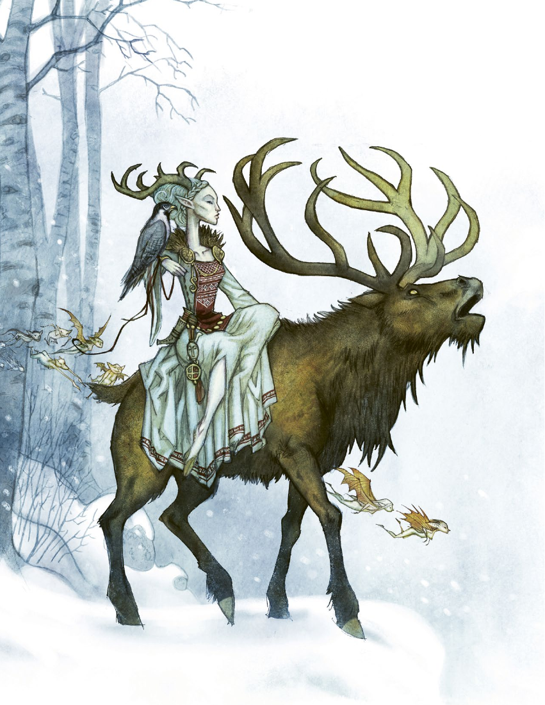

# 第 8 章：自在之物

[返回总目录](README.md) · 原始 PDF 第 114–173 页

## 本章目录

- [自在之物与人类](#section-01)
  - [自在之物的本质](#section-02)
  - [自在之物在哪里？](#section-03)
- [魔法力量](#section-04)
  - [妖术](#section-05)
  - [咒术](#section-06)
  - [精类魔法](#section-07)
  - [玩家角色使用魔法的情形](#section-08)
- [对于自在之物的规则](#section-09)
  - [自在之物的特性](#section-10)
  - [放逐自在之物](#section-11)
  - [失传之秘](#section-12)
  - [物理攻击](#section-13)
  - [特殊能力](#section-14)
  - [魔力物品和魔法物品](#section-15)
- [自在之物图鉴](#section-16)
  - [灰树夫人](#section-17)
  - [溪中之马](#section-18)
  - [教堂守护兽](#section-19)
  - [仙灵](#section-20)
  - [鬼魂](#section-21)
  - [巨人](#section-22)
  - [林德龙](#section-23)
  - [梦魇怪](#section-24)
  - [美人鱼](#section-25)
  - [死婴灵](#section-26)
  - [水乐灵](#section-27)
  - [黑夜渡鸦](#section-28)
  - [田舍侏儒](#section-29)
  - [恶灵](#section-30)
  - [海妖蛇](#section-31)
  - [妖虫](#section-32)
  - [特洛精](#section-33)
  - [维提尔](#section-34)
  - [狼人](#section-35)
  - [鬼火](#section-36)
  - [林中女士](#section-37)
- [非玩家角色](#section-38)
- [动物](#section-39)
- [世界各处的自在之物](#section-40)
  - [决定来源](#section-41)
  - [选择一个参考样本](#section-42)
  - [创造一个自在之物](#section-43)

<!-- 来源：北欧奇谭规则书.pdf；PDF 第 114 页；原书第 110 页 -->

<!-- 来源：北欧奇谭规则书.pdf；PDF 第 115 页；原书第 111 页 -->

我们洒在马厩屠宰场的肥料发挥作用了。当夜幕降临，村里的人和牲畜都入睡了，而我们躲进了干草垛里。门开了，满月之光预示着某些东西的到来。如果不是因为它那马一般的体型，且像人一样用爪子关门，我们很可能就把他错认成普通的狼。在黑暗笼罩我们之前，我们可以看到它黑色的毛。我们，和一只狼人同困一室。住在附近的埃伯哈尔特医生告诉我们，狼人已经在这片区域游荡了数百年之久。在过去，村民们习惯于崇拜狼人，并用鲜血献祭给它们，随着当地火车站的落成，这片土地的与世隔绝被打破了，往日的习俗被遗忘了。埃伯哈尔特医生给我们看了他项链上挂着的一个铜铃——他说，敲响铜铃就是消灭狼人的唯一办法。

我心跳加速，双手颤抖着点亮了油灯。狼人就在我们的下方，他直勾勾地盯着我们，嘴里还填满了内脏。在我的右边，海德薇猛地一跳，转身尖叫着奔向了我们身后的黑暗。而左边的安德斯侧着身子，他倚在我们用七只圣钟搭建的钟架上，开始用小锤子敲铜。狼人的嘴上挤出了一个扭曲的笑容，毫不费力地跳上阁楼，落在我们的面前。安德斯还在敲钟，但什么事都没能发生。然后我注意到狼人的项链，上面分明挂着一个铜铃。在这个怪物的眼睛里，我看到，埃伯哈尔特医生在凝视着我。

这章描述了自在之物以及它们的秘密。倘若你是玩家而不是 GM，这就是你不该阅读的部分。这章以及之后的内容是只允许 GM 看的。

这章一开始就解释了为什么自在之物存在于世，以及它们与人类之间的关系是什么样的。这些信息必须尽最大限度地向你们的玩家保密，否则会让游戏玩起来不那么神秘有趣。这段文字紧接着描述了自在之物的本质，并举一些可能遇到的情形为例。

而下一节则提供了自在之物可以使用的魔法规则，这些规则可以影响谜题所发生的区域，也可以用来攻击玩家角色。这里还有有关于自在之物的规则和特征，以及如何处理它们与玩家角色之间冲突的信息。此外，我们还提供魔法物品规则（以及其援例），它们不仅能被自在之物使用，也可以被期望凭此自我防护的人类使用。

但最重要的是，本章详细介绍了 21 种人类在斯堪的纳维亚半岛可能遇见的自在之物。以下是这些生物的一些例子，但并非所有现存生物毫无遗漏的清单。关键是，你可以为此受到启发，根据埃格尔克兰斯的《自在之物：北欧民俗中的精怪》一书，或者从其他来源得到灵感，创造你自己的自在之物——甚至你可以独立创作你的原创生物。本章的最后还介绍有关非玩家角色和动物的规则。

<!-- 来源：北欧奇谭规则书.pdf；PDF 第 116 页；原书第 112 页 -->

## 自在之物与人类

数千年来，自在之物和人类共处世上，亦敌亦友。但不论人类还是自在之物都并不知晓这份关系的实质。它们依赖于人类的信仰，并被人类的信仰塑造——如果人们停止相信它们的存在，它们会变得虚弱，也许甚至不复存在。几乎没有自在之物和人类知道这点；玩家的角色（以及玩家本身！）在刚开始游玩时一定不知道这点。在遇见许多自在之物和解决许多斯堪的纳维亚半岛的谜题之后，角色可能会开始怀疑真相，但他们的怀疑是绝不会被以任何方式证实的。

自在之物会因人们相信的事物而变化、涌现乃至衰亡。它们可以以恶魔或者天使的形式出现，也可以改变并追随人们去城市，以其他形态存在。如果村庄中的人们怀疑新掘的矿井会引起山中特洛精的滔天怒火，这座山就将为特洛精所据。尽管它们在那以前从未居住在那儿，但无论人类还是特洛精，他们都会认为早在记忆可溯的久远年代便是如此。

这种对信仰的依赖意味着自在之物在很大程度上也受社会发展影响。十九世纪，当人们离开村落，开始在城市的新生活时，他们也放弃旧信仰，投向基督教或者都市传说。或者所有的这些都不相信。启蒙运动的新思想和大学传播的知识正在铲除古老的真理，因此，自在之物正在斯堪的纳维亚半岛上消失，或者说，最好的结果就是转变为能延续到下个世纪的事物。

尽管他们并不明白发生了什么，但斯堪的纳维亚半岛的自在之物们感觉在被攻击，或者遭受暴露。他们当中的一大部分将怒火指向一些有形且具体的目标——杀害铁路工人、摧毁工厂和教堂。另一部分则潜入荒野，抵达无人之地。这部分生物将很快不复存在，或是被吸引回人类社会。

当人类与自在之物之间的平衡感被扰乱时，老盟约和旧传统步入终结。薪火相传的知识不再可靠。许多自在之物因发狂而残暴，或是笃信它们必须通过攻击人类来自我保护。

玩家们拥有灵视，并且能够接触到几个世纪以来协会图书馆里积累的海量知识。这使他们有能力去保护那些可能为这些生物的怒火所戕害的人们。

### 自在之物的本质

斯堪的维纳亚半岛的自在之物与大自然有着明显的联系。他们生活在森林中、水道里和山顶上，许多可<!-- 来源：北欧奇谭规则书.pdf；PDF 第 117 页；原书第 113 页 -->以变身动物。他们倾向于远离城市，但偶尔也会追随离开村庄的人们来到靠近工厂和精神病院的位置定居。一部分自在之物相信自己与魔鬼结盟，也有一些认为它们为上帝效劳。

<!-- PDF 第 116 页侧栏：仅限GM -->

#### 仅限 GM

这一章节的下文仅为 GM 而准备，如果你是普通玩家，应止读于此。

<!-- PDF 第 116 页侧栏：上帝和魔鬼 -->

#### 上帝和魔鬼

在游戏里并没有确定上帝和魔鬼是否真的存在。一些自在之物认为它们从地狱里被派来，长得像是恶魔一样，相信撒旦的力量正在通过它们发挥效用。其他一些自在之物相信他们是上帝的仆从。

基督教的符号对很多自在之物都能起到恐吓甚至致命的影响。它们和人类都相信这会发生，所以它就发生了。同理，一些玩家角色也许是教徒，并会将与自在之物的战斗视为向神履行某种义务，由此他们能从信仰中汲取力量；而其他人则是科学家，想要从研究自在之物中更好地理解这个世界。不论上帝和魔鬼是否存在，这都不会影响到你们的谜题。

只有星期四之子能总是看见自在之物——而对于其他人，自在之物是隐形的，除非它们自愿显露身形。但不论是否可见，它们的行动都会留下可感知的迹象。如果人们忧心留意，他们也能够发现它们存在的踪迹——比如房子内莫名其妙窜过的气流，新盛的花朵突然的凋谢，或者家猫意外的嘶声以及尖叫。

自在之物生性骄傲，常常近乎高傲，当被忽视或被苛待时，它们会相当生气。然后会不择手段去报复，而不考虑通常作为人类行为特征的道德。尽管很少破坏协定，但它们会通过延伸和重新诠释先前所商定的条款和义务去获取他们想要的东西。

除了人类的世界以外，自在之物还能够进入一个奇妙的世界，在那儿有位于地底的或不同真实世界的怪异领域。它们能开辟通往特殊处所的道路；其中一些可以扭曲时空，创造新生命，使人类返老还童或者变形。一些自在之物群居生活，另一些则离群索居，但不论如何它们都很少侵犯彼此的领地。

<!-- PDF 第 117 页侧栏：自在之物的种类 -->

#### 自在之物的种类

尽管每一种自在之物都是独一无二的，但如果试图去分类的话，可以如下所示：

- 自然精灵是类人生物，往往类似于特洛精、维提尔、巨人、美人鱼、树妖、木妻、水乐灵、溪中之马、田舍侏儒、灰树夫人以及仙灵。

- 造物是通过魔法制造的，通常认为它们在某个意义上与恶魔有关。这包括妖虫以及其持有者。

- 变形者是那些能够变成动物以及怪物的人类。这包括狼人、梦魇怪以及女巫。

- 死者的灵魂是依旧徘徊在生者世界的人们。包括鬼魂、恶灵、死婴灵、鬼火。

- 怪兽是那些比起人类更像动物的自在之物。通常包括林德龙、海妖蛇、海妖克拉肯、地狱散播者以及教堂守护兽。

<!-- 来源：北欧奇谭规则书.pdf；PDF 第 118 页；原书第 114 页 -->

### 自在之物在哪里？

自在之物不仅在荒野和乡村中格外常见，城市的贫民窟也同样如此。以下是四个可能会遇到自在之物的地方。

#### 福斯马克的铁匠铺

在位于斯德哥尔摩北部海岸的福斯马克的溪边一直有铁匠。几个世纪以来，都是林德家族经营这个铁匠铺，而现在由艾达·林德和她繁多的儿子女儿负责。村民们远道而来委托他们的服务。

据说，在某些夜晚，为了使金属软且有韧性，铁匠铺里艾达会利用月光而并非火焰来锻造，人们相信这些由月光冶炼而成的物品比起那些白日制造的物品更美丽且更耐用。

当地人最近注意到福斯马克的铁匠铺昼夜运转。在铁匠铺四周，一切动植物凋亡，溪水化作黄褐，而无人见到过艾达和她的孩子们离开铁匠铺。

真相是大约一百年前艾达的祖父在溪里抓住一只妖虫。据说，这种长得像是昆虫的生物与魔鬼为伍，会带来绝佳的礼物，以换取它第三个主人的灵魂。这些年来一直是妖虫让福斯马克的铁匠铺锻造出出色的产品。

当艾达从她的祖父手中继承这只生物时，她成了它的第三个主人，也正是因为这个原因她遭受了诅咒。这个生物相信它是被魔鬼派来的。它以黑暗魔法掌控这个家族以及他们的铁匠铺，命令他们锻造黑色的长锁链，这将被带往死者国度在地狱使用。

拯救林德家族的唯一方法是将妖虫浸入教堂的洗礼池里，并让教堂的钟声响彻通宵。这个生物就会消融水中。但妖虫不会让这发生的。如果玩家角色尝试去拯救这个家族，它会操控附近村庄的人来攻击玩家角色。

#### 库尔金内瓦的草地

众所周知，在芬兰西部库尔耶内瓦附近的一片森林中，有一片盛开美丽花朵的草地。这片草地并不会疯长到杂草蔓生，尽管从未被放牧或修剪过。在最明亮的夏夜，少年们带着花环和蜂蜜罐，在那儿聚集。蜂蜜倾倒在地上，男孩和女孩们为彼此讲故事，直至他们在草地上沉沉入眠。那些对未来怀揣甜美梦想的人将目睹梦成真。现在，睡在草地上的那几个年轻人都宣告失踪了。

一个衰老的仙灵爱上了少年少女们的青春，并把其中一些人带到了森林深处，她的名字叫做斯基特海夫特。她让他们住在她的树丛城堡里。他们侍奉她用餐的时候，她会窃取他们的青春。

解救这些少年人的唯一办法是用蜂蜜制成的巫师圈把斯基特海夫特引到草地上。然后必须把她困到一个涂有糖浆的玻璃瓶中，一直关到她肯放走这些孩子才行。

#### 伊森瓦德的弗里德赫姆城堡

许多年来，弗里德赫姆城堡一直被遗弃在丹麦日兰半岛伊森瓦德附近的树林里。在白日，它无人问津，到处充斥蛛网和污垢。而夜晚降临时，城堡里却举办起舞会——年轻的人们在乐曲声中欢歌纵舞，仆人们提供葡萄酒和食物，墙壁上挂着华贵的画作。

近百年前居住在这座城堡里的克洛耶尔家族有虐待癖。每到夜晚，仆人们被驱赶到阁楼，被捆绑在天花板的巨大横梁上，家族成员则对他们施虐。

当克洛耶家族病死在霍乱时，所有成员作为恶灵复活。如今，在夜间他们向城堡丢夜光球引诱客人，并吸光他们的生命。随后死者灵魂被带回来在舞会上跳舞和在阁楼上受苦。最近，有几个商人在城堡附近失踪了。驱逐恶灵的唯一方法是带着斧头或锯子到阁楼上把横梁劈砍成两段。

<!-- 来源：北欧奇谭规则书.pdf；PDF 第 119 页；原书第 115 页 -->

#### 巴马科的洗衣房

在某个早上，靠近挪威的城市特隆赫姆附近，一位妇女在洗衣篮里发现一个新生儿。她意识到这是特洛精的孩子，打死它并弃尸入水。自那日起，所有在那间洗衣房里清洗过的衣服都会被鲜血染色。除此之外，该地区的几个新生儿也宣告失踪。当地人认为是住在附近帐篷里的一伙流浪者绑架了，并且盘算着自己复仇，烧掉这座营地。

真相是特洛精们正在绑架人类孩童，来寻找一个足够漂亮又聪明的幼儿，以弥补被洗衣妇杀死的那个。但是没有人类婴儿足以与特洛精的孩子媲美。安抚特洛精的唯一办法是找到那个特洛精之子的尸体，并且将其埋葬在它出生的沼泽地里。

## 魔法力量

自在之物能够获得魔法力量，来攻击敌人、恐吓人们以及扭曲现实。作为 GM，你应该利用它们的能力来渲染氛围，以及赋予你的谜题危险意味。

有三种种类的能力：妖术、咒术和精类魔法。一部分自在之物同时拥有所有种类，而其他的自在之物可能只拥有其中一种或者两种的魔法。它们也可以有某种特定的能力，比如高速移动的能力。

自在之物能以多种方式运用这些魔法，它们能说出效力词、咏唱咒语、撒出魔法粉末、熬制魔药或者是呼唤天堂或地狱的力量。通常来说，玩家角色仅能受魔法影响，而不能见到魔法的施展。

咒术或者精类魔法在战斗中可以作为缓慢动作使用。施法者必须能够看见或者通过其他方式感知到玩家角色。然后，玩家角色可以用一个快速动作来抵御魔力。如果她不这么做，施法者只需要一个成功让魔法生效。

施法距离是 0-1。在战斗中，咒术和妖术往往会持续超过一个场景，甚至更长的 1D6 轮。每一轮，玩家角色可以用一个快速动作抵御魔力。如果这成功了，魔法会被撤销。

<!-- PDF 第 119 页侧栏：选择魔法 -->

#### 选择魔法

对于不同种自在之物的描述具体说明该生物能够使用的魔法类型。不过，记载里没有提到任何具体的妖术、咒术或者精类魔法。什么样的魔法最适合这个谜题完全取决于作为 GM的你。你可以在策划谜题时就想好，或者是在跑团过程中再决定。

<!-- 来源：北欧奇谭规则书.pdf；PDF 第 120 页；原书第 116 页 -->

### 妖术

妖术是影响某地以及生活在该地的人们的魔法，有时候也对玩家角色有效用。也许村子被浓雾笼罩，也许食物开始在角色眼前腐烂，或者可能是村庄里的井水变作鲜血。妖术的主要功能是渲染氛围。

超自然生物们施展妖术的成功与否不需要掷骰检定——这会自动成功。被妖术影响的玩家角色必须通过恐惧值为 1 的恐惧检定，极端情况下可能需要更高恐惧值。妖术通常只持续一个场景，但你可以根据自己的需要自由延长持续时间。

GM：你们所坐的那桌开始摇晃，酒瓶倾倒，盘子里的食物颤动着，其余客人焦虑地交换眼神。

玩家 1（卡斯帕·斯塔尔）：我起身大喊：“我不会给你的这些小伎俩吓住的！”

GM：变故随即发生——一些客人跌倒在地并且痛苦地哀嚎起来。你们当中的每个人都必须进行一个恐惧值为 1 的恐惧检定。

### 咒术

咒术是一种魔法，自在之物能用它攻击玩家角色。它可以被远距离释放，这种情况下玩家角色可能不知道超自然生物在哪儿，或是作为战斗场合里中的武器。为了让魔法成功，超自然生物必须在对抗检定中成功——它的魔力和玩家的观察、警觉或者力量对抗。在每个咒术边上会具体注明玩家对抗所必须使用的技能。玩家角色可以加骰，但超自然生物不可以。

为了让咒术成功，超自然生物必须比玩家角色骰出更多的成功数。在每个咒术边上会写上它检定成功的效果。额外的成功往往会导致玩家角色承受负面状态。

如果超自然生物和玩家角色骰出了相等的成功数，通常无事发生，除非玩家角色感觉到某人正在试图施加影响或者利用非凡手段攻击他。

如果玩家角色掷出的成功数更多，他赢得了对抗，不仅只抵御住了魔法，甚至说对自在之物占上风。具体意味什么取决于你——也许他在他的目睹自在之物的恐惧检定上得到一个自由成功，或者是也许在未来的技能检定里获得一个额外骰。另外两个可选项可以是，他得到能揭露部分谜题真相的灵视能力，或者他治好了一个负面状态。

一些咒术影响多个玩家角色。每个玩家角色必须单独掷骰，而超自然生物只骰一次。一些咒术有特定要求：超自然生物可能得偷走玩家角色的一绺头发，或者得物理距离上靠近他们。

咒术持续一个场景，除非另有说明。在战斗里施放咒术需要一个缓慢动作。

GM：正当你们准备回屋与其他人汇合时，你的手悬停在半道，止在门把手前。念头闯进来，他们要远比你们厉害多了。这一念头像一柄巨锤砸在你脑海里，你是个又胖又蠢的恶心懦夫——他们根本不乐意带你这家伙拖后腿。

玩家 3（伊尔金卡·普罗科特因）：我试图不尖叫出声，我能抵御吗？

GM：进行观察检定。我为魔力掷骰。

<!-- PDF 第 120 页侧栏：魔法不是竞赛 -->

#### 魔法不是竞赛

魔法的力量不是用来击败或者消灭玩家角色的。它们是创造精彩故事的工具。用之要适度。利用它们揭示特殊生物们的存在，借此透露它们的真实身份。

<!-- 来源：北欧奇谭规则书.pdf；PDF 第 121 页；原书第 117 页 -->

### 精类魔法

精类魔法是一种魔法，通常由特洛精和仙灵使用，与扭曲时空以及通过不同方式改变现实有关。当用于奠定基调以及创造某种氛围时基本上和妖术流程相同，譬如村民变成猫或者是每晚回溯时间。自在之物的检定会自动成功，而玩家角色承受效果后进行恐惧检定。

当精类魔法用于攻击玩家角色，譬如将他变成一只猪或者把他缩小成茶匙大小，就像是咒术一样运作。超自然生物使用魔力发起一个对抗骰，而玩家角色必须通过技能检定来抵抗这个效果。超自然生物必须骰出比玩家角色更多的成功数来确保魔法成功。

GM：正当你下床准备去用马桶时，你的身体开始颤抖。感觉就像被电了。进行力量检定。我为魔力掷骰，并且获得一个成功。

玩家 2：我一个成功都没有！

GM：整个房间延展开来包裹你。你的床变得庞大。马桶大得就像一座教堂。你被缩到了一只甲虫那么大。有人在敲你的房门，那对你来说听起来无异于惊雷霹雳。

<!-- PDF 第 121 页侧栏：故事首位 -->

#### 故事首位

魔法规则为诠释力量效果留下了充分的空间。譬如，可以用多种不同方式影响一位视野被扭曲的玩家角色。你和你的团队应有意地依照合理性和趣味性来诠释故事。

记住，GM 不该将他的玩家以及他们的角色视为须击败的敌人；游戏的重点是一同创造故事——一个所有人既是参演者也是观众的故事。这并不意味着你不应该将玩家角色置入困境或者危及生命的情形。你的任务是利用魔法——以及游戏里的其他规则——来做对于游戏合理和有趣的事。由此玩家角色既会陷入麻烦，也会有机会摆脱困扰。

<!-- 来源：北欧奇谭规则书.pdf；PDF 第 122 页；原书第 118 页 -->

### 玩家角色使用魔法的情形

在特殊情况下，玩家角色可以获得魔力技能，比如，从妖虫或者魔杖。魔法源提供一个技能值以及一个或者多个妖术、咒术或者精类魔法咒语。当玩家角色为魔力掷骰时，不能加上属性加值。这个技能不能被经验点提升。

魔力计为一个缓慢动作。可以因有关精神的状态加骰。

魔力通常需要某些形式的习俗或者韵文。

<!-- PDF 第 122 页侧栏：妖术 -->

#### 妖术

妖术可能包括：

- 动物入侵

- 使动物生而残疾

- 动物狂奔

- 失明（NPC 失去视力）

- 基督教的象征物损坏

- 命令动物

- 远去者沟通术（与灵魂类和不死生物类的自在生物通过言语、尖叫、气味、写作或幻象交流）

- 黑暗术

- 扭曲视野（NPC 看到的不是真实存在的东西）

- 干扰（NPC 被恐怖的闹鬼幻象所困扰 )

- 地震

- 魔法睡眠（折磨所在地的 NPC）

- 奴役术（NPC 变成不会思考的奴隶，可以用来攻击玩家角色）

- 雾

- 食物或饮料变形或腐烂

- 白色海面术（水上的磷光）

- 沉默（NPC 会失去说话的能力）

- 噩梦（一个或几个玩家角色被噩梦所困扰）

- 植物入侵

- 植物枯死

- 唤起死者

- 塑造石头或木头

- 传播疾病

- 风暴

- 恐怖预兆

- 饮用水中充满蝌蚪（NPC 会吐出青蛙）

- 地面变成沼泽

<!-- 来源：北欧奇谭规则书.pdf；PDF 第 123 页；原书第 119 页 -->

<!-- PDF 第 123 页侧栏：咒术 -->

#### 咒术

咒术可能包括：

- 致命严寒（力量）：玩家角色被极度的寒冷袭击，造成 1 点伤害，额外的成功骰会增加额外的肉体伤害。

- 迷魂术（观察）：该生物控制玩家角色的行动。额外的成功会造成精神伤害。受害者不能被迫伤害自己。有些生物需要获得属于玩家角色的道具才能使他陷入痴迷。你要么在接下来的场景中控制玩家角色，要么通过笔记或秘密对话指导玩家角色必须如何行动。

- 恐惧术（恐惧检定）：玩家角色受到幻象、思想、气味或其他感官上的折磨。所需的成功骰数量取决于生物的恐惧值。

- 狂宴术（警觉）：玩家角色被一种强烈的欲望所控制，想要派对和自我放纵。额外的成功会造成精神伤害。影响所有玩家角色。

- 火焰咒（力量）：玩家角色身上着火。身体的一小部分会燃烧起来。额外的成功骰会使火势提高（第 70 页）。

- 感染（力量）：玩家角色染上一种可怕的疾病，造成 1 点伤害。额外的成功骰会造成额外的肉体伤害。这种疾病必须用医学检定治好。该生物可能需要玩家角色的毛发或皮肤，如果这些毛发或皮肤被摧毁，疾病就会自愈。有时则必须驱逐该生物才能治好。

- 跛行术（力量）：玩家角色无法行走。额外的成功骰会造成额外的肉体伤害。

- 吸引术（警觉）：玩家角色会不自觉认为自己必须接近怪物，并会尝试使用暴力或诡计来突破任何障碍。额外的成功骰会造成精神伤害。

- 沉默术（力量）：玩家角色无法说话。额外的成功骰会造成额外的肉体伤害。

- 夜惊术（观察）：玩家角被严重的噩梦惊扰。在接下来的场景中他不能被唤醒，并受到 1 点精神伤害。额外的成功骰会造成额外的精神伤害。只能用于睡着的玩家角色。

- 引诱术（观察）：玩家角色被生物吸引。额外的成功骰会造成精神伤害。

- 自厌术（观察）：玩家角色会厌恶或嫌弃自己，并且无法停止思考这个问题。额外的成功骰会造成精神伤害。

- 睡眠咒（力量）：家角色陷入睡眠且无法被叫醒。额外的成功骰会造成精神伤害。那怪物一定在受害者的卧室里放置了某个东西。如果该道具被拿走，玩家角色就会醒来。

- 怪人咒（观察）：玩家角色的某种东西会让周围的人不喜欢他、伤害他甚至赶走他。每一个额外的成功骰都会让效果再持续一个场景。怪物必须先取得属于玩家角色的某个物品，取回物品就能驱除诅咒。

- 扭曲幻象（警觉）：玩家角色会对现实的体验与他人不同。他可能会把村民看成是怪物，或是认为他的朋友们被自在之物取代了。额外的成功骰会造成精神伤害。

- 重伤咒（力量）：玩家角色身上出现一个伤口，造成 1 点伤害。额外的成功骰会造成额外的肉体伤害。

<!-- 来源：北欧奇谭规则书.pdf；PDF 第 124 页；原书第 120 页 -->

<!-- PDF 第 124 页侧栏：精类魔法 -->

#### 精类魔法

精类魔法可能包扩：

- 年龄变更术（力量）：一个或多个人变得年老或是年轻。额外的成功骰会造成精神伤害。GM决定这能影响 1 个还是多个玩家角色，以及这是临时变更还是永久性。如果这种改变时永久性的，GM 应提供线索，让玩家角色通过追踪自在之物或执行奇异的仪式来来恢复原先的年龄，这最好作为一个独立的谜题。

- 局部兽化术（力量）：受害者的身体有一或两个部分变成动物的部分，如驴的耳朵或猪的尾巴。额外的成功使转化加剧。

- 活化死物（恐惧检定）：活化无生命的物体，并让物体受施法生物控制。这有时可能需要玩家角色进行恐惧检定。原本无生命的物体可以在战斗中视为士兵，数值参照本章末尾表格中列出的某一动物，根据士兵的形体和大小选择一种动物。

- 舞蹈术（观察）：受害者被迫跳舞，直到音乐停止。额外的成功骰会造成精神伤害。影响一个或多个玩家角色。

- 巨化魔法（力量）：受害者的尺寸变大到一个屋舍或巨人的尺寸。每一个额外的成功骰延长一个场景。GM 决定它影响一个角色还是多个角色。

- 混乱思想（警觉）：受害者的思想互相搅拌，他们必须通过一个恐惧等级 1 的恐惧检定。额外的成功骰会导致精神伤害。对所有玩家角色有效。

- 阻碍术（力量）：受害者不能越过某一点或向某一方向移动。每一次额外的成功都会延长一个场景的持续时间。GM 决定时影响一个或多个玩家角色。

- 迷恋术（观察）：受害者会深深地迷恋了另一个人。每一次额外的成功骰都会延长一个场景的持续时间。

- 缩小魔法：受害者缩小到昆虫大小。每一次额外的成功都会延长一个场景的持续时间。GM决定它是影响一个还是多个玩家角色。

- 时停术（观察）： 特定时间内的区域依然如常。这意味着，其边界外的一切都在陷入了时间冻结，同时其他的一切都陷入了衰老，或者陷入了同一天的无限循环中。玩家角色必须杀死或驱逐施法生物，或者让它收回精类魔法以使一切恢复。如果时停术是用于攻击玩家角色，它可能会陷入时间静止，无法移动，但也能面意伤害和其他效果。

- 传送术（力量）：某物或某人被传送到另一个地方。额外的成功骰可造成精神伤害。影响一个或多个玩家角色。

- 思想病毒（观察）：一个坚定的信念在人群中传播，就如这是真相一样。额外的成功骰会导致精神伤害。这会持续到谜题结束或者怪物死亡。会影响所有的玩家角色。

- 变化动物（力量）：受害者变成动物，同时保留他们的心智水平。该生物必须在玩家角色 10米之内，在战斗轮中则需要位于同一区域内。

<!-- 来源：北欧奇谭规则书.pdf；PDF 第 125 页；原书第 121 页 -->

## 对于自在之物的规则

除了它们的魔法力量，自在之物还能发动物理攻击和使用魔法物品袭击与影响玩家角色或者 NPC 们，这会在这一部分里更详细地描述。

首先，值得一提的是自在之物并没有属性和技能。在冲突中，他们会使用这四个数值：伟力、控体、魔力和操控人心。数值大小意味着掷骰数。它们不能加骰。记住当自在之物攻击或者影响 NPC 们的时候你无需掷骰，在这种情况，你决定发生了什么。

自在之物也会有第五个特性：恐惧。当玩家角色首次目睹这个生物时候，他们必须和这个数值进行一次恐惧对抗检定（第 68 页）。下一次他们见到这个生物时，他们就知道可能会发生什么，而无需进行恐惧检定。恐惧值0意味着角色见到它时无需进行恐惧检定，哪怕他们从未碰到过。

有些极为恐怖的自在之物会始终令人畏惧。它们有两个恐惧值——一个在玩家角色首次见到它们时使用，另一个则在用在后续遭遇里。比如，一个这类的超自然生物恐惧值为 3/1，恐惧值 3 在初次遭遇里使用，而1 在后来的遭遇里。

在战斗中，自在之物每个回合有一个缓慢和一个快速动作，除非其他明确注明的情况。它们抽卡决定战斗次序，就像玩家角色一样。一些自在之物有着某种形式的防护，就像护甲。

当自在之物受伤承受状态时，它们并不单独区分精神和肉体状态，而是计算针对它们的特殊状态。

自在之物的状态列出在第 124 页至第 164 页的描述里，使用时应该从上往下打勾。超自然生物的当前状态决定它的骰子调整值，并且不与前一状态叠加。调整值影响前四个属性，但不影响恐惧。每个状态都会为主持人提供超自然生物会如何行动的建议。正如玩家角色，只要你的自在之物没崩溃，你始终该至少投掷一个骰子。超自然生物崩溃的情形如何，依不同生物而不同。一旦自在之物被破坏的具体效果出现，该生物治好所有状态。超自然生物也会在它们单独呆上很长一段时间，不受玩家角色的威胁的时候，治好全部状态。

### 自在之物的特性

每个自在生物会有五个特性：

- 伟力用于攻击、抬高重物或者是抵御烈火以及其他种类的伤害。

- 控体用于闪避攻击、追追、逃逸、偷窃物品、潜行以及侦破潜行。

- 魔力用于施放以及抵御魔法力量。

- 操控人心用于欺骗或者说服玩家角色，或者是识破他们的谎言。

恐惧用于玩家首次目睹该生物的情形。这个特性意味着玩家角色想要通过恐惧检定而不为此恐慌时所需的成功数（第 68 页）。一些超自然生物会一直很吓人，哪怕并非首次遭遇；它们会拥有第二个恐惧值，这会用在后续的该生物遭遇上。

<!-- PDF 第 125 页侧栏：战斗中的自在之物 -->

#### 战斗中的自在之物

自在之物并不是一直在攻击，直至玩家崩溃的嗜杀怪物。它们通常会避免肢体冲突，直到别无选择，被置身于只能反击的情形。如果可能，自在之物会用魔法远远地去攻击玩家角色，尽可能不暴露他们所在的位置或藏身之处。试图通过战斗击败自在之物的玩家角色会发现它们通常相当危险。通常可以通过分散注意力、欺骗或不引起它们注意来避免战斗。

<!-- 来源：北欧奇谭规则书.pdf；PDF 第 126 页；原书第 122 页 -->

### 放逐自在之物

自在之物可被放逐、束缚、杀死或者催眠。仪式具体取决于自在之物的种类，甚至同种自在之物的不同个体都不同——能通过归还他们的银制宝物来安抚一群特洛精，而另一群必须通过在他们的巢穴里放进尖钢棒才能驱除。一个受冒犯的仙灵在感到满意前也许不会离开，而另外一个哄骗村民达成协议的仙灵可能只能被骗走。

在进行仪式时，玩家无须掷骰——他们只需要描述他们的角色在做什么，如果他们正确操作，仪式就会成功。在战斗中，你必须决定完成仪式需要花费几轮。

仪式会在结束的瞬间即刻生效——超自然生物会消融在空气中，或者陷入沉眠，或者被迫离开。它留下来的所有魔力效果都会被破坏。

### 失传之秘

人们相传如何驱除自在之物的故事，往往只是部分准确。仪式的重要部分缺失了。对于每个自在之物，都有一个记载失传之秘的文本框。里头的细节会拓展和复杂化仪式。知道这些后，你能够提供一些线索，来揭示一些有关于某类自在之物如何被放逐的基本知识；譬如，玩家可能被允许去阅读有关某个具体自在之物在约翰·埃格尔克兰斯书中的记载。之后，玩家角色也许会得到一些能够深化他们知识的线索。

这取决于你，是否想在谜题里使用失传之秘。一些团认为这会让放逐自在之物变得太过困难，而另外一些人认为这会增添层次感。

### 物理攻击

物理攻击是超自然生物在战斗中造成伤害的一种方式。可以是林德龙喷射酸液的能力、狼人的爪子或者是田舍侏儒的蛮力。

### 特殊能力

一些自在之物有特殊能力。可能是飞行或者变形的能力，或者是增加在战斗中的动作数，也可以是抽两张先攻牌且选走里头最好的一张。一些超自然生物甚至能抽两张先攻牌并且每轮行动两次，意味着它每轮能进行两个缓慢动作和两个快速动作。

### 魔力物品和魔法物品

魔力物品是指乡下习俗中，用来保护自己免受自在之物伤害的物品。玩家角色可以在神秘事件中找到它们或在他们的大本营中制造它们（参见第 6 章）。使用魔力物品时需要投进行一个 1D6 的骰子，如果结果为 1.，那么物品就会损坏，耗尽或是停止运作。

魔法物品是自在之物拥有和使用的物品。在驱逐自在之物后，玩家有可能会发现该生物留下的物品。然而对于玩家角色而言，使用这些物品都是伴随着风险。当玩家角色使用魔法物品时，需要投一个 1D6 的骰子。结果为 1 则代表玩家角色承受负面效果。具体请参见下文的魔法物品中的风险一列。自在之物可以毫无风险地使用它们拥有的魔法物品。

下一页的两个表格中包含了魔力物品和魔法物品，它们是可能出现在神秘事物中的例子——它们并不是所有物品的详尽列表。当你创建自己的物品时，用这些清单作为灵感。

<!-- 来源：北欧奇谭规则书.pdf；PDF 第 127 页；原书第 123 页 -->

<!-- PDF 第 127 页侧栏：魔力物品 -->

#### 魔力物品

| 物品 | 效果 | 描述 |
| --- | --- | --- |
| 仙灵十字 | 在对抗精类魔法时防御+2 | 一套九种的护身符，需要在三个连续的星期四之夜打造。 |
| 银制子弹 | 可以杀死特定的自在之物，至少造成1点伤害。 | 银制的弹药。 |
| 圣经 | 在恐惧检定中，把你的启迪技能加在属性上。 | 神圣的经典。 |
| 圣水 | 使用启迪检定对抗不死生物的魔力，以暂时驱赶它们。 | 受祝的水。 |
| 特洛精十字 | 抵抗来自特洛精的咒术时+2 | 弧形的吊坠 |
| 长柄镰刀 | 抵抗来自梦魇怪的咒术时+2 | 高悬于卧室门上的长柄镰刀。 |
| 精灵磨坊 | 在精灵磨坊附近抵抗仙灵的精类魔法时+2 | 岩石表面的杯状标记，里满涂满了油脂。 |

<!-- PDF 第 127 页侧栏：魔法物品 -->

#### 魔法物品

| 物品 | 效果 | 风险 |
| --- | --- | --- |
| 海藻气囊 | 水下呼吸。 | 海水渗透。在水下每呆十分钟就会出现一种肉体状况 |
| 水乐灵的 鲁特琴 | 引导人群时启迪+5。 | 无法停止演奏，每小时遭受一次精神伤害。玩家角色会一直演奏，直到她陷入崩溃，或者有人从她手中打掉乐器。 |
| 牡鹿角粉 | 你可以用观察检定来对抗自在之物的诱惑。 | 玩家角色会感到不被爱，并且每小时都会遭受一种精神状态，直到有人成功使用启迪检定对其治疗。 |
| 林中女士的蛇皮 | 变成一条蛇。 | 变形要持续一天。 |
| 门轴 | 发现魔法门。 | 将玩家角色传送到一个充满魔力的地方。 |
| 踪迹之砂 | 追踪自在之物时警觉+3。 | 一个奇怪的自在之物注意到玩家角色并开始跟追踪他 |
| 田舍侏儒的粥 | 一次检定中力量+3。 | 玩家角色激怒了田舍侏儒。 |
| 特洛精之眼 | 使用观察检定在梦中获得线索。 | 一个自在之物进入了玩家角色的梦境。 |
| 魔杖 | 可以使用1个或多个妖术、咒术或精类魔法。获得魔力8。 | 魔杖会断裂且魔法会影响玩家角色。 |

仙灵广场可以穿过锁上的门。

玩家角色最终会出现在其他地方。

<!-- 来源：北欧奇谭规则书.pdf；PDF 第 128 页；原书第 124 页 -->

## 自在之物图鉴

### 灰树夫人

在哈姆龙厄长着我所见过在这一纬度里最高大的梣树。它矗立在教区郊区，周围都是失修的房屋。我很想知道为什么这儿不论男人、女人还是小孩都不看它，也从不靠近它的根系。我花了一天时间才找到答案：那是灰树夫人。——卡尔·林奈，1732 年 5 月 16 日

一些梣树上住着灰树夫人——一种可怖的雌性自在之物，被绑在树上，要求人们在每年特定的时刻供奉祭品。她会纠缠那些破坏梣树的人、传播疾病和扭曲人们的心智。灰树夫人长得像人类女性，同时又具有梣树的某些特征——长长的绿头发、像是树皮一样的皮肤和角装的分杈。她控制那棵树以及周围的整片植被。

#### 特性

伟力 8 控体 10 魔力 10 操控人心 8恐惧值 1/1

#### 魔法力量

- 妖术

- 咒术

- 梣树附近的植被情况反应灰树夫人的心情

- 可以控制植被以及用树枝攻击或包围人们

- 可以使用一个快速动作在与梣树相连的树枝之间高速移动

- 有一个额外动作能被用来凭树枝攻击

- 可以打开在树根体系里的地下通路，用来隐藏或者诱捕掉进地下的人

#### 状态

- □ 这个地区的植被在战栗摇晃

- □ 愤怒 +1（试图诱捕某人）

- □ 谨慎（隐藏自身）

- □ 树汁裂淌 -1

- □ 杀气腾腾 +2

- □ 绝望 -2（树枝断裂，草木嘶嘶）

- □ 崩溃 - 变成落叶，1D6 小时后在梣树上再度出现

#### 战斗

| 攻击 | 伤害 | 射程 |
| --- | --- | --- |
| 爪 | 2 | 0 |
| 树枝 | 2 | 0-4* |
| 围困 | 0† | 0-4* |

* 只在被树和大灌木丛覆盖的区域里。†地面开裂并吞噬一个人。玩家角色必须花费一个快速行动并进行敏捷检定来尝试不被困进去。被围困的角色可以在每个回合里尝试用一个缓慢动作破土而出，这需要一个成功数 2 以上的力量检定。

#### 仪式

杀死灰树夫人的唯一办法是砍伐或者焚毁那棵梣树。

<!-- 来源：北欧奇谭规则书.pdf；PDF 第 129 页；原书第 125 页 -->

#### 冲突范例

- 在丹麦北部的旺萨，一棵灰树夫人厌倦了不被尊重。她对村民施展魔法，让他们把最近在该地区建造的工厂夷为平地，并逼迫他们与她一起在树林里生活。

- 在芬兰南部的斯特龙福斯附近，一群妇女联合起来杀死她们的丈夫，并开始抢劫这个地区的贵族。这些妇女到附近的森林寻求灰树夫人的庇护。灰树夫人保证她们不被发现。一位名叫阿尔瓦·海蒂宁的绅士农场主从图尔库派来“女巫焚毁者”——冷酷的星期四之子，他饮下自在之物的血并且相信这能使他更强大。

- 在瑞典南部的克里斯蒂安斯塔德，一位名叫菲利克斯·拉斯克的有名艺术家，屡次成功画出一棵灰树夫人。灰树夫人给予他看见自在之物的能力，并使他看到越来越多的恐怖景象。她想逼疯他，作为对伐木公司在该地区清除森林的复仇。

#### 失传之秘

在灰树夫人被杀死之前，必须用七根铁钉钉入它的根系。否则灰树夫人也许会离开这棵树，并且占据其它的梣树。然后她很可能会对那些曾尝试杀害她的人寻求报复。

<!-- 来源：北欧奇谭规则书.pdf；PDF 第 130 页；原书第 126 页 -->

### 溪中之马

我从未设想过我会在午夜后仍在泥泞的水池中游泳。但事情发生了，在今晚与奥斯特罗姆夫妇在学院的晚餐之后有一会的事，月光照耀下，一匹洁白的骏马立身于弗里斯河畔的睡莲间。那是场运河上的愚蠢赌局。忽然间，我便发觉自己骑乘着噩梦般的马匹，牢牢攥住这匹溪中之马湿漉漉的背毛，被迫离开乌普萨拉大教堂，穿越萨拉市，经过阿维斯塔的庄园和库尔希坦窑场。天哪，这教人清醒多了。如今看来，我被留在野外，只留下一声嘲弄的嘶鸣作为受害的证据……——卡尔·林奈，1732 年 5 月 3 日

溪中之马是一种骏马——雪白、斑驳灰、漆黑或者在午夜中显现出的荧光蓝。它是牙尖齿利的猎食者，埋伏在溪水与湖泊里。它最大的愿望是指引孩童或者粗心大意的农民迷失在溺人的沼泽里，或者是带他们进行疯狂之乘，离开这一区域。当它们试图把自己伪装成寻常马匹时，通常显得冷静且友好，沿着岸边或潺潺溪水漫步。它想引诱好奇的人类，并且，它的背可以延展出承载数个骑手的空间。在恶作剧后它消隐身形前，人们会听见狡猾的嘶嘶声。

#### 特性

伟力 9 控体 12 魔力 8 操控人心 10恐惧值 0

<!-- 来源：北欧奇谭规则书.pdf；PDF 第 131 页；原书第 127 页 -->

#### 魔法力量

- 妖术

- 咒术

- 可以在水下呼吸

- 可以拓宽背部让更多骑手得以乘坐其上

- 在疯狂之乘里能够高速移动，甚至可以在一两分钟内跨越教区

- 诱惑：可以用它纯洁的外表和嘶鸣声来引诱一个人去驾驭它。这需要一个操控人心与观察的成功对抗。

- 溪谷驭旅：骑手被带到最近的水道上进行疯狂之乘，想下马的话，必须通过一次成功的力量检定来对抗溪中之马的控体来避免遭受 3 点伤害。

#### 状态

- □ 引诱 – 试图让罪人爬上自己的背

- □ 愤怒 +1

- □ 野性不驯 +2 引诱并叼住一个受害者来疯狂之乘

- □ 疲惫 -1

- □ 惊恐 -2

- □ 崩溃 – 化作泥水以及水下植物，1D6 小时后在最近的水道里出现

#### 失传之秘

钢制品，像是钢索绳，能束缚溪中之马暂时听话。高喊“十字架”或“耶稣的十字架”能让它发出令人不寒而栗的叹息声，暂时消失。

#### 战斗

| 攻击 | 伤害 | 射程 |
| --- | --- | --- |
| 啃咬、蹄击 | 2 | 0 |
| 淹没 | 2* | 0 |

* 玩家角色在溪谷驭旅里被拖入水道，每回合受到2 点伤害。额外成功会增加伤害。

#### 仪式

驱逐溪中之马的办法是骑着它穿过太阳十字形的耕地，或者是把它引到刻有六个基督教符记的马厩里——每面墙上刻一个，地板与天花板上再各一个。

#### 冲突范例

- 一个叫做杨的农民在他的马厩里养了一匹特别漂亮的公骏马，从不需要梳毛。只要有缰绳和犁，就能耕种任何田地，通过它他赚了一大笔钱。这匹马其实是一匹被铁制品束缚的溪中之马。但在晚上，农夫会宰杀从附近农场偷来的鸡和牛来喂养这匹神秘的马。

- 一匹有闪光蓝鬃毛的漆黑骏马游荡在达拉纳森林的黑暗沼泽地里，袭击牛群，把当地的孩童引入迷途。最近，有几个年轻人失踪了，而如今在韦萨的水厂旁，厄斯特达尔河里发现了一具溺水的尸体。

- 在鲁斯南河沿岸地区，一匹讨厌的小马引诱饥肠辘辘的穷人、农民和流浪者。它诱拐受害者，带他们在森林和田野中疯狂疾驰，然后把他们丢到远离家乡教区的地方。据说那些孤独又迷茫的流浪者都有相同的故事要讲。

<!-- 来源：北欧奇谭规则书.pdf；PDF 第 132 页；原书第 128 页 -->

### 教堂守护兽

在沿乌梅河上行后，我们抵达了吕克瑟勒。瀑布威胁着要倾覆我们的船只，大雨和蚊子也不断骚扰我们，这把我逼得几乎要发疯。村民们都非常沉默寡言。一个女人声称村子被诅咒了，水里都是蝌蚪，她差不多得喝下烈性酒以免打嗝里突然蹦出一只青蛙。我询问她这种黑魔法的源头。她指着村边那座摇摇欲坠的木头教堂说，那是来自南方的一个英俊的牧师正在惩罚吕克瑟勒的人们，因为他们没把他放在心上。我去看了他。格兰牧师的确是个优雅的年轻人。他站在门口，身后一片漆黑。他问我，我是否认为，从这些粗野的当地人能够中培养出正派的人。当我提到所谓的诅咒时，他立刻变得很暴躁。什么东西从黑暗中走了出来，那是我所见过的最大的狗。它用脑袋蹭着牧师的腿，而猩红的眼睛瞪着我。我意识到，这头猛兽不属于这个世界。也许我真的是被那些该死的蚊子搞疯了，一连几天都睡不着了。——卡尔·林奈，1732 年 5 月 30 日

教堂守护兽是一种看守教堂的自在之物。通过杀死一只动物并将其葬在教堂的墙内，就可以制造出教堂守护兽。大多数教堂守护兽的形态是狗、公鸡、猫或马。这种生物会攻击任何试图伤害教堂或其神职人员的人，从教堂偷东西的窃贼，或者用其他方式亵渎教堂圣地的人。这种自在之物非常凶猛，做法不容情。教堂守护兽能从墓地里唤醒亡灵，让它们以黑鸟的形式出现。在夜晚，亡灵在教堂里徘徊，在村民将死的前一个午夜拉响钟声。

<!-- 来源：北欧奇谭规则书.pdf；PDF 第 133 页；原书第 129 页 -->

#### 特性

伟力 8 控体 8 魔力 8 操控人心 4恐惧值 1

#### 魔法力量

- 妖术

- 咒术

- 能够看见教堂里发生的所有事

- 以狂奔的骏马一样快速度移动

- 抽两张先攻牌并且每轮行动两次

#### 状态

- □ 愤怒的

- □ 着恼 +1

- □ 眩晕 -1

- □ 受伤且变得谨慎 -2（只用一张先攻牌行动）

- □ 愤怒 +2（使用妖术或者咒术）

- □ 崩溃 – 消解成烟气，在 1D6 分钟后才在教堂中重新出现

#### 战斗

| 攻击 | 伤害 | 射程 |
| --- | --- | --- |
| 咬、爪 | 2 | 0 |

#### 失传之秘

通过犯下恶行和亵渎上帝与耶稣基督，就有概率引来教堂守护者。这个自在之物会被激怒并被引到这个地方。通常来说，它会试图通过威胁和武力来消除这一罪恶，但也可能试图说服恶徒放弃干坏事。在这期间，就有可能潜入教堂，找到埋葬教堂守护兽尸体的地方。

#### 仪式

驱逐教堂守护兽最常见的方法是找到埋藏它动物尸体的墙壁，拆开墙，然后焚烧掉尸体。当尸体着火时，教堂守护兽就会尖嚎着消失。这通常会导致要把教堂分割开，或将其夷为平地。

#### 冲突范例

- 乌普萨拉的大主教决定将纳斯比的教堂拆掉重建。纳斯比的教堂守护兽不允许此事发生。因为它的魔法，大主教病倒了。去纳斯比的建筑工们也病了，濒临死亡。

- 尼米四姐妹把伊利维西的教堂作为她们策划杀人抢劫的密谋场所。现在，教堂守护兽正在逐个杀死她们。

- 在挪威南部，海于克利格伦的瑞德法特神父正在利用教堂守护兽来恐吓和掌控当地居民。

<!-- 来源：北欧奇谭规则书.pdf；PDF 第 134 页；原书第 130 页 -->

### 仙灵

我躺在我的旅伴边，在床上打着寒战。他们在夜中惊叫，因为噩梦正侵扰着他们。我们的皮肤布满了水泡，嘴唇发肿像草莓。这些病痛是在去索舍勒的半路上袭击我们的。那晚我梦见自己醒来，床上飞满发光的小东西，它们在树木与岩石飞来飞去，咯咯笑着，用一种不该写下来的方式嘲弄着我。不知为什么，我感觉我被控制着走上一条我白日从未注意过的道路。我们来到广阔无垠的翠绿湖边，从深水中冒出类似鲸鱼的生物，语言是如此匮乏，以至于我难以确切形容。它拉开颚，露出一张填满闪闪发光的财宝的大嘴。这些长着翅膀的小东西催着我走进去，去为自己取得这些财富。我踟蹰不前，它们便拿最粗俗的词骂我。随后，我即刻意识到什么，转身往回走。这激怒了它们。其中一个生物飞到我的脸上，吹出某种尘埃，以至于我咳嗽起来。之后不久，我便从睡梦中醒来，我们都遭了罪。——卡尔·林奈，1732 年 6 月 3 日

仙灵通常成群行事，结伴生活。它们通常以巴掌大会发光的女性形象出现，尽管它们变化成任何喜欢的模样——通常化身作丝缕薄雾、昆虫或者青蛙。男性仙灵被称作精灵，长得就像个小老头。精灵会在仙灵们起舞时演奏乐器，使得人们陷入癫狂，扭曲时间感。

仙灵们喜欢恶作剧。它们以自我为中心，易受冒犯，缺乏人类的道德。激怒它们的人类要么被咬，要么就被染上疾病。甚至当仙灵们心情好的时候，它们也会咬破小孩的手指，吸食他们的血液。仙灵住在土堆里，由仙灵女王或者精灵国王统治。它们在地下河道或者魔力通路里列队起前行。仙灵与动植物联系紧密。

#### 状态

- □ 贪玩 -1

- □ 活跃又恼人 +1（掀起仙尘）

- □ 受冒犯 -1

- □ 暴怒 +1 会使用两张先攻牌

- □ 崩溃 - 化作烟尘或者遁入地下。在 1D6分钟后回到它的居处

#### 特性

伟力 4 控体 8 魔力 9 操控人心 7恐惧值 0

#### 魔法力量

- 妖术

- 咒术

- 精类魔法

- +2 在破晓或黄昏时施展魔法

- 能够飞行

- 抽两张先攻牌并选走里头最好的一张

- 仙尘：能够吹向人类的脸上并且使他们看见幻觉。以操控人心对抗观察。幻觉持续一个场景，在这期间，玩家角色通过任何技能检定都会需要一个额外成功。更多的额外成功赋予精神性的状态。

<!-- 来源：北欧奇谭规则书.pdf；PDF 第 135 页；原书第 131 页 -->

#### 战斗

在战斗轮中，一群仙灵计为共用先攻牌和行动计算的同一单位。一些精灵会举着迷你剑，穿护甲，还会驾驭雪貂或者乌鸦。

| 攻击 | 伤害 | 射程 |
| --- | --- | --- |
| 啃咬、宝剑 | 1 | 0 |

#### 仪式

驱逐仙灵的一种方法是用风箱对着它们的居所吹气。而另一个方法是找到它们的魔法通路，并且一边敲从教堂取来的钟一边泼洒圣水。一些仙灵会在它们觉得自己被戏弄或者被智取时离开，或者是当它们的咒语被打破的时候。仙灵们能用某种魔法物品杀死，或者是利用其他自在之物的武力。

#### 失传之秘

为了用风箱驱逐仙灵，牧师或者其他神职人员必须先对着风箱吹气。仙灵们憎恨工厂、蒸汽火车以及其他有机械发明的地方——一些会避开，另外一些则会去摧毁机器。

#### 冲突范例

- 在瑞典南部的阿斯托普村，精灵国王蒂森达芙特对磨坊主的妻子赫尔加陷入爱河。赫尔加最近生了一对三胞胎。这几个婴儿的耳朵上有一绺头发，而且会用他们的小指出乎意料地表演魔术。赫尔加和她的丈夫意识到精灵国王必定是在她的睡梦里设法使她怀孕了。他们希望遮掩这一事实，不让其他村民发现，并且把孩子当做亲生孩子抚养。精灵国王想要娶赫尔加，并且将她和那些孩子都带回他的地下王国。当地的铁匠比约恩看到了孩子们，他试图说服村民杀掉孩子们然后把赫尔加作为女巫烧死。

- 一个叫做维昆的裁缝找到仙灵的一条魔法通路，并追寻来到了一片充满财富的小树林里。他将珠宝和钱币都带回位于挪威的诺尔村，然后大肆购买喜好之物。但他不知道，他手中的钱会扭曲花销者的心智。只有设法欺诈仙灵女王，让她承认这些被偷窃的珠宝是被赠予的礼物才能终结这场疯狂。

- 仙灵伊莉瓦纳被她的子民放逐了，逃到芬兰西部本卡约基里一个叫阿库拉的家里。她变成了青蛙的形态。而这家人马上要被一个有钱的农民赶出去了，因为他们无力清偿债务。仙灵打算用自己的魔法力量来阻止这一切发生，以及对那个农民复仇。

<!-- 来源：北欧奇谭规则书.pdf；PDF 第 136 页；原书第 132 页 -->

### 鬼魂

在克罗诺比医院，我与许多疯子并肩而坐，他们的头脑被不幸或者酒精摧毁，正如人们认为那样讲着没章法的话。但大家都谈到有个名叫埃利亚斯·格林的——他已经在医院的阁楼上吊自杀了——在走廊上徘徊着，为了等待着他的妻儿，因为他疯了以后，妻子和孩子从未来探望过他。他们悄悄地把我带过去，越过治疗室，指着埃利亚斯上吊的阁楼楼梯，被埃利亚斯爬上去迎接他的死亡的楼梯。那时候阁楼上呈现出一束蓝色的光，看起来极其不自然。我犹豫不决。我最终鼓起勇气上去时，阁楼上一片漆黑，空无一人，只有灰尘的气味笼罩了我。——卡尔·林奈，1732 年 9 月 20 日

鬼魂是因某种需求或者渴望尚未被满足，而不得安宁的死者灵魂。他们也许渴求复仇或者祈求原谅，希望做某事、警告某人或是因为爱他们的人的悲痛而与世界保有一线联系。鬼魂有着略微透明的身体，形状像是它们腐烂的尸体。它们会通过温度骤降、异响阵阵或者是烛火变蓝来彰显它们的存在。它们通常被限制在某个区域——可以是它们死去的地方、犯罪现场或者是它们的老房子。可以通过降灵仪式或者托梦与鬼魂联系。

#### 特性

伟力 - 控体 - 魔力 10 操控人心 7恐惧值 2/1

#### 魔法力量

- 妖术

- 咒术

- 在战斗轮不会受伤

#### 仪式

驱逐鬼魂的唯一办法是找到阻碍它往生的事物，然后帮助它们解决它们的未竟之事。

#### 冲突范例

- 一个叫做麦斯·库恩的赌徒被冤枉出千，在丹麦瓦尔普松的游船上被射杀。他徘徊在船上，等候他的仇人返回，而后他就能进行复仇。

- 莉丝·马尔加德是被哥本哈根的宁和济贫院院长米特修女所利用的小女孩之一。她杀死莉丝封口，以免她告诉任何人她所承受的一切。但莉丝的灵魂留存在修道院里，监视着其他女孩们。

- 在于韦斯屈莱有个被称为“幽影城堡”的地方，它因兰塔宁家族的独生子珀提的死亡得名。绝大部分的仆人已然逃走，兰塔宁伯爵夫人悲痛欲绝。她并没有意识到正是因为她无法割舍珀提，才让波提无法得到安宁，徘徊在城堡作祟。

<!-- 来源：北欧奇谭规则书.pdf；PDF 第 137 页；原书第 133 页 -->

#### 失传之秘

某些鬼魂会在实物或者活人中储存力量。这样就能够通过摧毁物品或者杀死宿主来驱逐鬼魂。一个被附身的人类也许会觉得就像是有另外一个人寄居体内。他能通过看向一面镜子，并且重复喊鬼魂的名字来欺骗鬼魂，使它现身。鬼魂会被劝诱，或者被迫撵离躯体。

<!-- 来源：北欧奇谭规则书.pdf；PDF 第 138 页；原书第 134 页 -->

### 巨人

在格里姆斯马克旅店，一位名叫奥托·帕森的农民谈到他曾在一座山上发现大量的铜。当乌默奥矿业委员会的人被派去调查此事时，却只发现了灰色的岩石。奥托争辩说，是人类前就生活在那里的巨人隐匿了这座山的财富。——卡尔·林奈，1732 年 6 月 13 日

巨人是比人类更早就生活在斯堪的纳维亚半岛的古代生物。它们差不多就是人类的长相，但巨大，身体上经常长有角、尖牙、长牙或者其他奇怪的附肢。巨人生活在它们自己的单独社群里。有些对人类有好感，有些喜欢吃人肉。巨人通常是暴力且急躁的。它们痛恨基督教，并且因向教堂投掷巨石意图摧垮它而有名。

#### 特性

伟力 14 控体 6 魔力 5 操控人心 5恐惧值 2

#### 魔法力量

- 妖术

- 巨人坩埚：可以用来进行咒术。魔力 + 3。

- 以狂奔的骏马一样快速度移动

- 在战斗轮中有一次额外的行动用于移动或者是抓取敌人

- 厚肤：护甲 6。

#### 状态

- □ 漠然的 -1

- □ 轻蔑的 +1

- □ 发怒 +1（抛投巨石或者抓取）

- □ 嗜血 +2（击碎路径上的一切）

- □ 谨慎 -1（妖术）

- □ 混乱 -3

- □ 崩溃 - 逃走并且 1D6 天内都不会回来

#### 战斗

| 攻击 | 伤害 | 射程 |
| --- | --- | --- |
| 拳头、棍棒 | 3 | 0-1 |
| 巨石 | 2 | 1-3 |
| 跳震 | 2 | 0* |
| 啃咬 | 4 | 0† |

* 影响在同一区域里的所有单位。†必须先抓住目标。

#### 仪式

在教堂钟声响起时巨人会逃离，尽管它们也许会试图用巨石摧毁教堂。在巨人住处附近立起十字架或者是泼洒圣水可以将它们驱赶到野外。一些巨人会在人们叫破它们真名时化为磐石。

<!-- 来源：北欧奇谭规则书.pdf；PDF 第 139 页；原书第 135 页 -->

#### 冲突范例

- 冰霜巨人奈法利姆从一场威慑整座岛屿的可怖风暴中拯救了霍德瓦的人们。为此，她被邀请到村庄，在人群当中生活月余，直至一队来自卑尔根市的冒险者远征队用锁链将其锁在基底岩上，打算将她出售给克里斯蒂尼亚动物园。村民们知道山中的巨人们正在计划救出他们的姐妹。

- 被黄金的许诺诱惑，巨人耶德斯菲尔答应帮助建起一座堡垒。但建造者却没有告诉它这座堡垒实际上是一座教堂，当钟复位之时，他就会鸣响钟声来驱逐它，从而不必付任何酬劳。本地人知道这座堡垒是由魔法建起的，但没意识到他们当中有巨人。

- 巨人奥克萨游荡在韦姆兰的森林里，随心所欲地吃人。奥克萨的父亲正在寻找她，希望能劝她和他一同回到位于北部山脉的家。

#### 失传之秘

巨人只害怕被基督信徒敲响的教堂钟声。圣水和十字架也同理。巨人之间会称呼昵称，避免暴露它们的真名。然而它们的真名一定被刻在或者隐藏在某个地方，比如在一块巨石的底面。

<!-- 来源：北欧奇谭规则书.pdf；PDF 第 140 页；原书第 136 页 -->

### 林德龙

我们被迫再度沿河而下，但不幸的是，我们的船擦过岛的边缘。船坏了。在这个过程中，我的同伴失去了他的船、他的斧头和一条梭子鱼——而我失去了几头标本鸟，里头包括一头苍鹭。拧干衣服里的水，沿着海岸步行一英里后，我们遇见了一个本地人。他给了我们些食物。他的名字叫奥斯卡。奥斯卡的脸上布满了病态的麻子。尽管他认为那是林德龙的喷出的酸所造成的。我想这该是因为病痛把他的心灵也摧垮了。可当我们离开时，我却目睹，有什么巨大的生物在树林中滑行。我问我的同伴那是什么怪物，他却告诉我，他只看见了树和灌木。——卡尔·林奈，1732 年 6 月 4 日

林德龙是一种躯体类似爬虫、有着锋利尖爪的古代怪物，能喷出腐蚀性的酸。它们的脖间长有白色的鬃毛，平日会待在四季常青的老橡树下，居住教堂地下或是在废墟中。林德龙会在洞中囤积财宝。它们还能通过衔住自己的尾巴来高速滚动。

林德龙以牲畜肉、人肉以及死尸为食。它们经常欺骗人们，并且让他们为自己的咒语所控。有人认为一些敬畏上帝的林德龙可以给予人们魔法作为赠礼，还有人认为只要吃下林德龙的肉就能够获得魔力。

#### 特性

伟力 12 控体 8 魔力 8 操控人心 7恐惧值 2

#### 魔法力量

- 妖术

- 咒术

- 抽两张先攻牌并且每轮行动两次

- 外甲：护甲 6。

- 不受火焰伤害

- 可以高速滚动

- 独处两个回合后恢复两个状态

#### 状态

- □ 警戒 +1

- □ 恶意满满

- □ 狂热 +1

- □ 晕眩 -2（撤退并试图治疗自己）。

- □ 恐慌 +1.( 向范围内的所有人喷射腐蚀性毒液，缓慢动作 )

- □ 谨慎 -1

- □ 受伤 -2.（为活命讨饶，参见馈赠）

- □ 崩溃 - 自己一头撞向敌人并且逃跑，在1D6 小时内回归

#### 战斗

| 攻击 | 伤害 | 射程 |
| --- | --- | --- |
| 啃咬、利爪 | 3 | 0 |
| 腐蚀性毒液 | 2/1* | 0-2 |

* 在第一轮目标受到 2 点伤害，在之后的每一轮仍会受到 1 点伤害。增加伤害的成功骰只适用于第一轮。护甲对毒液伤害不起作用。

#### 仪式

火焰并不会伤害林德龙，但可以诱使它们梭行过三堆不同的火焰。在经过第三堆火焰时，它们会灰飞烟灭。

<!-- 来源：北欧奇谭规则书.pdf；PDF 第 141 页；原书第 137 页 -->

#### 林德龙的馈赠

人们吞下林德龙的血肉、穿上它的虫蜕或与这一自在之物达成交易，就能获得魔法力量。玩家角色获得魔力 7，并且获得以下一种魔法力量。但如果检定失败，他将遭受一个肉体状态，而且魔法会吸引附近的自在之物。让玩家选择一种魔法力量或者投掷一个六面骰。

1. 治疗：能够治疗其他人类。每个成功数消除一个状态。

2. 动物交谈：能和特定的某种动物交谈。额外的成功数让玩家角色：变成一种动物、命令动物、永久地可以和某一种动物交流。持续一个场景。

3. 力量：每个成功数提高玩家角色的一点力量和一点崩溃前能够承受的物理状态上限。持续一个场景。

4. 隐形：玩家角色能够隐身。额外的成功数可以延长一个场景的持续时间，或者让其他玩家角色同样隐身。持续一个场景。

5. 喷射毒液：玩家角色可以用远程攻击技能来对同一范围的敌人喷射毒液。目标在第一轮受到1 伤害，而在之后的每一轮里同样受到 1 的持续伤害。护甲不对此进行减免。持续一个场景。额外的成功数使得喷射毒液的初始伤害 +1。

6. 变为爬虫：玩家角色能够将一个人变成一条蛇。其他玩家角色可以通过力量检定抵御这一效果。持续一个场景。额外的成功数可以延长一个场景的持续时间。

#### 失传之秘

林德龙主要通过下蛋繁衍。它们只能在有魔力的和被填充魔力的地方这么做。它们的繁殖并非通过性，而是通过魔法仪式。通过在那片土地上倒银屑或者是在正确的位置埋银制物品可以中止它们的繁殖并且驱逐林德龙。

#### 冲突范例

- 一个叫利尔拉西的养猪人在达尔士兰森林里从林德龙那儿窃取了一些黄金，并在哥德堡为自己买下一座大庄园。如今他在那儿过上了穷奢极欲的生活，而达尔士兰森林却面临林德龙的盛怒。

- 残酷成性的本茨伯爵与一头林德龙谈了笔交易。他利用这种自在之物来维系对维尔德比约村的统治，那儿人们曾屡次起义反抗他的可怖统治。

- 在芬兰东部的约恩苏，两位贫困的修女被林德龙伊格瑞德赋予了治愈能力。教会斥姐妹俩为异端，将她们关进牢狱，判处死刑。这引起了伊格瑞德的报复，它吞下一名牧师。修女们试图通过向拥有灵视的人在梦中传递图景来求救。

<!-- 来源：北欧奇谭规则书.pdf；PDF 第 142 页；原书第 138 页 -->

### 梦魇怪

在我沿着莱斯河寸草不生的河岸，向纳萨山脚前行的旅途中，我们碰着了个极为可怖的村落。我们在阿道夫森夫人的宅邸过夜，海尔巴肯的女仆和农夫们给我们讲述一个关于斯托米伦的黑巫婆的故事。在那儿，人们过夜时倘若不把马鬃夹在赞美诗集中，就会在公鸡报晓时喘不过气，梦魇缠身。村里的女仆们谈到了埃里克，对他深表同情。那是一位斯登马场的未婚农场主，如今他已和马厩里的公马一样骨瘦如柴了。我将这些故事撰写成文，然后决定和我的伙伴一同前往沼泽地，去探寻莱斯河梦魇的真相。

——卡尔·林奈，1732 年 7 月 5 日

梦魇怪是在不知情状态下变身为操纵噩梦的自在之物的女人。受害者被已死的未婚女子控制，它们往往想向生者复仇，或者渴望在往生与挚爱再见一面。也有一种说法是，这是一种咒术，源于有孕妇试图用黑魔法来减轻分娩的痛苦。晚上，痛苦的女人化为油般稠重的雾气，足以通过最小的木间节孔。在恢复实体以后，它趴在熟睡的人的胸口上，大口地汲取空气以及活力。受害者噩梦连连，身体大汗淋漓以及挣扎着想呼吸。梦魇怪有时候会驾马，马在马厩里苏醒时往往满身大汗并且在马鬃间有梦魇怪留下的痕迹。到了早上的时候，梦魇怪回到家中，并且变回人类的模样。

#### 特性

伟力 6 控体 9 魔力 8 操控人心 10恐惧值 2/1

#### 失传之秘

通过填补它以烟气形态通过的缝隙，就能够把梦魇怪束缚在它所去之处。它会一直保持梦魇怪的形象，直到可以回家。被被梦魇怪缠住的人可以通过单膝跪地求婚来缓解梦魇对复仇的渴望，赢得一些喘息的空间，但要是违背这一承诺，这人就惨了。

<!-- 来源：北欧奇谭规则书.pdf；PDF 第 143 页；原书第 139 页 -->

#### 魔法力量

- 妖术

- 咒术

- 可以花费一个快速行动在气态和固态中切换

- 在化作气态时，它可以飞行并且穿过狭小的裂痕，但不能攻击

- 在气态时不受伤害

- 梦魇之吻：这一攻击引诱受害者。效果有点类似于精类魔法迷恋术，目标会试图保护梦魇。但效果持续四个回合而不是一整个场景。

- 呼吸不畅：梦魇花费所有行动，选中一个目标或者是范围里的所有人。目标进行一个观察检定，如果失败了他们会陷入缺氧状态，受到精神伤害，并且失去他们的下一个缓慢动作。

#### 状态

- □ 谨慎 +1.– 溶为油雾，嘶嘶作响

- □ 愤怒 +1.– 威胁并施加咒术

- □ 求饶 -1

- □ 奉承和诱惑 -1.- 送出梦魇之吻

- □ 绝不放弃的狂怒 +2.- 吸取对手身边的空气

- □ 恐惧且逃离 -2.

- □ 崩溃 - 化为黑气消散，但实际上返回家中并且在日出时恢复人形，对发生的一切一无所知

#### 仪式

梦魇怪有强迫症，通过将头发夹在圣经中、在床周围撒亚麻籽或者让梦魇怪数数到天亮就能够把它们从某人家中赶走。

但这一咒术只能通过大声地向正在恢复人身的梦魇宣布她是梦魇怪来打破。然后这一变化就会被立刻中止，痛苦的女性醒来的时候会发现自己少了一根手指或者一条腿。

#### 冲突范例

- 在某年的秋天，斯瓦特奈斯的无子女寡妇奥古斯塔诞下三个金发女孩。据说，她同与女巫进行了一笔交易，勾引一个在邻近农场工作的男孩来取得她想要的东西。斯瓦特奈斯的女孩们长大了，她们照顾这个庄园，即便在她们的母亲突发去世后也始终如此。哪怕在成年后，她们也一直没有结婚，现在这个地区被夜间梦魇和放荡乱俗所萦绕。

- 在欧鲁斯特岛上的瓦雷基尔，一名叫安娜·塔夫斯特伦的助祭在为教会服务，过着极其虔诚的生活。当地人和牧师都表示，要是没她的好心肠，这座村子可就大不相同了。而在背地里，安娜因她的母亲而受诅咒，以梦魇的形式纠缠着村里的年轻人。最近，人们还在种马场的马厩里发现了被梦魇标记的公马。

- 在阿瓦萨克萨外，在托尔纳山谷的湿地中，有五名未婚女性的尸体被发现，这些女性是在 18 世纪末被溺死在深沼中。如今，" 托尔纳女巫 " 的灵魂纠缠上这片区域里的苦命少女，让她们化身梦魇，无知无觉地去引诱或报复村里吹毛求疵的男人。

#### 战斗

| 攻击 | 伤害 | 射程 |
| --- | --- | --- |
| 爪 | 2 | 0 |
| 梦魇之吻 | 1* | 0 |
| 呼吸不畅 | 2/1† | 0-1 |

* 像是精类魔法迷恋术一样魅惑目标。

† 目标遭受精神伤害。独立指定的目标承受 2 点伤害，如果是指定范围中所有人，则每个人承受 1点伤害。

<!-- 来源：北欧奇谭规则书.pdf；PDF 第 144 页；原书第 140 页 -->

### 美人鱼

在索尔福达峡湾的岸边，我见到据说可以追溯到人类文明诞生之初的物件——做工粗糙的斧头和刀子。除此之外，他们还向我展示了船吃水线附近的雕刻，声称这些雕刻是由美人鱼和她们的深海之子制作的。在我们乘渔船前往峡湾的途中，渔民们呼唤美人鱼，他们将硬币和手套等礼物投入水中。但我们最终还是没能见到美人鱼的身影。——卡尔·林奈，1732 年 7 月 13 日

美人鱼统治着海水、巨浪以及一切深海生物。传闻它们有鱼尾巴，取代腿的位置。它的背脊前倾且覆有鱼鳞，它还有鳃。有些人坚持认为，有许多雌性人鱼，以及同等数量的雄性人鱼。

海员们常常给它们提供祭品，这是个明智的选择，它可能会以航行顺风，大量的鱼获来报答。反之如果它们没有得到想要的东西，可能会掀起风暴或者在航道上放置冰山，好惩罚那些忤逆者。

美人鱼住在海底的宫殿里，那儿还有它的侍灵、被它施法的人类和它的海中子嗣——通常是人类和海中自在之物的混合。渔夫有时会在网里抓到一个海中子嗣，并将其作为自己的孩子抚养。海中子嗣从未停止过对大海的渴望，往往长大后，他们会成为善泳者以及绝佳的渔民。

#### 特性

伟力 7 控体 8 魔力 8 操控人心 8恐惧值 1

<!-- 来源：北欧奇谭规则书.pdf；PDF 第 145 页；原书第 141 页 -->

#### 魔法力量

- 妖术

- 咒术

- 精类魔法

- 引诱之歌：唱歌时魔力 +2。这不影捂住耳朵的人。

- 在水中时，它可以抽两张先攻牌，每回合能行动两次。

- 鱼鳞：护甲 4。

- 海兽：可以从深海里召唤怪物，击沉船只并将人拉入水中吞噬。这些怪物有自己的先攻牌和它们自己的动作数。伟力 14。控体 10。

- 可以变身为任何海洋生物

#### 状态

- □ 复仇 +1

- □ 谨慎 ( 通过歌声来施法 )

- □ 流血 -1

- □ 受伤 -2.( 变身来逃跑 )

- □ 使用战术 +1

- □ 惊慌失措 -2（召唤怪物来保护自己）

- □ 崩溃 - 撤退到海底，1D6 天内不会卷土重来

#### 战斗

| 攻击 | 伤害 | 射程 |
| --- | --- | --- |
| 三叉戟 | 2 | 0-1 |

#### 仪式

美人鱼惧怕金属。被它施咒的人，只要他们的皮肤直接接触钢铁，就能摆脱控制。如果海员向水中投放祭品，美人鱼会离开船只。但一旦它为某个人着迷，它将不会停止去追求它的爱侣，除非对方在教堂结婚并在手指上戴上婚戒。

#### 冲突范例

- 在哥本哈根，一条美人鱼爱上了一个名叫米拉·埃里克森的芭蕾舞演员。米拉平日经常下水去悼念她的亡夫汉斯。米拉的熟人们担心她和她的海中朋友的事。在米拉失踪，被引诱到美人鱼的海底宫殿后，她的朋友向当局求助。警方把这起案件记为自杀结案。

- 在厄兰岛的雪平斯维克，渔民们抓到了几个人鱼伊西多拉的海中子嗣。他们被当作被母亲丢进水里的孩子，以为他们不受待见，之后被送到博尔霍姆的救济院里。伊西多拉不惜一切代价想找回她的孩子。她用风暴击沉船只，召来怪物们徘徊在靠近岸边的海域，随时准备把人拖进水里。

- 美人鱼兹卡兰在瑞典北部芒克松外的博特尼安湾定居下来，并在她的海底宫殿里塞满男仆。她正在诱惑住在海岸边的男人下水。

#### 失传之秘

被丢进水里的祭品必须是对祭祀者而言是有重要意义的。美人鱼能够感受到船员是否真的割舍了什么。如果有人往海里丢错了东西，美人鱼也许会召来巨大的海兽袭击这艘船。

<!-- 来源：北欧奇谭规则书.pdf；PDF 第 146 页；原书第 142 页 -->

### 死婴灵

我问我的朋友，为什么新卡勒比的舞厅中空无一人。她告诉我，有一个未婚先孕的女子将她未受洗的婴孩埋藏在这的地板下，好隐瞒父亲的身份。在跳舞时，婴灵自地下升起，同她一起共舞，直到血液自大腿上淌落，她死在她的孩子怀中。这就是为什么人们在没有锋利的钢铁制品或者是十字架的情况下，不会靠近这儿的舞厅。在新卡勒比无人起舞。——卡尔·林奈，1732 年 9 月 22 日

死婴灵是被亲母所杀害的孩子的灵魂，通常是因为未婚生子，或者是因为缺乏社会保障，那些太穷困的人无法照料他们的孩子。在19世纪，杀婴会被判处死刑。而死婴灵往往期望看到它们母亲受到惩罚。灵魂徘徊在藏尸——伴随着尖叫、哀泣与哭啼声。它保留在孩子死时的年龄。这种自在之物也可以凭借有人头的巨大黑鸟的形态出现。死婴灵有时候会有些调皮捣蛋。

#### 特性

伟力 9 控体 7 魔力 8 操控人心 6恐惧值 2/1

#### 战斗

| 攻击 | 伤害 | 射程 |
| --- | --- | --- |
| 喙、爪 | 2 | 0 |

#### 魔法力量

- 妖术

- 咒术

- 飞行

- 花费一个 1 个额外的快速动作，可用于移动

- 覆羽：护甲 4。

- 呜咽：攻击者必须通过一个观察检定才能攻击到它以及对它造成伤害。

#### 状态

死婴灵只能在鸟的形态下受到伤害。

- □ 怀恨在心

- □ 意欲攻击 +1

- □ 怨恨满满 +2

- □ 羽翼受损 -1

- □ 发抖着恳求 -2

- □ 受伤 -2.– 流出漆黑的血液并且悲伤地呜咽

- □ 崩溃 – 消解在空气中并且只留下漆黑的羽毛，变成孩童形态的鬼魂

<!-- 来源：北欧奇谭规则书.pdf；PDF 第 147 页；原书第 143 页 -->

#### 仪式

在它的母亲以谋杀罪名被判处死刑时，或者当案件以另一种方式解决，伸张正义后，死婴灵将得到安息。也可以通过找到它的尸体，埋到经祝圣的土地上，给它起一个他人使用的名字来使它们得到永久的安宁。这种情况必须让送出自己名字的人改名。要是他继续使用自己的名字，死婴灵就会来纠缠他。

#### 冲突范例

- 由传奇人物斯库格神父所领导的猎巫人们访问了瑞典东南部的卡尔斯克鲁纳市，他们声称这儿有个女巫，在她被捆在火刑架上烧死前，猎巫人们不会离去。然而事实上是，报告中所提到的妖术是死婴灵的杰作。一个可怜的年轻女子杀死了她刚出生的婴孩，并将其掩埋在一家旅馆的地窖里。

- 在隆德东部的一个修道院里，一位修女为了掩盖她与小贩的私情，杀死了自己的孩子。她将孩子的尸体藏在修道院的阁楼里。如今这个修道院正被死婴灵纠缠不休。

- 丹麦桑德堡附近的一个森林里，死婴灵正在作祟，它迫使途径的旅行者绕开这片土地18 世纪末，十名被德国士兵强奸的孕妇杀死了她们的孩子，并将其埋在林子里头。

#### 失传之秘

当掩埋死婴灵的遗躯时，尸体必须被用布料包裹后滴上人乳。

<!-- 来源：北欧奇谭规则书.pdf；PDF 第 148 页；原书第 144 页 -->

### 水乐灵

我坐在草地上，一手托着一杯酒，撰写一次奇怪的遭遇。托尔内奥的人们在抱怨瘟疫。它席卷而来，过冬后就杀害成群的牛畜。这片河边的草地就是它们被放牧的地方。我想找办法去确定它们的死因。这地方长着许多水葫芦。我大声问自己，这种植物为什么在这儿长得这么茂盛。笛声回答我。那是一个高座在溪岩上的男人。他有一双山羊样的眼睛，前额顶着黑色的角。当我走近那人时，他跳进水里。他的笛声飘荡在空气中，岸边到处都是新发的蝉蜕。——卡尔·林奈，1732 年 8 月 18 日

水乐灵是生活在河流、小溪和湖泊中的音乐家。外表看起来像个男人，或年轻或年老，往往有一些奇异的特征——蹄子，额中间的第三只眼睛，或青蛙似的眼睛。水乐灵会演奏小提琴、长笛和竖琴。它的旋律优美迷人、回肠伤气，听到的人停不下来跳舞。 有人说它相当孤独，它把人们引到水底来陪伴它，却忘了人类不能没有空气。还有一种可能是，它只是很恶毒。世上只有一只水乐灵，而且它没有别的名字。在斯堪的纳维亚半岛各地都能找到它——偶尔会同时出现，但仍然是同一只自在之物。

如果送它一只黑猫作为报酬，水乐灵可能会教人演奏魔法旋律。但那些去演奏水乐灵的魔法音乐的人有时候会停不下来，这让人、桌子和椅子都开始跳舞，直到人的身体或者桌子的桌腿都被血淋淋地磨成光杆，音乐家本人的手指也毁掉。只有当乐器的弦被切断时，旋律才会停止。

#### 特性

伟力 5 控体 8 魔力 12 操控人心 10恐惧值 1

#### 魔法力量

- 妖术

- 咒术

- 可以在水下呼吸

- 可以便变身为在水中或者在水边活动的动物

- 可以花费一个缓慢动作在不同水体和河道间移动

- 魔法乐器：效用类似精类魔法舞蹈术。

#### 状态

- □ 左右逢迎 +2（伪装并引诱）

- □ 铤而走险的

- □ 受伤 -2（咒骂攻击者）

- □ 逃跑 -1（切换到另一水道或者变形）

- □ 崩溃 - 化作苍蝇或蛤蟆。水乐灵会在 1D6小时后重新出现在一个水道中

#### 战斗

| 攻击 | 伤害 | 射程 |
| --- | --- | --- |
| 爪 | 1 | 0 |

<!-- 来源：北欧奇谭规则书.pdf；PDF 第 149 页；原书第 145 页 -->

#### 仪式

水乐灵对基督教的符记和钢铁很敏感。可以在与它交谈时，把刀子插进地里，从而阻止它使用魔法。它讨厌画有十字架的地方。将水乐灵引诱到一个完全被基督教的符记和钢铁所包围的地方，就可以将其驱逐。

#### 失传之秘

如果想要让水乐灵被插入地面的刀影响，这把刀必须先切断过一把鲁特琴或者小提琴的琴弦。当水乐灵被基督教符记和钢铁困住时，只要它听见人们热情洋溢的演奏声和歌唱声，它依旧有概率重新凝聚足够的力量逃脱。

#### 冲突范例

- 库赫莫伊宁的人们不做抵抗，被水乐灵的音乐的魔法力量迷住了。他们跳舞、吹口哨、演奏乐器以及歌唱。作为回报，村民们从水乐灵的水底世界获得了一些宝物。

- 一个奇怪的年轻人被送进罗斯基勒精神病院，看守没发现他设法藏起的笛子。之后他便在夜间领起舞蹈，每次都演变为病态的狂欢。至今已经有几个病人自杀了。

- 丹麦和瑞典士兵的鬼魂正在瑞典南部的小村庄哈斯塔德作祟。据说是水乐灵让它们开始活动来惩罚村民，因为他们拒绝它在婚礼上演奏。

<!-- 来源：北欧奇谭规则书.pdf；PDF 第 150 页；原书第 146 页 -->

### 黑夜渡鸦

午夜弥撒的赞美诗沉寂下来后，我们向避难所走去。贝林格村的牧师声称他听见了东部雪地外传来可怖的尖啸声。但直到圣诞节后那天，我们才发现被肢解的尸体，寡妇埃格勒斯和她的三个孩子都深陷在血和漆黑羽毛的淤泥中。那时太阳清晨的煦光刚刚越过厚厚的积雪。地主弗里乔夫·埃格勒斯从前过着痛苦又压抑的生活，据说他想逃避自己严苛的妻子，为此自杀了。如今，他变身为不死的邪恶夜鸟，似乎已经成功报了仇……——卡尔·林奈，1731 年 12 月 25 日

黑夜渡鸦是自杀者和罪犯的煎熬且受诅咒的灵魂，他们通常被埋在不洁的土地上，有时是被教堂守护兽驱逐。教堂守护兽会认为它们是不洁的，并将其从教堂的北部墓地里清除。黑夜渡鸦形似乌鸦，形态移动时不断变化。这鸟神出鬼没，一身夜黑色色，有着布满油烟般邋遢不整洁的羽毛，眼珠子发光，口中挤满剃刀似的尖牙。它一般在夜间紧贴地面飞行，据说是在寻找基督之坟。它们在大节庆里成群结队。在白日它们总是藏在地底下。只有在黑夜降临时，它们才会继续这份找寻工作。

#### 特性

伟力 8 控体 9 魔力 6 操控人心 8恐惧值 1/1

#### 失传之秘

通过把它的三根羽毛和一朵干西番莲一起夹在圣经中，就可以束缚黑夜渡鸦，强迫它听己号令。受害者可以平躺在地上来躲避攻击，等到太阳升起来，黑夜渡鸦退去。

<!-- 来源：北欧奇谭规则书.pdf；PDF 第 151 页；原书第 147 页 -->

#### 魔法力量

- 妖术

- 能够飞行，但最多离地两米

- 抽两张先攻牌并且挑选其中较好的一张

- 在作为黑夜渡鸦群中的一员的时候，可以获得一个额外的缓慢动作

- 夜中尖啸：黑夜渡鸦能够发出使人血液冻结、毛骨悚然的尖啸声，石化受害者。投掷一个操控人心与范围 0-2 中每个人的观察进行对抗。对抗失败的人如果想要花费行动逃跑着受到一点精神伤害。

- 只有神圣武器或者教堂银器能对它造成伤害

#### 状态

- □ 怨气十足

- □ 愤怒 +1

- □ 苦恨的 +1

- □ 眩晕 -1.– 开始掉落羽毛

- □ 混乱 -2

- □ 忿怒 +2.– 选定一个玩家角色交换攻击顺序

- □ 崩溃 – 分解成油雾以及纷飞的羽毛，1D6分钟后复生在最近教堂的北方

#### 战斗

在战斗中，几只黑夜渡鸦可以作为同一NPC 存在，共享同一战斗顺序以及行动数。

| 攻击 | 伤害 | 射程 |
| --- | --- | --- |
| 鸟爪、喙 | 1/2* | 0 |

* 一只单独的渡鸦造成 1 点伤害。但当作为鸦群的一部分时，痛苦的灵魂使它陷入狂热状态，因此造成 2 点伤害。

#### 仪式

黑夜渡鸦的灵魂得不到安息，除非它原先的尸体被葬在祝圣过的土地里。要是在晚上把黑夜渡鸦的尸体包裹在圣人或主教的裹尸布中，在清晨将其曝晒在清晨的第一缕阳光下，它就会被迫回到上述的尸体里。

#### 冲突范例

- 在一场肆虐的秋季风暴后，默拉普的教堂倒塌了。那些曾经在教堂北部安息的受苦灵魂们化作一群漆黑的黑夜渡鸦卷土重来。在夜晚，这群黑夜渡鸦向东飞去，意图寻找基督之坟，所至之处只剩下夜行者的尸体。

- 在厄尔尼诺，有一个名叫艾琳·诺德拉姆的女巫驱使着一群黑夜渡鸦。她在大衣里带着一本旧圣经，里面夹着黑夜渡鸦的羽毛。每天晚上，它们都会飞出她住的济贫院，越过河，去寻找那些嘲笑欺辱她的人。这些灵鸟用爪抓起他们、咬他们，还吓唬它们。直到她的圆号声响彻整个村庄，鸟群才在一夜的奔袭后归家。

- 加尔彭贝里的贵族家族受到了诅咒，他们世代凭着自己庄园和置产，统治着格鲁斯约恩南岸的地区。家族成员开始接连地发疯，并亲手终结自己的性命。他们又接连地被埋葬在不洁的土地上，只有在最近的节日时分才会复活，想要为他们疯狂又悲惨的死复仇。

<!-- 来源：北欧奇谭规则书.pdf；PDF 第 152 页；原书第 148 页 -->

### 田舍侏儒

我们住在诺德马林农场，这儿的农场主人为我们提供脱脂乳和烤饼。他告诉我们，井旁种着一棵很少结果的樱桃树，但那些树却不能砍掉。因为这座农场的田舍侏儒把樱桃当作自己的私有财产。有一天，有个农夫往谷仓上撒尿，那儿正好是田舍侏儒的家。次日晚上有牛犊出生，牛犊的腿、尾巴和头都被复仇的田舍侏儒给替换掉了。我要求主人给我瞧瞧它。他答应了我，然后挖出了一只身子完全畸形的死胎小牛。——卡尔·林奈，1732 年 5 月 22 日

有些农场里头居住着田舍侏儒。田舍侏儒希望得到农场里最好的东西，一般来说，根本懒得理会居住在那的人。它会帮着干点农活，而且通常有一匹最爱的马，那匹马的鬃毛会被编成辫子，而且很难解开。

田舍侏儒往往以小老头的模样出现，蓄着长胡子，套上破旧的灰衣服，头顶红帽子。他们脾气暴躁，报复心强，而且性情傲慢。要是遇到了偷懒的农夫和女仆，他们会劈头盖脸一顿责骂。田舍侏儒会希望得到家庭的供品，比如一碗粥。曾经有一次，田舍侏儒曲解农场主妻子的善意，于是他们试图将农场主取而代之，不仅在床笫间，还在农场中。田舍侏儒可以变身为动物，通常是蟾蜍或者猫咪。他们实际上极其健壮，不可貌相。

#### 特性

伟力 10 控体 8 魔力 5 操控人心 7恐惧值 0

#### 魔法力量

- 妖术

- 侏儒之粥：通过喝下他随身携带的粥，田舍侏儒的伟力 + 3，持续一个场景。

- 可以变身成动物

- 抽两张先攻牌并且选择最好的那张

- 有一个可以用于移动的额外行动

- 可以短暂地隐身并且酿造点恶作剧

<!-- 来源：北欧奇谭规则书.pdf；PDF 第 153 页；原书第 149 页 -->

#### 状态

- □ 斥责的

- □ 被激怒 +1（隐身并且开始恶作剧）

- □ 眩晕 -1

- □ 可憎的 +2（觅求在周围造成破坏）

- □ 流血的 -2

- □ 焦躁的怨气 -2（受伤但总是用最高的先攻牌行动）

- □ 崩溃 – 躲藏 1D6 小时并且密谋一场性质恶劣的复仇

#### 战斗

| 攻击 | 伤害 | 射程 |
| --- | --- | --- |
| 拳头 | 3 | 0 |

#### 仪式

最简单的摆脱田舍侏儒的法子就是送它们一件新衣服。在把衣服穿上后，它们就会消失，被送到另外一个农场了。另一个法子则用在第一个简便之法失败时，是停止给田舍侏儒食物和礼物，或者喝他的粥来激怒他。这个法子比较不安全，可能会导致田舍侏儒复仇，比如在离开农场前先杀死一头牛或者烧毁马厩。但是如果想要驱逐一个就是坚持想留在这个农场的田舍侏儒非常困难。有时候可以通过偷走它们的帽子或者是恐吓它们说要伤害它们最爱的动物来赶走它们。

#### 失传之秘

田舍侏儒可以用蜘蛛丝绑住，这能够剥夺它们的力量，阻止它们挣脱逃离。只要钉子穿透侏儒的心脏，是有可能通过一根来自废弃农舍墙面的钉子来杀死田舍侏儒的。

#### 冲突范例

- 长期以来，一个名叫大斯坦瓦特的田舍侏儒一直跟着德国的夜魔剧团在斯堪的纳维亚半岛旅行，协助照料他们的动物、马车和道具。剧团的女主角叫做艾尔莎。最近由导演霍尔格·海因茨接管了这一剧团。霍尔格打算把艾尔莎撤下来，把最棒的角色留给他的妻子。这也是为什么这位女主角向大斯坦瓦特求爱，让它以为自己爱上了它。她计划利用田舍侏儒夺取剧院的控制权，重登舞台中心。

- 芬兰图尔库港是倪马特的家——一个正在帮忙打理船只、防波堤和储藏室的田舍侏儒。他对玩忽职守的港务局局长失去了耐心，把他和他的家人痛殴致死。为此，四名瑞典水手因谋杀罪被逮捕。

- 在瑞典哥特兰岛的斯通河边，自古以来有一个叫丁德曼的田舍侏儒住在克拉尔赫农场。不幸的是，这户人家的现任主人因病被迫卖掉一切财产，这导致丁德曼用从其他农民偷来的动物，填满马厩。这些盗窃行为引起了当地行政长官的注意。

<!-- 来源：北欧奇谭规则书.pdf；PDF 第 154 页；原书第 150 页 -->

### 恶灵

我撰写这篇文章时正独自一人呆在山上。我的同伴死了，我却对这件事一筹莫展。我们两个人在前往铸造厂外的萨米人帐篷，而且迟到了。当时是午夜，虽然太阳仍然高悬在大地上。我的同伴加速推进。而我正好发现一种前所未闻的植物，把它采摘下来，并命名为安德洛墨达。我再度抬首时，我的同伴已经离开。我赶忙追着他去帐篷，却发现他躺在我面前——他已经死了。他的脸被冻僵扭曲成狰狞的模样，而有什么东西从阴影中浮现。我尖叫，赶忙逃了出去。此刻，我在这儿发抖地写着手稿，笔战栗不停。我的包去哪儿了？我不知道。——卡尔·林奈，1732 年 7 月 20 日

恶灵是恶人死后作祟的灵魂。它们对人类充满仇恨，渴望恫吓、伤害以及虐杀人类。通常来说，它期望去折磨它的家人或其他它还属于人类时曾经厌恶的人。恶灵通常肉眼不可见，但也可以以拥有着利齿和尖爪的怪物形象出现。有时它们漆黑如夜，高达几米。恶灵能通过“鬼压床”来汲取走人的性命，但传闻里它们也会活活吞噬人。它们往往将巢穴安放在树上、岩石堆中，或死掉的地方附近的废墟中，藏在那儿，直至夜幕降临。

#### 特性

伟力 9 控体 9 魔力 9 操控人心 8恐惧值 2/1

#### 失传之秘

恶灵能够寄宿在活人身体里。这种情况下，它的尸体哪怕崩溃，它也能够存活下来。把恶灵从活人宿主中驱逐出去需要某种驱邪仪式。

#### 魔法力量

- 妖术

- 咒术

- 额外拥有一个可以用于移动的快速动作

- 可以用一个快速动作在实体以及幽灵状态中切换

- 在实体状态中可以造成以及受到伤害

- 可以飞行和高速移动

- 知晓人们的弱点以及难言之隐

- 可以穿过类似门缝或者钥匙孔这类的狭小空隙

#### 状态

- □ 狡诈 +1.– 探求受害者的难言之隐

- □ 憎恨的 +2

- □ 扭曲的 -1（咒术）

- □ 谨慎的 （以精神状态突然出现）

- □ 崩溃 – 退回到老巢并且在 1D6 天内不会回归

<!-- 来源：北欧奇谭规则书.pdf；PDF 第 155 页；原书第 151 页 -->

#### 战斗

| 攻击 | 伤害 | 射程 |
| --- | --- | --- |
| 利爪、噬咬 | 2 | 0 |
| 鬼压床 | 2/回合 | 0* |

* 必须先抓住目标。在目标受控制时每轮造成伤害。护甲对此不起作用。

#### 仪式

恶灵不能穿过涂抹了焦油的基督教标志，也不能伤害脖子上挂着十字架的人。然而，它可以利用魔法，诱使这个人摘下项链。

一个不能在日出前回到自己巢穴的恶灵会卡在原地，处于隐形状态，这种状态被称为“日中直立者”。它既不能被伤害，也不能造成伤害。但是星期四之子们可以听见它会威胁和侮辱所有经过的人。不小心撞到日中直立者会导致那个人中风。

可以利用它自己的尸体驱逐恶灵，如果它没被埋在坟墓里，就挖出尸体，把尸体抬过墓地的墙（而不是穿过大门），再埋进祝圣过的土地里，在棺材上悬挂十字架，这样就能驱逐恶灵。如果尸体已经被埋在墓地里，就必须重新挖出，抬过墙三次，用十字架以及当时刨坟时所用的同一铁锹埋葬。还有一种方法是焚毁它的尸体。

#### 冲突范例

- 在哥本哈根，有一个名叫维贝克·弗罗斯特的书商解雇了他的学徒卡斯滕·安克，因为他发现安克敲诈了许多其他学徒。同一日，卡斯滕被一辆驿站马车撞死。他的尸体被埋在本地的墓地里。卡斯滕的灵魂化作恶灵归来，如今正在书店以及和他死去的那个街区作祟。

- 在瑞典南部的克奈勒德，村民们把令人厌恶又惹人害怕的当地县长安德森引诱到一家废弃的旅店，然后放火烧死他。安德森惨死于烈焰中，化作恶灵向村民复仇。

- 挪威城市斯塔万格的钟表匠马蒂斯·霍尔特一直在自己家中举行降神会。不幸的是，这复活了一个恶灵。这个恶灵是埃阿是个 13 世纪女人，她把霍尔特夫妇误认为是维京人，而维京人当时把她买下作为奴隶，并将她折磨致死。

<!-- 来源：北欧奇谭规则书.pdf；PDF 第 156 页；原书第 152 页 -->

### 海妖蛇

瓦尔贝格港口的装卸工人谈到，许多水手在卡特加特大蛇的大嘴里葬送性命。他们说，卡特加特大蛇沉在拉索岛外那阴沉的水域深处。我得坦白，这些恐怖故事令我惶恐不安，因为我们马上就要在早晨出海，登上双桅船潮湿的甲板。但我前往阿姆斯特丹以及郁金香王国的旅程等不了。我只能期盼着，这条海妖蛇及其可怕的作为，就像传说中的湖怪一样，只是由酒醉的旅行者在喉咙干渴时胡编乱造出来的。——卡尔·林奈，1735 年 8 月 21 日

海妖蛇，或者海怪，是隐藏在黑暗水域中的奇异生物。它们生活在海岸和峡湾周围的洞穴和裂缝中，在海风吹拂的岛屿下，或在山中的湖泊深处。关于它们的故事和人类在北地的历史一样久远——从北欧神话里的世界蛇耶梦加得，到传说中斯图尔湖的水怪。它们是从魔法中诞生的智慧的生物，能用催眠的目光迷惑整船的船员，也能用庞大的身躯折断桅杆、击沉船只。

#### 特性

伟力 15 控体 10 魔力 8 操控人心 6恐惧值 3/2

#### 魔法力量

- 可以使用它的催眠视线（观察）来控制和引诱受害者

- 抽两张先攻牌以及每回合行动两次

- 泛铜光的鳞片：护甲 8。

- 可以在水下高速行动

- 它的每一口都能释放毒性为 4 的麻痹毒液

- 每个回合可以限制一个目标行动的同时用一个自由动作去抓住另外一个目标

- 和目标进行一个伟力的对抗检定（目标使用敏捷或者力量），成功则把人类、牲畜乃至整艘船都拖入深海

<!-- 来源：北欧奇谭规则书.pdf；PDF 第 157 页；原书第 153 页 -->

#### 状态

- □ 善于谋略的

- □ 愤怒的 +1

- □ 谨慎的 -2

- □ 意欲复仇的 – 如果可能，把某人拖入水中

- □ 忿怒的 +2 试图摧毁一切

- □ 因伤势狂暴的 +1

- □ 崩溃 - 擒住最近的目标的咽喉并且撤回水中。在 1D6 分钟以后才会回来。

#### 战斗

| 攻击 | 伤害 | 射程 |
| --- | --- | --- |
| 咬 | 3 | 0 |
| 限制 | 2/1* | 0 |
| 重击 | 2 | 0† |
| 躯体摆击 | 3‡ | 1-2 |

* 试图抓住一个目标并且造成 2 点伤害。之后每回合会造成 1 点伤害，直至这个目标崩溃或者逃出魔掌。

† 影响在同一区域里的所有人。

‡ 能对人和船同时造成伤害，但需要原本的冲力。

#### 仪式

海兽生性害羞且孤独，所以它们会把一切视为威胁，去无差别攻击。可以使点小伎俩让海妖蛇咬住他们自己的尾巴，从而用毒液麻痹自身。这得先把它们带到充满隧道和孔洞的地形，这样它们才会把尾巴当做敌人去攻击。这样，它们就会沉入海地，并且消散，化为浑浊的鱼鳞与内脏混合物。

#### 失传之秘

海兽可以用挂着小猪崽的嫩肉的锚或者大钩子引诱。它们会被金属的气味吸引，然后将自己绕着金属制锚绕起来，然后沉入海底。

#### 冲突范例

- 布罗姆岛的渔民们讲述了乌鸦岛外的“韦纳大蛇”。它的铜鳞已已经泛白，正刮擦过往船只的龙骨，破坏布置下的渔网。据说海妖蛇从湖底掀起岩土，形成能够使船只搁浅的滔天巨浪。这条海妖蛇是斯莫尔哈塔灯塔的看守人在一个格外风大的秋夜施展妖术的结果。

- 从克吕尔布到瑟德福什，达尔河沿岸的村民都声称，一个闪闪发光的水神在保护这个地区免遭不幸。然而，牛群和一些实属倒霉的游客在河边失踪了，有人说他们一定是激怒了水神。但事实上，这个闪闪发光的保护者是一条泛着微光的白色海妖蛇。它是由纳斯布鲁克外的地球伟大能量创造的。这条大蛇泥泞的河床上挖洞睡觉，每回睡上几周，再回河岸上找点吃的。

- 随着冰盖消亡，两条海妖蛇诞生在博特尼亚海漆黑无光的海底。格林宁和海德尔。当它们第一次相遇时，两条大蛇打了七天七夜，直到两条怪物纠缠在一块儿。随着时间的推移，也可能是因为某种黑魔法，这两条大蛇合并成了双头怪物格里斯尔。多年来，它常常攻击奥兰海上的独行船只。如今，这头怪物在泥泞的海底产下一枚闪亮的银蛋，并且在沉船上筑巢。

<!-- 来源：北欧奇谭规则书.pdf；PDF 第 158 页；原书第 154 页 -->

### 妖虫

托夫特提恩的一个猎人给我看了他们总随身携带的装酒袋子，那是用风干的鹿膀子做成的。之后他还打算给我看点别的，声称这是他财富和成功的秘密。他拿来他的鼻烟盒，里头装着一只不知名的小甲虫，还活着，扭来扭去，活像羽毛床上的家庭主妇。直到猎人把它狠狠地唾出来，才突然探出了我所不熟悉的四肢。那人很快又把盖子按上了。他不乐意把这只东西卖给我，说这可比山中巨魔的所有金子都还要值钱。——卡尔·林奈，1732 年 7 月 12 日

妖虫是一种奇妙的生物，通常以黑亮的虫、白细蛇或蠕虫的模样出现。据说，它与魔鬼有盟约，人类可以借助它的力量来取得财富、爱情和成功。获得妖虫的最常见法子是把人腿当作饵，去小河里钓鱼，或者把鸡蛋夹在腋下孵化它。

妖虫通常住在鼻烟盒里，每天都需要以唾液为食。要是拥有者忘了喂它，它就会开始可怕的报复。这个生物一定会控制它的持有者，或早或晚的事，除非它被卖掉了，或者送给别人了。但它最多被这样摆脱两次。第三位收到妖虫的人，将永远无法摆脱它，而妖虫终将控制它的持有者。

#### 失传之秘

摆脱妖虫的唯一办法是过上一种充满道德的生活。任何想用血祭仪式来杀死妖虫的人只会让妖虫变得更强大，甚至让这怪物能够爬进持有者的耳朵里，从脑袋里控制他。持有者也许会认为这个仪式是成功的，他终于摆脱了这一怪物，浑然不觉他的一举一动实际上受妖虫掌控。

#### 魔法力量

妖虫自身没有力量，但它会给予持有者（也许是玩家角色或者是 NPC）魔力 8，以及以下能力中的一种：

- 妖术：一种或者多种妖术。

- 咒术：一种或者多种咒术。

- 精类魔法：一种或者多种精类魔法

- 财富：资源增加 2。

- 幸运：在每个团里有一次机会在检定中增加一个额外的成功。

- 爱情：当引诱他人的时候，操控人心 + 3。

- 强壮：力量 + 2 在崩溃前有一个额外的肉体状态。每当游戏角色使用妖虫的力量，GM掷骰。1 意味着这一自在之物的力量泄露了。骰一个泄露魔法表。GM 暗骰并且让这个效果持续一个或者数个场景。妖虫必须每天被用一团唾液喂养，否则，它的持有者（或者持有者的朋友、家人）将会被厄运、疾病乃至死亡袭击。参照泄露魔法表效果。

<!-- 来源：北欧奇谭规则书.pdf；PDF 第 159 页；原书第 155 页 -->

#### 状态

妖虫不能通过物理方法杀死。如果把它丢掉，它在 1D6 小时内会回到它的持有者身边。

#### 仪式

一旦人类沦入妖虫的掌控中，有两种办法摆脱它：一种方法是用魔法仪式并且献祭一打人；另外一种方法是让持有者全身心地为教堂服务数年，并且过上一种清心寡欲的生活。这两种情况都能让妖虫最终萎缩并死亡。

#### 泄露魔法表

投掷 1D6 来决定会发生什么。

1. 一个影响玩家角色周围人的妖术效果。

2. 一个影响玩家角色周围人的咒术（魔力10）效果。

3. 玩家角色的身体被扭曲或者变形。GM 决定具体发生了什么。

4. 玩家角色的身体开始流血、犯恶心以及发生发生奇怪的身体变化。

5. 玩家角色被一个灵体寄生，持续 1D6 日。他性格大变，判若两人。同时，GM 以及玩家秘密决定这个玩家角色应该怎么被扮演。

6. 妖虫控制玩家角色，影响玩家角色，正如他是第三个持有者。

#### 冲突范例

- 在于斯塔德，一个叫做汉斯·马格努森的男人意识到他是妖虫的第三个持有者。他已经了解到如何通过献祭他人的灵魂来帮助他摆脱这一噩梦。他抓住三个倒霉的过路人，关进他靠海的房子，并且正在猎取更多的祭品。

- 在丹麦西部的埃斯比约，富可敌国的商人克里斯蒂安·坦纳去世了。他的家人知道，他的财富是在妖虫的帮助下获得的。克里斯蒂安的孩子们向彼此施加黑魔法、暴力相向，每个人都想成为唯一活着的继承者。

- 斯德哥尔摩的贫民窟里的人正在被一个在逃避警察的残虐成性的杀手恐吓。她是镶玻璃的工人海伦娜·斯瓦施泰特，在妖虫的帮助下实现她的谋杀幻想。

#### 第三个持有者

妖虫的第三个持有者会被这个自在之物控制，而且不能卖掉它也不能把它送人。如果他这么干了，在 1D6 小时内妖虫又会回到他的口袋里。在接受妖虫以后，他很快开始改变：

- 他的身体变得扭曲。

- 他的梦境被地狱的图景萦绕。

- 妖虫（自认为是魔鬼的容器）可以夺走身体的控制权在场景中的任何一个时候。玩家角色可以试图抵御，通过一个至少 2 成功数的观察检定。

- 和人类、动物的关系变差。玩家角色试图建立一个良好的关系，比如通过操控人心，需要一个额外的成功数来达成。

- 祸及他人。朋友和亲戚的生意和爱情都失败了，房屋倒塌，疾病开始蔓延。

- 妖术的力量开始影响这人的周围环境。

<!-- 来源：北欧奇谭规则书.pdf；PDF 第 160 页；原书第 156 页 -->

### 特洛精

我参加过的最奇怪的婚礼是在西博滕这里。在不算宽敞的小屋里摆出的宴桌不仅供给人类客人，也供给山中特洛精。新郎的亲戚们带来干肉和奶酪，他的父母在客人们彼此握手时，招待每个人罐子里的酒。不少酒水被倾倒在地，给山里的女士喝。有人告诉我，如果特洛精来拜访，人眼是看不见的。它们被描绘为老人的样子，长着胡须，毛发灰白。显然，他们带来的礼物比人类更丰盛——不在白日送出去，而是在新郎新娘睡着后放在他们身边。我不记得更多了，不管解释还是婚宴，可能是杜松子酒太带劲了。我的脑袋一抽一抽的，教人害怕天亮。——卡尔·林奈，1732 年 9 月 28 日

特洛精的聚落分布在山区和丘陵，他们酿造啤酒，饲养牲畜，缔结婚姻，并恪守它们自己的传统。尽管他们厌恶基督教的一切，但特洛精有时可以与人类交换小东西和工具。

林中特洛精往往蓄有长胡子，有尾，还顶着大鼻子。他们也可以长得很像人类——有时甚至极其貌美——但总有些细节出卖他们，比如他们的面部五官倾斜，皮肤是绿色的，或者瞳孔很奇怪。

山中特洛精与巨人有联系，他们巨大且丑陋，长着獠牙和大耳朵，皮肤有疣，多臂多腿。

一些特洛精从人类的农场里偷盗东西，还可能绑架人类。诱饵可能是提供一些看起来美味的食物，但实际上是恶心的蛞蝓以及青蛙。那些吃掉这些食物的人类会被与特洛精绑定。曾经有这样的案例，特洛精偷走摇篮中的孩童，然后留下一个换生儿。

#### 特性

伟力 9 控体 6 魔力 7 操控人心 7恐惧值 1

#### 魔法力量

- 妖术

- 咒术

- 精类魔法

- 可以拥有一个或者多个魔法物品（参照文本栏）

- 山中特洛精：在白日，山中特洛精变成石头，他们会有伟力 12，操控人心 5，恐惧值 2 以及能够造成 3 点伤害。

<!-- 来源：北欧奇谭规则书.pdf；PDF 第 161 页；原书第 157 页 -->

#### 特洛精的物品

| 物品 | 力量 |
| --- | --- |
| 纺锤 | 转动它，就能够显现出魔法道路以及大门。 |
| 特洛精之尘 | 抛出它，就可以在检定中获得魔力+2的加成 |
| 特洛精大餐 | 控制吃下它的人的想法（魔力和观察的检定对抗），持续一个场景，每个额外的成功数延长一个场景的持续时间。 |
| 魔杖 | 魔力+2 |
| 特洛精包袱 | 可以容纳一切事物，包括人类。 |
| 特洛精之眼 | 通过献祭它们的一只眼睛，特洛精获得入梦以及影响他人睡眠的能力。 |

#### 状态

- □ 被激怒 +1

- □ 愤怒 +2（使用妖术并且恐吓）

- □ 恐惧 -1

- □ 眩晕 -1

- □ 流血并且暴怒 +1（对他的敌人施展咒术）

- □ 肢体受损 -2

- □ 崩溃 - 逃离并且在 2D6 小时内都不回来

#### 战斗

| 攻击 | 伤害 | 射程 |
| --- | --- | --- |
| 棍棒、刀、拐杖 | 2 | 0 |

#### 仪式

通过进行基督教仪式可以驱赶特洛精，例如在它们的住所立起十字架。在它们的农舍里喊出神圣的话语会使食物变质。对幼儿进行洗礼可以保护他们。一些山中特洛精如果曝露在日光中，就会开裂或者永久地变成石头。

#### 失传之秘

在把基督教符号带进特洛精的住所前，持有者必须将衣服内外反过来穿，用倒退来前进，并且倒过来说句子。这样，用于保护住所的魔法就会认为这个人是想要带着基督教符号离开这里。

#### 冲突范例

- 在挪威的米克达伦，村里的白痴声称他见到有个带着牧师和唱诗班的新婚队伍在山上跳舞，然后失踪了。特洛精哈尔夫弗拉斯想报复矗立在山顶的十字架，那些十字架把它的整个家族变成顽石。如今，它打算把婚礼上的客人和自己绑定，把他们全都变成巨魔。

- 一个名叫西克斯滕·福尔克的猎人在莫拉北部的森林里打倒了一头巨大的野兽——那是像马一样大的野狗。他不知道它是山中特洛精安克忒的宠物，只是当时逃出来了。特洛精有五只手臂，每只手臂各持一根棍子，气势汹汹地想并要来杀死偷走它养的狗的人。

- 在苏奥嫩约基，一个身披苔藓和树皮女人来到这儿，她看起来三十多岁，自称名字叫伊利亚·科尔佩拉，小时候是被特洛精抓走的。这个女人声称，村中也叫做这个名字的电报员实际上是把她取而代之的换生儿，练习精类魔法，还和特洛精有联系。

<!-- 来源：北欧奇谭规则书.pdf；PDF 第 162 页；原书第 158 页 -->

### 维提尔

今早，我离开索兰德牧师在皮特奥的住处的时候，挎包里塞着礼物。这是一个自在之物给我的，它比我的前臂大不了多少，长得像是两脚直立行走的老鼠一样。在我正尝试入睡时，有谁在喊我的名字，并且求我帮他搬走一个放在厨房外走廊的水桶。我依它的要求去做了，才注意到原来那桶正好堵住了地板上的一个洞。随即一个小小的身影跳了出来。它冲着我笑，脸就像是青蛙一样，还拿手点点它的帽子，像模像样地向我致意问好。第二天早上，我就收到了礼物——那是枚用白桦树叶包裹着的精美特洛精鼓，放在毯子上。——卡尔·林奈，1732 年 6 月 17 日

维提尔是起居最贴近人类的自在之物，当然，也是最容易打交道的。它们往往生活在马厩或壁炉下，或者在地下的通道里。家庭在向地面倒热水或挪动建筑前，应该预先告知它们。维提尔小得像老鼠，套着黑或灰的衣服，长得像蟾蜍、老鼠或刺猬等小动物。他们的名字都很短，如陶斯、普斯或诺斯。它们会给好心帮它们的人类送礼物，比如金叶子或者是魔法物品。但是，维提尔也可能想复仇，传播疾病或者烧毁农场。

#### 特性

伟力 5 控体 7 魔力 8 操控人心 7恐惧值 0

#### 魔法力量

- 妖术

- 咒术

#### 状态

- □ 眩晕 -1

- □ 沮丧并且恳求着 -2.

- □ 受伤并且被惊吓了 -1

- □ 崩溃 – 如果这一伤害是作用在肉体上的，则会让维提尔死亡。对这一用于居住的地方，或者是对造成最多伤害的人施加咒术。

<!-- 来源：北欧奇谭规则书.pdf；PDF 第 163 页；原书第 159 页 -->

#### 战斗

在战斗中，许多维提尔视为共享同一先攻和动作数的同一单位。

| 攻击 | 伤害 | 射程 |
| --- | --- | --- |
| 刀 | 2 | 0 |
| 小动物* | 1 | 0-3 |
| 烈火炸弹 | † | 1 |

* 可以在一次动作中至多选定四个攻击目标。在每场战斗开始前，可以已经完成这一攻击。† 击中在同一区域的所有人并且让其身体的一部分着火（第 70 页），每个额外的成功会让火势增长一个程度。可以用躲避检定来逃出这一区域或者藏进掩体里。

#### 仪式

但凡人类有的弱点，维提尔也都有。它们可以被杀死，也可以被用任何武器或者方法驱赶走，就像是赶走一个人类不速之客一样。

#### 失传之秘

一些维提尔在被杀死（被认为已经被杀死）的时候会变成小动物。它们会以动物形态复仇。曾经有这样的事，人们抓到宠物，之后发现是维提尔。它们利用这一地位，帮助其他宠物从家庭里偷东西。

#### 冲突范例

- 一位名叫哈尔多·罗宁的牧师搬进了霍克松的牧师住宅，他是星期四之子，发现住在房子下的维提尔，还认为所有的自在之物都是地狱之物，就用烟把它们熏出来，试图赶走。维提尔归来的时候，打算把这栋房子烧掉。哈尔多拿着一把斧头守株待兔，在维提尔们成功逃走前，杀死了其中四只。如今维提尔召集了挪威南部各地的亲戚朋友，向霍克松的人们发起了袭击。至今已有三个人在梦里被割喉。

- 在奥兰岛的玛丽港市，邪恶的维提尔蛊惑市长，让他把这座岛屿变成他的领土，制定严酷的法律，建立告密系统，让腐败横生。

- 瑞典中部的布勒特贝里耶村遭遇一场瘟疫，这是由本地区的维提尔们掀起的。这里的维提尔女王格瑞基正试图调查出是谁杀害了森林中的动物，并且任由它们的尸身腐烂。

<!-- 来源：北欧奇谭规则书.pdf；PDF 第 164 页；原书第 160 页 -->

### 狼人

在维里豪尔湖的另一边和我们会合的，是县警察局的考克警官。还没等我们下船，他就穿过浓雾向走向我们，问我们是否看到一个身披狼皮、满身血迹的男人。一个异乡人发了疯，杀死了一位女仆并掏出了她的心脏。我们告诉他，我们一无所知。他提醒我们务必睁大眼睛。那天夜里，我们听见了狼嚎声，它就在湖泊和森林之间回荡。——卡尔·林奈，1732 年 7 月 17 日

狼人是一种变形者，即可以变成狼或熊的人类。有三种方式可以创造出狼人：人类会因自在之物或巫师的咒术变成狼人，如果母亲在分娩时使用魔法来缓解疼痛，婴儿可能会变成变形者，而第三种方式是，研习魔法的人自愿转化为狼人。

狼人非常强大且嗜血。有些狼人只有在满月之时才会变形，有些则会在他们情绪化时变身，比如悲伤，愤怒或狂喜。一小部分狼人可以自行选择变身的时机，但大多数狼人不能控制自己的变身，也没法控制自己野兽形态的行动。就如同其他自在之物一样，狼人可以自行选择是否对人类隐身。但许多狼人都会受到一种冲动本能的驱使，去追猎和恐吓猎物，他们更喜欢在狩猎时被人看见。

#### 特性

伟力 10 控体 9 魔力 3 操控人心 6恐惧值 2/1

#### 魔法力量

- 妖术

- 抽取 2 张先攻卡，且每轮行动两次

- 皮毛：护甲 4。

#### 状态

- □ 嗜血 +1

- □ 恼怒 +1

- □ 警惕 +1

- □ 茫然的 −2

- □ 战术和回避 +1

- □ 愤怒但受伤 +1

- □ 鲜血狂热 +3（如果一个人被狂热攻击导致崩溃，狼人死后诅咒会传递，受害者会成为一个新的变形人。可以通过在第一次变身前吞食白银来预防。）

- □ 崩溃 - 撤退 1D6 分钟并进行治疗。如果被导致崩溃的伤害来自银制品，狼人就会死亡。

#### 战斗

| 攻击 | 伤害 | 射程 |
| --- | --- | --- |
| 咬噬，爪击 | 2 | 0 |

#### 仪式

有三种方法可以杀死或还原狼人。如果使用银质武器攻击狼人导致其陷入崩溃，狼人就会死亡。在满月的月光下，喊出狼人的真名可以让它解除咒术并变回人类。狼人也可以找到一个孕妇，掏出她未出生的孩子，在没人的地方吞掉它，借此来解除咒术。

<!-- 来源：北欧奇谭规则书.pdf；PDF 第 165 页；原书第 161 页 -->

#### 失传之秘

只有用银制品在狼人的脖子或心脏处给与终结一击时，狼人才会被杀死。

#### 冲突范例

- 天文学家冈瑟·法克斯在在瑞典南部的赫文岛上研究月球运动时，无意中惹怒了一个崇拜月亮的教团。他们把冈瑟转化成狼人作为惩罚。冈瑟离开了他的观察站和家，在岛屿中间的小林地中定居下来，远离了自己怀孕的妹妹。冈瑟知道它可以通过在无人之地吞噬妹妹未出生的孩子来恢复人性。但他不知道的是，如果妹妹能喊出他的真名，咒术就会解除。

- 在丹麦城市欧登塞的郊区，一个名叫迪特·弗罗斯特的星期四之子把自己变成了狼人，其目的是杀死那些利用和羞辱她的人。

- 在挪威最南端的曼达尔，生来就是狼人的卡尔·奥维·基特尔森召集了一群狼人。他们为了争取挪威独立，在战斗中杀害瑞典士兵。

<!-- 来源：北欧奇谭规则书.pdf；PDF 第 166 页；原书第 162 页 -->

### 鬼火

清晨我们离开了满是翠绿冷杉树的于默尔。我们做了短暂的休息，发现了盛放的迷迭香。不久后，薄雾慢慢地从山上垂下。同伴提醒我树林中有绿色的光。我突然心生一种冲动，想要跟随那到光，而它正在向着丛林深处远去。翻译劝我停下，但当我坚持的时候，他紧紧地抓住我的外套，直到那光消失。我很是生气，狠狠地谩骂了他。现在我为自己的言语而后悔，我好奇，他是否以某种方式把我从悲惨的命运中拯救了出来。——卡尔·林奈，1732 年 6 月 12 日

一个诈骗了他人土地产权的人也许会在死后变成鬼火。这个灵体会在它行偷来的土地边缘徘徊，并移动路标。鬼火是个小人儿模样，穿着绿色或灰色的衣服、提着一盏散发出怪异光芒的提灯。有些鬼火会用灯光芒把人引入歧途，诱使他们进入沼泽里淹死。另一些鬼火是善良的，可以帮助人们找到回家的路。

#### 特性

伟力 - 控体 - 魔力 10 操控人心 8恐惧值 1/1

#### 魔法力量

- 妖术

- 魔法提灯：鬼火可以使用咒术吸引术。所有看到提灯的人都会受到影响，被带入树林，走向湖泊或沼泽。

- 溺亡：鬼火可以用魔力让人们走到水里或湿地里淹死自己。

#### 仪式

让鬼火安息的唯一方法是把土地还给它的合法主人。

#### 战斗

| 攻击 | 伤害 | 射程 |
| --- | --- | --- |
| 溺亡 | 2* | 0-3 |

* 一旦受到提灯光芒的影响，玩家角色就会被受控于鬼火，因此溺水。玩家角色每回合可有一次己会去抵抗魔力效果，骰观察检定以对抗自在之物的魔力检定，且不能做其他任何事情。所有被提灯蛊惑的玩家角色都会受到影响，每回合受到 2 点伤害。额外的成功骰会增加伤害。其他玩家角色可以帮助受害者。如果有人打破它的控制，鬼火就会离开，即使只是暂时的。

#### 状态

鬼火没有肉身形态，在战斗中不会受伤。

#### 冲突范例

- 在瑞典南部赫尔辛堡附近的沼泽地里，有一只鬼火，它活着的时候曾骗走了别人的大片土地。他的继承人将在继承的财产上建造房屋，从而赚得盆满钵满，他们可不会愿意放弃这些财产。小精灵使许多人淹死在沼泽里。

<!-- 来源：北欧奇谭规则书.pdf；PDF 第 167 页；原书第 163 页 -->

- 在韦姆兰省诺拉汉湖湖周围的湿地上，有 10 只鬼火，它们曾经属于一个商人集团，他们欺骗地获得了一些土地，在那里开发了一个矿山。在视察第一个矿井时，他们死于塌方。

- 一名来自南欧的贵族在前往瑞典北部托恩湖的途中失踪。唯一能防止外交危机的办法就是有人去救那个被鬼火引入湖中的贵族。

#### 失传之秘

那些被鬼火淹死的人可以重生为幽灵的奴仆。奴仆会发出明亮的绿光，极尽其能地引诱人们进入沼泽。它们有时会变成人形，在夜间短暂停留，在人群中移动。他们通常会散布虚假的谣言，说湿地里藏着金子。鬼火奴隶可以通过向他们泼圣水或诱骗他们吃喝来驱逐他们。当食物直接穿过他们幽灵般的身体时，他们意识到自己早已死去，然后消失无踪。

<!-- 来源：北欧奇谭规则书.pdf；PDF 第 168 页；原书第 164 页 -->

### 林中女士

森林里长满了灰色的赤杨和生了丛枝病的白杨。（我也不知道为什么）我的马在今天穿过安格芒纳德的旅行中倒下了好几次。有一次我骨折了，在火光中，我记下了了一幅让我忘却痛苦的景象。我们在夜色中扎营，我在小溪旁清空了膀胱。突然我看见了三只驼鹿，一只白色，一只棕色，还有一只黑色，他们头上长着雄壮的鹿角。白驼鹿的背上坐着一个前额有鹿角的女性。她十分美丽，有着白皙的皮肤和绿色的眼睛。从她的表情中我知道，她许可我们前去参观森林。——卡尔·林奈，1732 年 5 月 19 日

林中女士是森林的一部分，她是森林的守护者。她常以人类女性的形象出现，但也可以以树、岩石或动物的形式出现。她总会有一些奇怪的地方。她可能有分趾的蹄子，尾巴，带着绿光的皮肤，或者像空心树干一样被树皮覆盖的后背。她经常有动物陪伴和保护——如狼、熊或狗。

林中女士性情变化无常。伤害林中动物（尤其是驼鹿和鹿）的人会受到她的惩罚。她的受害者会被咒语迷住心神，或者误入歧途，漫无目的地游荡，直到他们发疯、生病或衰老。林中女士有时会展现出善良的一面，她会帮助迷路的孩子找到回家的路，或预告森林的火灾。

据说林中女士会引诱人类。一旦与她坠入爱河，人们就会变成另一个人，心中只剩下从森林和孤独的渴望。有人说，林中女士会和人类生子，这些孩子比常人强壮有力。其他的自然守护者还有矿山守护者、泉水女神、泛舟侏儒和湖中女士。

#### 特性

伟力 6 控体 8 魔力 9 操控人心 9恐惧值 1

#### 魔法力量

- 妖术

- 咒术

- 精类魔法

- 可变化成动物、植物或石头

- 可感知到森林中发生的事件

#### 状态

- □ 愤怒 +2

- □ 恐惧

- □ 迷茫

- □ 流血 -1（会变成一种更大的动物）

- □ 重伤 -2（会从森林中召唤怪物）

- □ 崩溃 - 变成绿色植物。在 1D6 回合后再次出现在森林中心

#### 战斗

| 攻击 | 伤害 | 射程 |
| --- | --- | --- |
| 咬噬，爪击* | 2 | 0 |
| 拳击 | 1 | 0 |

* 动物形态下。

<!-- 来源：北欧奇谭规则书.pdf；PDF 第 169 页；原书第 165 页 -->

#### 失传之秘

如果口袋里有十字架，把外套反穿才可以对抗林中女士的魔法。必须按照正确的顺序烧毁或砍伐森林中心的树木。该地区中心的树必须被优先摧毁。如果林中女士被杀死，森林将会死亡或变成贫瘠的沼泽地。

#### 仪式

有时可以用一份礼物来安抚林中女士，比如食物或一枚有价值的硬币。然后，她可能会允许猎人捕杀某些动物。那些被她的魔法影响的人可以通过翻转外套来打破咒语（在对抗她的魔法时，获得一次 +2）。林中女士可能会被美丽的歌曲、艺术品或人所吸引。安抚她，就有可能寻求与林中女士达成协议。可以通过焚烧或砍伐森林中心的树木来杀死或放逐林中女士。

#### 冲突范例

- 制碳工阿尔宾·阿斯克达尔是延雪平外碳坑中的工作者的一员。他爱上了林中女士希特利娅，并离开家庭，住在森林里。阿尔宾现在正在帮助林中女士保护森林免受他的同事的破坏，他的同事一直在燃烧和清除植被。

- 在瑞典中部的斯瓦尔塔，一个名叫卢卡斯的猎人杀死并制作了大量的动物标本。林中女士通过绑架和杀害村民为他们报了仇。卢卡斯是村子仅有的幸存者之一。他意识到森林在寻求报复，并计划报复。

- 一位名叫埃舍尔的年轻牧羊女爱上了一位樵夫，她被邀请到挪威南部法斯达尔郊外的农场。现在灵体已经占领了农场。野生动物已经搬进来了，树木从建筑物中生长出来，土地上覆盖着灌木丛和灌木。农场里的人被施了魔咒，他们以为自己住在城堡里，而实际上他们在赤身裸体的到处游荡。

<!-- 来源：北欧奇谭规则书.pdf；PDF 第 170 页；原书第 166 页 -->

## 非玩家角色

作为 GM，你的工作就是创造和扮演 NPC。给角色一些描述性的细节，让他在游戏过程中有所发展。有些角色只会在一个场景中出现几秒钟，而有些角色则会在多次游戏聚会中反复出现。为了让简化工作，你可以在 NPC 特质表上掷出 1-2 次骰子。

NPC 有技能和属性值。这些只能用于 NPC 和玩家角色的冲突中。当两个 NPC 发生冲突时，发生的事情由你决定。NPC 不能进行孤注一掷。

NPC有精神强度和肉体强度，却没有对应的状态。

强度的作用和状态相同。对 NPC 造成的每一点伤害都会导致他的对应技能检定（肉体或精神）中得到 -1 的惩罚。一旦 NPC 受到的伤害超过其强度上限，他就会陷入崩溃。崩溃的 NPC 通常会被永久移除。如果是肉体伤害，NPC 就会死亡。

大多数 NPC 拥有 1 点肉体强度和 1 点精神强度。换句话说，他们最多被曝光承受 2 点肉伤害或 2 点精神伤害。对谜题很重要的，有名字的 NPC 强度分别都是 2。一些独特的 NPC，如强大的魔法师或战役的主要角色，其强度可以为 3。

NPC 和动物的强度无法在谜题中回复，一旦受到<!-- 来源：北欧奇谭规则书.pdf；PDF 第 171 页；原书第 167 页 -->伤害就会一直存在。唯一的例外是，如果他们得到了玩家角色的医疗照顾，或者他们已经经过了很长时间并得以休息。

<!-- PDF 第 170 页侧栏：NPC表格 -->

#### NPC

#### 表格

| 范型 | 体能 | 精准 | 逻辑 | 共情 | 肉体强度 | 精神强度 | 技能 |
| --- | --- | --- | --- | --- | --- | --- | --- |
| 士兵 | 4 | 4 | 2 | 2 | 2 | 2 | 远程战斗3，敏捷2，近身战斗2，警觉1 |
| 警员 | 3 | 3 | 3 | 3 | 1 | 2 | 调查3，近身战斗2，观察2，远程战斗1 |
| 医生 | 2 | 3 | 4 | 2 | 1 | 2 | 学习3，医学3，敏捷2 |
| 教授 | 2 | 3 | 4 | 2 | 1 | 2 | 学习4，调查3，启迪3 |
| 学生 | 2 | 3 | 3 | 3 | 1 | 2 | 隐秘行动2，学习2，操控人心2 |
| 农民 | 4 | 2 | 2 | 2 | 2 | 1 | 力量3，敏捷2，学习1 |
| 铁匠 | 4 | 2 | 3 | 2 | 2 | 1 | 敏捷2，力量2，操控人心1 |
| 女仆 | 2 | 2 | 3 | 3 | 1 | 1 | 力量2，隐秘行动2，警觉1 |
| 牧师 | 2 | 2 | 3 | 4 | 1 | 3 | 启迪4，观察3，操控人心2，医学1 |
| 马车夫 | 3 | 2 | 2 | 3 | 2 | 1 | 敏捷3，近身战斗2，观察2 |
| 贴身男仆 | 2 | 2 | 3 | 3 | 1 | 2 | 隐秘行动2，学习2，警觉2，观察1 |
| 猎人 | 2 | 4 | 3 | 2 | 2 | 2 | 隐秘行动4，远程战斗3，调查2，警觉1 |
| 街头孩童 | 3 | 2 | 2 | 3 | 1 | 1 | 敏捷3，隐秘行动3，近身战斗1，操控人心1 |
| 码头工 | 4 | 2 | 2 | 2 | 3 | 1 | 力量4，近身战斗3， |
| 商人 | 2 | 2 | 3 | 3 | 1 | 1 | 操控人心3，学习2，观察2 |
| 占卜者 | 2 | 2 | 4 | 3 | 1 | 2 | 学习3，调查2 |
| 记者 | 2 | 2 | 3 | 4 | 1 | 2 | 学习2，观察3，操控人心2 |

除非 NPC 在游戏中具有重要意义，否则你不需要设置它们的数据属性等。当这种情况发生时，你可以可以查看表格，以查询其主要技能确定他有多少骰子。然后，您可以设置其他的技能值，它们应该再低一个或两个档次。例如，一个有能力的士兵在将远程战斗与精准相结合时，他应投掷 7 或 8 个骰子，而在使用其他重要技能时应该少掷出 1 或 2 个骰子。

<!-- PDF 第 171 页侧栏：NPC状态 -->

#### NPC 状态

| NPC | 肉体强度 | 精神强度 |
| --- | --- | --- |
| 次要NPC | 1 | 1 |
| 有名字的NPC | 2 | 2 |
| 独特NPC | 3 | 3 |

<!-- PDF 第 171 页侧栏：NPC特征 -->

#### NPC

| D66 | 特征 |
| --- | --- |
| 11 | 古怪的化妆师 |
| 12 | 暴怒的 |
| 13 | 口齿不清的 |
| 14 | 轻浮的 |
| 15 | 不安全的 |
| 16 | 高兴的 |
| 21 | 抽烟的 |
| 22 | 多疑的 |
| 23 | 寻求帮助的 |
| 24 | 异乡人 |
| 25 | 酗酒的 |
| 26 | 暴力的 |

#### 特征

| D66 | 特征 |
| --- | --- |
| 31 | 考虑周全的 |
| 32 | 自吹自擂的 |
| 33 | 令人讨厌的 |
| 34 | 怪异的 |
| 35 | 奇装异服的 |
| 36 | 歌手/音乐家 |
| 41 | 傲慢的 |
| 42 | 好奇心旺盛的 |
| 43 | 鼠目寸光的 |
| 44 | 受伤或患病的 |
| 45 | 有真正梦想的 |
| 46 | 幽默的 |

| D66 | 特征 |
| --- | --- |
| 51 | 贫穷的 |
| 52 | 辛酸的 |
| 53 | 被通缉的 |
| 54 | 说书人 |
| 55 | 极度虔诚的 |
| 56 | 饥饿的 |
| 61 | 离经叛道的 |
| 62 | 健壮的 |
| 63 | 肮脏污秽的 |
| 64 | 满嘴脏话的 |
| 65 | 安静的 |
| 66 | 唐突的 |

<!-- PDF 第 171 页侧栏：巫师和法师 -->

#### 巫师和法师

人类 NPC 也可以拥有自在之物的能力。给你的 NPC 加上魔力值和一到两个魔法力量。根据你的谜题需要从妖术、咒术、精类魔法作出选择。

<!-- PDF 第 171 页侧栏：NPC的主要技能 -->

#### NPC 的主要技能

| NPC 的类型 | 骰子数量（属性 + 技能） |
| --- | --- |
| 新手 | 4-5 |
| 受过训练的 | 5-6 |
| 能手 | 7-8 |
| 专家 | 9-10 |

<!-- 来源：北欧奇谭规则书.pdf；PDF 第 172 页；原书第 168 页 -->

## 动物

如果玩家角色在战斗中面对动物，动物会用伟力以及控体来溜走或者攻击他们。所有动物有一个缓慢动作和一个快速动作。不同动物的强度以及攻击伤害不同，属性如下表所列。

## 世界各处的自在之物

这本书主要是讲北欧的自在之物和北欧神话，但是这些规则同样可以用于解决北欧地区外的谜题。本节提供了一些建议，有关于作为 GM 的你如何利用这些规则来创造基于其他国家文化的自在之物。这只需要一点儿想象力，和对当地的神话有一定研究，乐意调整规则来适应你想要投入的某个特定自在之物。如果你只把这些规则和原理当做承载你想象力的框架，游戏很容易就能够被迁移进不同的背景。

### 决定来源

从格陵兰岛的极寒冰原到南美的热带雨林，全世界都分布有自在之物。在创造一个自在之物时，首先要问自己的是它来自哪里。也许，你会希望基于你和玩家的现实生活中的家乡去建立一个存在神秘的场景，让他们在一个有传说的时代去探索熟悉的地方？也许，你在电视里看见或阅读到一个有趣的神秘生物的记录，希望在游戏中用上它？不管哪种情况，你都该从研究这一自在之物的本质和起源开始。在互联网上搜索、前往最近的图书馆，越多越好地收集资料。通常来说，很多神话故事的记载之间会自相矛盾——可以利用这一点来创造个让玩家惊讶的自在之物。基于真实的神话，却不要让它限制你的想象力。

三个可能的来源：

- 漆黑狱犬是一头通体黑色的地狱犬，游荡在教堂的庭院中，被发现出没在东英格兰的诺福克、萨福克和埃塞克斯三郡。

- 吕贝扎尔是反复无常、令人畏惧的山中精灵，据说藏在德国波西米亚和波兰西里西亚之间的山区。

- 阿斯旺是一种令人恐惧的变形者，被发现在菲律宾的维萨扬群岛以及其他地方。

<!-- PDF 第 172 页侧栏：动物 -->

#### 动物

| 动物 | 伟力 | 控体 | 强度 | 伤害 |
| --- | --- | --- | --- | --- |
| 獾 | 5 | 4 | 1 | 1 |
| 熊 | 8 | 6 | 3 | 2 |
| 狗 | 5 | 6 | 1 | 1 |
| 鹰 | 5 | 7 | 1 | 1 |
| 狐 | 4 | 8 | 1 | 1 |
| 驼鹿 | 7 | 4 | 3 | 2 |
| 驯鹿 | 4 | 5 | 1 | 1 |
| 野猪 | 5 | 6 | 2 | 1 |
| 狼 | 6 | 7 | 2 | 1 |
| 狼獾 | 5 | 6 | 1 | 1 |

<!-- 来源：北欧奇谭规则书.pdf；PDF 第 173 页；原书第 169 页 -->

### 选择一个参考样本

翻阅关于自在之物的章节，看看是否有现有的自在之物与你想起的自在之物相似的。如果你找到了一个合适的原型，就用它的数值和描述作为你想创建的自在之物的起点。这会节约许多工作量，而且只要你对你的自在之物做些改变，玩家就不会注意到这件事。

这里罗列三种自在之物和它们各自的原型：

- 阿兹是非洲的精灵，它可以在萤火虫和需要吸血的人类形态之间转换，与恶灵有相似之处（第150 页）。

- 狼身客是来自法国加拿大的一种神话生物，它使用魔法，从人类形态变身为狼的形态。狼身客几乎与经典的狼人相同（第 160 页）。不同之处是它能够主动选择什么时候变身，并在变身时完全控制自己的行动。

- 食人鬼起源于日本，贪婪自私的人类死后在来世会变成吃尸体的怪物。它们本质上是一种鬼魂的形式（第 132 页）。

### 创造一个自在之物

到这一步，你应该已经查过了有能成为自在之物的怪物的资料，查询其起源，以及也许选择一个原书中的自在之物作为原型创作。可以开始使用这些材料，写下你的自在之物的游戏用信息了。遵循这一章节中所提到的其他自在之物所用的格式，或者大略写下笔记。考虑其长处以及弱点。然后写下其特性、魔法力量、状态以及攻击方式，还有仪式以及失传之秘。如果你对某个方面不确定，可以参阅你选择作为原型的那个自在之物，调整现有的内容，来帮助创作。

三个自在之物：

- 巴巴雅格是来自东欧的恐怖女巫，传说中，她乘坐木臼飞来飞去。她可能是邪恶的敌人，但也可能成为你们盟友；她信守承诺。巴巴雅格住在一个由骨头搭成的小屋里，在那里摆放着一个熬煮死亡和苦痛的大汽锅。

- 托科洛希的传说流传在南部非洲的祖鲁人之间，它是一个带来疾病和死亡的精灵。他们说，只要它喝下水就会使自己隐身，而且只在夜晚人们沉眠时出没。避开它的一个可靠办法是在四只床腿下各放一块石头。

- 山之母，即森林之母，是哥伦比亚神话中的一个精灵。据说她保护森林，驱逐入侵者和危险。她被大多数人认为是一种善的力量，但她对那些激怒她的人却毫不留情。

<!-- PDF 第 173 页侧栏：世界各地的自在之物 -->

#### 世界各地的自在之物

这个列表可以作为你去探索更多想要在游戏中描述的区域的起跳点。不列颠群岛南美洲

- 报丧女妖 ◆ 亚库马马

- 漆黑狱犬 ◆ 山之母

- 矿墙敲击者 ◆ 守财蛇中欧非洲

- 告死鸡 ◆ 阿兹

- 德鲁德 ◆ 暴风巨蛇

- 吕贝扎尔 ◆ 托科洛希西欧中东

- 浴中老者 ◆ 伊弗利特

- 巴巴雅格 ◆ 隐灵

- 奇奇莫拉 ◆ 长脖鸟北美亚洲

- 狼身客 ◆ 阿斯旺

- 林中人 ◆ 吊死鬼

- 尖牙海怪 ◆ 食人鬼

[上一章](07-mythic-north-and-upsala.md) · [返回总目录](README.md) · [下一章](09-mysteries.md)
