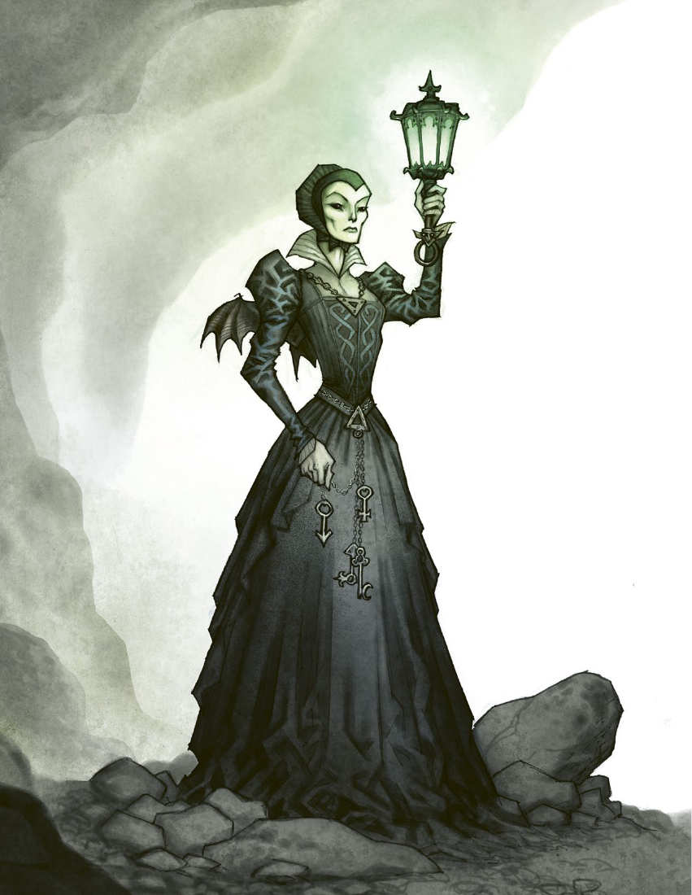
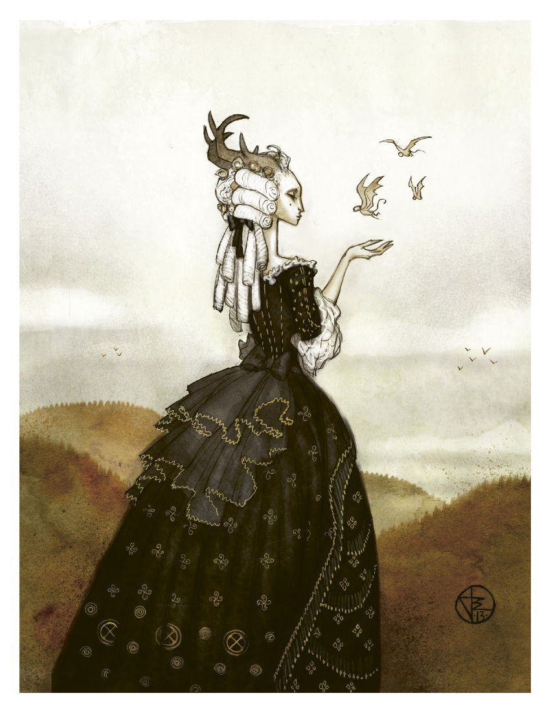

# 第 9 章：谜题

[返回总目录](README.md) · 原始 PDF 第 174–199 页

## 本章目录

- [谜题的构成](#section-01)
  - [自在之物](#section-02)
  - [冲突](#section-03)
  - [罪行](#section-04)
  - [地点](#section-05)
  - [氛围](#section-06)
  - [线索](#section-07)
  - [倒计时到大灾难](#section-08)
- [谜题的结构](#section-09)
  - [序章](#section-10)
  - [邀请](#section-11)
  - [准备](#section-12)
  - [旅途](#section-13)
  - [抵达](#section-14)
  - [地点](#section-15)
  - [对峙](#section-16)
  - [余波](#section-17)
  - [谜题表格](#section-18)
- [战役](#section-19)
- [游戏主持技巧](#section-20)
  - [仔细听，放慢点](#section-21)
  - [解谜和谜语](#section-22)
  - [非玩家角色](#section-23)
  - [游戏中的黑暗秘密](#section-24)
  - [转折](#section-25)
  - [地图](#section-26)
  - [梦境与超自然经历](#section-27)
  - [误导](#section-28)

<!-- 来源：北欧奇谭规则书.pdf；PDF 第 174 页；原书第 170 页 -->

<!-- 来源：北欧奇谭规则书.pdf；PDF 第 175 页；原书第 171 页 -->

我前线上唯一的朋友，比约恩·阿夫·希勒加德上尉被捕了。他被指控犯下间谍罪，将在第二天早上枪决。我回想起他和我说过他的家庭，我们还为他的长子制作了木剑。趁着警卫睡着，我溜进了他的牢房。比约恩瘫倒在地上，对着泥土在说些什么。他注意到我，举起他戴着镣铐的手臂说 :“我无法忍受钢铁。

在趁着夜色离开前，他给了我一个吊坠盒。我本以为这是份友善的礼物。在一开始，一切都变得好了起来。家人告诉我，我们的生意正在蒸蒸日上；我向波默兰的费尔丁格小姐写信求婚，她出乎意料地答应了。再后来战争结束，我可以回家了。那个吊坠盒从未离开我的上衣口袋，有种感觉告诉我，这就是我幸运的源泉。透过衣物的布料，我能感觉到它像毛毛虫一样在我的口袋里蠕动。

在我回到家后，我的父母生病死了。医生说是我从欧洲大陆带回了疾病。费尔丁格小姐在一次狩猎中被流弹击中，她的下半身再也无法行动。婚约取消了。

现在我知道我被诅咒了，这都是那个吊坠盒的问题。但我无法把它扔掉。我的体液颜色变暗，无论是血液、尿液还是唾液。血管像纹身一样布满我的皮肤。在我的前额，以及我身体的其他部位，骨头已经变成了突出的肿块和角。不能让别人看到我这个样子。自从我解雇了仆人，我家的庄园就变成了鬼屋。村里的孩子们聚集在门口，指着我和房子。花园里的地面干裂得像烧焦的皮肤。

通过研究神秘学书籍，我找到了摆脱挂坠盒的方法。这需要献祭，我的，以及其他人的。

本章描述介绍的是如何创作和运行《北欧奇谭》的谜题。本文第一部分聚焦于谜题的构成，并介绍如何通过一个或若干个自在之物来构建冲突作为故事的基础，进而触发故事的核心事件。你必须考虑玩家角色为了解决谜题需要什么线索，他们如何到达发生谜题的地点，以及你希望这个地方能营造出何种氛围。通过填充倒计时，你可以简略地描述出让事态逐步恶化的事件，从而玩家角色则试图拼凑线索。

第二部分则是将谜题变成你可以在游戏中使用的文本。这一部分描述了构成每个谜题的阶段，这些阶段总是按照相同的顺序展开。文本中还包括如何创建氛围的小建议。本章最后提供了一些关于运行游戏时可以使用的技术性建议。

<!-- 来源：北欧奇谭规则书.pdf；PDF 第 176 页；原书第 172 页 -->

## 谜题的构成

下文描述了谜题的基本组成部分，包括谜题涉及哪些的内容，核心冲突是什么，以及如果玩家角色不采取行动将会发生什么。你还必须决定神秘事件发生的地点，以及你想要营造何种氛围。

### 自在之物

首先需要决定你的谜题到底和什么自在之物有关。你可以使用本书第八章中介绍的某个生物，也可以自行创造。自在之物可以存在同一类别的多个个体，比如说一个仙灵的群落。还有些谜题以不止一个类别的自在之物为特征。

你需要弄清楚你的自在之物是什么并让它独一无二。它会叫什么名字 ? 它看起来像什么 ? 它想要什么 ?如果你要重复使用玩家角色已经遇到过的自在之物，你就需要改变某些细节，但也不要使这种生物变得无从辨认。

思考你为什么要选择这个特定的自在之物。这个问题的答案会让你对如何描述这种生物有产生大概的认知。如果你选择了一个田舍侏儒，是因为你喜欢他们的想法，是因为他们是非常强大的且能同时具备善恶的，强调这些方面会是明智之举。你的田舍侏儒时而温柔善良，时而邪恶复仇。生活在农场里的人们因它的反复无常而深感恐惧。

这种生物的性格是如何？它是害羞的还是狂妄的？如果自在之物具有多面性通常会更为有趣，比如既幽默又严肃，既富有同情心又冷酷无情。一个简短的背景故事可能会派上用场。

想出这个生物的弱点，描述一下驱逐它的仪式。这个生物拥有什么力量，它会如何使用魔法？写下它在谜题中可能使用的妖术或咒术。

#### 给你的自在之物命名

每一个自在之物都应有一个名字。由于自在之物是因人类对它们的信仰而诞生的，因此它们的名字通常与周围的人以及人们对这种生物的看法相关。被认为是森林之魂的守护神的名字可能与森林中一棵巨大的树有关，而大人们为了吓唬孩子讲故事用的自在之物可能会有一个吓人的名字。下面列出了一些分类供大家参考：

- 植物和自然现象：黑水塘、黑莓皇后，椴木藓，巨石缝

- 对人类而言有梦幻色彩：伊丽安德亚、沃伦 - 沃克斯、汀德罗维纳，哥拉斯卡帕格

- 城市和工厂：隆隆锵、疾病之风、黑路、破灭、砖块、化学恶臭

- 人类腔调的名字：老爹、魔术手、大块头、不悦领主、王牌小丑

- 人类的名字：汤姆，鲁特·安娜，埃吉尔，菲娜斯蒂娜

- 恐怖的名字：狂吼怪，爆裂魔，吸血魔

<!-- 来源：北欧奇谭规则书.pdf；PDF 第 177 页；原书第 173 页 -->

### 冲突

谜题是基于冲突的，有些事情出了问题，而且会变得更糟。总有一个围绕自在之物的主要冲突，和一个在场人类之间的次要冲突。在某些谜题中，主要冲突和次要冲突可能是相互关联的，而在另一些谜题中，它们完全不相关。更长的谜题可能会引发更多的冲突。

主要冲突会涉及两个或两个以上的方面或人群，一方是怪物；另一方可以是一个人，一个团体，一个公司，一个不属于结社的星期四之子，也可以是另一种怪物。想想这些方面都有哪些人，在下面的例子中，这个“有人”有的可以是谁？

- 有人想从怪物身上得到什么

- 有人从怪物身上拿走了什么东西

- 有人在利用这种生物的能力

- 有人试图从怪物手中拯救某人

- 有人冤枉了这只怪物

- 有人想要阻止或驱逐这种生物

- 有人想和那个生物合为一体

- 有人利用关于这种生物的谣言来达到自己的目的<!-- 来源：北欧奇谭规则书.pdf；PDF 第 178 页；原书第 174 页 -->次要冲突是谜题发生地周围的阴谋、争斗或问题。次要矛盾会让这个地方生动起来，并确保在玩家角色调查谜题线索的同时有事件正在发生。次要冲突让玩家角色遇到的 NPC 有了生气、悲伤、苦恼、怀疑和无理取闹的理由，这会让得故事更富戏剧性。

<!-- PDF 第 177 页侧栏：自在之物的范例 -->

#### 自在之物的范例

在丹麦菲英岛南部的阿雷斯科夫湖西南的沼泽里，有一群鬼火是行脚商不死的鬼魂。在 18 世纪早期，他们通过传播疾病提议撤离并清洁这片区域，进而骗取了教堂的土地。现在他们必须永远在沼泽里漫步。鬼火们穿着华丽的衣服，戴着许多闪闪发光、叮当作响的珠宝。他们用不同的语言向过往的行人呼喊，晚上，人们可以看到绿色的灯火在黑暗中舞动。看见这些光的人会有一种感觉，只要他跟着光走，一切就会好起来。那些误入沼泽的人都被淹死了。除非把沼泽地归还给教堂，否则鬼火将无法在死亡中安息。

巨魔洛米在厄兰岛南部的斯道拉·阿尔瓦雷特荒原上游荡。她养了一群白羊，用羊毛制成漂亮的衣物。她会把这些衣服送给当地的人类，前提是让她在农夫的火炉旁待上一晚，听一听关于人类的浪漫和单相思故事。洛米曾经是岛上某个特洛精社区的一员，但因为皇室成员来到岛上狩猎的缘故，她所有的朋友和家人都被杀害了。特洛精们试图保护野生动物，结果被猎狗撕咬成碎片。洛米看起来像一个人类，她有长长的白发和深色的眼睛，穿着羊毛衣服。她渴望爱情和亲情，却不知道如何获得。每隔一段时间，洛米就会迷惑一个年轻的男人，把他带到古埃克托普城堡废墟里的家中。魔法会使这个男人爱上她，但魔法迟早会失效。当这个男人想要离开的时候，洛米完全被孤独所征服，通常最后会用一把屠刀杀死他。驱逐洛米的唯一方法就是杀死她的羊，让她远离所有同伴，帮助被她咒语控制的人类逃跑。此外，她的住所必须用基督教的象征物来净化。做这些事情会让洛米变得干枯并在瞬间死去。

<!-- PDF 第 177 页侧栏：游戏平衡 -->

#### 游戏平衡

有些自在之物会比其他自在之物更加危险，但玩家角色的经验等级不一定与生物的能力相匹配；在他们的第一个谜题中，角色们遇到林德龙和维特尔可能性是一样的。要做到游戏平衡的话，要让玩家必须始终能够在不被杀死的情况下破解谜题。

次要冲突可能已经持续了数百年，或者是由玩家角色的到来所触发的。这种冲突可能涉及通奸、嫉妒、贫富冲突、传染病、躲避教会迫害的违禁教派，或者一群某个自在之物的少女，而农场工人试图让她们前往教堂。

次要冲突可以用来建立地点和玩家角色之间的联系，例如让玩家角色的黑暗秘密中提及的角色出现。你也可以使用玩家角色背景故事的主题——如果角色的动机是帮助那些需要帮助的人，那么冲突可能会围绕一个试图赶走某位贫困母亲地主展开。 次要冲突不需要玩家角色来解决——他们可以在回家时把它抛诸脑后。

<!-- PDF 第 178 页侧栏：主要冲突范例 -->

#### 主要冲突范例

一个名叫佩妮雅·雅各布森的星期四之子想要利用阿雷斯科夫湖沼泽里的鬼火杀死她的家人，并继承她父亲的遗产。她邀请他们去沼泽附近的“快乐伙伴旅馆”。佩妮尔素以通灵闻名，她声称自己年纪轻轻就去世的妹妹一直在湿地出没。她希望能把这些家庭成员一个接一个地引到那里，让他们被幽灵淹死。冲突发生在佩妮儿和她的家人之间——鬼火是被利用的第三方。

特洛精洛米对一个名叫斯文·安德森的商人施了魔法，这让他爱上了洛米。斯文的未婚妻兼儿时好友，英格丽·拉斯克，正在到处寻找她的未婚夫。婚礼还有一个月就要举行了。大多数人认为斯文逃婚了，但英格丽相信斯文已经被蛊惑了。冲突发生在洛米和英格丽之间。英格丽知道那只穿过斯托拉·阿尔瓦雷特的奇怪白羊与斯文的失踪有关。她已经抓住了两只羊，并计划把偷走未婚夫的怪物引诱进来，她的方法是把羊切开，让它们慢慢流血而死。

<!-- PDF 第 178 页侧栏：次要冲突范例 -->

#### 次要冲突范例

在快乐伙伴旅馆，佩妮雅·雅各布森聚集了她的家人，一场戏剧性的奸情正在发生。家里的丈夫爱上了小他 20 岁的马童罗尔夫。女主人意识到有些事情发生了，但不知道细节。当她知道发生了什么事时，她的反应是悲伤、仇恨和暴力。罗尔夫想要找到一个摆脱困境的方法，但是他一个人根本做不到。在客栈里，夫妻之间会发生冲突。

多年以来，厄兰岛的酒水几乎没有受过管制。农民们在不用纳税的情况下，一直通过私酿烈酒在欧洲大陆上赚取外快。而现在法耶斯坦登来了一位新警长，他可不会对偷税漏税视若无睹。几个农民聚在一起，决定谋杀警察局长。他们在古老的埃克托普城堡秘密会面，没有注意到这个地方也是特洛精洛米的家。冲突发生在警察局长和造反的农民之间。

<!-- 来源：北欧奇谭规则书.pdf；PDF 第 179 页；原书第 175 页 -->

### 罪行

当玩家角色到达时，主要的冲突已经开始了，发生了一些吸引他们兴趣的事情，促使他们离开乌普萨拉去调查这件事。这一事件被称为神秘事件。罪行可能是让无辜的人受伤或者看到了魔法。其他的例子包括 :

- 有人死去了

- 有人失踪了

- 有人疯了

- 奇怪的事情发生了

- 某事或某人发生了变化或是改变了某地方

- 有人实施了奇怪的仪式或魔法

- 有人被奴役了

- 有人生病了

### 地点

如果你还没有想好谜题应该发生的地点，现在是时候去做决定了。看看斯堪的纳维亚半岛的地图，为你的自在之物选出一个令人兴奋的环境。它可以住在城市的贫民窟，高山之巅，岛上，或废弃的城堡里。给这个地方一个名字和描述。也许这个谜团会发生在火车上？画一张地图给玩家展示。

然后问自己一些地点相关的问题，并试着作答：它是什么样子的？现在是一年中的什么时候？这种气候下生长什么？这个地区的地标是什么？它是建在高山上还是深林里？

在制造冲突的同时，你已经在创造这个地点的人物了。接着描述 NPC 并给他们命名——一个词就足够了。考虑一下你是否需要再找一两个 NPC。记录 NPC的一种方法是创造一个涵盖所有人和生物的流程图。在你描述他们彼此关系的地方画上一条线。

如果驱逐生物的仪式需要某些物品，这些物品必须在该地点可以获得。你还需要考虑在哪里放置关于这个生物和仪式的线索。也许有个村民是神秘学书籍的收藏家 ?

<!-- PDF 第 179 页侧栏：罪行的例子 -->

#### 罪行的例子

佩妮雅把她的一个家庭成员骗入沼泽，那人已经被幽灵淹死了。

商人斯文·安德森被特洛精洛米施了魔法，下落不明。

<!-- 来源：北欧奇谭规则书.pdf；PDF 第 180 页；原书第 176 页 -->

### 氛围

你的职责是描述角色所看到的、闻到的、尝到的、听到的和感受到的，帮助玩家构建此刻发生事件的心理想象。描述应简明，通过写下一些笔记来帮助你在游戏过程中创造氛围描述，或者当玩家角色到达地点时你可以阅读一些简短的文本。

塑造氛围时，您可以在描述细节和提供概述之间切换。最好建立一个反复出现的主题，例如：腐坏、霉菌和腐烂的食物。利用好季节和天气。二分法也很有用——这个地方的人和物品要么是有秩序、保守且脾气坏的，要么就是年轻、叛逆且不可靠的。

### 线索

玩家角色需要线索去理清发生的事件以及得知打败怪物的方法。如果玩家把这些点连接起来，你就必须在游戏过程中给出更多线索。你有责任确保故事不会停滞。

线索可以分为核心线索和次要线索。核心线索对解决谜题至关重要。次要线索则提供了本地区正在发生的事件的信息，并为故事提供了深度。但次要线索不能是执行仪式和放逐自在之物的必需品。所以和次要冲突相关的线索都是次要线索，因为玩家角色们不一定要解决次要冲突，就能完成谜题。列出玩家角色<!-- 来源：北欧奇谭规则书.pdf；PDF 第 181 页；原书第 177 页 -->必须接触到的所有信息，并把它们划分为主要线索和次要线索。

<!-- PDF 第 180 页侧栏：风味文本范例 -->

#### 风味文本范例

深秋的夜晚。凉爽的微风吹过，你乘着前往菲英岛南部的长途车，马车仿佛是在无尽的黑暗中穿行，时间早已流逝，车辆却如同静止。突然有一道光，你听到了说话和欢笑的声音。一个手绘的路标告诉你们，快乐伙伴旅馆已经不远了。当马车停下来，车夫帮你下车时，你闻到了植物腐烂的气味，还有沼气和泥浆的恶臭，它们提醒着你，沼泽就在附近。你匆匆地穿过旅店的前门，松了一口气，你们感觉自己马上就会被外面的黑暗和恶臭吞噬，但终于逃到了安全的地方。一旦进入室内，你就会被各种印象所淹没——欢笑的人们，响亮的歌声，轻松的对话。壁炉里燃着火，桌上有啤酒和美食。你们觉得建筑里的火焰和温暖保护着你们，使你们远离腐烂、古老而黑暗的沼泽。

<!-- PDF 第 180 页侧栏：氛围范例 -->

#### 氛围范例

- 炎热干燥的夏天

- 刮风的沼泽

- 草本植物和大量的蓝色花朵

- 绵羊和羊毛服装

- 沉默寡言的农民

- 随处都能看见海

- 古代器物、维京墓穴和北欧符文的遗迹

- 对新警察局长的愤怒，叛乱四起

- 婚礼、爱情、性和异教徒的婚礼传统

- 牧师讨厌他的教众

- 教众讨厌他们的牧师，转而信仰异教传统

- 血淋淋的羊尸体，在腐肉上盘旋的鸟

- 与世隔绝，荒凉的小路，废弃的小屋

- 风车

- 渔船

- 孤立的岛屿，与世隔绝的人

- 被石墙隔开的田地

- 蚊子和黄蜂

- 夏天的暴风雨从海上袭来

线索应该位于不同的位置 ( 见下文 )。你也可以在乌普萨拉放置线索，这样玩家角色就可以在离开城市前就能开始调查谜题。

核心线索应该至少在不同的地点出现 2 次以上。这样即便玩家角色在一个地方错过线索，他们仍有获得线索的机会。角色应无需依赖检定就能获得核心线索，因为检定失败可能会使故事陷入僵局。要确保玩家能在正确的地点，或从正确的人口中获得线索。

另一方面，找到次要线索可能需要 1 到 2个检定的成功，因为故事在没有次要线索的情况下依然能继续。例如，玩家角色可能需要检定才能说服 NPC 透露秘密，或是找到日记本里的隐秘隔层。次要线索可能会导致误导和冲突，也可以通过符号或图形的形式进行传达好让玩家更能理解，同时也能为故事氛围和神秘感。

线索可以提供某个问题的全部答案，也可以仅仅透露出一部分。对玩家而言，拼凑线索获得更大的蓝图会是一件有趣的事情。

<!-- PDF 第 181 页侧栏：核心线索 -->

#### 核心线索

举个例子，核心线索可以提供以下问题的答案：

- 谜题中的自在之物是什么类别？

- 自在之物该如何被驱逐或杀死？

- 怎样才能找到或引出自在之物？

- 哪里可以找到仪式的所需用品？

<!-- PDF 第 181 页侧栏：次要线索 -->

#### 次要线索

举个例子，次要线索可以提供以下问题的答案：

- 这场不断发展的冲突的背景是什么？

- 这只怪物的背景是什么？

- 这里发生过什么事情？

- 我们不采取行动的话，事态会怎样发展？

- 到底是谁犯下的过错？

- 这个地方有什么历史 ?

<!-- 来源：北欧奇谭规则书.pdf；PDF 第 182 页；原书第 178 页 -->

### 倒计时到大灾难

思考在游戏过程中事态是如何一步步恶化的。除非玩家角色能够找到阻止事态恶化的方法，否则最终将以大灾难收尾。倒计时的每一阶段都在导向大灾难。倒计时有助于推进故事的发展，使情况越发令人绝望和富有戏剧性。当游戏桌上的节奏开始缓慢不前，当玩家不知道该做什么的时候，或者当你认为已经靠近了谜题的结尾时，就应启动下一步倒计时 +。使用倒计时中所写的内容创建一个场景。玩家角色可以受到倒计时 - 事件的影响，当事情影响到其他人的时候，他们就在周围，或者你可以设置一个场景，让他们听到正在发生的事件。

在一个谜题中，可以为主要冲突设计一个倒计时事件，为次要冲突设计一个倒计时事件。还可以设置一个同时与主要矛盾和次要矛盾相关的倒计时事件。有时候还能为怪物对玩家角色的攻击设置倒计时事件：他们距离执行仪式的真相越是接近，怪物的攻击就越是猛烈。

倒计时通常由三阶段组成。每个步骤都应能自然地衔接上一阶段，最好与罪行有所关联，罪行也就是让玩家角色来到这里的事件。而大灾难应该是倒计时的后续——如果玩家角色什么都不做，那又会发生什么？

倒计时的第一个事件的发生应远离玩家角色，这样看起来不会十分危险。渐渐地，事件会逐步靠近玩家角色，且越来越具有威胁性。比如，在第一阶段，一个陌生人在村子中死去 / 第二阶段，玩家在旅店中结识的某人死亡了。第三阶段玩家角色遭到了袭击。而大灾难是，玩家到此来保护的那个修女死了。

怪物的魔法也应该随着每一阶段的推进而逐渐强大，玩家角色会越发强烈地感受到其影响。第一阶段，一种奇怪的雾笼罩着村庄。第二阶段，玩家角色的食物变成了蠕虫。第三步，他们所住的旅店被魔法火焰烧着了。

<!-- PDF 第 182 页侧栏：线索范例 -->

#### 线索范例

- 日记

- NPC 知道且可以透露的内容

- 档案里的信息

- 足迹或者爪印

- 孩子们唱的歌谣

- 有尸体的犯罪现场

- 图书馆里的一本书

- 教堂墙壁上的铭文

- 梦中的信息

- 童话中的信息

- 失踪科学家的笔记

- 某人的行为方式

- 玩家角色的黑暗秘密中的某个角色

- 一幅画

<!-- PDF 第 182 页侧栏：小道具 -->

#### 小道具

有一个塑造氛围的好办法，你可以通过展示你制作的物品来提供线索。如果玩家角色们收到了一封信，你可以准备一封游戏世界中的信件，并在合适的时机交给他们。你可以通过火车票，装着奇怪化学物质的容易，遗留在犯罪现场的靴子，或是关于必须解开它才能得到怪物信息的谜题来实现。这些在游戏桌上实际使用的物品被称为“小道具”。

<!-- 来源：北欧奇谭规则书.pdf；PDF 第 183 页；原书第 179 页 -->

## 谜题的结构

在奠定了谜题的基础之后，是时候构造出一个你可以在游戏中使用的“脚本”了。谜题是分阶段进行的，每个谜题都是如此。玩家角色们接受任务，做好准备，前往目的地，并试图解决谜题。最后，它们回家舔舐伤口。

### 序章

一些游戏小组喜欢在进入谜题前，各自扮演角色在乌普萨拉的生活场景，以此来热身。它可以是与爱人的一次会面，家庭聚餐，工作上的一次活动，或者大本营里的一次会议。

雄心壮志的主持人可以参照谜题的冲突设置主题相吻合的场景。如果这是一个被出卖的自在之物的复仇故事，那么角色可以在序章的场景中被自己抛弃过的情人报复。

<!-- PDF 第 183 页侧栏：倒计时和大灾难的范例 -->

#### 倒计时和大灾难的范例

1. 英格丽杀死了洛米的几只羊。洛米让一场可怕的风暴席卷厄兰岛。许多房屋被毁，一条渔船沉没，树木倒在小路上。

2. 英格丽让一群农民帮她寻找斯文。当他们走近埃克托普城堡的废墟时，洛米诅咒了他们。农民们失去了理智，迷失在斯道拉·阿尔瓦雷特。

3. 英格丽带着一把来复枪，一把屠刀和一个摩尔比兰加教堂的十字架来到城堡。她杀了罗米的 14 只羊。大灾难：英格丽找到了特洛精。洛米控制了斯文，通过操纵斯文攻击并杀死英格丽来保护自己。之后，斯文从咒语中醒来。在意识到自己做了什么之后，斯文自杀了。

<!-- PDF 第 183 页侧栏：谜题步步观 -->

#### 谜题步步观

1. 序章：如有必要，每个玩家角色都会进行一个日常生活中的场景

2. 邀请：引入谜题，给出角色探访某地点的理由

3. 准备阶段：角色们在大本营进行准备

4. 旅途：GM 描述前往某个地点的旅程。角色可以获得优势

5. 抵达：角色到达地点。

6. 地点：为了寻找线索，角色会调查很多地方，通常是三个地方

7. 对峙：角色与冲突背后的怪物或人类的对峙

8. 余波：角色返回大本营，在那里他们获得经验值，并决定他们的缺陷和洞察是否已经转化为永久性

#### 偏离模板

有时跳过一两个步骤，或自由地进行一段时间的角色扮演是合理的。这是完全可以的，如果它与谜题吻合，作为 GM 你应该鼓励这种行动。例如，发生在乌普萨拉的神秘事件可能不需要经过一段旅程。对大本营的威胁可以发展成一个谜题，这样小队就无需离开吉伦克鲁茨古堡。使用谜题的模板作为基础，当你认为有必要时忽略模板。玩家角色甚至不需要在每个谜题中面对一个自在之物——它可以是一个疯狂的牧师，一个古老的诅咒，或来自结社内部的敌人。

<!-- 来源：北欧奇谭规则书.pdf；PDF 第 184 页；原书第 180 页 -->

<!-- 来源：北欧奇谭规则书.pdf；PDF 第 185 页；原书第 181 页 -->

### 邀请

玩家角色会收到一个邀请，以得到前往某地点开始调查的理由。邀请信息中包含了罪行，或是对超自然事件发生的或直接或间接的揭露。邀请当中可以包含一些线索。

邀请中应包含一些离开城市前就能在乌普萨拉找到的线索。比如一个可以在图书馆里找到的人名。

邀请的形式有以下范例：

- 一封信

- 奄奄一息的传信人

- 一个梦

- 超自然的信使

- 一篇报纸文章

- 疯子的话

- 突然记起了失去的记忆

- 说方言的人

- 从书上掉下来的一页

- 一个醉汉讲的故事

- 一首正在播放的歌曲

### 准备

在旅行前往目的地之前，玩家们有机会进行准备。他们可以寻找线索，制作或购置装备，或是磨练自己的技能。谜题应该包括在一开始能在乌普萨拉就可获得的线索信息。角色们的准备工作不一定需要演绎，但如果进行演绎，这些场景应该是简短的。这些内容在本书第六章中有更详尽的介绍。

### 旅途

前往地点的旅程是谜题和游戏的起点。它的目的是营造气氛，让玩家有机会代入角色。旅途应尽量简短。

GM 概括并描述玩家的旅程。十句话左右就足够。也许玩家角色会从乌普萨拉乘坐火车前往舍夫德，然后再乘坐长途汽车前往布兰斯托普，在那里他们会乘坐一艘小渔船前往韦特恩湖的韦欣莎。

旅途的氛围可以和目的地一致，也可以形成鲜明的对比。举例来说，如果你的谜题是一个饱经粮食歉收、贫穷和疾病打击的小镇。玩家角色可以会穿越富裕和繁荣的社区，遇到浑身穿金戴银，满身珠光宝气的贵族。当他们离目的地越来越近时，贫困就越发明显。这种对比会使这个小镇看起来更加生动和真实。

你可以通过以下设置来描述旅途的情感基调：

<!-- PDF 第 185 页侧栏：邀请的范例 -->

#### 邀请的范例

亲爱的结社成员：我曾听说过一些遥远的传闻，说你们与超自然现象和神秘学有所关联。我自然也对此颇有兴趣。我和我丈夫在菲英岛南部的阿雷斯科夫湖以南经营着一家名为“快乐伙伴”的旅店。我们的马僮罗尔夫告诉我，住进旅馆中的雅各布森一家人到此是寻找他们死去的女儿的。他们说她的鬼魂就在湖南边的沼泽里飘荡。一个夜里，我独自来到湿地的边缘，并看见一道幽灵般的光在空中移动。我既没有合适的着装，也没有勇气前往湿地，只好回到旅馆的床上。若事情仅仅如此，恐怕它很快就会被我所遗忘。但后续的事情让我写下了这封信。雅各布森家的一个成员失踪了。据说，家里的一个年轻人走到沼泽里去了，且再也没有回来。我担心这种事还会再次发生——这片土地笼罩着一种诡异的氛围，事实上，旅馆本身也被这种氛围包围了。某种超自然的邪恶正在酝酿。如果您对此有兴趣，欢迎光临我的旅店。如果你们愿意调查这些事情并与我分享你的发现，我将提供免费的食宿。

你忠实的朋友阿格尼茨·沃迪克

<!-- 来源：北欧奇谭规则书.pdf；PDF 第 186 页；原书第 182 页 -->

- 天气和热量

- 上下车的人们

- 旅途上遇到的人

- 地位或财富

- 口音

- 擦肩而过的人们的反应

- 车辆的外观和状况

- 他们入住的旅店

- 旅行中做的噩梦或看到的幻象

- 饮食

- 演奏的音乐在旅途中，每个玩家角色都有机会获得优势（第24 页 )。角色应该在旅途上某个时间点的一个短场景中获得优势。玩家可以自行选择地点、时间和优势。然后，玩家应该记下他所学到的、记下的或遭遇的内容。优势可能会是：

- 前往同样目的地的某个人

- 一个位于目的地的亲戚朋友提供的信息

- 角色对某事有了更好的理解

- 改良装备的机会

- 技能特训的机会

- 一次宗教或哲学经历

- 童年记忆重现

- 角色从他遇到的人身上学到的某些东西

- 与其他玩家角色相关的情感变化<!-- 来源：北欧奇谭规则书.pdf；PDF 第 187 页；原书第 183 页 -->GM：有谁想演绎在旅途中获得优势的场景吗 ?

<!-- PDF 第 186 页侧栏：可能使用的交通方式 -->

#### 可能使用的交通方式

- 蒸汽船

- 火车

- 马车

- 马匹

- 步行

- 帆船

- 平底驳船

- 滑雪板、溜冰鞋、雪鞋或踢滑板

- 登山设备

- 划艇

- 脚踏车

- 狗拉的雪橇

- 热气球

玩家 2（阿斯特丽德·莉亚）：我想通过菲英去参观路上的教堂创建优势。我想认识一个和我有相同目的地的人。

GM：在你登上马车前，你可以参观海边的教堂，这里幽深、空旷而寂静。感觉无论生者还是死者都能在这里找到安宁。

玩家 2：我走到洗礼池前，把口袋里的烧瓶装满圣水。然后我拿出我的银十字架，举到祭坛前，用拉丁语说了几句话。然后我就坐在前排，低下头，抱着十字架祈祷。我想到父亲的不安的灵魂，它在晚上仍然对我纠缠不休。

GM：你被身后一排的某人吓到了。你转头向后面看过去，你看到了一个金色卷发的女人，你也要去快乐伙伴旅馆，对吗 ?”

### 抵达

当玩家角色到达某个地点时，玩家将需要一些概述。可以通过场景或 GM 的简短描述来实现这些。此时正是阅读风味文本并将地图铺开的好时机。

<!-- PDF 第 187 页侧栏：旅途的风味文本范例 -->

#### 旅途的风味文本范例

前往厄兰岛南部的摩尔比兰加的旅途令人心旷神怡。这是美丽的夏日，人们心情愉悦。你们乘坐列车从乌普萨拉向南抵达了卡尔马。从那里你们乘坐一艘小汽船到厄兰岛上的法耶尔斯坦登。这个岛屿和大陆很是不同。岛民很是安静，很少与人往来。沿着土路往南走，你们看见了许多异教的标志，这些东西在你的故乡可是不被许可的。还有少女和农场的工人在草地上围着五朔节的花柱舞蹈，还有几座房子装饰以多神教时代的残余。岩石地貌上到处都是在贫瘠牧场上吃草的羊群，地表的大部分被称为蓝蓟的蓝色花朵所覆盖。

摩尔比兰加是一个小社区。村民们友好地欢迎了你们，并送上羊肉和烈酒。然而，一些人嘀咕说警察在追查他们的酒水。许多农民装备着老式左轮手枪和霰弹枪。空气中弥漫着怒气，却没有人愿意解释发生了什么。

<!-- PDF 第 187 页侧栏：时间紧迫 -->

#### 时间紧迫

如果你时间紧迫，想要在一个晚上完成一个谜题，你可以直接跳过序章从玩家抵达目的地开始游戏。如果你如此决定，你应该用几句话概括出邀请阶段和旅途阶段。

<!-- 来源：北欧奇谭规则书.pdf；PDF 第 188 页；原书第 184 页 -->

<!-- PDF 第 188 页侧栏：给GM的建议 -->

#### 给 GM

#### 的建议

如果你想创作一个令人不悦且恐怖的故事，你需要考虑这些内容。

#### 没有朋友，也没有退路

玩家角色将离开城市去探索未知。你应确保他们是孤立无援且暴露无遗的。往日每日都路过的马车突然消失无踪。一直协助他们的农夫被发现死亡、失踪或被怪物的魔法所改变。当他们进入亡灵的墓穴时，入口的大门突然被关紧。村民们口音怪异或是说着一种未知的语言。夜复一夜，玩家角色们被自己的尖叫声吓醒，睡眠不足让他们疯狂。环境阴暗，寒冷，不宜居住。

#### 蛇虫鼠蚁

肮脏和不愉快的细节总是在恐怖故事中占据一席之地，尽管它们很容易被滥用或变得可以预测。村民身上的皮肤似乎脱落了，松松垮垮地挂在身上。玩家角色吃的食物会变成蠕虫。进入洞穴的通道里挤满了蟋蟀，它们强烈的噪音笼罩在玩家角色周遭。溃烂的脓疮、饥饿、疾病和死亡都可能是有用的道具。

#### 逐步升温

当玩家角色看到怪物时，恐怖故事通常会沦为冒险故事，接下来的事情就是驱逐怪物了。你应该逐步给事态升温。首先，在逐渐增加陌生感之前，让角色注意到一些不对劲的小迹象，一些可以解释清楚的事情。让令人不快的事件、地点或人变得越来越具威胁性。把与怪物的遭遇留到最后一刻。 倒计时的目的是让局势恶化。如果一些戏剧性的事情必须在早期发生，你可以使用次要冲突的倒计时。

#### 古怪的人群和地点

确保你的谜题中有一些古怪的人物和地点。一名警察就像是一个日渐年轻的，患上相思病的孩子般跟随着玩家角色。患上热症的孩子们赤身裸体地在街上游荡。教堂近 20 年来一直少了一面墙。湖面上覆满了腐败的鱼类。但是，谜题中也必须有正常的人物和地点来突显出古怪的存在。

#### 协助玩家构建心理图景

对恐怖事物大量且详尽的描述会让玩家更难构建出他们心中想象的图景。暗示而不应说明，揭露部分的细节而非其全貌，给出错误或自相矛盾的描述更能激发玩家的想象力。集中在一个或仅仅几个感觉上。这种怪物的花香让人想到西尔玛阿姨的拥抱。森林中回荡着小鹿被生吞活剥的声音。使用直接的比喻。林中女士痛苦的吼声在树林间回荡，就像被活埋的人从棺材里发出的尖叫。不由自主的笑声传遍了整个村庄，就像贫民院里的水痘一样。狼人在黑暗中的呼吸声听起来就像铁匠铺里的风箱。

你可以让玩家描述他们为什么觉得某个 NPC 令人不快，古怪或有吸引力。玩家们最清楚对他们来说什么才是最痛苦的。然而，这将改变玩家和 GM 之间的平衡，所以我们对此必须谨慎。

#### 私人化订制

抓住每一个机会去创造关于玩家角色生活的故事，不管是字面上的还是象征性的。例如，你可以让怪物袭击某个（玩家的）家庭成员，而非某个不认识的 NPC。某个地点的人可能看起来很像玩家角色的妹妹。黑暗秘密中的主题可能会在谜题中出现。想想什么才会让玩家感到不安，有时人类的邪恶会比自在之物更可怕。

#### 蜡烛、音乐和泛黄的羊皮纸

创造一个玩家能够沉浸于其中的游戏环境吧。点燃的蜡烛、游戏世界里的道具和怪异的音乐总是很有帮助。

<!-- 来源：北欧奇谭规则书.pdf；PDF 第 189 页；原书第 185 页 -->

### 地点

谜题的核心是玩家角色可以访问的地方。这些地方应该包含线索和挑战。大多数谜题都有三个地点，较长的谜题可能有更多地点，而简短的入门谜题只有一两个地点。

地点是故事和谜团的中心。它可以是同一地点的三个房屋，城堡的不同部分，或三节火车车厢。这些地点可以是普通的住宅楼或铁匠铺，也可以是神秘岛屿上仙灵的城堡，或者是被超自然火焰包围的草原。

这些地点可以被安排以特定的探访顺序。也许他们必须先抵达城堡（地点 1），在那里他们可能会找到地下洞穴的隐蔽入口（地点 2），其中有一条隧道通往一个被施加了魔法的地点（地点 3）。地点也可以被设置为可以按任意顺序进行探访，例如，这些地点是同一个村庄里的三个房屋。画出地点连接方式的草图可能会有所助益。

#### 挑战

大多数地方都会存在某种形式的挑战。它可以阻止玩家角色找到线索，如隐藏的隔间或说谎的 NPC。其他例子还包括攻击玩家角色的生物或人类，或者危险而可怕的魔法。挑战也可以是让玩家角色难以抵达某个地方的环境因素，例如地震或 NPC 之间的持续争斗。可以利用主要冲突和次要冲突来设置挑战。

<!-- PDF 第 189 页侧栏：地点1地点2地点3对峙 -->

地点 1 地点 2 地点 3 对峙

对峙

地点 1 地点 2 地点 3

对峙地点 1 地点 2 地点对峙地点 3 3 地点 1 地点 2

<!-- 来源：北欧奇谭规则书.pdf；PDF 第 190 页；原书第 186 页 -->

#### 线索

每个地点都包含一条或多条线索。关键线索应能在多个地点找到，并且很容易就能找到。

一个地点也可以包含抵达其他地点的线索。例如，玩家角色可能会调查一起发生在学校的谋杀案，并在地板上发现一张纸条，上面写着一个鞋匠的地址，而在鞋匠的家中，一个 NPC 透露牧师正在谈论杀死受害者——这让玩家角色不得不去拜访牧师的住所。

<!-- PDF 第 190 页侧栏：现场的图书馆 -->

#### 现场的图书馆

理想情况下，在目的地应有某种形式的图书馆或藏书室，以便玩家角色可以获得新线索以证实自己的猜想。GM 还可以通过这种书库来提供玩家已经错过的线索。

<!-- PDF 第 190 页侧栏：谜题就如同地图 -->

#### 谜题就如同地图

谜题，连同它的人物和地点，就像一张标有路径的地图。玩家角色可能会沿着路径前进，也可能会忽略路径去拜访其他地方和人，并以未被描述的方式收集线索。

谜题应该成为 GM 的安全保障。当你不知道该做什么的时候，你总是可以把故事引回到原路，或者使用所描述的地点和人物。你的工作不是确保谜题一字不变地运行。

<!-- PDF 第 190 页侧栏：关于地点的两个范例 -->

#### 关于地点的两个范例

伯恩夫妇和他们无数的近亲繁殖的孩子住在菲英岛南部沼泽边的一间旧房子里。这家人依靠划艇和手织网捕获沼泽鱼为生。伯恩夫妇知道沼泽里的光来自死去的灵魂，它们在引诱人们进入湿地。他们把鬼火视为神明来崇拜，许多孩子被“祝福”，走到沼泽里淹死了。这对夫妻对陌生人持怀疑态度。他们曾多次遭到邻村人的袭击，受到法律和当地教会的通缉。如果玩家想要了解这个家庭对“说着神之语的提灯人”的信仰，就必须欺骗他们或取得他们的信任。

女巫埃洛伊丝独居于厄兰岛南端的一个防波堤旁边。她有灵视能力，并且在特洛精被杀之前和它们有过接触。埃洛伊丝认识洛米，知道她对人类和爱情的痴迷。她经常试图劝诫洛米，但洛米听不进去。她意识到保护岛民免受特洛精伤害的唯一方式就是杀死洛米。埃洛伊丝知道孤独会让洛米变得干枯，如果玩家角色杀光她的羊并赶走她所爱的对象，这只特洛精就会被消灭。在探访埃洛伊丝时，洛米通过监视女巫的魔法发现了玩家角色。她对埃洛伊丝降下诅咒，这会让埃洛伊丝被一只无形之手掐死。玩家角色们必须拯救女巫才能获得驱逐洛米的方法。

<!-- 来源：北欧奇谭规则书.pdf；PDF 第 191 页；原书第 187 页 -->

### 对峙

对峙是谜题的最终幕。它描述了玩家角色遭遇怪物的时间或地点。GM 应该避免玩家角色在对峙中因失败而导致的死亡。如果他们对峙失败，他们应该有第二次驱逐怪物的机会，尽管有时会为时已晚，他们除了逃回乌普萨拉外已别无选择。

就像谜题中的其他内容一样，对峙也是游戏中可能发生事件的建议。谜题不一定要如原文般结束。结局可能有多种不同的可能，而对峙是一种工具，它能把故事推向某一结局。

### 余波

玩家角色返回他们在乌普萨拉的家。回到大本营时，他们将获得经验点，并明确缺陷或洞察是否转化成永久性（第 88 页）。

每个玩家都要回答问题（第 25 页），以确定他们的角色获得了多少经验值。每一个积极的答案都能让角色将获得 1 点经验值。如果谜题在多次游戏聚会后才被解决，角色将在每次聚会结束时获得经验值。

当玩家角色积累了 5 点经验值时，他就可以晋级。升级可以用来提高一点技能或购买一个新天赋。玩家可以购买任何天赋——包括在创建角色时其他范型特有的天赋。

当谜题结束时，若玩家愿意，他可以修改角色的动机、黑暗秘密或与其他玩家角色的关系。这一变化应与谜题中发生的事件有一定的联系。

<!-- PDF 第 191 页侧栏：对峙的两个范例 -->

#### 对峙的两个范例

玩家角色遇到了鬼火，并知晓了带给他们安息的唯一方法，那就是把沼泽还给教堂。它现在的主人是一个名叫尼古拉斯·奎斯特的商人。角色们可以从商人处买下土地，但佩妮雅·雅各布森会用魔法阻止他们会面。

玩家角色设法追踪特洛精洛米到埃克托普城堡，而无论是否得到了英格丽的帮助。为了驱逐洛米，他们必须把羊群杀死，打破连接斯文和洛米的魔法，并在废墟上放置十字架。洛米将使用魔法保护自己，并让斯文攻击玩家角色。

<!-- 来源：北欧奇谭规则书.pdf；PDF 第 192 页；原书第 188 页 -->

### 谜题表格

你可以从古老的童话故事和歌谣中为自己的谜题汲取灵感。要获得其他帮助，可以考虑使用以下表格。投骰子，让概率来做决定，或者你也可以自行选择。请记住，您可以自由修改这些建议，也可以自己制定建议。

#### 已经发生了什么？

邀请，即玩家角色的任务，可以通过信件或口信的形式呈现出来，并由某人主动提出。信息的来源是那些听说过结社的人或向熟人寻求帮助的任务提供者，后者会将这个请求传达给玩家角色。这次任务是由一些神秘或不祥的罪行引起的。

<!-- PDF 第 192 页侧栏：邀请 -->

#### 邀请

| D6 | 类型 |
| --- | --- |
| 1 | 气喘吁吁的送信人 |
| 2 | 邮差送来的信件 |
| 3 | 电报消息 |
| 4 | 和镇上牧师的谈话 |
| 5 | 城堡门口有一个被钉死的大箱子 |
| 6 | 遍体鳞伤的信鸽 |

<!-- PDF 第 192 页侧栏：任务提供者 -->

#### 任务提供者

| D66 | 类型 |
| --- | --- |
| 11-13 | 古怪的科学家 |
| 14-16 | 旅行的历史学家 |
| 21-23 | 远房亲戚 |

<!-- PDF 第 192 页侧栏：任务提供者 -->

#### 任务提供者

| D66 | 类型 |
| --- | --- |
| 24-26 | 前结社成员的孩子 |
| 31-33 | 牧师或主教 |
| 34-36 | 村议会/村长老 |
| 41-43 | 拥有大庄园的贵族 |
| 44-46 | 陷入困境的客栈老板 |
| 51-53 | 神秘的主顾 |
| 54-56 | 代表某个庄园的律师 |
| 61-63 | 调查官 |
| 64-66 | 梦中有自在之物在恳求 |

<!-- PDF 第 192 页侧栏：罪行 -->

#### 罪行

| D66 | 事件 |
| --- | --- |
| 11-13 | 噩梦 |
| 14-16 | 饮用水 |
| 21-23 | 作物歉收 |
| 24-26 | 残忍的谋杀案 |
| 31-33 | 大火灾 |
| 34-36 | 失踪或绑架 |
| 41-43 | 入室盗窃 |
| 44-46 | 故意破坏 |
| 51-53 | 一连串的暴力行为和攻击 |
| 54-56 | 牲畜死亡 |
| 61-63 | 疾病或疯狂 |
| 64-66 | 无法解释的天气现象 |

<!-- 来源：北欧奇谭规则书.pdf；PDF 第 193 页；原书第 189 页 -->

#### 原因是什么？

一个自在之物应对此地的罪行负责，无论其是非对错。在怪物和人类之间存在一个主要的冲突，个体们希望摆脱、控制甚至是帮助怪物。无论出于何种原因，自在之物会在某些事件发生后陷入一种特殊的精神状态。还有一个长期存在或是即将发生的次要冲突发生于当地人之间。这与自在之物的主要冲突背景并无关联。

<!-- PDF 第 193 页侧栏：自在之物表 -->

#### 自在之物表

| D66 | 自在之物 |
| --- | --- |
| 11-12 | 灰树夫人 |
| 13 | 溪中之马 |
| 14-15 | 恶灵 |
| 16-21 | 鬼魂 |
| 22 | 美人鱼 |
| 23 | 巨人 |
| 24-25 | 教堂守护兽 |
| 26 | 林德龙 |
| 31-32 | 鬼火 |
| 33-34 | 梦魇怪 |
| 35-36 | 死婴灵 |
| 41 | 水乐灵 |
| 42-43 | 黑夜渡鸦 |
| 44 | 海妖蛇 |
| 45-46 | 林中女士 |
| 51-52 | 妖虫 |
| 53-54 | 田舍侏儒 |
| 55-56 | 特洛精 |
| 61-62 | 狼人 |
| 63-64 | 维提尔 |
| 65-66 | 仙灵 |

<!-- PDF 第 193 页侧栏：主要冲突 -->

#### 主要冲突

| D6 | 不满 |
| --- | --- |
| 1 | 自在之物失去了家园 |
| 2 | 人们不再安抚自在之物 |
| 3 | 自在之物正在被猎杀，或是受到威胁 |
| 4 | 自在之物不再有追随者 |
| 5 | 自在之物遭到了劫掠 |
| 6 | 自在之物被封印了 |

<!-- PDF 第 193 页侧栏：自在之物的精神状态 -->

#### 自在之物的精神状态

| D6 | 态度 |
| --- | --- |
| 1 | 惊恐的，逃窜的 |
| 2 | 心怀憎恨，意图谋杀 |
| 3 | 苦求的，嫉妒的 |
| 4 | 轻蔑地，恶作剧的 |
| 5 | 困惑的，精神失常的 |
| 6 | 保护心理，领地意识 |

<!-- PDF 第 193 页侧栏：当地的次要冲突 -->

#### 当地的次要冲突

| D66 | 引发的紧张事态 |
| --- | --- |
| 11-12 | 被剥夺继承权 |
| 13-14 | 无子嗣或是私生子（女） |
| 15-16 | 继承权争夺 |
| 21-22 | 牧草匮乏 |
| 23-24 | 金融债务 |

<!-- 来源：北欧奇谭规则书.pdf；PDF 第 194 页；原书第 190 页 -->

#### 我们要与谁会面。

玩家角色在抵达时总会碰见一个联络人，他可能了解谜题，甚至被牵扯进其中了。下文表格中的范型都有自身的属性、天赋和技能，这些都列在了 166 页。当创建 NPC 时，也可以使用第 167 页的特质表。此外，最好给 NPC 们起好名字。

<!-- PDF 第 194 页侧栏：当地的次要冲突 -->

#### 当地的次要冲突

| D66 | 引发的紧张事态 |
| --- | --- |
| 25-26 | 工作竞争或岗位竞争 |
| 31-32 | 懒散的生活方式和消耗 |
| 33-34 | 对魔法的猜忌 |
| 35-36 | 暗恋 |
| 41-42 | 非正当的收益 |
| 43-44 | 不幸的家族或个人 |
| 45-46 | 不明确的边界 |
| 51-52 | 正在崛起的教派和自由散漫的教会 |
| 53-54 | 亵渎的关系 |
| 55-56 | 饥荒和富裕的冲突 |
| 61-62 | 三角恋 |
| 63-64 | 被家族排斥 |
| 65-66 | 家族恩怨（并且再投一次决定理由） |

<!-- PDF 第 194 页侧栏：会面之人 -->

#### 会面之人

| D66 | 角色 | 范型 |
| --- | --- | --- |
| 11 | 村子里的弱智儿 | 街头孩童 |
| 12 | 仆人 | 女仆 |
| 13 | 乞丐 | 街头孩童 |
| 14 | 穷困潦倒的流浪者 | 码头工 |

<!-- PDF 第 194 页侧栏：会面之人 -->

#### 会面之人

| D66 | 角色 | 范型 |
| --- | --- | --- |
| 15 | 旅店的酒鬼 | 码头工 |
| 16 | 酗酒的畜牧工人 | 农民 |
| 21 | 辛勤的农民妻子 | 农民 |
| 22 | 当地杂货商 | 商人 |
| 23 | 殡葬医生 | 医生 |
| 24 | 下定决心的屠夫 | 码头工 |
| 25 | 磨坊碾磨工 | 农民 |
| 26 | 跑腿使童 | 街头孩童 |
| 31 | 专心致志地植物学家 | 学者 |
| 32 | 书籍档案管理员 | 教授 |
| 33 | 教师 | 教授 |
| 34 | 退役军官 | 士兵 |
| 35 | 和蔼的乡村医生 | 医生 |
| 36 | 疲倦的外科医生 | 医生 |
| 41 | 猎场看守 | 猎人 |
| 42 | 铜匠 | 铁匠 |
| 43 | 邮政局长 | 马车夫 |
| 44 | 县治安官 | 警察官员 |
| 45 | 陷阱专家 | 猎人 |
| 46 | 小摊贩 | 商人 |
| 51 | 巡警 | 警察官员 |
| 52 | 腰板笔挺的侍从 | 男仆 |
| 53 | 牧师的女执事 | 牧师 |
| 54 | 村中长者 | 农名， 铁匠 |
| 55 | 轻蔑的外围人员 | 街头孩童 |
| 56 | 知名的隐士 | 预言者 |
| 61 | 著名的地主商人 | 商人 |
| 62 | 当地牧师 | 牧师 |
| 63 | 古怪的房东 | 商人 |

<!-- 来源：北欧奇谭规则书.pdf；PDF 第 195 页；原书第 191 页 -->

<!-- PDF 第 195 页侧栏：会面之人 -->

#### 会面之人

| D66 | 角色 | 范型 |
| --- | --- | --- |
| 64 | 前往惊恐之地的保镖 | 士兵 |
| 65 | 占卜者 | 预言者 |
| 66 | 乡村里的神秘主义者 | 预言者 |

<!-- PDF 第 195 页侧栏：NPC名字 -->

#### NPC 名字

| D66 | 男性名 | 女性名 | 姓氏 |
| --- | --- | --- | --- |
| 11 | 亚历山大 | 阿加莎 | 阿姆格兰 |
| 12 | 安东 | 阿尔瓦 | 安德斯多特 |
| 13 | 奥古斯特 | 安妮特 | 贝克伦德 |
| 14 | 伯恩哈德 | 阿斯特丽德 | 贝克马克 |
| 15 | 贝尔蒂尔 | 克里斯蒂娜 | 伯格伦 |
| 16 | 布鲁尔 | 艾巴 | 比尤尔 |
| 21 | 埃德文 | 艾沃尔 | 布隆贝格 |
| 22 | 埃弗拉伊姆 | 艾玛 | 布维斯特 |
| 23 | 伊莱亚斯 | 伊娃 | 布瑞拉 |
| 24 | 埃米尔 | 赫尔达 | 卡尔斯提克 |
| 25 | 埃里克 | 伊达 | 科雷 |
| 26 | 弗里索夫 | 约瑟菲娜 | 埃里克松 |
| 31 | 约斯塔 | 卡琳 | 法尔肯加德 |
| 32 | 古斯塔夫 | 谢斯廷 | 弗利斯克 |
| 33 | 古斯滕 | 蕾娜 | 格拉乌尔 |
| 34 | 哈罗德 | 林内亚 | 古斯塔夫松 |
| 35 | 赫尔曼 | 莉丝贝特 | 哈尔玛弗斯 |
| 36 | 约翰 | 洛妲 | 海尔斯托 |
| 41 | 约翰尼斯 | 马格达琳娜 | 杰恩伯格 |
| 42 | 卡尔 | 马琳 | 约翰松 |
| 43 | 卡拉斯 | 玛格丽塔 | 拉尔松 |
| 44 | 克努特 | 玛莲安 | 林德伯格 |
| 45 | 康拉德 | 米尔达 | 伦德斯特伦 |
| 46 | 拉尔斯 | 莫妮卡 | 麦辛 |
| 51 | 列夫 | 奥尔加 | 梅兰德 |
| 52 | 雷奥纳德 | 奥莉维亚 | 奥雷 |
| 53 | 曼斯 | 宝琳娜 | 奥斯卡松 |
| 54 | 马蒂亚斯 | 瑞贝卡 | 佩尔松 |
| 55 | 奥斯卡 | 莎拉 | 拉夫 |
| 56 | 奥维 | 西格丽德 | 斯塔克 |
| 61 | 佩尔 | 索菲亚 | 松登 |
| 62 | 斯特凡 | 索尔维格 | 塔夫斯托 |
| 63 | 斯文 | 斯汀娜 | 图灵 |
| 64 | 特吕格弗 | 特蕾莎 | 维坎德 |
| 65 | 威廉 | 维拉 | 瓦伦 |
| 66 | 沃尔特 | 威廉敏娜 | 威德马克 |

<!-- PDF 第 195 页侧栏：瑞典的名字 -->

#### 瑞典的名字

在 18 世纪末和 19 世纪的大部分时间里，瑞典在命名方面发生了巨大的变化。希腊、法兰西和拉丁的名字在知识分子中很是流行。虽然传统名字仍然占主导地位，可供选择的有创意的新兴名字产生了。

- 阿吉尔，美多迪乌斯，霍尔姆格，托尔堡，克文滕，埃尔文

- 塔莱纳，埃特克尔，塞鲁迪亚，罗莎莉亚，阿伯塔，西格洛格神职人员经常用拉丁化的新名字替代原来的旧版本，比如埃里克从“Erik”变成了“Eric”，斯特凡（Stefan）变成了斯特凡尼（Stephani），约翰（Johan）变成了约翰尼斯（Johannis），还有些人根据自己的故乡选择了新的拉丁名字。比如赫尔辛格斯（Helsingus）或格瓦利西斯（Gevaliensis）。士兵们通常会根据个人特点取一些特殊的姓氏，比如格拉德（“快乐的”)，斯塔克（“强壮的”），塞克尔（“安全的”)。贵族的姓氏通常是从家族纹章演变而来的，如斯文霍弗德是指“野猪头”和莱昂斯蒂尔纳是指“雄狮之星”，出生地点也会决定他们的姓氏，如冯·林恩和阿夫·克林特博格。

<!-- 来源：北欧奇谭规则书.pdf；PDF 第 196 页；原书第 192 页 -->

#### 我们该去哪儿 ?

在抵达罪行发生的村庄或城镇之后，玩家角色将调查不同的地点以获得线索。使用下面的列表作为灵感，并填充其中每个地点的细节。它的外观如何？有谁来到过这里？有冲突即将发生的迹象，或是自在之物在此游荡的痕迹吗？

## 战役

若干谜题可以连成一个更长的故事。如果这样做，那么应以某种方式从所有谜题的次要冲突中衍生出一个首要冲突。一个自在之物可能想要占据一个特定地区，而玩家角色必须和这只怪物在该地区的不同地点导致的谜题做对抗。

在战役中，通常会在谜题之间演绎玩家角色的生活场景，例如角色结婚或遇到法律问题，或是被送进精神病院。把乌普萨拉甚至大本营作为谜题的地点也会很有趣。

战役可以有首要主题和整体氛围。如果首要冲突涉及一只想要复活兄弟姐妹的特洛精，那么不同的谜题中，NPC 和地点的特征会与死亡、墓地、或是希望阻止不可避免的事情的想法有关。也许玩家角色会在战役过程中失去心爱的人，导致她陷入类似于特洛精的情感挣扎中？

<!-- PDF 第 196 页侧栏：重要的地点 -->

#### 重要的地点

| D66 | 乡村 | 城市 |
| --- | --- | --- |
| 11-12 | 杂货店 | 教堂 |
| 13-14 | 铁匠铺 | 市政厅 |
| 15-16 | 旅店 | 城市公园 |
| 21-22 | 舞厅 | 居民区 |
| 23-24 | 乡村诊所 | 图书馆 |
| 25-26 | 古堡 | 济贫院 |
| 31-32 | 废弃的农场 | 码头 |
| 33-34 | 风力磨坊或 锯木厂 | 桥底 |
| 35-36 | 猎人小屋或 牧羊人的小屋 | 城镇广场 |
| 41-42 | 农田 | 仓库 |
| 43-44 | 宅邸 | 监狱 |
| 45-46 | 墓地 | 军营 |
| 51-52 | 沼泽地 | 养马场 |
| 53-54 | 悬崖 | 纺织厂 |
| 55-56 | 洞穴 | 砖厂 |
| 61-62 | 原始森林 | 公共图书馆 |
| 63-64 | 长满野花的牧场 | 旅店或啤酒小屋 |
| 65-66 | 湖泊、河流或 海洋 | 医院 |

<!-- PDF 第 196 页侧栏：林内亚·艾尔弗克林 -->

#### 林内亚·艾尔弗克林

玩家角色会通过前成员林内亚·艾尔弗克林了解结社及其历史和传统，她现在大部分时间都待在乌普萨拉的精神病院里。由你来决定她是谁，发生了什么，以及她为什么拒绝与玩家角色一起回到结社大本营。也许她知道城堡里住着一个可怕的自在之物，也可能残旧的大本营会带给她痛苦不安的回忆？林内亚的背景和秘密很可能被编织成一个更长的战役，每个谜题都揭示了与她相关的更多细节，以及其生活事件和整体冲突相关联的方式。

<!-- 来源：北欧奇谭规则书.pdf；PDF 第 197 页；原书第 193 页 -->

## 游戏主持技巧

在几次游戏过后，你可能会对探索不同的游戏主持技巧感兴趣。

### 仔细听，放慢点

为了创造优秀的故事，你必须在创建角色和游戏过程中仔细倾听玩家对角色的看法。注意细节，并在创造和主持谜题时使用这些信息。让 NPC、地点和其他玩家创建的东西在游戏中出现。如果玩家确定自己的角色是由年迈的卡尔叔叔抚养长大的，那么卡尔叔叔就会碰巧出现在神秘事件发生的地点，并遭受死婴灵的怒火。

你也要也给自己一些时间来描述细节和营造氛围。让速度慢下来。对情况进行评估。不要害怕沉默。思考自己在游戏世界中创造了哪些细节，就像使用玩家提供的材料那样使用它们。

### 解谜和谜语

有许多方式可以为玩家创造出令人愉悦的解谜和谜语。例如，谜题里可以有一个用密码写成的文本，一首揭示怪物的歌谣，解谜的碎片将合成一张地图，指出前往怪物巢穴的路径。也可以玩家角色（也就是玩家）必须解答三个谜语才能放逐怪物。

### 非玩家角色

为了在玩家角色和 NPC 之间制造分歧和冲突，所有主要的 NPC 要么想要帮助玩家角色，并从玩家角色处获得协助，要么就会与玩家角色为敌。如果玩家角色试图揭露一只特洛精，可能会有一个 NPC 需要让特洛精继续隐蔽下去，另一个 NPC 深受特洛精的魔法所折磨，还有一个 NPC 试图帮助玩家角色驱逐巨魔，但这对村庄而言是灾难性的。

NPC 想要的东西可能与玩家角色的黑暗秘密、背景或个人特质有关。一个饱受丑陋感折磨的玩家角色可能会遇到一个有同样困扰的 NPC，NPC 通过超自然的方式改变了自己的外观。

<!-- 来源：北欧奇谭规则书.pdf；PDF 第 198 页；原书第 194 页 -->

### 游戏中的黑暗秘密

询问玩家关于他们黑暗秘密的问题。找到特定玩家对每个秘密的兴趣点。让玩家背景中的人物出现在目的地，通过这种方式把秘密加入到游戏中。你也可以使用秘密的主题去描绘冲突。在目的地提供一些可能会激活玩家黑暗秘密的东西。举个例子，如果一个玩家是个酒鬼，那么旅店就应该以其啤酒而闻名。

### 转折

让第一个线索指向一个方向，之后引出一个与之截然不同方向的线索是非常有趣的。这可能会是倒计时中的一个阶段，也可能是某个谜题地点中看似随机的线索。

可能让村庄陷入恐惧的狼人是在保护着人们，或是任务的提供者是一个自在之物，也可以幽灵不仅附身在玩家角色所追赶的病人身上，而且控制了整个精神病院。

### 地图

除了斯堪的纳维亚半岛的地图和位置，你应该总是画出你希望角色探索的不同地方的地图。地图提供了总结性和清晰性，让玩家能够专注于某些内容。它们可以是一时冲动绘制的，也可以是精心设计的。

### 梦境与超自然经历

许多谜题会从玩家角色的超自然经历和梦境中获益。这些可能会发生在前往目的地的路上，也可能发生在调查线索的时候。这种经历可能是某种怪物的魔法造成的，也可能是灵视者对令人敬畏之物的极高的敏感导致的。

梦境可以对怪物的身份及渴望给出模糊的暗示，而启示可以提供关于冲突真实原因的线索。例如，旅<!-- 来源：北欧奇谭规则书.pdf；PDF 第 199 页；原书第 195 页 -->馆指示牌上的字母可能会被重新排列成“不洁的死亡”字样。然后眨眼间，指示牌就恢复了原样。

<!-- PDF 第 198 页侧栏：童话 -->

#### 童话

如果你想在谜题中增加童话感的话，你可以使用一些特定的技巧：

- 童话故事中的图片：看这本书中的图片和童话故事中的图片，比如约翰·鲍尔的插图。试着重现场景和情绪。描述岩石被苔藓覆满的松林深处，长发的特洛精，还有人类和魔鬼的遭遇。

- 三和七：童话感总是依赖于事件的重复——同一件事重复三次或是七次时，每次的不同和变动。仙灵们向铁匠发出过三次警告，每次警告都变得更加严厉和吓人。必须收集七个善人的头发，然后烧掉，才能引诱鬼魂来到村子里。

- 命运、诅咒和语言：使用关于未来的预言和宿命来营造神秘感。一个干瘦的老妪在玩家角色前往目的地的途中为他们念了一段诗；诗里的故事就在目的地发生了。对峙结束后，老妇再次出现，并给予玩家角色一个超自然物品，以及一到两句箴言。

- 寓意：童话故事总会告诉我们人们为人处事的道理。你的谜题要告诉大家什么？

- 独特的地点和物品：童话故事不会发生在普通的地方。让玩家角色去探访最黑暗的森林，地下世界里最深的地穴，还有最黑暗的湖泊吧。让他们品尝横扫饥饿的面包，聆听童话里的歌谣，被困在姜饼屋里，从黑骑士手上逃出生天吧。

- 天真无邪的旅行家：童话故事的中心通常是一个年轻天真的男孩或女孩，他们遇到了自在之物，并从所经历的事件中成长。她要么得到这些怪物的帮助，要么就要打败它们。

- 在很久很久以前：你可以以经典童话的惯用开场白作为游戏聚会的开始。或者你可以读一本书的开头和结尾，书本的开合就意味着游戏聚会的开始和结束。

### 误导

对于较长的冒险而言，添加一个或若干误导的线索可能会很有趣。这些线索指向了错误的方向。也许在这片区域还有另一种怪物？是否这个生物与发生的事件并无关系？它甚至可以是玩家角色正在对抗的怪物的敌人。

如果你想让冒险像一个经典的侦探故事，你可以让谜题有多个嫌疑人。

GM：就在夜晚上床睡觉之前，你透

过窗户看到天空中有森林上方有一道光，就像是云彩之间燃起了火焰。当你躺下闭上眼睛时，你仍能看见火焰。突然你就站在了一个黑暗的房间或洞穴里。空气污浊而闷热。一盏明亮的灯在靠近。

玩家 1（卡斯帕尔·斯道尔）：我要向光源靠近，我带剑了吗？

GM：你低头看了看自己的身体，发现自己穿着黑色的衣服。而佩剑就挂在腰间。

玩家 1：我要拔出剑。

GM：光亮变成了火炬，就在一个红发黑裙的老妪手上。她似乎说的是俄语，你听不懂她的话。然后你意识到自己身处坟墓之中。女人的兄弟姐妹都葬在这里，而她是唯一的幸存者。当女人向你靠近的时候，在火炬的照耀下，你发现她的皮肤像贝壳或盘子一样坚硬。她的眼睛就像是爬行动物一样，她又向你靠近了一步，然后突然变得比你高大许多。你意识到你必须要逃跑了！你还没来得及迈出第一步，就在床上惊醒了，汗水浸透了床单，舌头和嘴唇有种灼伤感，就像是刚喝了沸水一样。

他们在不同的方面都显得很古怪，但只有一个是伪装成人类的自在之物。玩家角色必须通过收集和理清线索把它揪出来。

当玩家变得经验老道时，你可以添加驱逐怪物方式的错误线索，或让线索指向到其他方向。玩家必须决定执行何种仪式。但要切记，错误的线索可能会让玩家角色无法成功，这可能会导致玩家对你和游戏失去信心。

[上一章](08-vaesen.md) · [返回总目录](README.md) · [下一章](10-dance-of-dreams.md)
