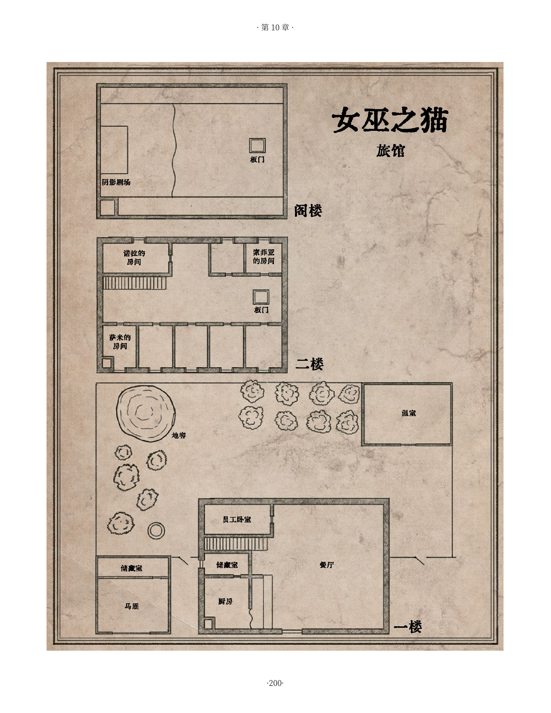

# 第 10 章：梦中之舞

[返回总目录](README.md) · 原始 PDF 第 200–217 页

## 本章目录

- [序幕](#section-01)
  - [恶灵奥斯卡·约尔特](#section-02)
  - [冲突](#section-03)
  - [邀请](#section-04)
  - [乌普萨拉的线索](#section-05)
  - [旅途](#section-06)
  - [女巫之猫旅馆](#section-07)
  - [抵达](#section-08)
  - [倒计时阶段与大灾难](#section-09)
- [地点](#section-10)
  - [餐厅](#section-11)
  - [阁楼](#section-12)
  - [诺拉的房间](#section-13)
- [对峙](#section-14)
- [余波](#section-15)
  - [C：诺拉的日记](#section-16)

<!-- 来源：北欧奇谭规则书.pdf；PDF 第 200 页；原书第 196 页 -->

这一章包含了一款入门级谜题《梦中之舞》，这个谜题需要两到三次游戏聚会来完成。如果你希望以在一次游戏聚内会来完成这个谜题，你可以跳过最初的步骤，直接从前往目的地的旅途开始。你可以简单地叙述玩家角色是得到邀请的方式，而不是把它作为一个场景来进行游戏。你也可以跳过每个玩家来获取优势的部分。

谜题从玩家角色被叫到位于乌普萨拉南边的女巫之猫旅馆开始。私家侦探奥劳斯·克林特注意到了那里发生的奇怪事件，并向玩家角色寻求帮助。故事讲述了一个发生在 50 年前的谋杀案，在对峙阶段，玩家角色得到了一个机会，可以让愤怒迷茫的恶灵获得他渴求的安息。这些事件发生在深秋或冬季。

## 序幕

第一节描述了本谜题的背景以及它所基于的冲突。一个邀请开启了这次游戏，紧接着一段文字描绘了前往女巫之猫旅馆的旅途，以及旅店的情况。这一节以一个倒计时事件作为结束，作为 GM 你需要在谜题中适当的时间发动它，文中还描述了一场大灾难，若玩家角色们没有采取行动或是无法驱逐恶灵灾难就会降临。但首先我们应该回顾一下这次谜题的引子。

五十年前，一些结社成员在乌普萨拉以南的女巫之猫旅馆中举行了一次秘密会议。他们已经意识到斯堪的纳维亚的超自然存在的某些情况，他们害怕与其<!-- 来源：北欧奇谭规则书.pdf；PDF 第 201 页；原书第 197 页 -->他结社成员共享这些信息。会议的旨在设计出一个将会永远改变斯堪的纳维亚未来的计划。关于这个计划以及如何实施，这一部分将在《北欧奇谭》未来的拓展书中被揭示，但为了让 GM 主持《梦中之舞》这一谜题，我们需要了解以下三件事。

首先，奥斯卡在他死后 50 年如鬼魂般重返人间的原因是，实现这个计划的时机已经到来。在他从死亡中苏醒的那一刻起，整个斯堪的纳维亚地区的其他事物开始发生变化，所有的这些都被单一的目标联系在一起。

其次，你要知道的是私家侦探奥劳斯·克林特事实上是一个罗森伯格派（第 82 页，分裂的结社）。他想让玩家角色成为他的盟友，甚至是朋友，以便渗透他们所在的结社分支，并将他们纳入在自己的组织或者摧毁他们。

第三件你应该知道的事情是，旅馆的颓败 ( 见下文 )与斯堪的纳维亚半岛的一系列变化有关。在这个地区的某些地方，人类的发明和建筑正在瓦解，而超自然力量却在不断壮大。

五十年前在女巫之猫旅馆展开会议的，是协会最为老练的三个成员：艾伯特·韦尔登海姆，卡特娅·科科拉，和希尔玛·阿夫·图伦斯蒂娜，这些人都在第六章中被提及过。他们是去见一个刚刚加入组织的年轻人。他的名字是奥斯卡·约尔特，而他们想让他在即将发生的一系列事件中扮演一个关键角色。同时出席的还有女巫之猫旅馆的老板派利·哈留拉，他同时也是参与此计划的一位星期四之子。派利曾多次担任他们三人的保镖，并被指示到如果奥斯卡不愿合作，就使用暴力手段抹除会议的所有痕迹。

奥斯卡没有加入或帮助这三名协会的高级成员，而是对此表达了愤怒和蔑视。他宣称要把他们的秘密告诉社团的其他成员，然后冲出了旅馆。派利偷偷跟在他后面，割断了他的喉咙。奥斯卡被埋在旅馆后面的地窖里，他的身体被施了魔法，这样即使他死亡也能实现艾伯特、卡特娅和希尔玛计划的预期目的。

<!-- 来源：北欧奇谭规则书.pdf；PDF 第 202 页；原书第 198 页 -->

### 恶灵奥斯卡·约尔特

大约十个月前，奥斯卡·约尔特以恶灵的身份归来了。他记得他死时的情形，正是旅馆老板和他的三位朋友艾伯特、卡特娅和希尔玛杀害了他。他没有意识到距离他的死亡已经过去了五十年，他以为这些事情是近期发生的。

奥斯卡一心想要报复杀害他的凶手。他在旅馆的房间里游荡，等待机会把他们四个都干掉。当玩家角色来女巫之猫旅馆调查这里发生了什么的时候，这位恶灵将他们错认为艾伯特、卡特娅和希尔玛，他看到并抓住了机会。

奥斯卡死而复生的那一刻，在他被埋葬时所准备好的魔法被激活了。女巫之猫旅馆及其周围地区成为一片自在之物与魔法力量不断在壮大的区域，这也导致所有人造建筑的坍毁。

### 冲突

主要的矛盾是奥斯卡想要向背叛他的旅馆老板和“星期四之子”们复仇。他将女巫之猫旅馆的现任持有者萨米当做了他的祖父派利，并坚信玩家角色是背叛了他的“星期四之子”。

其次的冲突发生在旅馆老板萨米和他女儿索菲亚之间。索菲亚想成为她母亲一样的艺术家。萨米憎恨有关艺术的一切，期望索菲亚在他死后接管旅馆，他试图以暴力手段将自己的意愿强加在女儿身上。

在过去的一年中，索菲亚多次于梦中得到恶灵奥斯卡的启发。奥斯卡生前是一位艺术家和作家，他在巴黎师从名家学习过皮影戏。现在索菲亚已经秘密地在阁楼上建了一个影子剧院。她计划上演一出她自己写的戏剧《梦中之舞》，这部戏剧实际上讲述了奥斯卡的生平和经历，尽管索菲亚并没有意识到这一点。她已经分发了她戏剧的宣传单，希望她的父亲萨米可以在目睹她的成功后做出让步，并且欢迎任何嘉宾来观看她的演出。

萨米的妻子也就是索菲亚的母亲诺拉和她女儿一样，对任何艺术相关的事情抱有兴趣，但与此同时她也是个神秘学爱好者。当奥斯卡以恶灵的身份回归人间时，她注意到有什么东西正在旅馆里游荡，并试图找出那个恶灵的身份。萨米知道了她的计划后十分恼怒，因为他禁止她参与这种活动。他狠狠地揍了她。诺拉跟随一个路过的剧团逃走了，并在几个月后死在病床上。

### 邀请

本次谜题的邀请来自于专攻超自然领域的私家侦探奥劳斯·克林特。他意识到女巫之猫旅馆在闹鬼，但因感受到这个生物力量的强大，他不敢独自一人去面对它。作为替代，他向玩家角色发出了一条信息，要求他们和他在女巫之猫旅馆见面并一起驱逐那个生物。奥劳斯怀疑索菲亚的剧场和徘徊在旅馆之物有所联系。

玩家角色收到一封红色火蜡封口的信，蜡封上写着“克林特”。信中有一份手写的广告，“皮影戏：梦中之舞”（展示材料 a）：梦中之舞这是一场关于恐怖，谋杀与复仇的影子戏法！痴迷于古典机械的阴影剧场，感受它的毛骨悚然，惊叹它如欧洲建筑大师手笔的不凡。且看那魔鬼的笑脸与善人的末路，再看那死者从地下迎面走来！

且看奥斯卡·约尔特与黑暗存在的邂逅，看他苦苦挣扎，看他最终时刻那夺命的背叛！且看魔笛的小调引导亡魂，让它们向着地狱翩然舞蹈。

这一曲目将在近日于女巫之猫旅店隆重首映！胆小勿来！

<!-- 来源：北欧奇谭规则书.pdf；PDF 第 203 页；原书第 199 页 -->

还有人在纸条留下一行字：“今夜在女巫之猫与我碰面。——奥劳斯”玩家角色可以在他们的图书馆或大学里寻找线索( 见文本框 )。让他们进行一个学习检定。如果失败了，他们仍然可以得到信息，但同时也会承受一个状态，或者引发一些问题。你可以一次性告诉他们所有的线索，或者把它们分散在不同的来源，这取决于你有多少时间。

### 乌普萨拉的线索

像往常一样，玩家角色可以在他们的总部为旅程做准备，从而获得优势（第 24 页）。玩家角色在乌普萨拉中搜索线索可以获得以下信息片段：

- 镇上有个叫奥劳斯·克林特的私家侦探。他在市中心有间小房子。奥劳斯作为涉及超自然的案件的专家而出名。

- 女巫之猫是西格图纳北部十字路口的一家客栈。18 世纪末奥卢大火之后，结社得到重建，客栈被用作聚会场所，当时的旅店老板派利·哈留拉是一位“星期四之子”。现在这个旅馆由派利的孙子萨米·哈留拉经营。

- 协会成员名单提到了一个名叫奥斯卡·约尔特的人，他生活在 18 世纪晚期。他是一名作家，曾在巴黎跟随著名艺术家弗朗索瓦·多米尼克·塞拉芬学习，他为凡尔赛宫和巴黎皇宫表演过皮影戏。

- 皮影戏起源于印度和中国，在公元前几个世纪就已经成熟。被裁剪出来的纸质人物被放置在一个光源上，这个光源会在布质屏幕上产生影子。一个熟练的傀儡师可以操纵傀儡和光线，使傀儡看起来栩栩如生。这种艺术形式在 18 世纪传入意大利，并继续在欧洲传播。英国和法国的艺术家们已经用发条装置来实现自动化的皮影剧场。

### 旅途

大声朗读下面的叙述来描述这次旅行。在前往目的地的路上，每个参与者都应该有一个场景来获得优势。

这时正值秋季，你们坐着马车离开乌普萨拉往南走，那里有一场可怕的风暴肆虐。乌云笼罩着天空，狂风呼啸，大雨滂沱，冰雹倾盆而下，让你们浑身湿透。闪电划过天空，雷声使马儿仰身嘶鸣，但马车夫用鞭子驱使它们前行。旅程需要三个半小时，随着前行风暴愈发猛烈。透过车窗，你可以看到西边的玛拉湖，泛着泡沫的波浪拍打在湖岸。穿过松树林，你会看到高大的树木被瞬间的狂风掀倒在地，或者被闪电劈开。在闪电中，你可以看到树丛中巨大的岩石——长满苔藓巨块凝视着你们。忽然，女巫之猫旅馆出现在一个周边环绕这树林的丁字路口处，它的北面和西面是玛拉湖。这似乎是附近唯一一座建筑。马车夫热心地将你们送下车，然后继续向南前往西格图纳。在旅馆和远处的小社区之间，你看到一座孤零零的教堂塔楼从树间伸出来。

<!-- 来源：北欧奇谭规则书.pdf；PDF 第 204 页；原书第 200 页 -->

<!-- 来源：北欧奇谭规则书.pdf；PDF 第 205 页；原书第 201 页 -->

### 女巫之猫旅馆

女巫之猫旅馆坐落在一个 T 字路口上。西边的路通向一个渡口营地，在白天，可以穿过这里到达哈图纳村。南边的路通向西格图纳（详见如果玩家角色选择逃离）。女巫之猫旅馆的南面两公里处，在旅馆和西格图纳之间是比尔比教堂，从松林之间可以遥望见它的塔楼。

客栈是一栋木质建筑，由一个大的主体建筑和一个带储藏室的马厩组成。在后面是个花园。房子似乎正在瓦解——雨水渗漏入室内，到处都是接水用的盆和桶，门把手脱落，楼梯板有些断裂，窗户也碎了。花园也是一团糟。

### 抵达

车夫把玩家角色放下马车，然后很快驶向西格图纳。奥劳斯·克林特在外面抽烟，在马厩突出的屋顶下等待着玩家角色的到来。他告诉角色们他发给他们的关于梦中之舞的传单已经传遍了乌普萨拉。奥劳斯还告诉他们，路过的旅客据说在旅馆做了古怪的梦，传说这座建筑被魔法控制了。

奥劳斯听说玩家角色和他自己一样对神秘学感兴趣。他暗示自己知道关于林内亚的事情，并说自己也有能看到那些寻常人所不能见之物的能力。奥劳斯解释说，他几天前去过旅馆并感觉到一种力量使得他胆寒，他希望玩家角色能帮助他弄清楚到底发生了什么。如果有玩家角色质疑他的动机，奥劳斯会添油加醋地描述在他十几岁时他的妹妹被自在之物诱拐进森林并再也没回来之后，以及他是如何发誓战胜那些超自然存在的。

进行一个成功的观察检定，玩家角色就会意识到奥劳斯正心乔意怯，并且在隐瞒着什么，尽管他们不能明确说出那是什么。如果向他施压，他会低声说，对他来讲，在进入旅馆之前他很难说出自己的经历。

### 倒计时阶段与大灾难

当有事情需要发生的时候，让倒计时一步一步地进行。不要操之过急，记得让玩家角色在事件间隙中扮演角色。

#### 倒计时阶段

1. 奥斯卡施放了一个妖术，让旅馆里的所有人 ( 包括奥劳斯 ) 都陷入沉睡，只有萨米和索菲亚还醒着。人们在他们站着或坐着的位置突然入睡，而且无法被唤醒。灯光与灯火变得幽蓝且暗淡，房间变得越来越暗。火依然在燃烧着，但是没有热量传出，也几乎无法提供任何光亮。温度持续下降，直到整个旅馆变得无比寒冷。玩家角色必须通过恐惧值为 1 的恐惧检定。

<!-- PDF 第 205 页侧栏：氛围 -->

#### 氛围

玩家角色在暴风雨中抵达旅馆，刺骨的风和湿气浸透了他们的衣裳。他们一次又一次地被闪电之间的黑暗所吞噬。起初，旅馆就像是暴风雨和黑暗中的救赎。尽管天花板可能会漏水，但有温暖的火焰，油灯，歌声和笑声，热饭和啤酒。

但是一点点地，被困在女巫之猫变得比狂风暴雨还要难以忍受。外面的黑暗进入了建筑，奇怪的事情开始发生。原本看起来像是避难所的地方，却变得危险起来——角落里潜伏着某些东西，阴影在移动，可以听到奇怪的声音，而玩家角色孤立无援，四周危险重重。水从天花板上滴落，穿过建筑的风声听起来如同哀鸣。

<!-- 来源：北欧奇谭规则书.pdf；PDF 第 206 页；原书第 202 页 -->

2. 奥斯卡用魔法控制了萨米。这个妖术让萨米把自己当成了祖父派利，他因自己犯下的罪行而内疚不已，他认为必须终结自己的生命来为罪行付出代价。萨米会躲起来，或是把自己关进旅馆或马厩里。他会在某个地方悬梁自尽。在萨米死后，奥斯卡用魔法在萨米的尸体上用血写下“背叛者派利”的字样。如果玩家角色设法阻止萨米的自我封闭和自杀，他也无法解释他到底犯了什么罪，他只是觉得自己有罪，因此应该受死。如果他们继续阻止他自杀，他最终会像旅馆里的其他客人一样陷入沉睡。玩家角色看到萨米的尸体时必须通过一个恐惧值为 1 的恐惧检定。

3. 奥斯卡控制了女巫之猫旅馆内所有沉睡着的 NPC的肉体而非精神，控制他们傀儡一样地前去杀害玩家角色。这些陷入沉眠的躯体逐渐从睡梦里醒来，他们睁开眼睛，却眼神呆滞目无所指，有人发出咳嗽般的怪叫；另一些人则在地板上拖曳着脚步，某个人的手臂抽搐着打翻了一杯啤酒；有人爆发出一阵沙哑的大笑然后继续说着睡前被所打断的话语。不一会儿，所有睡着的人一同站起，有节奏地大步穿过旅馆，犹如舞蹈，时而梦呓着“艾伯特、卡特娅、希尔玛、派利”。奥斯卡派出他的傀儡去搜寻并攻击玩家角色。他试图让他们逃到二楼或者是阁楼，好一会在房子里放火，把他们一网打尽。当玩家角色看到这些陷入沉睡的人的时候，必须通过一个恐惧值为 1 的恐惧检定。

#### 大灾难

玩家角色和所有 NPC 都被几乎不发出光亮的冰冷蓝色火焰烧死。

## 地点

玩家角色可以在旅馆内自由行动，与客人交谈，并试图察觉即将发生的事。跟随着倒计时的进行。有三个房间能找到线索：餐厅、阁楼、诺拉的房间。

### 餐厅

餐厅温暖又热闹。客人乔纳森、丽莎以及克拉赫德神父（见女巫之猫旅馆的 NPC）分别坐在不同桌前，斯文和索菲亚在为他们服务。天花板在漏水，雨水砸进锅碗瓢盆。萨米在吧台后面给厨师英吉利耶传菜单。他们会为玩家角色提供夜晚的食宿。

<!-- PDF 第 206 页侧栏：描述女巫之猫旅馆 -->

#### 描述女巫之猫旅馆

花园里杂草丛生，温室成了断瓦残垣，地窖是一个中间被挖空的土丘。

马厩里有两匹马和一辆马车，里面有能容纳三匹马和一辆马车的空间。储藏室里有一箱箱的食物和旅馆的设备。

一楼包括一个带双壁炉的大餐厅、一间带酒吧的厨房、一间储藏室和一间供员工使用的卧室。在二楼，萨米和索菲亚各有一个房间在那，还有一个公共起居室和五个出租房间。萨米的妻子诺拉的房间被锁起来了。走廊的天花板上有一个通往阁楼的板门，有梯子挂在墙上。阁楼里到处都是垃圾，索菲亚将远处那侧清理干净了，用天花板上的窗帘将它掩住。在这里，她设立了她的影子剧院，并为观众准备了椅子。

<!-- 来源：北欧奇谭规则书.pdf；PDF 第 207 页；原书第 203 页 -->

如果他们给萨米看“梦中之舞”的传单，他就会把索菲亚叫过来。然后他们两个走进厨房，随即在厨房里传来来了萨米大声打骂女儿的噪杂声。索菲亚逃去了阁楼，而萨米和其他客人装作什么都没发生一样。

#### 挑战

如果萨米意识到玩家角色在向他询问关于他妻子诺拉、女巫之猫旅馆的超自然事件或者索菲亚的事情时，他会变得心烦意乱并叫他们停止询问。如果向他施加压力，他会抓起自己的来福枪让他们离开旅馆。玩家可以用一个成功的操控人心检定来让他冷静下来。

玩家角色也会因为询问一名叫丽莎的客人而陷入麻烦。她为了自己的研究去走私鸦片，并坚信警察正在追捕她，此时她正在使用她的那些药剂使自己保持冷静。丽莎浑身发冷冒着虚汗，看起来头脑并不清醒而且还在失温。玩家角色通过一个成功的学习检定将会了解到这些症状正是药物滥用的表现。如果丽莎怀疑角色们在监视她，她就会回到房间，准备在傍晚离开旅馆。丽莎的衣服下藏着一把左轮手枪（精准 3，远程战斗 1）。

当玩家角色在餐厅与大多数人交谈时，你可以触发倒计时的第一步 ( 见文本框 )。当他周围的人都陷入沉睡时萨米显然很害怕。他认为是他妻子诺拉的鬼魂回来惩罚他，并要求玩家角色把自己锁在房间里 ( 如果他们在旅馆过夜 )。萨米会前往屋外的花园里，来到诺拉倒塌的温室，试图与她讲话，直至暴风来袭。如果索菲亚还在餐厅，她会十分恐惧然后逃去阁楼。

#### 线索

乔纳森、克拉赫德神父或任意一位员工可以透露以下信息：

- 萨米的妻子诺拉是个对未知事物有浓烈兴趣的天才艺术家。一年年初，她认为自己在夜里看到了一个奇怪的身影，并声称听到了脚步声。与此同时，她和萨米争论是否邀请演员和歌手来旅馆。萨米厌恶着也拒绝着任何形式的艺术。一些事情使冲突升级，使得萨米多次殴打她。最后她受够了，和剧团一起离开了。去年夏天萨米得到消息，他的妻子在卡尔斯克罗纳的病床上死于霍乱。

- 在诺拉离开后萨米把她房间的门锁上了，不准任何人进去。

<!-- PDF 第 207 页侧栏：女巫之猫旅馆的NPC -->

#### 女巫之猫旅馆的 NPC

- 奥斯卡·约尔特：恶灵（见下）

- 萨米·哈留拉：旅馆老板（见下）

- 索菲亚·哈留拉：萨米的女儿，在旅馆内工作（见下）

- 奥劳斯·克林特：私家侦探（见下）

- 英吉利·赫姆：厨师：声音洪亮，有幽默感，红发

- 斯文·克鲁泽：侍者和服务员 : 极瘦又高，语调轻柔，好奇心强

- 乔纳森·纳吉：客人，农场主，也是萨米的好友：在交谈时喜欢触碰别人，爱搬弄是非，嗜酒如命

- 丽莎·芬克尔：客人，带着非法来源的鸦片回乌普萨拉做研究的化学家：偏执，手势频繁，因药物原因而亢奋着

- 尼尔斯·克拉赫德神父：宴会客人，比尔比教堂的神父：严肃又病恹恹的，是个原教旨主义者

<!-- 来源：北欧奇谭规则书.pdf；PDF 第 208 页；原书第 204 页 -->

<!-- PDF 第 208 页侧栏：塞缪尔“萨米”哈留拉 -->

#### 塞缪尔“萨米”哈留拉

“一条船上只能有一名船长！”女巫之猫旅馆已经一代代继承了几百年了，萨米将他的作为旅馆老板的职务视作一种神圣的使命，管理不善或不把它传给索菲亚都是不可想象的。他想不通为何他做了所有工作也没能阻止房子和花园继续衰败。萨米怀疑这是诺拉的鬼魂在报复。

萨米是个四十多岁的矮壮男人，有着一把大胡子和漂亮的蓝眼睛。他声音洪亮，有很强支配欲并且有暴力倾向。他养活着他的女儿和他的员工，但他想要完全掌控着他们的一言一行。萨米对科技进步很感兴趣，同时厌恶着艺术和神秘学。

- 体能 4. 精准 3. 逻辑 2. 共情 2

- 敏捷 1. 近身战斗 3. 力量 3.远程战斗 1. 警觉 2

- 精神强度 2. 肉体强度 2

- 装备：小刀、来福枪

<!-- PDF 第 208 页侧栏：索菲亚·哈留拉 -->

#### 索菲亚·哈留拉

“无所依归是我唯一的朋友，妈妈也是这样。”索菲亚十六岁，是个梦想家，也是个不合群的人。她很想念母亲，并被奥斯卡引诱她的梦境所深深影响。奥斯卡还多次控制了她的身体，帮助她建造了影子剧院。

索菲亚身材高挑而丰满，有着一头棕发和一双棕色的杏仁眼。她说话时总是很轻犹如耳语，而且很难和别人有视线接触。她经常使用朦胧而诗意的语言。她梦想着不去接管旅馆，而是去成为一名艺术家、作家和演员。她惧怕自己的父亲，身上因频繁的殴打而有淤青。

- 体能 2. 精准 3. 逻辑 2. 共情 4

- 启迪 3. 观察 3. 医学 1

- 精神强度 2. 肉体强度 1

<!-- 来源：北欧奇谭规则书.pdf；PDF 第 209 页；原书第 205 页 -->

- 尽管萨米努力维护着旅馆，旅馆的情况在过去一年中还是越来越糟，屋顶漏水，木板破裂，花园杂草丛生。就好像女巫之猫旅馆被诅咒了一样。

- 从今年年初开始，旅馆里的客人就开始做恶梦，梦见有人用刀割断他们的喉咙，梦见他们被活埋，梦见他们最好的朋友其实是魔鬼，梦见他们在舞台上，另一个演员刺向他们——那居然是把真刀，而观众则在他们死时鼓掌。

- 索菲亚和她母亲一样对神秘学和艺术感兴趣，但萨米禁止她做除了照顾旅馆外的任何事，他想让她接手他的工作。

- 自从她母亲离开后，索菲亚变得很奇怪，她开始变得害羞而避世，开始自言自语，陷入沉思。在她不工作的时候，她就会躲去阁楼上。

### 阁楼

阁楼上堆满了衣箱、盒子、书籍和旧衣服。索菲亚已经将屋子尽头清理了出来，并将窗帘放下来隐藏她的所作所为。在窗帘后她建起了一座先进的影子剧院，并为未来的观众备好了椅子。剧院里有灯室、纸人和可以替换的布制屏幕，可以显示不同的背景。一切都与轨道和发条装置相连，通过转动曲柄，光源和人物可以移动，背景也可以替换。

索菲亚可以透露她的剧院的创意是从今年年初开始做的一些梦中想到的。她恳请玩家角色坐下，想要为他们表演自己的戏剧。灯室里蓝色的光芒给剧院带来了鬼魅一样的氛围。当索菲亚转动手柄、使得纸人移动起来时，她凭借记忆背诵起了剧本（见文本框）。

#### 挑战

如果索菲亚被允许演出她的剧本，她就会启动发条装置，开始讲述她的故事。她的声音越来越大、越来越低沉，直到变得很明显那声音不属于她，而是一个男人的声音，那声音回荡着，像是来自于洞穴的底端。索菲亚的目光停留在天花板的某处，浑身失去了力气，唯独她的手臂依旧旋转着曲柄，看起来如同有无形之线从天花板悬吊起曲柄，让它自己转起来一样。

<!-- PDF 第 209 页侧栏：奥劳斯·克林特 -->

#### 奥劳斯·克林特

“你有锐利的目光。”奥劳斯是个罗森伯格派（第 82 页），将自在之物视为是魔鬼的产物。他全心全意地憎恨着他们。奥劳斯感到艾伯特、卡特娅和希尔玛之间有一个很重要的秘密，他想要弄清楚这个秘密。奥劳斯想要渗透结社，让玩家角色成为他的盟友或者朋友，这样就可以将他们纳为罗斯伯格派。否则那就杀了他们。

当玩家角色第一次见到奥劳斯时，他介绍自己是一个私家侦探，并明确表示他是一位星期四之子。他会通过支持他们的想法和尽可能地帮助他们来赢得他们的信任。

奥劳斯是一个 40 岁的男人，有着整洁的胡须，圆形眼镜和尖尖的鼻子。他有一双敏锐的眼睛，会用停顿来增加他话语的分量。当他认为没人在看他时，他有时会吹口哨或者用手指敲击出一段新潮又激情澎湃的音乐。奥劳斯穿着一件旧夹克，戴着一顶帽子。

- 体能 3. 精准 3. 逻辑 4. 共情 4

- 远程战斗 2. 力量 3. 学习 2. 警觉 2....操控人心 3. 观察 2

- 精神强度 3. 肉体强度 3

- 装备：左轮手枪、放大镜、化学分析仪器、藏书、马和马车

<!-- 来源：北欧奇谭规则书.pdf；PDF 第 210 页；原书第 206 页 -->

当索菲亚讲完故事，恶灵奥斯卡·约尔特就在影子剧院现出了身。他不死的躯体散发着腐败的恶臭，整栋建筑开始颤抖，就像被地震摇晃着一样。奥斯卡低吟”欢迎”，声音在屋内回荡着，一种挥之不去、令人厌恶的感觉涌上心头。然后这恶灵嚎叫着向玩家角色猛冲过向玩家角色，此时的玩家角色必须进行一个恐惧值为 2的恐惧检定。不管他们是成功了，又或是因为检定失败而被冻僵，奥斯卡都会直接穿过他们，恶灵逐渐溶解，消失在了空气中。不一会儿，索菲亚又重新控制起她的身体，但她已经被吓坏了，眼泪止不住落下。

如果玩家角色没有让索菲亚表演，那么当他们从阁楼里走下来，这时奥斯卡会穿过通往阁楼的板门飞出，现身在他们面前。

#### 线索

若玩家使用调查或学习仔细检查了剧院，他们会发现它的结构极其复杂，这要水准需要一位傀儡戏大师才能建成。而且这些傀儡们身着的服饰是 18 世纪晚期在欧洲大陆流行的。

使用共情检定，玩家可以得知索菲亚对她的父亲感到不解和害怕，以及对她母亲的思念。她很乐意告知玩家角色她所知道的事：

- 索菲亚和她的母亲诺拉都热衷于神秘学和艺术。萨米则憎恶这些，索菲亚知道这是因为在他和诺拉结婚并怀上索菲亚之前，诺拉曾经与一个演员出轨。

- 诺拉在她的房间里收集关于“女巫之猫旅馆的鬼魂”的笔记。她认为房子里闹鬼的是萨米的一个亲戚。索菲亚说“鬼魂”是在今年年初时出现的。

- 索菲亚一直在做奇怪的梦。在梦里，她总是一位男子，梦中都是她戏里的情节。

<!-- PDF 第 210 页侧栏：梦中之舞的剧本 -->

#### 梦中之舞的剧本

一个年轻人在欧洲周游，见过只有少数幸运儿见过的美好。他和女王们跳舞，游览凡尔赛和巴黎皇宫。人们表演他的戏剧，赞美他的名字，生活如同梦一样起舞。但人民的革命横扫了这片土地，用那火焰和榴弹，而那些奏乐／嬉闹和歌唱的人们，最终于路旁死亡。年轻人逃离了断头台之歌。

我们的英雄返回了家乡，那是一座北方的城市，他赤脚穿过城门，贫穷且缄默。他出生的房子被烧成灰烬，家人也不知所踪。他跪在路边，祈求硬币，无人知道他的名字曾在欧洲的宫殿被传唱。

突然，他的瞧见了别人看不见的生物，它们匍匐、飞行、蜿蜒向前，像是无形之物对他掀开幕帘。当他向其他人指出它们，他被讥讽被殴打。

一个男人将他从街上带回，还为他洗澡和穿衣。他的名字是艾伯特，他的宅邸充满了友爱和歌声。我们年轻的英雄为他表演为他歌唱，从白天又到夜晚。他们一起吃着水果、喝着美酒。

艾伯特为我们的主人公介绍了他的朋友，在这个年轻人的梦中他们一同起舞。但这场梦是个谎言。

是你，你将我带到这。你叫我坐下来谈谈。我们说到了这个世界的未来。

我有权拒绝，你这样说着，面带微笑。然后你把我宰了，像是宰一头吊在天花板上的猪。你将我的尸体埋在了不洁的土地，没有牧师，也没有祭祀。现在这场梦仅为我所有了，我遥望着皇宫的观众，我和一个公主跳舞，我吃着蛋糕，我看着你的眼睛，艾伯特，然后我让你握住我脏污的手。你把我叫去派利的旅馆。你向我提出了一个邪恶的提议，然后我拒绝了。

你将我杀害，我尖叫着，不愿死去。你终于回到了这。欢迎。

<!-- 来源：北欧奇谭规则书.pdf；PDF 第 211 页；原书第 207 页 -->

### 诺拉的房间

房间里有一张床，一张桌子，一个衣橱，一个书柜，还有许多画。所有的东西都被灰尘覆盖。

#### 挑战

诺拉的房间是锁着的，房间的钥匙正挂在萨米的钥匙环上。可以用隐秘行动将锁摘下，或者使用力量将它撬开。如果萨米在周围，他会试图阻止玩家角色进入其中。在必要的时候他会使用武力。

如果玩家角色在房间里，奥斯卡会使用咒术迷魂术攻击其中一人。描述玩家角色感到体内一阵刺痛。玩家角色使用观察来对抗奥斯卡的魔力骰。如果玩家角色的成功数更多，就能抵御住魔法，并且眼前出现了奥斯卡的尸体被埋葬在不洁之地的画面，他的灵魂不得安宁。如果双方的成功数一样多，那么什么都不会发生。如果奥斯卡在对抗检定中胜出，他就会控制玩家角色的身体一段时间。给玩家出示相关信息纸条。（见标题为幻惑和展示材料 B 的文本框）奥斯卡会强迫玩家角色攻击她的一位朋友，而之后他便失去了对角色的控制，而玩家角色就可以自由行动了。她最后感受到的是一股刺骨的寒意从她心中离开。

#### 线索

在书柜里可以找到诺拉的日记（见下一页的文本框和展示材料 C）。找到它不需要进行任何掷骰。

<!-- PDF 第 211 页侧栏：幻惑 -->

#### 幻惑

一个满心复仇的生物在一段时间内控制着你的身体。你认为其他玩家角色应该为他们对你所犯下的可怖罪行付出代价，而你想要杀了他们。也许这些变化会反应在你的呼吸和姿态上？尝试去描述你的性格变化来营造出一种恐怖氛围。你可以去告诉其他玩家角色你憎恨着他们，没有人可以活着走出旅馆。拔出你的武器去攻击他们其中一人。经过一回合的战斗，这个生物失去了对你身体的控制权。

<!-- PDF 第 211 页侧栏：学习检定 -->

#### 学习检定

如果玩家角色阅读了诺拉的日记或者他们已经被恶灵袭击，他们可以进行一个学习检定来获知以下信息。如果检定失败，玩家角色只能从其他地方，主要是与 NPC 的对话，来获取信息。

- 一个成功：这一定是恶灵所为，这是一种不得安宁的亡灵，心怀着那些在生前曾对它不公的人的怨恨。恶灵往往是无形的，但据了解，它们也会化形为有着尖牙利爪的丑恶形态。

- 两个成功：恶灵可以用它的亡灵之拥将一个人的生命力吸出体外。它也可以用魔法控制一个人的灵魂。

- 三个成功：安葬它的躯体可以让恶灵被超度。

<!-- PDF 第 211 页侧栏：诺拉的神秘学藏书 -->

#### 诺拉的神秘学藏书

诺拉有着数量众多的神秘学书籍。玩家角色可以通过描述想要找的内容，从而找到关于鬼魂和灵魂的信息。很明显，恶灵必须找到安宁才能被超度，而尸体必须埋葬在圣地。

<!-- 来源：北欧奇谭规则书.pdf；PDF 第 212 页；原书第 208 页 -->

<!-- PDF 第 212 页侧栏：诺拉的日记 -->

#### 诺拉的日记

一月十五日昨晚，就在我去清空鳏夫鲁特格尔的夜壶的路上，我又见到了它。我手上的蜡烛熄灭了，站在二楼黑暗的走廊里，我听得到地板在颤动。有人在走向我。我低声叫出了我丈夫的名字，一个陌生的声音用一个我听不懂的词回应了我。我手臂上汗毛直立，血管里的血液也剧烈搏动着。最后，我丢下了壶，跑下了楼。我的脚步声惊醒了几个客人。我不得不花费一个多小时跪在地上用力擦净地板上鲁格特尔的排泄物。萨米很生气。我没跟他说我见到了一个幽灵，这只会火上浇油。

一月十七日我真的应该责怪我自己吗？我知道我对萨米做了什么，但那都是二十年前的事了。他生气时会变得很不一样，我吓得说不出话，但他偏要我回答。也许我不该去烦他？但我所做的只是建议，旅馆的突然倒塌可能有神秘学的原因。我真不该提起那个幽灵。现在我一个星期都不能出现在客人面前了，我脖子上的瘀伤可以用项圈遮住，也没人能看到我胸口和胃部的疼痛，但我的左眼紫得像是李子，我的鼻子也肿了。

我很担心索菲亚。她太像我了，我想告诉她一切，但我害怕萨米会说些什么。他想从他女儿的身体里拔去所有艺术和崇高的东西，那些来自我的东西。

一月三十一日我跟索菲亚提到了我的噩梦，结果她也做了同样的梦！一个男人要被杀死了，凶手偷偷地在他身后，用刀割断了他的喉咙。尸体被埋在一个不洁的地方，突然之间，躺在坟墓里的就成了我的尸体。我被活埋了，我出不去，我想要的只有复仇，或是死后的安宁。我尖叫着醒来。

二月七日我第四次见到他的时候，我明白了他在说什么，那不是一个词，而是一个名字，“派利”。经过了几天的反复思索，直到萨米非常恼火后，我想起了在哪听过这个名字。曾经经营这座旅馆的萨米的祖父，名叫派利·哈留拉。阁楼里有很多旧信。其中我发现了一叠有派拉名字署名的信息，是用密码写的，寄给乌普萨拉的某个人。密码很容易破译，现在我整个上午都把自己关在房间里，读着派拉的情书。萨米因为我玩忽职守而大发雷霆。他敲打着厨房的墙壁，又把平底锅扔在地板上。可怜的英吉利。

二月八日现在，我知道死者是谁了。派拉写下来了他的罪行和对他犯下谋杀之罪的悔恨。他们割断了一个叫奥斯卡·约尔特的人的喉咙，杀死了他。这件事发生在来自乌普萨拉的三个人的那场会议里。其中一人名为艾伯特。奥斯卡不愿意合作，但我不确定他想做什么。他们把他的尸体埋在我们花园的某处。派利说，他们没有让牧师为土地举行祭祀仪式，而是用魔法亵渎了他的躯体。他害怕自己诅咒了旅馆，于是把自己送进了地狱。

三月一日索菲亚近日已经沉默寡言了许久。我坐下来和她聊聊，她跟我说她梦想着开一家剧院。她想要在女巫之猫旅馆举办一场演出。我觉得这是一个绝妙的主意。

我给山精之梦剧团发了邀请函，主要是为了吸引顾客，但也是为了鼓励索菲亚。这次，我不会让萨米得逞的。

三月十九日萨米看到了剧团经理的信，当我写这封信时，我藏在马厩里，就好像个淘气的孩子。他用壁炉的拨火棍打了我，眼前一切都黑了下去…我是在地板上醒来的。我左手的手指失去了知觉，现在依旧麻木着。血、唾液、鼻涕和眼泪从我的脸上流下来，所以我要把这张纸拿得理我远点，不然会弄脏它。我好害怕。

四月三日如果我留在这他会杀了我的。今晚我就要收拾东西，把派利的信带着。等我回来接索菲亚的时候我会给她看这些信。也许哪天萨米死掉了或者恢复了理智，我们会回到女巫之猫旅馆。然后我们就可以一起寻找幽灵了。

<!-- 来源：北欧奇谭规则书.pdf；PDF 第 213 页；原书第 209 页 -->

## 对峙

奥斯卡的尸体埋在花园的地窖里。玩家角色必须把它挖出来埋葬在被神圣 / 被祝圣的土地上，这样才能超度恶灵，为他带来宁静。

地窖被奥斯卡的魔法和噩梦所污染。打来门，玩家看到了一个比地窖更宽敞的巨大黑暗洞穴。墙上的食物架爬满了蛆虫、甲虫和老鼠。强风在呼啸。奥斯卡的低语和呼喊的声音碎片传来：“…艾伯特，我的爱人…”“…我有权拒绝…”“你就是我的一切！”“你叫派利杀了我，然后我…”“卡特娅！”“希尔玛…”“我曾见过你们无人能见到的…”“我的名字是…”“在巴黎跳舞，然后…”玩家角色们看到人类奥斯卡站在他们面前的洞穴里的幻象。他是个衣着华贵的年轻人，眼中爱意闪动。奥斯卡看向一旁一个看不见的人。然后他的脖子就像被刀割开了一样，鲜血直流，然后奥斯卡倒在了地上。他试图尖叫，但只能发出“咯咯”声。他的身体瞬间腐烂，布满了蛆虫。玩家角色必须进行一个恐惧值为 2的检定。如果他们之前，比如在阁楼上见过了奥斯卡，那么恐惧等级为 1 而不是 2。

<!-- PDF 第 213 页侧栏：奥斯卡·约尔特 -->

#### 奥斯卡·约尔特

“我…不应该…因为爱…不能安眠！梦想着、幻想着、妄想着…”奥斯卡出生在乌普萨拉，但在他很小的时候就为了追求梦想成为一名艺术家而搬去了法国。他师从弗朗索瓦·多姆·伊尼克·塞拉芬大师，在那里学会了搭构皮影戏，并凭借自己的实力成名。当革命爆发后，奥斯卡被迫离开了法国返回家乡。在乌普萨拉他只是个无名小卒，被迫以乞讨为生。那段艰难的时光使得他成为一名“星期四之子”。艾伯特·韦尔登海姆在街上找到了他，并把他吸纳进了结社。奥斯卡爱慕着艾伯特，但当他听到了死之谣和艾伯特、卡特娅和希尔玛的计划时，他拒绝与他们合作。艾伯特派出旅馆老板派利去杀他，并把尸体埋葬在地窖不洁的土地里。

恶灵奥斯卡，他神志不清，胸膛中怒火燃烧。他坚信他们就是艾伯特、卡特娅和希尔玛，想要在杀死玩家角色前让他们恐惧不已、备受折磨。同样的，他将旅馆老板萨米误认为是他早已离开多年的祖父派利，想要让他自我了断。奥斯卡有着恶灵的数据（见第八章）。他会使用妖术魔法睡眠、奴役术和风暴，以及咒术迷魂术和极度严寒。

<!-- 来源：北欧奇谭规则书.pdf；PDF 第 214 页；原书第 210 页 -->

奥斯卡会从旅馆召唤熟睡的人来攻击玩家角色。玩家角色可以和奥斯卡交谈，或者向他展示一些东西，表明他们想把尸体埋在被祝福的土地上，为他带来安宁。一次成功的操控人心检定可以让奥斯卡明白他已经不在人世了，自从他被谋杀已过了多年。他意识到玩家角色并不是他憎恨的人，于是指挥着沉睡的人向后退去。玩家角色现在可以安葬尸体了。

玩家角色在地窖中心进行挖掘可以找到奥斯卡的遗骨。遗骨必须被埋葬在被祝圣的土地上。如果一个玩家角色是牧师或者精通宗教仪式，他们可以自己将土地圣化，然后将尸体安葬。让玩家描述自己的所言所行。在举行仪式时会听到呼啸的风声和其中参杂着的奥斯卡的尖啸。而当仪式结束后，一切都将归为平静。

另一个选择是把尸体带到旅馆南边两公里处的比尔比教堂。教堂本身是上锁的，但人们可以很容易地进入墓地。当他们在墓地掘墓时，玩家角色会看到奥斯卡远远地站着，感激地望向他们。这时不需要进行恐惧检定。

<!-- PDF 第 214 页侧栏：梦游者 -->

#### 梦游者

“艾伯特！…卡特娅…希尔玛…”当奥斯卡在女巫之猫旅馆唤起熟睡的人后，这些人会因为抽搐的动作逐渐恢复意识。他们脸上的表情很奇怪，似乎在随着一种听不见的节奏跳舞。梦游者会用拳头、椅子或任何他们能获得的东西攻击玩家角色。他们想强迫角色进入房子某个部分，比如二楼或阁楼，这样他们就无法逃脱了。然后他们会放火，和玩家角色们一起被烧死。梦游者不受操控人心的影响。

- 体能 3. 精准 2. 逻辑 1. 共情 1

- 敏捷 1. 近身战斗 1. 力量 2. 警觉 1

- 精神强度 0 肉体强度 1..

<!-- 来源：北欧奇谭规则书.pdf；PDF 第 215 页；原书第 211 页 -->

#### 如果玩家角色选择逃离

如果他们离开旅馆，玩家角色会发现马厩里的马也睡着了。离开的唯一方法是步行，最近的聚居地是曾在中世纪有辉煌岁月的“沉睡之镇”西格图纳。西格图纳是一个有着 300 名居民和田园风光的聚居地。步行去那里需要一个半小时。

奥斯卡会瞄准一位玩家，在夜晚时从远处使用极度严寒对她发起攻击，直到她崩溃或咒术失败。描述玩家角色是如何在严寒里牙齿打颤、面色逐渐苍白、头发结上寒霜的。如果她想要对抗魔法，这个角色会看见到奥斯卡被谋杀，他在在坟墓中密谋复仇，然后以恶灵的身份重返人间。

如果玩家角色于次日返回旅馆，这时 NPC 们都已经醒来，并且他们之中的大多都记不得睡着的事。只有萨米和索菲亚记得发生了什么，并向玩家角色寻求帮助。直到夜幕降临之前奥斯卡都不会再次现身。

## 余波

当奥斯卡的尸体被埋葬在神圣的土地中，他的灵魂最终得到休息。奥斯卡消失了，他的魔法也消散了。NPC 们苏醒了过来，但不记得发生过了什么。如果玩家角色杀死了 NPC 中一人，他们必须找个不会让他们被指控谋杀的理由来解释发生了什么。没有解决这个谜题意味着奥斯卡依旧徘徊在旅馆里，沉睡着的 NPC第二天会醒来，但不会记得发生了什么。

玩家角色返回大本营，此时你必须依据玩家回答的问题来分发经验（见第二章）。如果任何玩家角色已经陷入崩溃，你必须决定是否她的缺陷或洞察是否是永久的。

<!-- PDF 第 215 页侧栏：治疗状态 -->

#### 治疗状态

如果玩家角色想进行一项活动来治愈状态，他们必须去一些安全且安静的地方，例如马厩。

<!-- 来源：北欧奇谭规则书.pdf；PDF 第 216 页；原书第 212 页 -->

梦中之舞这是一场关于恐怖，谋杀与复仇的影子戏法！

痴迷于古典机械的阴影剧场，感受它的毛骨悚然，惊叹它如欧洲建筑大师手笔的不凡。且看那魔鬼的笑脸与善人的末路，再看那死者从地下迎面走来！

且看奥斯卡·约尔特与黑暗存在的邂逅，看他苦苦挣扎，看他最终时刻那夺命的背叛！且看魔笛的小调引导亡魂，让它们向着地狱翩然舞蹈。

这一曲目将在近日于女巫之猫旅店隆重首映！胆小勿来！

今夜在女巫之猫与我碰面。——奥劳斯A：来自奥劳斯·克林特的一张字条

#### 幻惑

一个满心复仇的生物在一段时间内控制着你的身体。你认为其他玩家角色应该为他们对你所犯下的可怖罪行付出代价，而你想要杀了他们。也许这些变化会反应在你的呼吸和姿态上？尝试去描述你的性格变化来营造出一种恐怖氛围。你可以去告诉其他玩家角色你憎恨着他们，没有人可以活着走出旅馆。拔出你的武器去攻击他们其中一人。经过一回合的战斗，这个生物失去了对你身体的控制权。

B: 对可能被迷魂的玩家角色的说明

<!-- 来源：北欧奇谭规则书.pdf；PDF 第 217 页；原书第 213 页 -->

### C：诺拉的日记

#### 1 月 15 日

昨晚，就在我去清空鳏夫鲁特格尔的夜壶的路上，我又见到了它。我手上的蜡烛熄灭了，站在二楼黑暗的走廊里，我听得到地板在颤动。有人在走向我。我低声叫出了我丈夫的名字，一个陌生的声音用一个我听不懂的词回应了我。我手臂上汗毛直立，血管里的血液也剧烈搏动着。最后，我丢下了壶，跑下了楼。我的脚步声惊醒了几个客人。我不得不花费一个多小时跪在地上用力擦净地板上鲁格特尔的排泄物。萨米很生气。我没跟他说我见到了一个幽灵，这只会火上浇油。

#### 1 月 17 日

我真的应该责怪我自己吗？我知道我对萨米做了什么，但那都是二十年前的事了。他生气时会变得很不一样，我吓得说不出话，但他偏要我回答。也许我不该去烦他？但我所做的只是建议，旅馆的突然倒塌可能有神秘学的原因。我真不该提起那个幽灵。现在我一个星期都不能出现在客人面前了，我脖子上的瘀伤可以用项圈遮住，也没人能看到我胸口和胃部的疼痛，但我的左眼紫得像是李子，我的鼻子也肿了。

我很担心索菲亚。她太像我了，我想告诉她一切，但我害怕萨米会说些什么。他想从他女儿的身体里拔去所有艺术和崇高的东西，那些来自我的东西。

#### 1 月 31 日

我跟索菲亚提到了我的噩梦，结果她也做了同样的梦！一个男人要被杀死了，凶手偷偷地在他身后，用刀割断了他的喉咙。尸体被埋在一个不洁的地方，突然之间，躺在坟墓里的就成了我的尸体。我被活埋了，我出不去，我想要的只有复仇，或是死后的安宁。我尖叫着醒来。

诺拉的日记

#### 2 月 7 日

我第四次见到他的时候，我明白了他在说什么，那不是一个词，而是一个名字，“派利”。经过了几天的反复思索，直到萨米非常恼火后，我想起了在哪听过这个名字。曾经经营这座旅馆的萨米的祖父，名叫派利·哈留拉。阁楼里有很多旧信。其中我发现了一叠有派拉名字署名的信息，是用密码写的，寄给乌普萨拉的某个人。密码很容易破译，现在我整个上午都把自己关在房间里，读着派拉的情书。萨米因为我玩忽职守而大发雷霆。他敲打着厨房的墙壁，又把平底锅扔在地板上。可怜的英吉利。

#### 2 月 8 日

现在，我知道死者是谁了。派拉写下来了他的罪行和对他犯下谋杀之罪的悔恨。他们割断了一个叫奥斯卡·约尔特的人的喉咙，杀死了他。这件事发生在来自乌普萨拉的三个人的那场会议里。其中一人名为艾伯特。奥斯卡不愿意合作，但我不确定他想做什么。他们把他的尸体埋在我们花园的某处。派利说，他们没有让牧师为土地举行祭祀仪式，而是用魔法亵渎了他的躯体。他害怕自己诅咒了旅馆，于是把自己送进了地狱。

#### 3 月 1 日

索菲亚近日已经沉默寡言了许久。我坐下来和她聊聊，她跟我说她梦想着开一家剧院。她想要在女巫之猫旅馆举办一场演出。我觉得这是一个绝妙的主意。

我给山精之梦剧团发了邀请函，主要是为了吸引顾客，但也是为了鼓励索菲亚。这次，我不会让萨米得逞的。

#### 3 月 19 日

萨米看到了剧团经理的信，当我写这封信时，我藏在马厩里，就好像个淘气的孩子。他用壁炉的拨火棍打了我，眼前一切都黑了下去……我是在地板上醒来的。我左手的手指失去了知觉，现在依旧麻木着。血、唾液、鼻涕和眼泪从我的脸上流下来，所以我要把这张纸拿得理我远点，不然会弄脏它。我好害怕。

#### 4 月 3 日

如果我留在这他会杀了我的。今晚我就要收拾东西，把派利的信带着。等我回来接索菲亚的时候我会给她看这些信。也许哪天萨米死掉了或者恢复了理智，我们会回到女巫之猫旅馆。然后我们就可以一起寻找幽灵了。

[上一章](09-mysteries.md) · [返回总目录](README.md) · [下一章](11-background-tables.md)
